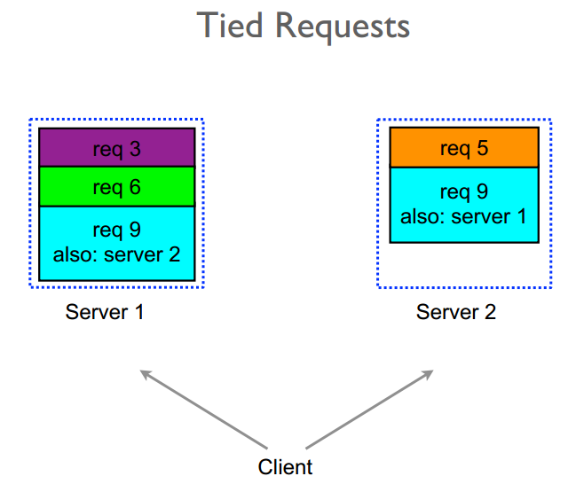

в первой части разобрали базовые способы борьбы с tail latency, здесь чуть подробнее остановлюсь на факультативных техниках

#### 1.2.3.1 Hedged Requests

Идея hedged-запросов в том, чтобы не ждать бесконечно “вдруг повезёт”, а дать себе второй шанс на другой ноде, если первый запрос подозрительно затянулся.

Схема такая:

1. Сначала измеряем latency и строим распределение.
2. Выбираем порог, например p95.
3. Когда приходит запрос:

    - шлём его на обычную реплику;
    - если он не успел завершиться за p95 — отправляем вторую копию на другую реплику;
    - берём первый успешный ответ, второй считаем лишним и отменяем если это возможно
4. Число параллельных копий ограничиваем: обычно 2, иногда 3, но не по всем инстансам

Важно заметить что такую технику можно применять только на идемпотентных операциях. Если 2 раза спишем деньги, бизнес спасибо не скажет

Здесь мы платим дополнительными запросами за более стабильный p95/p99.
Если всё настроено аккуратно, прирост нагрузки получается небольшой, а хвост заметно подрезается.

Минусы:

- увеличивает нагрузку на систему
- требует калибровки порога (если порог слишком маленький — будем спамить вторыми копиями почти всегда; если слишком большой — толку не будет);
- требует аккуратной интеграции с ретраями, чтобы не получилось: “сначала мы хеджим запросы, а потом ещё и три раза ретраим поверх”.

#### 1.2.3.2 Tied Requests

Обычный hedged-запрос режет хвост, но за счёт лишней нагрузки.

Queue-based leveling выравнивает нагрузку через очередь.

подход tied-requests  (связанные запросы) же использует несколько очередей сразу, чтобы быстрее найти свободного исполнителя, но без лишних дублей работы.

Представим ситуацию
у нас основные хвосты для данного запроса происходят из-за очереди
но когда запрос был взят в работу - дальше все стабильно

В таком случае выгодно послать запрос на две реплики почти одновременно, но дать им договориться, кто реально будет работать.

По шагам выглядит так

1. Клиент шлёт запрос на сервер A.
2. Через маленькую паузу (порядка 1–2 RTT(round trip time), ~5–10 ms) — копию на сервер B.
3. Оба запроса несут общий `requestId`.
4. Когда один сервер берёт запрос в работу, он помечает `requestId` как “в работе” (через быстрый стор / внутренний протокол) и шлёт cancel для копии.
5. Если на второй ноде запрос всё ещё стоит в очереди — его просто выкидывают или понижают приоритет.

Это по сути смесь queue-length-aware balancing и hedged request

Таким образом
* мы агрессивно боремся с хвостом за счёт двух очередей;
* но не делаем два одинаковых дисковых чтения / тяжёлых вычисления;

#### 1.2.3.4 Latency-aware Load Balancing

Сродни этому подходу где мы отталкиваемся от загруженности очереди сервиса есть подход который распределяет нагрузку в зависимости от скорости ответа ноды
называется Latency-aware Load Balancing

Обычный round-robin считает, что все ноды одинаковы.
но На практике:

- часть нод может быть подогружена;
- часть попала на более медленный диск/соседей.

А Latency-aware LB:

- смотрит на историческую задержку по нодам;
- реже шлёт запросы тем, у кого latency выше;
- даёт “отдохнуть” перегруженным или деградировавшим нодам.

Это напрямую уменьшает хвост: мы уменьшаем шанс попасть на самую медленную ноду.
Но усложняет работу балансировщика

#### 1.2.3.3 Request Coalescing

Еще одна техника - Request Coalescing

Если у нас есть cache item с высоким rps и вдруг он истек по ttl, то сотни одинаковых запросов могут одновременно упасть на один и тот же ресурс (БД, внешний API) и устроить thundering herd problem - заддосить этот ресурс.

Request coalescing призван решить эту проблему

- первый запрос реально идёт вниз;
- остальные, которые пришли “с тем же ключом”, мы временно подвешиваем;
- когда первый вернулся – раздаём его результат всем ожидающим.

Мы уменьшаем concurrency на нижнем уровне → меньше нагрузка на БД/внешний сервис → ниже шанс, что p99 превратится в секунды.

#### 1.2.3.5 Background jittering

Если у нас есть какие-то периодические задачи или воркеры и они хостятся на тех же ресурсах, то и они могут отбирать неожиданно у нас мощности, особенно если это задачи по расписанию, таких задач сотня и все на одно время например на 00:00
Вдобавок если мы на виртуалках или облаках, то у нашего noisy neighbour в это время могут тоже запускаться задачи и еще больше нас задерживать

Решение простое - размазать нагрузку во времени, это называется Background jittering

- добавляем случайную компоненту в расписания
- вместо 1000 задач в 00:00 получаем 1000 задач, размазанных по минуте.

#### synchronized disruption

Если же какие-то процессы запускаются не только по ночам а в течение всего времени да еще и не на одной машине, то может помочь обратный подход - synchronized disruption

Примеры тому
- GC,
- ротации/ретеншн/компакшен логов и тп

Если они бесконтрольно запускаются - у нас постоянные хвосты, то тут замедлились то здесь
Мы можем запускать эти процессы везде в один момент, тогда только запросы пришедшие в этот момент времени подвиснут, а в остальное время хвостов не будет

То есть система не все время подтормаживает, а потратила пару секунд чтоб протормозить и дальше норм
