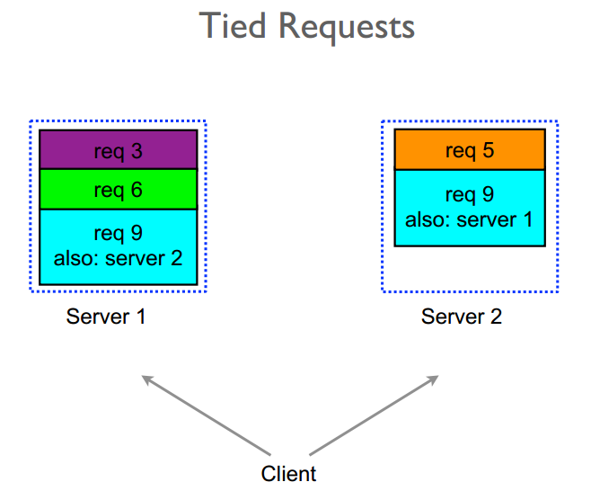

## Блок 1.2 Tail Latency

### 1.2.0. Откуда берутся хвосты

Но откуда берутся хвосты? Они же по определению случаются лишь иногда, значит причина плавающая и вряд ли в коде, верно?

На то есть три группы причин - Аппаратные, Сетевые и Программные

1) Аппаратные, например throttling на диске из-за лимита записи/чтения (IOPS) или thermal throttling на процессоре. 
    Может показаться что это мелочи, но нет
   В одном из моих проектов сервера стояли в московском ЦОДе. Как-то летом выдался особенно жаркий день, охлаждение не вывезло, часть стоек вообще начали отключать в попытках охладить.
   С нашей стороны не было никакого релиза, но сайт сильно деградировал по показателям, едва ли что-то вообще грузилось часть запросов падала со всякими 502 504 ошибками

2) Сетевые, например Congestion из-за соседнего сервера, изредка долгие DNS-запросы

3) Программные

   - очереди
   - конкуренция за ресурсы (оптимистичные/пессимистичные блокировки)
   - эффект noisy neighbor — когда другой сервис на той же ноде начинает потреблять выделенные и вам их не хватает ( на виртуалках или в облаках)
   - сборка мусора
   - ротация/retention логов
   - перезапуск процессов
   - fsync базы (дампит данные из памяти в файл)

Для хвоста не нужно, чтобы что-то было сломано.
Достаточно маленькой вероятности “плохого сценария”, которая при большом трафике проявляется постоянно.

Если посмотреть на этот список причин, видно что это закон протекающих абстракций в действии
на уровне кода у нас абстракция “сделать HTTP-запрос / сходить в БД / положить в очередь”.
Но как только мы смотрим на tail latency, абстракция начинает протекать:
видно TCP-ретрансляции, задержки DNS, GC-паузы, lock-и, медленные диски.

### 1.2.1 Retry storm

Одиночный хвост сам по себе неприятен, но систему не убивает. Гораздо хуже, когда она начинает “умно” на него реагировать.

как это может выгдядеть?:

1. Вот один наш запрос поймал хвост
2. Клиент (мобильное приложение или фронтенд) не дождался и сделал retry.
3. API-шлюз / ingress тоже умеет ретраить “для надёжности”.
4. В нашем сервисе тоже прописаны ретраи с таймаутами

В результате в место одного застрявшего мы можем получить еще 27 таких же если на каждом из этих 3 слоев будет по 3 ретрая. это и называется  retry storm.

И мы окончательно добили тормозящий компонент

Характерные симптомы:

- p50 почти не меняется;
- p95–p99 улетают в космос;
- на отдельных нодах скачет нагрузка по CPU/сети, хотя бизнес-трафик не сильно вырос.

Ретраи сами по себе нужны, но за ними нужно следить

- ограничивать количество попыток — и на каждом слое, и по цепочке в целом. то есть не while(true) и sleep(1)
- привязывать к времени: экспоненциальный backoff с джиттером. экспоненциальный backoff - когда промежутки между ретраями увеличиваются с каждой попыткой, например 1с, 3с, 10с
- выделить ответственного за ретраи: клиент, гейтвей или сервис, а не все сразу; без uml диаграммы думаю здесь не обойтись

Иначе “надёжность через ретраи” легко превращается в механизм добивания и без того больных компонентов.

### 1.2.2 как бороться

Однако хвосты никуда не денутся, ретраи тоже — это нормальная жизнь распределённой системы.
Поэтому все приёмы борьбы с tail latency по сути делятся на две группы:

1. Уменьшить хвост — сделать так, чтобы медленных запросов реально стало меньше

2. Спрятать/обойти хвост — сделать так, чтобы редкие медленные запросы не ломали всю систему и опыт пользователя

В нормальном проде почти всегда нужны обе группы сразу: и подрезать хвост, и не давать ему тянуть за собой весь сервис.

### 1.2.3 Уменьшение хвоста

#### 1.2.3.1 Hedged Requests

Идея hedged-запросов в том, чтобы не ждать бесконечно “вдруг повезёт”, а дать себе второй шанс на другой ноде, если первый запрос подозрительно затянулся.

Схема такая:

1. Сначала измеряем latency и строим распределение.
2. Выбираем порог, например p95.
3. Когда приходит запрос:

    - шлём его на обычную реплику;
    - если он не успел завершиться за p95 — отправляем вторую копию на другую реплику;
    - берём первый успешный ответ, второй считаем лишним и отменяем если это возможно
4. Число параллельных копий ограничиваем: обычно 2, иногда 3, но не по всем инстансам

Важно заметить что такую технику можно применять только на идемпотентных операциях. Если 2 раза спишем деньги, бизнес спасибо не скажет

Здесь мы платим дополнительными запросами за более стабильный p95/p99.
Если всё настроено аккуратно, прирост нагрузки получается небольшой, а хвост заметно подрезается.

Минусы:

- увеличивает нагрузку на систему
- требует калибровки порога (если порог слишком маленький — будем спамить вторыми копиями почти всегда; если слишком большой — толку не будет);
- требует аккуратной интеграции с ретраями, чтобы не получилось: “сначала мы хеджим запросы, а потом ещё и три раза ретраим поверх”.

#### 1.2.3.2 Tied Requests

Обычный hedged-запрос  режет хвост, но за счёт лишней нагрузки.

Представим ситуацию
у нас основные хвосты для данного запроса происходят из-за очереди
но когда запрос был взят в работу - дальше все стабильно

В таком случае выгодно послать запрос на две реплики почти одновременно, но дать им договориться, кто реально будет работать.

Этот подход называется tied requests (связанные запросы)

По шагам выглядит так

1. Клиент шлёт запрос на сервер A.
2. Через маленькую паузу (порядка 1–2 RTT(round trip time), ~5–10 ms) — копию на сервер B.
3. Оба запроса несут общий `requestId`.
4. Когда один сервер берёт запрос в работу, он помечает `requestId` как “в работе” (через быстрый стор / внутренний протокол) и шлёт cancel для копии.
5. Если на второй ноде запрос всё ещё стоит в очереди — его просто выкидывают или понижают приоритет.

Это по сути смесь queue-length-aware balancing и hedged request

Таким образом
* мы агрессивно боремся с хвостом за счёт двух очередей;
* но не делаем два одинаковых дисковых чтения / тяжёлых вычисления;

#### head-of-line blocking

Ещё одна частая причина хвостов — **head-of-line blocking**: в очереди спереди застрял один тяжёлый или неудачный запрос.
И множество более легких запросов вынуждены ждать, хотя давно могли бы быть обработаны. 
Чтобы не ловить такой эффект, тяжёлые и лёгкие запросы обычно разводят по разным очередям или пулам воркеров

#### 1.2.3.4 Latency-aware Load Balancing

Сродни этому подходу где мы отталкиваемся от загруженности очереди сервиса есть подход который распределяет нагрузку в зависимости от скорости ответа ноды
называется Latency-aware Load Balancing

Обычный round-robin считает, что все ноды одинаковы.
но На практике:

- часть нод может быть подогружена;
- часть попала на более медленный диск/соседей.

А Latency-aware LB:

- смотрит на историческую задержку по нодам;
- реже шлёт запросы тем, у кого latency выше;
- даёт “отдохнуть” перегруженным или деградировавшим нодам.

Это напрямую уменьшает хвост: мы уменьшаем шанс попасть на самую медленную ноду.
Но усложняет работу балансировщика

#### 1.2.3.3 Request Coalescing

Еще одна техника - Request Coalescing

Если у нас есть cache item с высоким rps и вдруг он истек по ttl, то сотни одинаковых запросов могут одновременно упасть на один и тот же ресурс (БД, внешний API) и устроить thundering herd problem - заддосить этот ресурс.

Request coalescing призван решить эту проблему

- первый запрос реально идёт вниз;
- остальные, которые пришли “с тем же ключом”, мы временно подвешиваем;
- когда первый вернулся – раздаём его результат всем ожидающим.

Мы уменьшаем concurrency на нижнем уровне → меньше нагрузка на БД/внешний сервис → ниже шанс, что p99 превратится в секунды.

#### 1.2.3.5 Background jittering

Если у нас есть какие-то периодические задачи или воркеры и они хостятся на тех же ресурсах, то и они могут отбирать неожиданно у нас мощности, особенно если это задачи по расписанию их их сотня и все на одно время например на 00:00
Вдобавок если мы на виртуалках или облаках, то у нашего noisy neighbour в это время могут тоже запускаться задачи и еще больше нас задерживать

Решение простое - размазать нарузку во времени, это называется Background jittering

- добавляем случайную компоненту в расписания
- вместо 1000 задач в 00:00 получаем 1000 задач, размазанных по минуте.

#### synchronized disruption

Если же какие-то процессы запускаются не только по ночам а в течение всего времени да еще и не на одной машине, то может помочь обратный подход - synchronized disruption

Примеры тому 
- GC, 
- ротации/ретеншн/компакшен логов и тп

Если они безконтрольно запускаются - у нас постоянные хвосты, то тут замедлились то здесь
Мы можем запускать эти процессы везде в один момент, тогда только запросы пришедшие в этот момент времени подвиснут, а в остальное время хвостов не будет

То есть система не все время подтормаживает, а потратила пару секунд чтоб протормозить и дальше норм

#### 1.2.3.6 Backpressure

Backpressure - Это механизм ограничения входящего потока под пропускную способность ресурса.

Идея:

> Система должна честно сказать “я не вывожу по мощности”
вместо того чтобы молча раздувать очереди и latency или вовсе падать

Механики:

- ставим лимиты на одновременные запросы к БД / Redis / внешним API / очередям;
- ограничиваем размер очередей перед воркерами;
- при превышении лимита:

    - быстро отдаём 429 / 503;
    - или отправляем сообщение в dead-letter queue,
    - или просим клиента ретраить позже с backoff + jitter

Выигрыш:

- контролируем concurrency, а значит и среднюю latency (через закон Литтла);
- не даём базе / кэшу / очереди физически умереть от бесконечного наплыва;
- “жертвуем” частью запросов, чтобы остальная система оставалась живой.

### 1.2.4 Маскировка/обход хвоста

Это все были паттерны Уменьшения хвоста, теперь пройдемся по маскировке хвоста

#### 1.2.4.1 Circuit Breaker

Паттерн Circuit Breaker похож на backpressure, но работает не с мощностью, а с здоровьем удалённого ресурса.

Механизм:

- следим за долей ошибок и таймаутов при обращении к внешнему сервису / БД;
- если процент ошибок превышает порог — размыкаем цепь:

    - новые запросы сразу завершаются ошибкой или быстрым fallback’ом;
    - мы вообще перестаём ходить в зависимость, которая явно нездорова

Пока breaker открыт:

- периодически делаем “пробные” запросы;
- если они начинают успешно проходить то мы закрываем breaker и постепенно возвращаем трафик.

В контексте хвоста:

- вместо того, чтобы каждый запрос висел до таймаута, мы быстро отдаём контролируемую ошибку или упрощённый ответ.

тем самым спасаем остальную систему и UX.

#### 1.2.4.2 Deadline Propagation

Есть подход Deadline Propagation

Идея в том чтобы никакой участок запроса не завис

То есть мы считаем какой-то приемлемый порог выполнения запроса и пропихиваем его в заголовок например на уровне балансера

Например это 200мс 
- вот запрос прошел контроллер, дошел до сервиса, там запрос в базу
- мы смотрим текущую метку времени и понимаем что осталось 150мс на выполнение
- мы запрос в базу отправляем с таймаутом 100мс
- если она не успеет ответить за это время - что ж, мы возвращаем неуспешный ответ
- предположим база ответила, и нам надо сходить в микросервис - опять же считаем оставшееся время и прокидываем туда таймаут
- учитываем общий дедлайн и при ретраях, если уместно

Плюсы:

- хвостовые запросы не зависают бесконечно;
- система тратит меньше ресурсов на заведомо проигрышные попытки.

#### 1.2.4.3 Good Enough

также называется Graceful Degradation  или Fallback

Иногда лучше быстро сделать “хоть что-то”, чем очень долго — “идеально”.

Примеры:

- не удаётся получить свежие рекомендации — отдаём дефолтный список бестселлеров;
- не можем посчитать цену с учётом всех скидок и купонов — показываем приблизительную цену или честно пишем “уточним стоимость чуть позже”;
- поисковый движок отдаёт результат чуть проще/хуже по релевантности, но стабильно быстро, вместо “очень умного”, который иногда уходит в секунды.

В плане хвоста:

- пользователю не приходится ждать до p99–p999;
- система не держит висящие до таймаута запросы и тратит меньше ресурсов на “безнадёжные” ответы.

### 1.2.5 Метрики и наблюдаемость

Как вы могли заметить почти все подходы опираются на сбор тех или иных метрик

- Перцентили по latency: p50, p95, p99, p999.
- Rate of retries:

    - сколько процентов запросов были ретраями;
    - какие сервисы ретраят чаще всего.
- Длина очередей:

    - запросов в очереди перед воркерами;
    - размер connection pool’ов.
- Rate of errors

И прочее

Поэтому метрики наше все

В распределенных системах нужно делать Distributed tracing, чтобы логи разных компонентов связывать между собой, например по идентификатору запроса

- помогает увидеть, какое именно звено в цепочке даёт хвост;
- позволяет отличить “хвост в БД” от “хвоста в очереди” или “хвоста в сети”.

и конечно надо иметь Alerting чтобы вовремя реагировать на деградацию, а не узнавать от пользователей. это могут быть:

- алерты по p99
- алерты по резким всплескам ретраев;
- алерты по росту длины очередей.

Таким образом подводя черту:

> Tail latency — это не баг, а естественное свойство сложных систем.
> Задача инженера — не сделать хвост нулевым, что невозможно,
> а держать его под контролем и не давать ему ломать общий опыт пользователя.
