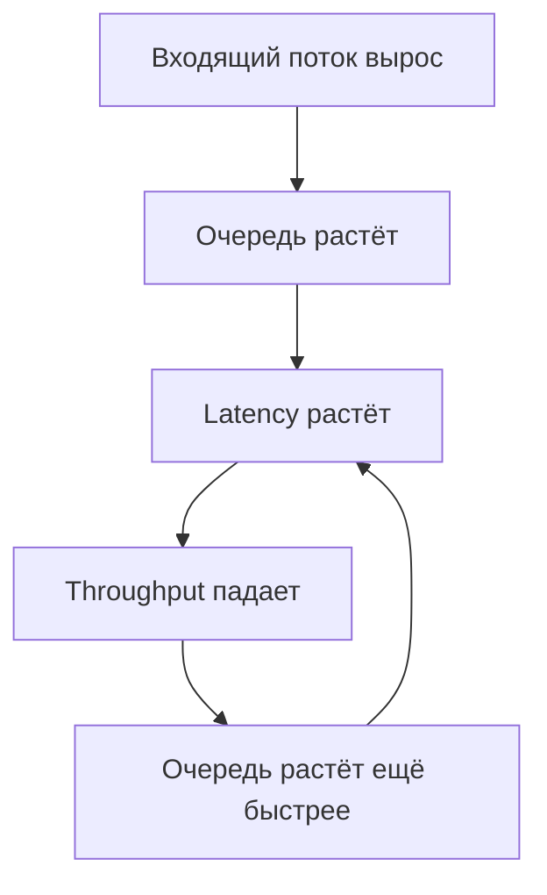
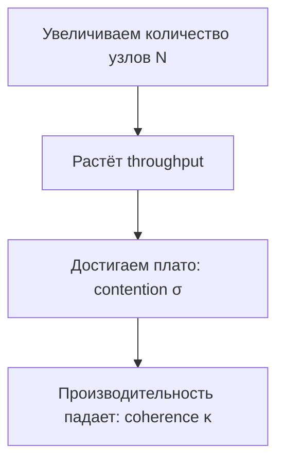

# 🔥 B. Throughput Scaling

# 🎬 ВСТУПЛЕНИЕ (2–3 минуты)

Представьте: ваш сервис работает быстро. Красиво, ровно, графики зелёные.
Вы добавляете немного нагрузки — и всё внезапно превращается в ад.

* latency прыгнуло в 20 раз,
* RPS упал,
* очереди выросли,
* клиенты начали ретраить,
* downstream умер,
* удержание пользователей опустилось в минус бесконечность.

Это не баг, это **законы физики распределённых систем**.

Сегодня мы разберём:

* что такое throughput,
* почему он НЕ растёт от количества серверов,
* почему добавление ресурсов иногда *убивает* производительность,
* и какие законы описывают такое поведение

---

# 📌 ЧТО ТАКОЕ THROUGHPUT (и чем он отличается от latency)

Большинство инженеров в голове путают эти две вещи, а потом удивляются графикам.

### Latency

Это время ответа на **ОДИН** запрос.
Миллисекунды.

### Throughput

Это **СКОЛЬКО** запросов мы можем обработать **в секунду**.
RPS, QPS, ops/sec.

Они неразрывно связаны:

```text
Если нагрузка > throughput → latency растёт.  
Если latency растёт → throughput падает.  
Если растёт concurrency → растёт latency.
```

Это не две независимые метрики.
Это два конца одной трубы, которая забивается при перегрузе.

---

# 📐 Визуализация деградации



Это и есть **doom loop**.
Любая система, которая не ограничивает нагрузку — умеет падать сама на себя.

---

# 📊 ГЛАВНАЯ ФОРМУЛА (Little’s Law) (уже разбирали в latency)

```
Latency = Concurrency / Throughput
```

Пример:

* concurrency = 3000
* throughput = 1000 RPS

latency = 3 секунды.

Без магии.
Просто законы очередей.

---

# 🔥 ПРИМЕР ИЗ РЕАЛЬНОГО МИРА

Redis отвечает за 1–2 ms. Идеально.

Но:

* на hot key он выдерживает только 50–100k RPS,
* вы даёте 200k входящего,
* throughput кончается,
* latency растёт до 10ms,
* потом 50ms,
* потом 200ms,
* потом Redis сбрасывает коннекты.

Даже железный Redis имеет жёсткий потолок.

---

# 🧩 АНАЛОГИЯ

**Latency** — скорость одного кассира обслужить покупателя.
**Throughput** — сколько покупателей пройдёт через кассу за минуту.

Если покупателей приходит больше, чем касса успевает обслужить:

* очередь растёт,
* throughput не растёт — упёрлась,
* люди бесятся.

С backend-системами то же самое.

---

# 1. БОЛЬ: ПОЧЕМУ “ДОБАВИМ СЕРВЕРОВ” НЕ РАБОТАЕТ

* масштабирование **нелинейно**
* после точки насыщения производительность **падает**
* очереди формируются **везде**
* блокировки становятся **центральной точкой бутылочного горлышка**
* даже ОДИН медленный запрос ломает всю цепочку

---

# 2. ЗАКОНЫ МАСШТАБИРОВАНИЯ

## ✔ 2.1. Закон Амдаля (Amdahl’s Law)

Говорит простое:

- > если хотя бы маленькая часть программы НЕ параллелится — она ограничивает ускорение.
- Система ускоряется ровно настолько, насколько позволяет её самый медленный непараллелящийся кусок.
- девять женщин за один месяц не родят ребёнка.

Пример:

* 95% можно распараллелить,
* 5% — нет,

→ максимум ускорения = x20.
Хоть 1000 серверов ставь.

---

## ✔ 2.2. Закон Густафсона (Gustafson’s Law) (usl)

Когда у нас появляется больше вычислительной мощности, мы обычно не ускоряем маленькие задачи — мы решаем более масштабные задачи. Симуляции погоды становятся детальнее, модели нейросетей — больше, графика — реалистичнее.
У нас есть больше ресурсов, давайте решим БÓЛЬШУЮ задачу за то же время"
Мы не пытаемся ускорить старую задачу, мы берём новую, большую

Противоположность Амдалю:

> если сама задача растёт → параллелизм работает лучше.

Хорошо подходит для аналитики, ML, batch-процессинга.
Плохо — для веба и API.

теперь мы за 9 месяцев рожаем 9 детей, а не 1

---
Это **самая практичная** модель масштабирования из всех.
Амдаль слишком упрощён.
Густафсон слишком оптимистичен.

**А USL объясняет реальный прод, в котором всё ломается.**

USL говорит:

> Производительность растёт…
> потом перестаёт расти…
> потом начинает падать.
> И это нормально.

Да, падать.
Добавляешь сервера → производительность хуже.
Звучит как твой первый стартап.

---

# ✔ Формула (не больно)

```
C(N) = N / (1 + σ (N − 1) + κ N (N − 1))
```

* N — количество узлов / потоков / воркеров
* σ — коэффициент конкуренции (contention)
* κ — коэффициент координации (coherence)

### Перевод на человеческий:

* **σ — это сколько мы тратим времени на борьбу друг с другом**
  (доступ к БД, блокировки, shared ресурсы, hot keys)

**σ (contention)**
Это как один туалет на 50 человек.
Вроде людей больше, но быстрей это не работает.

* **κ — это сколько мы тратим времени на синхронизацию**
  (репликации, согласование транзакций, обновление кэшей, межсерверные протоколы)

**κ (coherence)**
Это как ежедневка в Тимлиде, когда 50 человек пытаются договориться.
Чем больше людей, тем дольше согласование.

---

# ✔ Что показывает график (суть в трёх фазах)

## 1) Фаза роста (linear scale, всё хорошо)

При малых нагрузках:

* contention ≈ 0
* coherence ≈ 0
* performance ≈ N

```
+------- масштабирование почти линейное
```

---

## 2) Фаза плато (упёрлись в shared resource)

Появляется σ (contention):

* lock на одной строке
* глобальный счётчик
* один Redis-ключ
* один шард горячий
* один поток пишет в Kafka слишком медленно

Система перестаёт расти:

```
------ plateau ------
```

---

## 3) Фаза деградации (координация всех убивает)

Включается κ (coherence):

* расходы на синхронизацию между нодами
* репликация всех данных всем
* глобальные транзакции
* invalidation кэша на всех нодах
* перекрёстные запросы “а дай мне твои данные”

Получается вот это:

```
  /\       ← максимум
 /  \
/    \     ← чем больше ресурсов, тем хуже
```

Да-да, **система становится хуже из-за роста количества узлов**.

Классика: “добавим ещё 20 воркеров, и очередь почистится”…
а потом всё медленнее и медленнее.

---


# ✔ Пример из реального продакшена

### Пример 1: Redis hot key

* чтение горячего ключа = быстро
* но Redis однопоточный
* 100к RPS → всё нормально
* 500к RPS → конкуренция растёт
* 2 млн RPS → Redis начинает тормозить → throughput падает
* приложение ещё больше ретраит → система падает полностью

Это чистый USL:

* σ растёт — перестаёт масштабироваться
* κ растёт (сетевая синхронизация, TCP congestion) — начинает деградировать

---

### Пример 2: Postgres sequence

Ты сделал `serial` или `nextval()` на счётчике заказов.

Сначала:

* 2 сервера → отлично
* 4 сервера → норм
* 8 серверов → seq-lock начинает висеть
* 16 серверов → throughput падает
* 32 сервера → база умирает

---

### Пример 3: Пул PHP-FPM воркеров

* ставишь 50 воркеров → норм
* ставишь 200 → контекстные переключения начинают жрать CPU
* ставишь 600 → latency растёт
* ставишь 1200 → сервер висит, потому что CPU только планировщиком занят

Это снова USL:

* σ = борьба за CPU
* κ = overhead планировщика ядра

---

# ✔ Что даёт закон Гюнтера инженеру (на практике)

1. **Выяснить точку оптимального N**
   Где производительность максимальна.

2. **Понять, что “добавить ещё ресурсов” не поможет**
   Если σ и κ высоки — нужен рефактор, а не железо.

3. **Распознать три источника боли:**

  * contention → убираем shared ресурсы
  * coherence → убираем глобальные операции
  * sequential → избавляемся от узких мест

4. **Понять, почему 2PC, глобальные транзакции и shared counters — зло.**

5. **Обосновать менеджерам, почему “поставьте на кластер 20 инстансов” — не решение.**




---

## ✔ 2.4. Little’s Law (ещё раз)

Основной закон очередей:

```
Latency = Concurrency / Throughput
```

Работает ВСЕГДА.

---

# 3. КРИТИЧЕСКИЕ ЭФФЕКТЫ, КОТОРЫЕ УБИВАЮТ ПРОД

## ✔ Convoy Effect

Один тормозящий запрос держит lock → все ждут.

## ✔ Head-of-Line Blocking

Первый в очереди медленный → вся очередь умерла.

## ✔ Tail Amplification

При росте нагрузки хвост увеличивается быстрее средней.

## ✔ Coordinated Omission

Метрики лгут.
Система работает медленно, но графики гладкие, потому что метрики не учитывают моменты, когда запросы просто не могли попасть в систему (классическая ошибка в нагрузочных тестах).

---

# 4. РЕАЛЬНАЯ БОЛЬ У ИНЖЕНЕРОВ

* RabbitMQ очередь замерла из-за одного slow consumer
* Redis не вытягивает hot key
* Postgres упёрся в row lock
* PHP-FPM достиг max_children и начал ставить очередь на воркеры
* Kafka consumer lag растёт из-за одного тормоза
* gRPC ретраи умножают нагрузку → кластер умирает

---

# 5. ПРАКТИЧЕСКИЕ СПОСОБЫ РЕШИТЬ ЭТУ БОЛЬ

## ✔ Избегать координации

* убрать глобальные mutex’ы
* отказаться от глобальных последовательных ID
* убрать centralized counters

## ✔ Segregation of workloads

Разделить:

* write-heavy / read-heavy
* user traffic / batch jobs
* background tasks / synchronous API

## ✔ Изоляция hot keys

* отдельный Redis tier
* microsharding
* L1 cache

## ✔ Backpressure

Система должна уметь **отказывать**, а не умирать:

* HTTP 429/503
* лимиты на queue length
* ограничения concurrency
* drop overload trafficВот компактная вставка, которую можно прямо в сценарий влепить — коротко, практично и без перегруза.

Представь, у тебя PHP-FPM настроен на:

* `pm.max_children = 50`

Это значит: одновременно может работать **50 запросов**, остальные становятся в очередь.

Теперь прилетает пик:

* 200 запросов в секунду
* каждый занимает воркер на 300 ms

Что происходит без backpressure:

1. первые 50 запросов заняли воркеры
2. следующие 150 — встают в internal queue
3. очередь растёт → latency растёт
4. клиенты начинают ретраить → нагрузка ×2
5. все воркеры забиты → всё висит
6. FPM начинает отдавать 504/502
7. nginx перестаёт ждать и добивает ретраями
8. сервис улетает в чёрную дыру

Это классика: “у нас ничего не ломалось… пока всё не сломалось”.

---

## ✔ Теперь с backpressure

PHP-FPM (или API Gateway) делает простую вещь:

* если очередь воркеров > 20
  → мгновенно отдаём `429 Too Many Requests`
* если очередь > 40
  → режем rate limit на входе
* если очередь > 50
  → полностью закрываем ingress до стабилизации

Что меняется?

* нет таймаутов по 30 секунд
* нет retry storm
* нет лавины в БД
* нет роста latency
* нагрузка резко сбрасывается
* система возвращается в норму за секунды

Клиент получает **быстрый отказ**, а не **долгую смерть**.

---

## ✔ Суть

Backpressure — это умение сказать:

> “Я не успеваю. Подожди. Или приходи позже.”

Это спасает PHP, Redis, Postgres, очереди, брокеры и всю остальную цепочку от цепной реакции падений.

## ✔ Circuit Breakers (объясняли в latency)

Чтоб один умирающий сервис не утянул за собой 10 здоровых.

## ✔ Replication vs Sharding

Для чтения → реплики.
Для записи → шарды.

“Пихать всё в одну базу” — прямой путь к row-lock аду.

