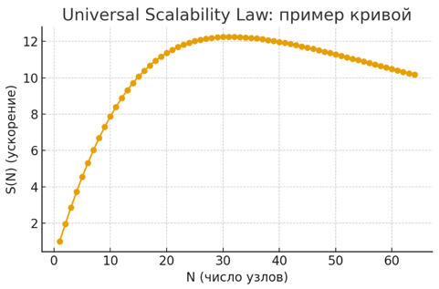

## Блок 1.2. Throughput Scaling законы

### 1. Напоминание базовой формулы

итак мы разобрали что по закону литтла если мы увеличим throughput то latency уменьшится

> Latency = Concurrency / Throughput

получается При фиксированном throughput рост входящего RPS приводит к росту concurrency, а значит и latency.

Если мы хотим удержать latency на приемлемом уровне при росте нагрузки, нужно:

- либо повышать throughput;
- либо ограничивать concurrency (backpressure, очереди, быстрые отказы) а это мы уже разобрали;

как увеличить throughput? кажется все просто - масштабировать систему горизонтально, то есть больше серверов добавлять

но оказывается рост числа серверов может как ускорить так и замедлить нас, поэтому обратимся к законам масштабирования пропускной способности

всего их три - закон амдаля, густафсона и Universal Scalability Law, разберем по порядку

### 2. Amdahl’s Law: почему “ещё серверов” не спасает

Итак, кажется логично: хотим больше throughput → давайте добавим серверов / воркеров / реплик.

Закон Амдаля говорит - фиг вам

> Ускорение системы ограничено той частью работы, которую нельзя распараллелить.

Представим запрос:

- 70% времени он тратит на параллелящуюся часть (можно растащить по серверам / воркерам);
- 30% — на строго последовательный кусок (один мастер, один lock, один общий ресурс).

Если бы параллельная часть стала “бесконечно быстрой”, эти 30% всё равно никуда не денутся.

Формула Амдаля:

```text
S_max = 1 / (1 - p)
```

где `p` — доля параллелящейся части работы.

тогда для нашего примера при `p = 0.7`:

```text
S_max = 1 / 0.3 ≈ 3.33
```

То есть:

- хоть 10, хоть 100 серверов поставь,
- если 30% запроса упираются в один общий участок,
- максимум ты ускоришься примерно в 3.3 раза, дальше — потолок.

Та же интуиция, что и в классике:

> Девять женщин за месяц не родят одного ребёнка.

Есть кусок работы, который по природе последовательный, и никакое “горизонтальное масштабирование” его не отменит.

Примеры таких непараллелящихся кусков:

- один монолитный `AuthService`, через который проходят все логины;
- один мастер в БД, через который идут все записи.

Чтобы пробить потолок, мало “добавить серверов” — нужно резать именно последовательную часть. Например, переходить к eventual consistency. 
Об этом поговорим подробно позже

#### Привязка к собесам

Частая проблема на систем дизайне

> — Нагрузка растёт, latency растёт. Что будем делать?
> — Добавим ещё несколько копий сервиса и реплик базы.

этого мало. Ожидают примерно такого хода мысли:

- “Смотрите, по закону Амдаля ускорение упрётся в непараллелящуюся часть: всё, что идёт через одиночный master/lock/очередь, и есть наш bottleneck.”
- “Read-реплики поднимут throughput по чтениям, но запись денег всё равно упрётся в один master — это и есть тот самый (1 − p).”
- “Если хотим реально расти по throughput, надо уменьшать долю последовательной части: шардировать биллинг, резать горячие таблицы, разводить очереди и инварианты.”

То есть хороший ответ на собесе — не “накидаем серверов”, а “определим, где у нас последовательный кусок
И что мы можем с ним сделать, иначе по Амдалю дальше X-кратного ускорения мы не продвинемся”.

### 3. Gustafson: масштабируем задачу

С Амдалем мы смотрели на мир так:

> Есть одна и та же задача.
> Мы добавляем ресурсы и спрашиваем: “насколько быстрее она станет выполняться?”

И быстро упёрлись в последовательную часть: есть кусок работы, который по природе нельзя распараллелить, и он ставит потолок ускорению.

Закон Густафсона предлагает другой взгляд:

> Зафиксируем бюджет времени и спросим:
> “сколько работы мы можем сделать за это время, если добавим ресурсов?”

То есть:

- Амдаль: “как сделать одну задачу не за 3 секунды, а за 0.5?”
- Густафсон: “раз уж нам норм жить с 3 секундами —
  давай за эти 3 секунды делать больше полезной работы”.

Инженерная интерпретация:

- нам не всегда нужно делать те же 1000 запросов быстрее;
- чаще нам нужно переваривать уже 100 000 запросов за те же 200 ms p95;
- или считать более тяжёлые отчёты за то же время.

Формально ускорение по Густафсону при N узлах можно записать так:

```text
S(N) = N - α · (N - 1)
```

где `α` — доля непараллелящейся части работы.

Пример:

- пусть последовательная часть = 10% (`α = 0.1`);
- ставим `N = 8` узлов:

```text
S(8) = 8 - 0.1 · (8 - 1)
     = 8 - 0.7
     = 7.3
```

То есть за то же время мы можем сделать работы примерно в 7.3 раза больше, чем на одном узле
(но всё равно не 8 раз, потому что 10% остаются последовательными).

С практической точки зрения это означает:

- масштабируя кластер, мы в реальности используем новые ресурсы, чтобы:

  - обрабатывать больше трафика при том же p95;
  - считать более тяжёлые отчёты за то же время;
- но доля последовательной, shared-части (`α`) всё равно ограничивает, насколько близко мы подберёмся к идеальному `S(N) ≈ N`.

Кейс: nightly‑отчёт по логам маркетплейса.

- Есть ночной джоб, который за 1 час считает агрегаты по логам заказов за вчера: выручка по магазинам и категориям.
- Мы добавили ещё N воркеров и расширили кластер хранилища логов, но SLA остался тем же — отчёт по‑прежнему должен укладываться в час.
- Вместо того чтобы “сделать тот же отчёт быстрее”, мы начинаем делать его “толще”: добавляем срезы по городам, устройствам, промоакциям, удлиняем период истории.
- В терминах Густафсона масштабирование здесь — это “за тот же час считаем больше полезной аналитики”, а не “тот же отчёт, но чуть быстрее”.

#### 3.5. Universal Scalability Law (USL)

Амдаль и Густафсон говорят нам, какая теоретическая польза от добавления ресурсов:
- Амдаль — про потолок ускорения;
- Густафсон — про то, как впихнуть больше работы в тот же бюджет времени.

Но в реальных системах при росте числа узлов мы начинаем платить:

- за contention — конкуренцию за общие ресурсы;
- за coherence — согласование состояния между репликами.

Примеры contention:

- Один hot ключ в Redis, по которому у нас инкремент счётчика.
- Один row-lock в БД, через который проходят все обновления.
- Глобальный мьютекс в приложении.

Примеры coherence:

- Репликации БД, где нужно поддерживать согласованное состояние.
- Кластеры кэшей, где надо инвалидировать/обновлять значения на нескольких нодах.
- Распределённые транзакции между сервисами.


Это описывает Universal Scalability Law (закон универсальной масштабируемости):

```text
S(N) = N / (1 + σ · (N - 1) + κ · N · (N - 1))
````

где:

- `N` — число узлов,
- `σ` — накладные расходы на contention,
- `κ` — накладные расходы на coherence.

Интуитивно:

- при маленьком N знаменатель почти 1 → S(N) ≈ N, масштабирование почти линейное;
- дальше σ · (N - 1) начинает доминировать — рост замедляется, кривая выходит на плато;
- при большом N κ · N · (N - 1) становится огромным —
  затраты на согласование и координацию растут быстрее, чем полезный throughput,
  и кривая реально начинает клониться вниз.

Вот отсюда и рождается реальный эффект “добавим ещё серверов — стало только хуже”:
мы увеличили количество узлов, но ещё сильнее увеличили внутреннюю координацию и борьбу за shared-ресурсы.



Пример: база данных биллинга в том же маркетплейсе.

- В начале: одна БД платежей, один сервер, все операции по деньгам проходят через неё — при умеренной нагрузке всё летает.
- Потом: добавляем реплики для чтения, чтобы снять нагрузку с мастера и кормить отчёты/аналитику.
- Кажется, throughput растёт: фронты и API‑слой масштабируются, чтения уезжают на реплики.
- Но:

    - все записи по деньгам (списание, возврат, hold) всё равно упираются в один мастер;
    - транзакции, row‑lock’и и проверки инвариантов вокруг балансов не дают распараллелить этот кусок;
    - по мере роста числа приложений, бьющих в ту же БД, растёт contention по “горячим” строкам и индексам.

В итоге:

- мы наращиваем количество приложений и реплик, но σ и κ в формуле USL растут быстрее, чем полезный throughput по деньгам;
- рост нагрузок приводит к росту lock‑contention и стоимости репликации;
- в какой‑то момент добавление новых сервисов/реплик перестаёт помогать: throughput по критичным операциям платёжки почти не растёт, а tail latency чек‑аута начинает ухудшаться.

#### 6. Базовые приёмы для устойчивого роста throughput 

##### Backpressure

Backpressure разбирали в прошлой части

##### Разделение нагрузок и данных

Чтобы уменьшить contention:

- разбиваем монолитные ресурсы:

    - шардируем БД по пользователям / регионам;
    - разделяем сервисы по доменам;
    - выносим отдельные кластеры под тяжёлые операции.
- переводим горячие операции в отдельные потоки обработки:

    - отдельные кластеры Redis для разных типов данных;
    - отдельные очереди и воркеры под тяжёлые задачи.

Идея:

- вместо одного куска “последовательной части” делаем несколько независимых;
- уменьшаем долю непараллелящейся работы → выигрываем по Амдалю.

##### Изоляция hot ресурсов

Если видим hot key / hot таблицу / hot endpoint:

- выносим его в отдельный сервис / кластер;
- даём ему собственные лимиты, свой backpressure, свои воркеры.

Это позволяет:

- не давать одному горячему кейсу “съесть” весь throughput;
- масштабировать именно то место, где действительно больно.

> Производительность распределённой системы — это не настройка одного Nginx,
> а баланс между математикой (Little, Amdahl), архитектурой (shared ресурсы, шардирование)
> и эксплуатацией (ретраи, очереди, алерты, circuit breakers).
