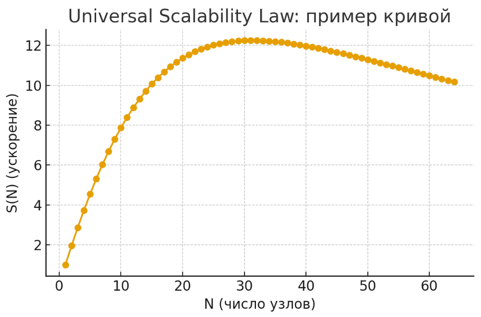

### Блок 1.3. Throughput Scaling законы

#### 1.3.1. Напоминание базовой формулы

как мы выяснили раньше, по закону Литтла, если мы хотим удержать latency на приемлемом уровне при росте нагрузки, нужно:

- либо повышать throughput;
- либо ограничивать concurrency (backpressure, очереди, быстрые отказы) а это мы уже разобрали;

как увеличить throughput? кажется все просто - масштабировать систему горизонтально, то есть добавить больше серверов

но, оказывается, рост числа серверов может как ускорить, так и замедлить нас, поэтому обратимся к законам масштабирования throughput

всего их три - закон амдаля, густафсона и Universal Scalability Law, разберем по порядку

#### 1.3.2. Amdahl’s Law: почему “ещё серверов” не спасает

Закон Амдаля говорит:

> Ускорение системы ограничено той частью работы, которую нельзя распараллелить.

Представим запрос:

- 70% времени он тратит на параллелящуюся часть (можно растащить по серверам / воркерам);
- 30% — на строго последовательный кусок (один мастер, один lock, один общий ресурс).

Если бы параллельная часть стала бесконечно быстрой, эти 30% всё равно никуда не денутся.

конечно же, закон описывается математической формулой, но на собесе важно не формулу вспомнить,
а понимать сам закон и уметь принимать решения исходя из него

формулу можете видеть на экране

```text
S_max = 1 / (1 - p)

где p - доля параллелящейся части работы,
    S_max - максимальное ускорение
```

тогда для нашего примера с 70% параллельной части максимальое ускорение составит 3.3 раза

```text
S_max = 1 / 0.3 ≈ 3.33
```

То есть:

- хоть 10, хоть 100 серверов мы поставим
- если 30% запроса упираются в один общий участок,
- максимум мы ускоримся примерно в 3.3 раза

Часто это выражают жизненным примером

> Девять женщин за месяц не родят одного ребёнка.

Примерами таких последовательных участков в системе может быть 

- один мастер в БД, через который идут все записи.
- или один монолитный `AuthService`, через который проходят все логины;

Чтобы пробить потолок, мало “добавить серверов” — нужно ускорять или разбивать именно последовательную часть. 

Например, переходить к eventual consistency, о которой поговорим позже

#### Привязка к собесам

На систем-дизайне часто бывает так: ты прикинул нагрузку и понял, что один инстанс не вытягивает — надо масштабироваться.
И вот здесь полезно проговорить Амдаля словами:

- сначала оцени, какая часть запроса реально параллелится (CPU, stateless-логика, fan-out по независимым данным);
- а какая часть всегда проходит через один общий участок

Дальше решение простое:

- если упираемся в параллельную часть → X-масштабирование (добавить инстансы) действительно помогает;
- если упираемся в последовательную часть → добавление инстансов почти не даст эффекта, надо уменьшать этот кусок:
  шардировать записи, убирать общий лок, переразбивать данные/инварианты, разводить очереди, иногда ослаблять консистентность.

Плохой ответ на собесе — “добавим серверов / распилим на микросервисы” без указания где bottleneck

#### 1.3.3. Gustafson: масштабируем не скорость, а объём работы

Однако бизнесу не всегда нужно именно ускорить запрос

Бывает, что за тот же временной интервал мы хотим выполнять больший объем работы

Например
- нам надо при том же p95 пережёвывать уже не 10k запросов, а 100k;
- или Есть job, который за 1 час считает агрегаты по логам заказов за вчера: выручка по магазинам, категориям и т.п.
  - Мы добавили ещё N-ое количество воркеров
  - SLA не поменялся: как был час, так и остался час.
  - Вместо “давайте посчитаем тот же отчёт за 10 минут” бизнес часто говорит “давайте тогда за тот же час:
    - добавим разрез по городам,
    - по устройствам,
    - по рекламным кампаниям,
    - и возьмём не один день, а неделю”.

здесь нам на помощь приходит закон Густафсона.

Как и в случае с Амдалем мы не получаем линейного ускорения от добавления серверов, но формула уже другая

```text
S(N) = N - α · (N - 1)
где α — доля непараллелящейся части (как и у Амдаля).
    N - количество узлов
    S(N) - во сколько раз больше работы можем сделать
```

Например при:

- последовательной части в 10% 
- и 8 узлах

Получаем увеличение объема в 7.3 раза, а не в 8

```text
S(8) = 8 - 0.1 · (8 - 1)
     = 8 - 0.7
     = 7.3
```

То есть мы снова упираемся в долю последовательной части

##### Как это продать на собеседовании

если на собесе попадется задача проделать больший объем работы за то же время,
то теперь вы знаете, как посчитать сколько инстансов нужно подымать - главное определить количество непараллелящейся части

То есть ты показываешь, что:

- понимаешь разницу между ускорением запроса и увеличением работы за то же время
- а также понимаешь нелинейность масштабирования в цифрах

#### 1.3.4. Universal Scalability Law (USL)

Однако что закон Амдаля что закон Густафсона не учитывают накладные расходы на распараллеливание системы, которая всегда есть в реальном мире

При росте числа узлов мы начинаем платить за contention и coherence

что это за слова?

- contention — это конкуренция за общие ресурсы, Чем больше параллелизма, тем больше времени тратится не на полезную работу, а на ожидание доступа, например

  - У сервиса пул на Postgres = 50 коннектов. При пике 500 параллельных запросов часть просто ждёт свободное соединение.
  - Rate limit на внешний API

- coherence — это согласованное состояния компонентами или слоями системы, например

  - Реплики БД, где нужно поддерживать согласованное состояние.
  - Кластеры кэшей, где надо инвалидировать/обновлять значения на нескольких нодах.
  - Распределённые транзакции между сервисами.

Это учитывает Universal Scalability Law

```text
S(N) = N / (1 + σ · (N - 1) + κ · N · (N - 1))

где:

- S(N) - speedup, насколько раз вырастает пропускная способность (или объём работы в единицу времени) при N узлах по сравнению с одним узлом.
- N — число узлов,
- σ — накладные расходы на contention,
- κ — накладные расходы на coherence.

````

Какие выводы мы можем сделать из этого закона?



~~на экран~~

- при маленьком числе узлов масштабирование почти линейное;
- дальше рост замедляется, кривая выходит на плато;
- при большом количестве узлов затраты на согласование и координацию растут быстрее, чем полезный throughput,
  и кривая начинает клониться вниз.

Получается мы можем добавить ресурсов системе через добавление узлов, но только ухудшить производительность этим

Разберем кратко на примере биллинга в маркетплейсе.

- Мы добавляем инстансы API и read-реплики БД — чтения масштабируются
- Но записи по деньгам всё равно идут через один master и держат локи/инварианты: это contention.
- Плюс растёт цена синхронизации реплик/кворумов и сетевых подтверждений: это coherence.
- В итоге после некоторого N новые узлы почти не дают throughput, зато ухудшают p95/p99 накладными расходами

Что мы можем с этим поделать? 

во-первых, по закону литтла все приемы уменьшения latency, которые мы разобрали ранее, помогают нам увеличить throughput

Во-вторых есть еще пара способов:
- Разделение нагрузок и данных
- Изоляция горячих ресурсов

#### 1.3.5. Базовые приёмы для устойчивого роста throughput 

##### Разделение нагрузок и данных

Чтобы уменьшить contention:

- разбиваем монолитные ресурсы: например шардируем БД по пользователям / регионам;

то есть идея в том чтобы

- вместо одного куска “последовательной части” сделать несколько независимых;
- уменьшить долю непараллелящейся работы → а следовательно выиграть в масштабировании по Амдалю.

##### Изоляция hot ресурсов

Если видим hot key / hot shard / hot endpoint:

- выносим его в отдельный сервис / кластер;
- даём ему собственные лимиты, свой backpressure, свои воркеры.

Это позволяет:

- не давать одному горячему ресурсу убить весь throughput;
- масштабировать именно то место, где действительно высокая нагрузка
