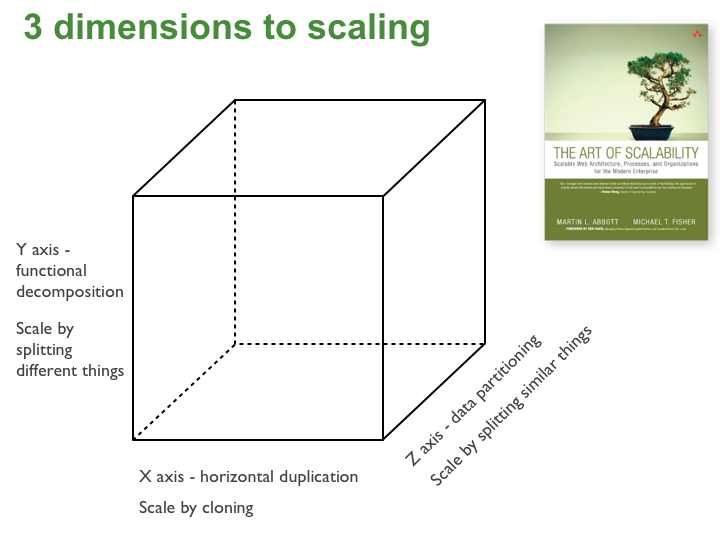

### Блок 1.4 Балансировка и Scale Cube

мы уже несколько раз сказали что добавление серверов не обязательно приведет к масштабированию, но это не единственный способ

#### 1.4.1 Scale Cube: три оси масштабирования

Есть модель Scale Cube, согласно которой масштабирование бывает по трём осям, и каждая подходит под определенный bottleneck.

Ось X — клонирование.
- то есть добавление инстансов того же сервиса за балансером
- Она помогает, когда мы упираемся в CPU или IO на приложении.

Ось Y — разделение ответственности.
- Это по сути переход к микросервисам: поиск отдельно, отчёты отдельно, биллинг отдельно. каждый на своем стеке, отдельно масштабируется и тд
- Ось Y нужна, когда одна часть системы начинает “убивать” остальные части, и её нужно изолировать и масштабировать отдельно.

Ось Z — разделение по данным.
- Это например шардирование или партиционирование
- Ось Z нужна, когда потолок — данные: одна база, hot keys, локи, или просто физический предел по записи.

то есть на собесе в зависимости от условий задачи отталкивайтесь от bottleneck'ов и идите по нужной оси, например

Если узкое место — приложение, то X реально помогает: добавляем инстансы и правильно балансируем.

Если узкое место — база, то
- X почти не помогает: мы просто быстрее добиваем базу.
- Микросервисы по оси Y тоже часто ухудшают, потому что появляется больше сетевых вызовов и сложнее консистентность.
- А вот Z может дать рост capacity: партиционирование, шардирование, а для чтений — реплики.

Если ты не можешь назвать узкое место цифрами и метриками — ты не масштабируешь, ты просто усложняешь систему.

#### 1.4.1 Балансировка: где она вообще происходит

И раз мы активно говорим о горизонтальном масштабировании, надо пару слов сказать о балансировке: как запрос вообще попадает на конкретный инстанс.

Начнём с простого: балансировщик — это не один Nginx “перед всем”. Балансировка обычно есть в нескольких местах.

Первое — на входе в систему.

Запрос прилетает в наш edge: это может быть ingress, API gateway, Envoy/Nginx, облачный load balancer.
Там мы терминируем TLS, маршрутизируем запрос в нужный сервис и выбираем один из его инстансов.

Второе — внутри системы. 

Когда один сервис вызывает другой, там снова нужно выбрать инстанс: 
- либо через service discovery, 
- либо через сервис-меш, 
- либо еще как-то

И третье — на уровне данных - так как могут быть разные реплики или шарды

#### 1.4.1 Правила выбора инстанса

Окей, теперь “как выбираем ноду”.

- Самое простое — round robin: на каждую ноду по очереди
  Это нормально, если ноды одинаковые и запросы одинаковые.
  Если запросы разные по тяжести, то round robin начинает давать перекосы. 

- Тогда используют least connections или least outstanding: отправляем туда, где сейчас меньше активных запросов.
  Идея простая: мы уменьшаем очередь на стороне сервиса — а значит, уменьшаем latency. 
  Так же можем мониторить время отклика нод и отправлять на более быструю, давая медленным восстановиться

- Иногда нужен hash по ключу — например по `user_id` или `session_id`
  Это нужно, когда нам нужно отправлять запрос на определенную ноду - там либо кеш под нее есть, либо данные, либо еще что-то
  называется это sticky sessions или session affinity.
  Минус — появляется риск горячих нод: один сегмент пользователей может перегрузить конкретный инстанс, и хвосты вырастут локально, но сильно.

#### 1.4.2 Stateless vs sticky: надо ли “приклеивать” пользователя

Если сервис stateless, то любой запрос можно отправить на любой инстанс, а состояние живёт в Redis/БД/токене. Это проще и надёжнее.

То есть у нас есть выбор: мы или хотим, чтобы сервис был stateless, или нам нужна session affinity.

Обычно правило такое: по умолчанию делаем stateless, 
а sticky включаем только если есть понятный выигрыш — например, тяжёлый L1-кэш или есть проблемы с read-you-write consistency

#### 1.4.3 Как это звучит на собеседовании

На собеседовании обычно надо сказать про балансировку уровня гейтвей и на уровне базы - то есть 2 слоя

Также в зависимости от характера нагрузки на проектируемую систему может понадобиться выбирать разные алгоритмы балансировки
