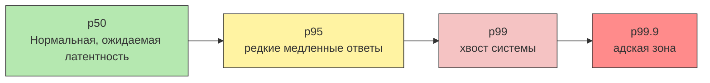
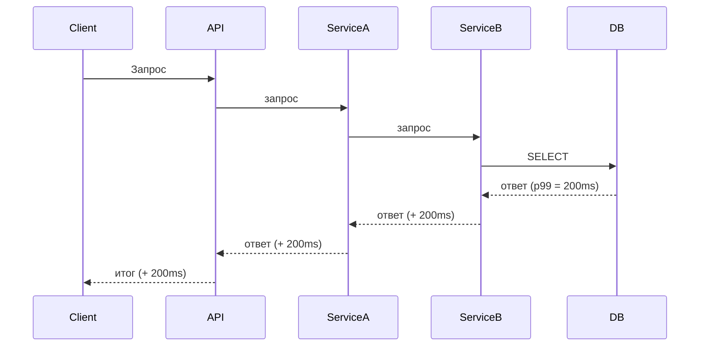
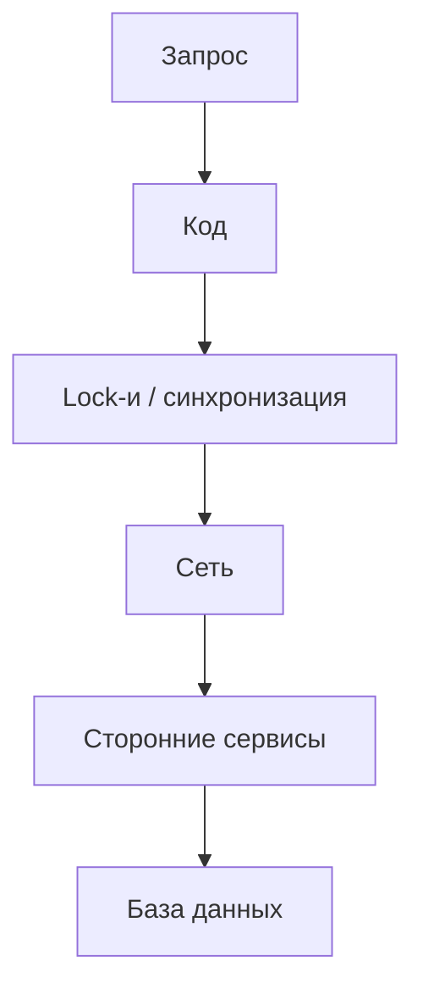
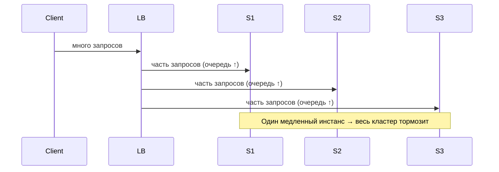
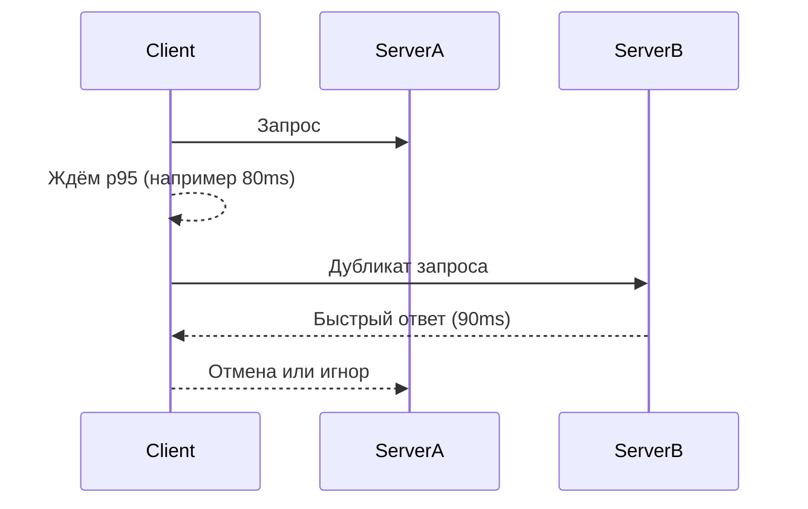
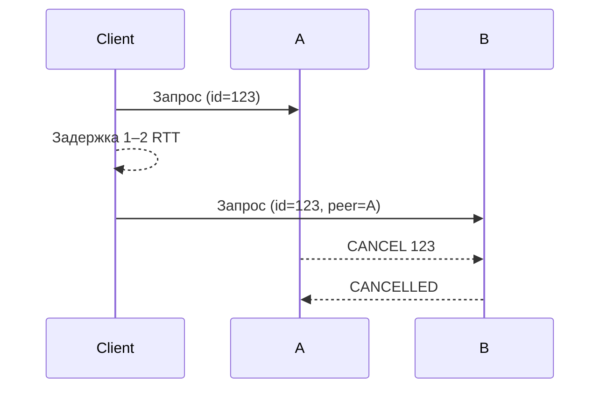
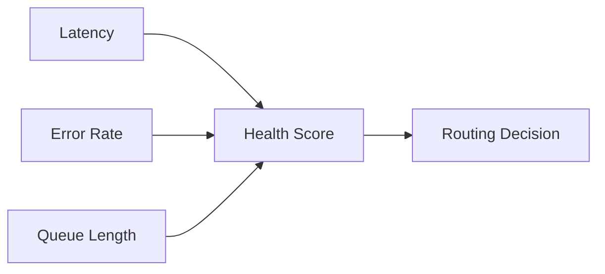
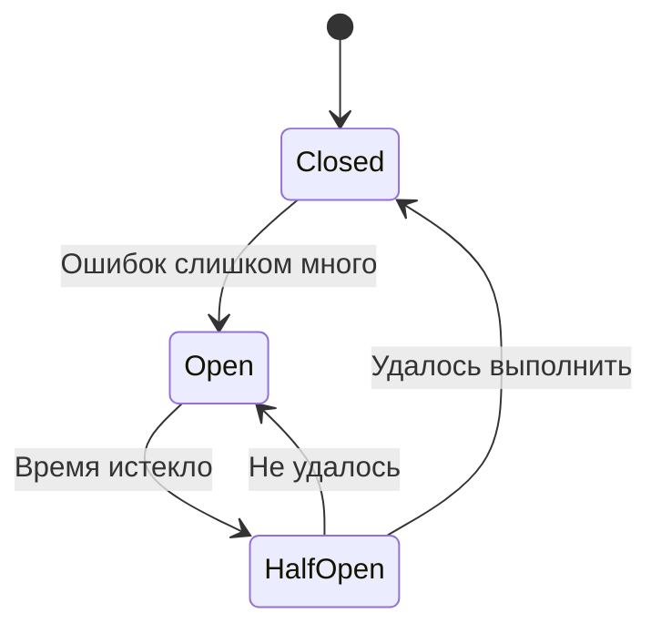
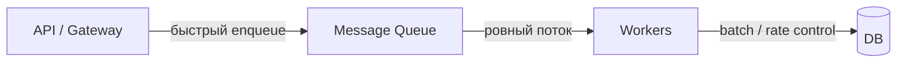
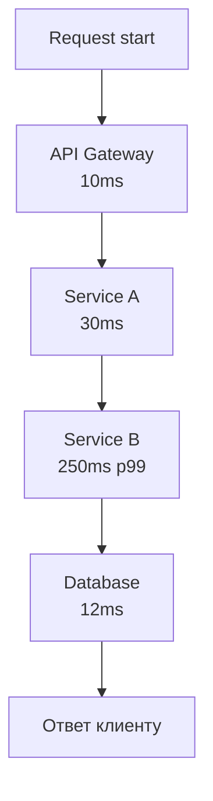

# ВВЕДЕНИЕ (2–3 минуты)

Представьте ситуацию. Ваш сервис работает быстро, красиво, уверенно. Логи чистые, графики ровные.
И вдруг один запрос решает, что пора выбросить вас из зоны комфорта.

Все остальные 999 запросов отработали за 20–30 миллисекунд.
Один — за 2 секунды.

WE ARE IMPATIENT PEOPLE -> money!

Кто-то скажет: «Статистика же нормальная, что такого?»
Ну да, среднее время ответа отличный. p50 отличный. А вот **p99** внезапно живёт своей тёмной жизнью.

И вот эта одна секунда — это не баг. Это не “редкий случай”.
Это нормальная реальность больших систем.

Чем больше система, тем длиннее хвост.
И тем больше проблем он приносит:

* потерянные корзины
* таймауты
* лавины ретраев
* внезапные пики нагрузки
* цепочки деградаций в микросервисах

Мы это называем **tail latency** — задержка на краю распределения.

Чтобы зафиксировать термины — вот простой график:



Среднее значение здесь почти ничего не отражает.
Одна пауза на секунду «съедает» тысячи быстрых ответов.

В этом видео мы разберём не теорию, а настоящую практику —
откуда берётся хвост, почему он растёт, и что с этим реально делают в продакшене.

---

## 📊 БЛОК 1: ПРОБЛЕМА (10–12 минут)

---

## 1.1 Что такое tail latency технически

Tail latency — это поведение системы **на краю распределения задержек**.
Это не «медленный запрос». Это целая зона адской жизни.

Основные метрики:

* **p95** — 5% самых медленных запросов
* **p99** — 1% медленнейших
* **p999** — 0.1% запросов, которые обычно ломают весь продакшен

Почему среднее бессмысленно:

* Если 999 запросов выполнились за 20ms
* И 1 запрос — за 2000ms
* Среднее ≈ **18ms**

По среднему вы выглядите как бог оптимизации,
а реальный пользователь — как альфа-тестер.

---

### 1.2 The Tail at Scale (хвост растёт экспоненциально)

Это та часть, которую **обязательно показать визуально**, иначе люди недопонимают.

Если у вас:

* API Gateway
* Service A
* Service B
* Database
* Redis
* gRPC external

И в каждом p99 = 200ms, то:

```
общий p99 = 200ms ^ N
```

N = количество вызовов в цепочке.

Не буквально в математическом смысле, но **эффект экспоненты** реальный.

Вот диаграмма:



Каждый “почти быстрый” сервис добавляет к хвосту.
И в итоге p99 превращается в секунды, а то и минуты.

---

## 1.3 Откуда берутся хвосты (только практические причины)

### Аппаратные

* GC стопы (в JVM/Go)
* CPU preemption
* I/O spikes («диск внезапно решил подумать»)
* Memory paging
* NUMA перекосы

Если ты на облаке, хвост — это не баг, это план:

> “Сосед жрёт CPU → твой pod тормозит”.

### Сетевые

* перегрузка роутера
* packet loss → TCP retransmit
* неравномерная топология в DC (east-west/cross-rack)

### Программные

* горячие ключи в Redis
* глобальные lock-и
* большие JSON-сериализации
* тяжелые shard'ы

Симпатичная диаграмма “откуда берётся задержка”:



Любой компонент может создать хвост.

---

## 1.4 Каскадные эффекты (всё ломается одновременно)

Вот где настоящий ад начинается.

### 1) Очереди растут → задержки растут

Little’s Law:

```
W = L / λ
```

```
Latency = Concurrency / Throughput
```

Пример:

* concurrency = 3000
* throughput = 1000 RPS

latency = 3 секунды.


Если у тебя чуть-чуть выросло L (длина очереди) — задержка улетает.

### 2) Таймаут → ретрай → лавина

Пользовательский клиент ретраит
гейтвей ретраит
PHP ретраит
всё ретраит

И один хвостовой запрос превращается в:

> RETRY STORM

### 3) Cache-miss avalanche

если ключ горячий → TTL истёк → 5000 запросов идут в базу → база умирает → API умирает → Redis умирает → всё

### 4) Load balancer распределяет боль равномерно

Он не “лечит” хвосты — он их размазывает по всем инстансам,
делая хвост **системным**, а не локальным.

Вот диаграмма:



---

# 🛠 БЛОК 2: РЕШЕНИЯ TAIL LATENCY (15–18 минут)

> Прежде чем бежать оптимизировать, надо принять простую мысль:
> **Хвосты неизбежны.**
> Умные системы не “искореняют” tail latency, они **живут с ним**.

Есть два типа техник:

1. **Уменьшение хвоста** — сделать так, чтобы медленных запросов было меньше
2. **Маскировка/обход хвоста** — сделать так, чтобы медленные запросы не ломали всё подряд

Google прямо так делит подходы: short-term и long-term.

---

# 🔹 2.1. SHORT-TERM: техники уменьшения хвоста

Это то, что можно внедрить **быстро**, и оно начинает сразу снижать p99/p999.

---

## ✔ Hedged Requests

Это решение, которое Google использует практически в каждом сервисе.
Да, в PHP оно тоже работает (если ты не живёшь в мире синхронных адских запросов, но у тебя есть очереди или async-воркеры).

### Суть

Отправляем **второй запрос** через задержку, равную p95.
Первый, кто ответит — выиграл.

Вот пример:



### Почему это работает?

Потому что “хвостовой” сервер — это **редкое состояние**.
Дублирование запроса даёт шанс попасть на быстрый инстанс.

### Плюсы

* p99 падает в **разы**
* p999 падает в **десятки раз**
* дополнительная нагрузка 2–5%
* почти бесплатно по реализации

### Минусы

* операции должны быть *idempotent*
* нельзя делать так для операций с побочными эффектами
* PHP-код на стороне сервера должен уметь обрабатывать дубликаты

### Минимальный PHP пример (Symfony + HTTP Client)

```php
public function hedgedRequest(HttpClientInterface $http, string $url)
{
    $primary = $http->request('GET', $url);

    // Ждем p95 – например 80 мс
    usleep(80_000);

    $secondary = $http->request('GET', $url);

    // Первым пришёл — победил
    $responses = [$primary, $secondary];

    foreach ($responses as $res) {
        try {
            return $res->getContent();
        } catch (\Throwable $e) {
            // игнорируем
        }
    }

    throw new \RuntimeException('Both hedged requests failed');
}
```

Понятно, да?
Ничего магического — просто страховка.

---

# ✔ Tied Requests (Связанные запросы)

Это следующий уровень превосходства над hedging.
Техника мощная, но требует поддержки на стороне серверов.

### Как работает:

1. Клиент отправляет запрос на сервер **A**
2. Через ~2 RTT (обычно ≤1ms в датацентре) отправляет копию на **B**
3. Сервер **A**, начав обработку, отправляет “cancel” на **B**
4. Если **B** ещё не начал обработку → он отменяет
5. Если начал → понижает приоритет или прекращает

### Диаграмма



### В чём сила?

* почти никогда **оба** сервера не начинают работу
* хвостовые задержки глушатся уже на уровне очередей
* не нужно дублировать дорогие операции

### Плюсы

* Меньше нагрузки, чем у hedging
* Сильнее уменьшает p999
* Идеально для невероятно нагруженных API

### Минусы

* сложно реализовать в чистом PHP
* нужна координация между воркерами
* нужен быстрый межсерверный канал

Это уже уровень “кластерного окружения”, но если у тебя большая система — мастхев.

---

# ✔ Request Coalescing

Это простое, но гениальное решение.

### Проблема

Если 5000 запросов одновременно хотят одно и то же —
они идут толпой вниз, вызывая:

* k8s queue spike
* Redis hot key
* DB overload

### Решение

Первый запрос “забирает билет” и идёт вниз.
Остальные ждут и получают тот же результат.

### Пример (Symfony Gateway)

```php
$key = 'coalesce:' . md5($url);

if ($result = $cache->get($key)) {
    return $result;
}

$lock = $lockFactory->createLock($key);

if (!$lock->acquire()) {
    // Кто-то уже делает запрос — подождём результат
    return $cache->get($key, 2.0);
}

try {
    $response = $http->request('GET', $url)->getContent();
    $cache->set($key, $response, 2);
    return $response;
} finally {
    $lock->release();
}
```

### Плюсы

* спасает Redis от смерти на hot key
* уменьшает нагрузку на БД
* работает в любом языке

### Минусы

* не работает для уникальных запросов
* добавляет “микро-задержку” первым в batch

---

# 🔹 2.2 LONG-TERM: маскировка и обход хвостов

Это архитектурные техники — не “фичи”, а подходы.

---

# ✔ Latency-aware Load Balancing

Обычный load balancer:

> распределяет запросы “равномерно”.

Latency-aware LB:

> отправляет меньше запросов на медленные инстансы.

Он оценивает инстансы по **health score**:



Если какой-то node “буксует”, LB его **временно исключает**, потом возвращает через exponential backoff.

### Плюсы

* уменьшает хвост **без изменения кода**
* реакция на реальные условия нагрузки

### Минусы

* нужно много метрик (Prometheus + exporters)
* может сделать “горячие точки”

---

# ✔ Deadline Propagation

Когда у клиента есть “тайм-бюджет”, но никто в цепочке о нём не знает —
это гарантированно приводит к хвостам.

Deadline propagation — это:

* клиент → API: “у меня 200мс на ответ”
* API → сервисы: “у меня осталось 150мс”
* сервисы → база: “у меня осталось 100мс”

### Что это даёт?

Если deadline вышел, сервисы прекращают работу **сразу**, экономя ресурсы.

### Плюсы

* никакой бесконтрольной работы
* меньше нагрузки
* меньше cascade failure

В Symfony это реализуется просто: на входе ты парсишь дедлайн и считаешь “сколько осталось”. Перед каждой операцией (SQL, Redis, HTTP) ты делаешь короткую проверку:

```php
if ($deadline->isExpired()) throw new DeadlineExceededException();
```

И передаёшь оставшийся бюджет в timeout драйвера:

```php
$db->executeQuery($sql, [], ['timeout' => $deadline->remainingMs()/1000]);
```

При вызове downstream-сервисов дедлайн просто прокидывается дальше тем же хедером:

```php
$http->get($url, [
    'headers' => ['X-Deadline-At' => $deadline->getDeadlineAt()],
    'timeout' => $deadline->remainingMs()/1000,
]);
```

Это обеспечивает простое правило: **если дедлайн вышел — работа прекращается везде**, не усугубляя хвосты, не забивая базу и не создавая каскадные сбои. Снаружи клиент получит 504 быстрее, а система сохранит ресурсы.

---

# ✔ Priority Queues

Если очередь одна для всех —
хвост одним медленным batch job положит критичные операции.

Решение: разделение по приоритетам.

### Пример

* HIGH: оформление заказа, оплата
* MEDIUM: получение корзины
* LOW: генерация отчётов

### Плюсы

* гарантии для важного пути
* предсказуемость работы

### Минусы

* риск starvation низких очередей

# ✔ Как реально делаются Priority Queues

Есть **два** практичных варианта:

## **Вариант 1: Несколько отдельных очередей (самый рабочий)**

Ты просто создаёшь **3 очереди**:

```
orders.high
orders.medium
orders.low
```

И запускаешь **отдельные группы воркеров**:

```
workers-high:   20 штук
workers-medium: 10 штук
workers-low:     2 штуки
```

И при этом gateway/producer сам решает куда пихать сообщение:

```php
$priority = $order->isPayment() ? 'high' : 'medium';
$bus->dispatch($msg, new AmqpStamp("orders.$priority"));
```

### Почему это лучший способ:

* ты сам контролируешь пропорцию ресурсов
* высокая очередь не блокируется низкими задачами
* никакой магии брокера, всё прозрачно

Именно так делают Shopify, Netflix и прочие взрослые системы.

---

## **Вариант 2: Настоящий AMQP priority (RabbitMQ Priority Queues)**

RabbitMQ *умеет* “встроенный приоритет”, но он, мягко говоря, ограниченный.

### Как выглядит:

1. Создаёшь очередь с приоритетом:

```bash
x-max-priority: 10
```

2. Отправляешь сообщения с разным значением `priority`:

```php
$bus->dispatch(
    $msg,
    new AmqpStamp('queue', AMQP_NOPARAM, ['priority' => 9])
);
```

### Но проблемы такие:

* очередь всё равно одна → **единичная точка отказа**
* если внутри есть большой LOW message → он всё равно занимает память
* RabbitMQ читает всё подряд, но **ставит high вперёд только при выборе**, не при размещении
* при большом объёме сообщений приоритеты начинают вести себя странно (документированный факт)

Короче: **рабочий вариант, но хуже чем multiple queues**.

---

# ✔ Что используют в реальных продах (короткое резюме)

### **Правильно:**

✔ несколько очередей
✔ несколько пулов воркеров
✔ разные лимиты на concurrency
✔ отдельные dead-letter для каждого приоритета

### **Неправильно:**

❌ одна очередь на всё
❌ надеяться, что “амкп-приоритет всё починит”
❌ не ограничивать низкоприоритетные воркеры

---

# ✔ Мини-диаграмма (как это выглядит)

```mermaid
flowchart LR

A[API] -->|critical| Q1[orders.high]
A -->|normal| Q2[orders.medium]
A -->|bg| Q3[orders.low]

Q1 --> WH[Workers High (20)]
Q2 --> WM[Workers Medium (10)]
Q3 --> WL[Workers Low (2)]
```

---

Ладно, вставляю это в твой блок так, будто оно там и было изначально. Без воды, только практика, как ты хотел.

---

# ✔ Circuit Breaker

Типичная ситуация:

* внешний сервис тормозит
* твой API висит
* ретраи растут
* весь кластер умирает

Circuit Breaker говорит: **“Хватит, мы туда больше не ходим”**, пока сервис не оживёт.



### Как это работает на практике

В реальных системах это не “магический флажок”, а конкретная логика:

* В **Closed** режиме — шлём запросы как обычно, считаем ошибки (timeout, 5xx, отказ в соединении).
* При превышении порога (например, 5 подряд ошибок или 50% за окно) — **переключаемся в Open**, и **мгновенно отдаём отказ**, не выполняя сетевой запрос.
  Это защищает воркеры, базу и очередь от лавины хвостов.
* Через `cooldown` (например, 5 секунд) breaker переходит в **Half-Open** и делает **один пробный запрос**.
  Если он успешен — закрываем, если нет — снова Open.

То есть breaker превращает длительное зависание в **быстрый, контролируемый отказ**, который не убивает остальную систему.

---

### Как это выглядит в API

Типично делают middleware, которое:

1. проверяет состояние breaker
2. если Open — сразу возвращает ошибку или fallback
3. если Closed — делает запрос и считает ошибки
4. если Half-Open — отправляет один пробный запрос

Пример (идея):

```php
if ($breaker->isOpen()) {
    throw new ServiceUnavailableException("Circuit open");
}

try {
    $response = $client->request(...);   // внешний сервис
    $breaker->markSuccess();
    return $response;
} catch (\Throwable $e) {
    $breaker->markFailure();
    throw $e;
}
```

---

### Зачем вообще нужен?

Потому что без него:

* все запросы продолжают висеть на таймаутах
* растёт latency
* растут ретраи
* растут очереди
* база перегружается
* сервис умирает полностью

С breaker’ом:

* основной путь работает стабильно
* low-priority или внешние зависимости “отрезаются”, пока не оживут
* система не входит в retry-storm
* уменьшаются хвосты и queueing delays

---

### Плюсы

* предотвращает каскадные отказы
* защищает критичный бизнес-путь
* быстро обнаруживает проблемы
* уменьшает нагрузку на зависимые сервисы

### Минусы

* нужна fallback-логика (иначе толку мало)
* сложно подобрать пороги (под слишком низкими он «флапает», под высокими — включается слишком поздно)

---

# 🔹 2.3 Архитектурные решения

---

# ✔ Local Caching (L1)

Это super-fast кэш прямо в памяти PHP: APCu, shared-memory, preloaded config и т. д.

Плюсы: скорость → <1ms
Минусы: **invalidation больная**, coherence ломается.

---

# ✔ Micro-sharding

Если один shard тормозит — вся система теряет p99.

Micro-sharding даёт:

* компактные маленькие shard'ы
* миграцию без боли
* изоляцию hot spots

---

# ✔ Queue-Based Load Leveling (коротко, но понятно)

Когда трафик идёт неравномерно, система получает **пики**, из-за которых:

* растёт latency
* забиваются очереди воркеров
* база умирает
* p99 разлетается

Очередь (MQ) вставляется **между API и тяжёлой логикой**, чтобы превратить хаотичные всплески в **ровный поток**.

---

## 🎯 Ментальная модель

**Без очереди:**

Пик трафика = пик нагрузки = смерть бэкенда.

**С очередью:**

Пик трафика → “гасится” в очереди → воркеры обрабатывают **ровным контролируемым темпом**.

---

## 🧬 Архитектура



API больше не делает тяжёлую работу.
Он просто кладёт задачу в очередь и возвращает ответ пользователю за 20–50ms.

---

## 🔥 Что даёт load leveling

### ✔ 1. Стабильный throughput

Workers работают с фиксированной скоростью → база не перегружается.

### ✔ 2. Быстрый API

Запросы не ждут внешних систем.
“Лёгкий” путь остаётся лёгким.

### ✔ 3. Пики сглаживаются

100k запросов за секунду превращаются в:

* 100k сообщений в очереди
* * плавную обработку в течение минут

### ✔ 4. Управляемая деградация

Если очередь растёт → можно снижать приоритеты, замедлять ingestion, отдавать 429.

---

## 🎓 Где применяется

**Идеально:**

* отправка email/SMS
* платежи (асинхронная проверка статуса)
* тяжёлые операции (индексации, пересчёты)
* обновление отчётов
* все, где важен SLA API, но не мгновенный результат

**Не подходит:**

* login
* получение профиля
* операции, где пользователю нужен прямой ответ

---

# ✔ Background jittering

Если у тебя 100 pod'ов и cron запускается в 00:00:00 у всех —
ты сам себе создаёшь thundering herd.

Решение:

* разносить задачи во времени
* использовать jitter
* делать random delay ± 20%

---

# 🎯 БЛОК 3: ПРАКТИЧЕСКИЕ СОВЕТЫ (5–7 мин)

В этом блоке надо вернуть зрителя из «большой архитектуры» к понятным действиям, которые он может внедрить у себя прямо завтра.

Главный посыл:

> Tail latency — это не абстрактная проблема. Это просто плохие метрики.
> Если ты их хорошо меряешь, ты уже в топ-10% инженеров.

---

# 3.1 Что мерить в реальном продакшене

Большинство команд мониторит **среднее**.
Это бесполезно.

Мониторить надо **распределение** задержек. Вот гарантированный набор:

### ✔ p50 — здоровье обычных запросов

Если p50 прыгнул — это значит проблема или в коде, или в БД.

### ✔ p95 — первые симптомы боли

Если растёт p95 → скоро будет беда.

### ✔ p99 — реальность продакшена

Это ключевая метрика для всего видео.

### ✔ p999 — зона “гробит прод”

Тут живут GC-паузки, тормозные контейнеры, NUMA, ретраи, и всякая нечисть.

### ✔ Rate of retries

Если растёт — проблема уже идёт по цепочке.

### ✔ Queue length (на API/Gateway/DB/Redis/kafka)

Очередь растёт → задержка неизбежна.
Это тот самый Little's Law, теперь не как академическая фигня, а как реальная боль.

---

# 3.2 Histogram vs Summary

Если ты используешь Prometheus:

* **summary** показывает p95/p99, но только на одной ноде
* **histogram** позволяет агрегировать по всем нодам

В продакшене микросервисов — только histograms.
Summary ломает картину и скрывает хвосты.

---

# 3.3 Distributed tracing как рентген tail latency

Здесь можно показать Jaeger/Tempo/Zipkin.

Что даёт трассировка:

* видишь, какой сервис дал хвост
* видишь, на каком шаге запрос повис
* легко находишь локи
* видишь где возник retried storm
* видишь cross-shard операции

Добавь такую диаграмму:



Сразу видно, где лежит p99.

---

# 3.4 Alerting: на что реально ставить алерты

Не надо будить инженеров при `average latency > 50ms`.

Надо:

### ✔ p99 > 10 × p50

Сильный сигнал, что хвост пополз.

### ✔ рост очередей

Особенно на LB и БД.

### ✔ рост количества ретраев

Обычно это ранний сигнал cascade failure.

### ✔ рост доли `5xx` от downstream сервисов

Если p99 вырос → ошибки неизбежны.

---

# 3.5 Красные флаги (которые должен бояться каждый)

* p99 гуляет как хочет
* разница между p99 и p50 > 20–30×
* воркеры иногда подвисают на 1–2 секунды
* Redis внезапно делает EVICT
* Kafka lag нестабилен
* “иногда checkout 2 секунды” — никто не разбирался

Это всё симптомы tail latency, просто не всегда это так называют.

---

# 🏁 ЗАКЛЮЧЕНИЕ (2–3 мин)

Это место, где надо собрать всё в один простой посыл, чтобы зритель ушёл с чётким выводом.

---

# ✔ Основные истины о Tail Latency

### 1) Tail latency — это не баг. Это физика распределённых систем.

Любой сервис под нагрузкой начинает «тянуть хвост».

### 2) Хвосты нельзя полностью убрать.

Можно только:

* уменьшить,
* замаскировать,
* изолировать,
* сгладить.

### 3) Увеличение количества сервисов → хвост растёт нелинейно

p99 одного сервиса → превращается в секунды на цепочке.

### 4) Решения лежат на трёх уровнях:

* короткосрочные — hedging, tied, coalescing
* долгосрочные — latency-aware LB, deadline propagation, circuit breakers
* архитектурные — L1/L2 caching, microsharding, async queues, background jitter

### 5) Хорошие метрики — половина победы

Если команда шлёт алерты по среднему — она никогда не победит tail latency.

---

# ✔ Завершающий месседж

> В мире микросервисов ваша система никогда не будет быстрее своего хвоста.
> Инженеры, которые умеют работать с p99, живут в другом мире, где продакшен не валится по воскресеньям в 4 утра.

Оставляй ссылку на ресурсы:

* Google: *The Tail at Scale*
* AWS Builder’s Library: *Timeouts, Retries, and Backoff*
* HighScalability articles about queuing
* Martin Kleppmann: *Designing Data-Intensive Applications*
