### Блок 1.3. Throughput Scaling законы

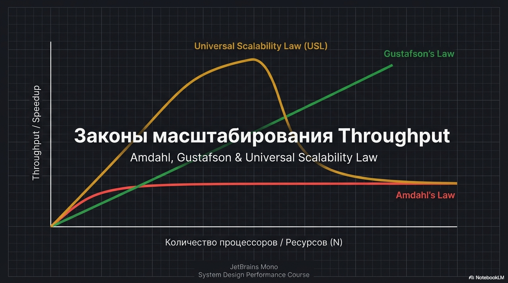

#### 1.3.1. Напоминание базовой формулы

Рассмотренные техники позволяют нам уменьшать concurrency в системе

По закону Литтла чтобы удерживать latency при росте нагрузки - второй рычаг это увеличенеи throughput

как это сделать? казалось бы просто добавить больше серверов

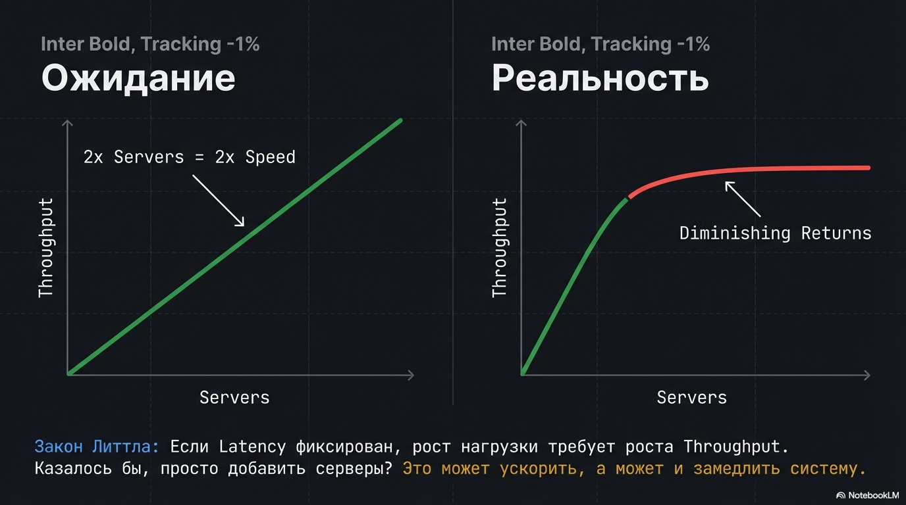

но рост числа серверов может как ускорить, так и замедлить нас, поэтому сейчас кратко разберем законы масштабирования throughput

всего их три - закон Амдаля, Густафсона и Universal Scalability Law

#### 1.3.2. Amdahl’s Law

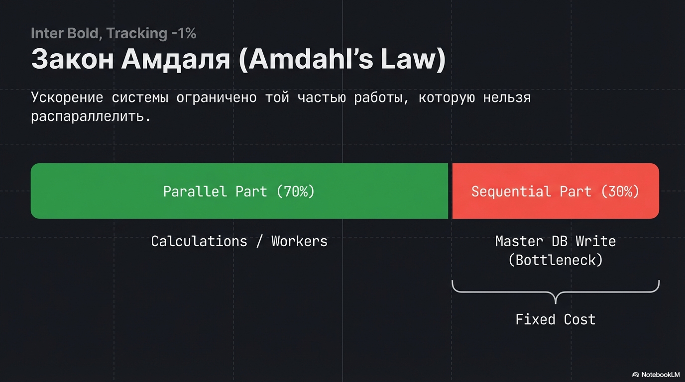

Закон Амдаля говорит:

> Ускорение системы ограничено той частью работы, которую нельзя распараллелить.

Представим запрос:

- 70% времени он тратит на параллелящуюся часть, которую можно растащить по серверам / воркерам
- 30% — на строго последовательный кусок, например пишет в мастер

Если бы параллельная часть стала бесконечно быстрой, эти 30% всё равно никуда не денутся.

конечно же, закон описывается математической формулой, но на собесе важно не формулу вспомнить,
а понимать сам закон и уметь принимать решения исходя из него

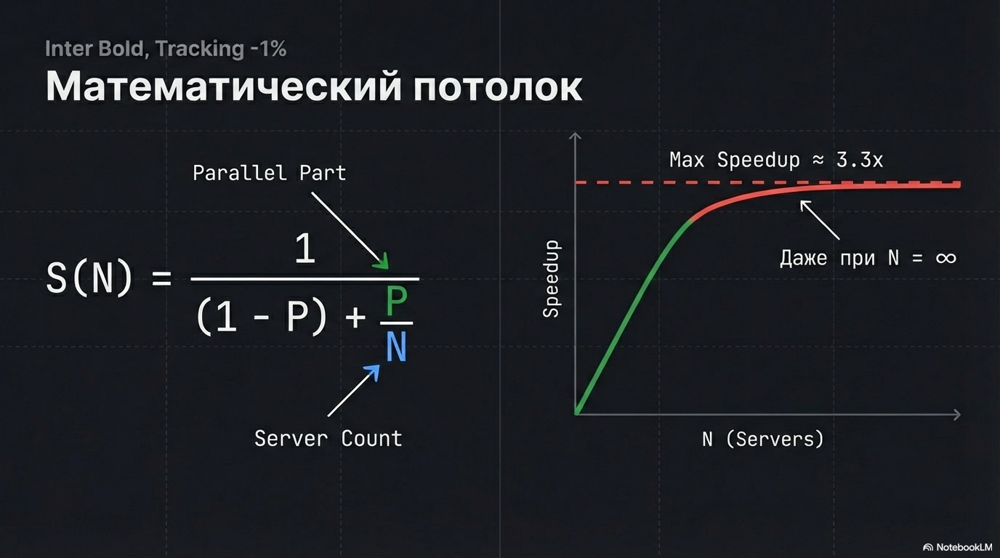

формулу можете видеть на экране

```text
S_max = 1 / (1 - p)

где p - доля параллелящейся части работы,
    S_max - максимальное ускорение
```

Для нашего примера с 70% параллельной части максимальное ускорение составит 3.3 раза

```text
S_max = 1 / 0.3 ≈ 3.33
```

То есть:

- хоть 10, хоть 100 серверов мы поставим
- если 30% запроса упираются в один общий участок,
- максимум мы ускоримся примерно в 3.3 раза

Вы могли слышать такую вариацию этого закона

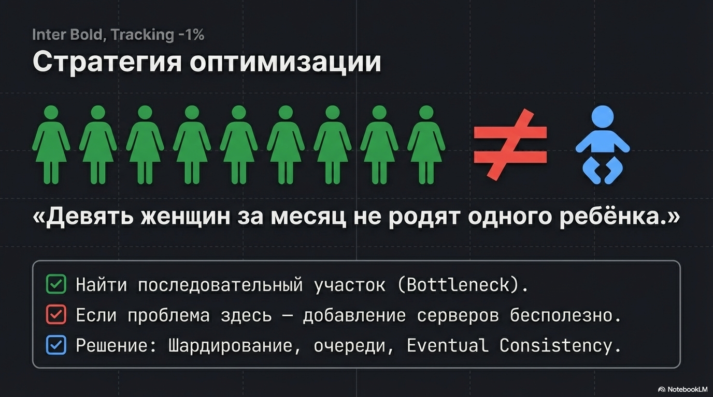

> Девять женщин за месяц не родят одного ребёнка.

Чтобы пробить потолок, мало “добавить серверов” — нужно ускорять или разбивать именно последовательную часть. 

Например, добавлять шарды, очереди или ослаблять требования к консистентности

На собеседовании закон Амдаля нужен, чтобы понять: даст ли добавление инстансов необходимое ускорение по latency.

- мы сначала ищем “последовательный участок” и оцениваем его долю;
- если bottleneck в параллельной части → дополнительные сервера действительно помогут;
- если bottleneck в последовательной части → добавление инстансов даст мало, нужно дробить/ускорять этот кусок

#### 1.3.3. Gustafson: масштабируем не скорость, а объём работы

Однако бизнесу не всегда нужно именно ускорить запрос

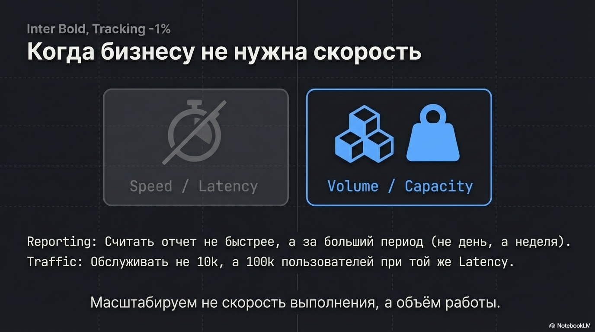

Бывает, что за тот же временной интервал мы хотим выполнять больший объем работы

Например
- У нас есть запрос на получение отзывов товара, работает за 200мс. 
  Бизнесу не надо ускорять его до 100мс - пользователь не заметит.
  Зато надо при такой же latency обслуживать не 10к пользователей, а 100к
- или есть джоба, которая за 1 час считает отчет за прошедшие сутки по совершенным заказам
  - Нам не надо получать этот отчет быстрее
  - Зато мы хотим за это же время 
    - делать отчет за неделю, а не день
    - да еще и добавить разбивку по городам/устройствам и тп

здесь нам на помощь приходит закон Густафсона.

Как и в случае с Амдалем мы не получаем линейного ускорения от добавления серверов, но зависимость уже другая

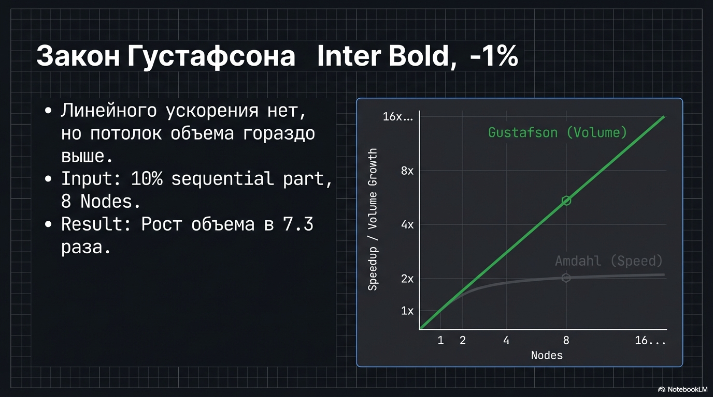

```text
S(N) = N - α * (N - 1)
где α — доля непараллелящейся части (как и у Амдаля).
    N - количество узлов
    S(N) - во сколько раз больше работы можем сделать
```

Например при:

- последовательной части в 10% 
- и 8 узлах

Получаем увеличение объема в 7.3 раза, а не в 8

```text
S(8) = 8 - 0.1 · (8 - 1)
     = 8 - 0.7
     = 7.3
```

То есть при увеличении объема работы нет такого выраженного потолка, как в случае с ускорением запроса. Но эффективность все равно теряется

если на собесе попадется задача проделать больший объем работы за то же время,
то теперь вы знаете, что рост объема ограничен последовательной частью, но не так сильно, как уменьшение latency

#### 1.3.4. Universal Scalability Law (USL)

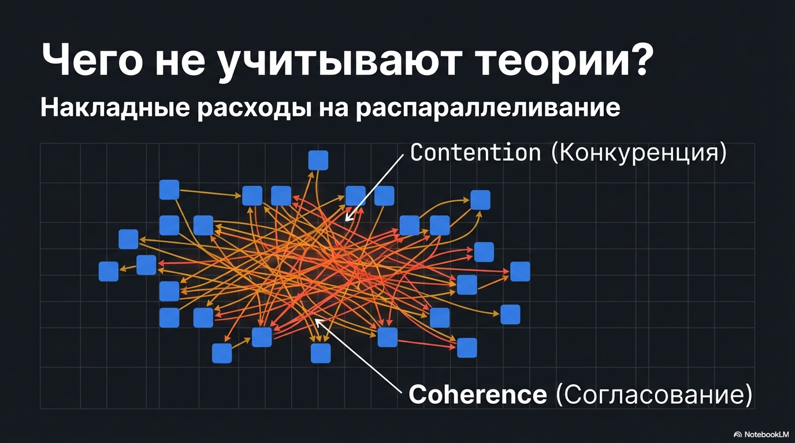

Однако, что закон Амдаля, что закон Густафсона, не учитывают накладные расходы на распараллеливание системы, которые всегда есть в реальном мире

По мере роста числа узлов мы начинаем платить за contention и coherence

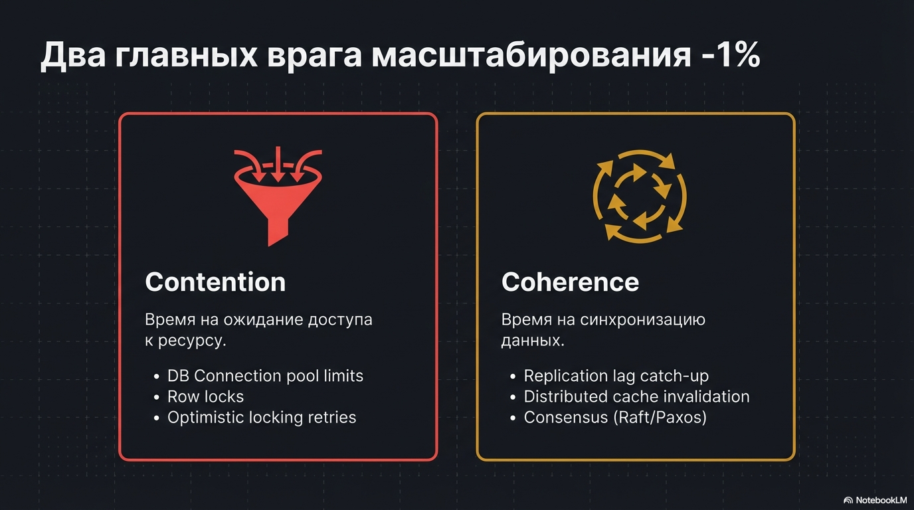

- contention — это конкуренция за общие ресурсы, чем больше параллелизма, тем больше времени тратится не на полезную работу, а на ожидание доступа, например

  - ограниченный пул коннектов к Postgres; 
  - горячий ключ/строка с локом;
  - ретраи из-за optimistic locking.

- coherence — это согласованное состояние между компонентами или слоями системы, например

  - Реплики БД, где репликам надо постоянно догонять мастера
  - Обновление кэша на нескольких слоях

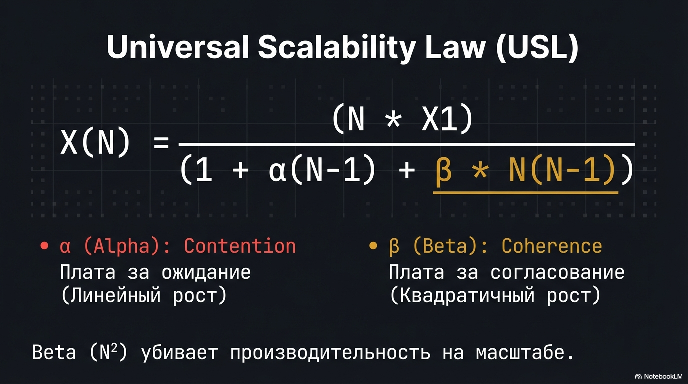

Это учитывает Universal Scalability Law, формулу можете видеть на экране

```text
S(N) = N / (1 + σ · (N - 1) + κ · N · (N - 1))

где:

- S(N) - speedup, во сколько раз вырастает пропускная способность (или объём работы в единицу времени) при N узлах по сравнению с одним узлом.
- N — число узлов,
- σ — накладные расходы на contention,
- κ — накладные расходы на coherence.

````

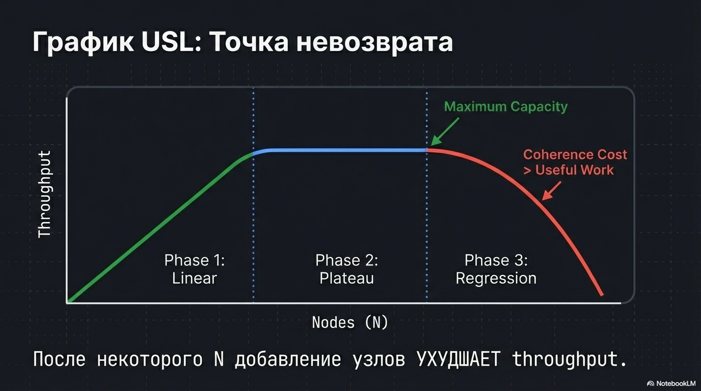

И вот кривая, описанная этим законом


~~на экран~~

Как видим

- при маленьком числе узлов масштабирование почти линейное;
- потом рост замедляется и выходит на плато;
- после некоторого N добавление узлов может начать ухудшать throughput, а хвосты начнут расти, потому что накладные расходы растут быстрее полезной работы.

Получается мы можем добавить ресурсов системе через добавление узлов, но только ухудшить производительность этим

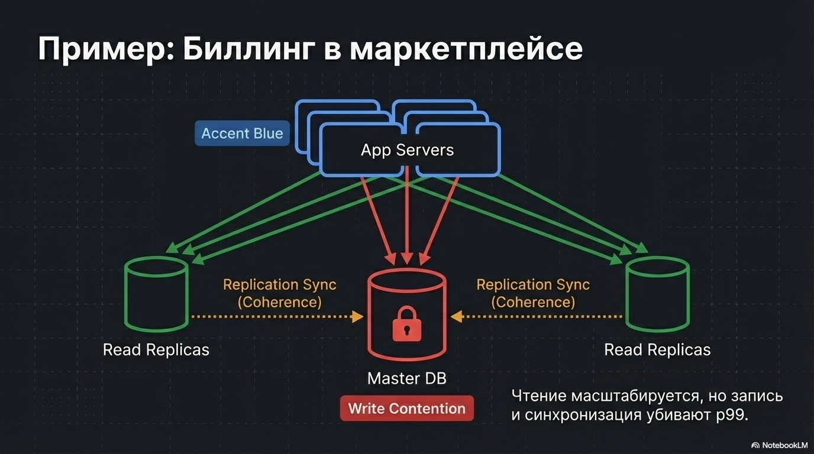

Разберем кратко на примере биллинга в маркетплейсе.

- Мы добавляем инстансы API и read-реплики БД — чтения масштабируются
- Но записи по деньгам всё равно идут через один master и держат локи/инварианты: это contention.
- Плюс растёт цена синхронизации реплик: это coherence.
- В итоге после некоторого N новые узлы почти не дают throughput, зато ухудшают p95/p99 накладными расходами

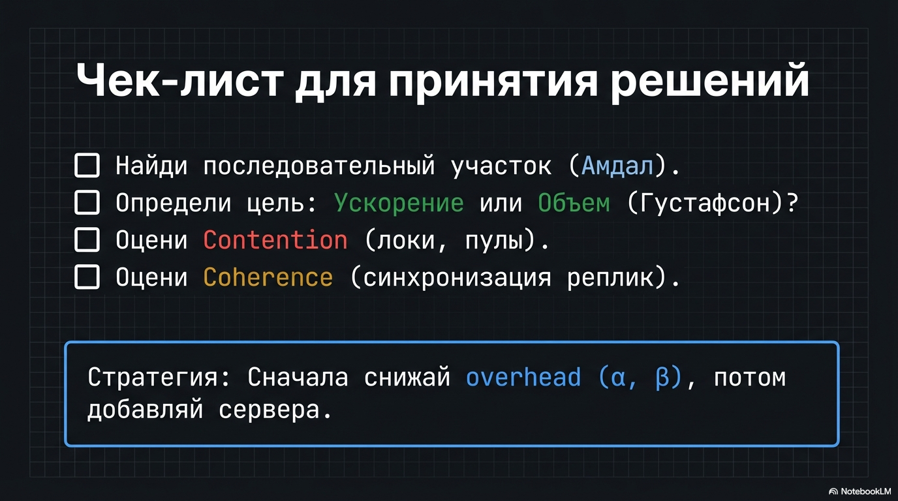

USL на собесе удобно использовать как чеклист:

- какие общие точки в системе дадут contention;
- какие части требуют согласования и дадут coherence;
- после этого выбирается стратегия: добавлять узлы или сначала снижать накладные расходы (уменьшать contention/coherence).

#### Вывод 

Таким образом, если от вас требуется предложить архитектуру, которая выдержит большую нагрузку, важно помнить: новый инстанс не обязательно ускорит систему

Сначала разберитесь, во что вы упираетесь — в contention или в coherence

И уже от этого выбирайте стратегию: либо сначала снижать эти накладные расходы и рефакторить архитектуру,
либо действительно масштабироваться добавлением инстансов.
