### Блок 1.4 Балансировка и Scale Cube

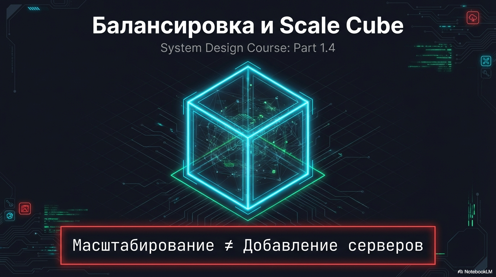

Мы уже несколько раз сказали что добавление серверов не обязательно приведет к масштабированию, но это не единственный способ

#### 1.4.1 Scale Cube

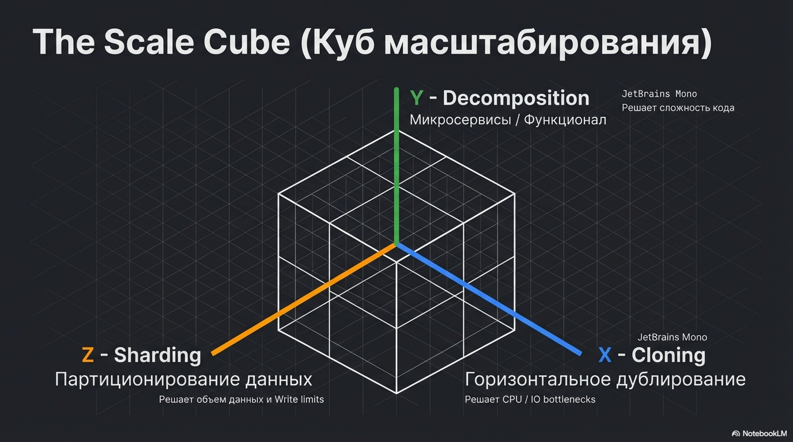

Есть модель Scale Cube, согласно которой масштабирование бывает по трём осям, и каждая подходит под определенный bottleneck.

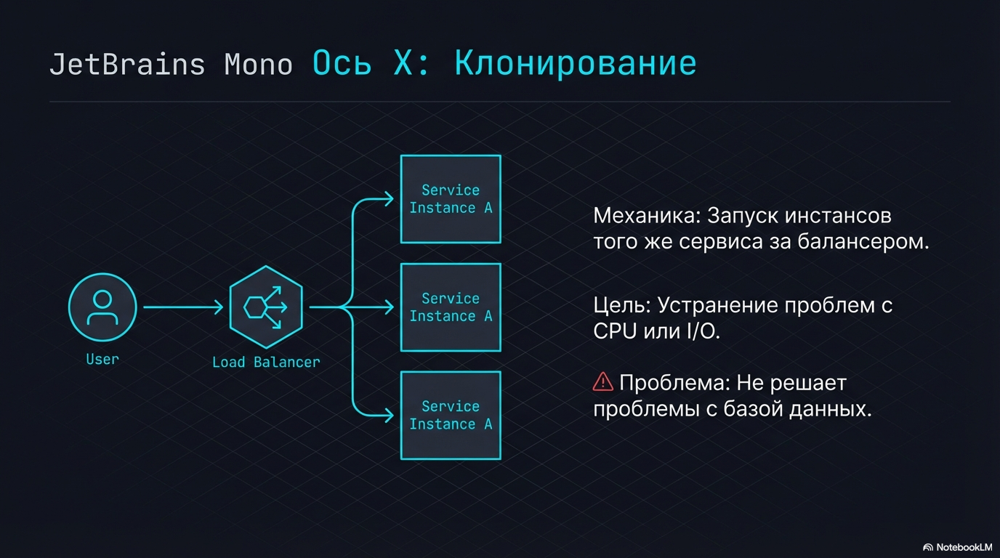

Ось X — клонирование.
- то есть добавление инстансов того же сервиса за балансером
- Она помогает, когда мы упираемся в CPU или IO на приложении.

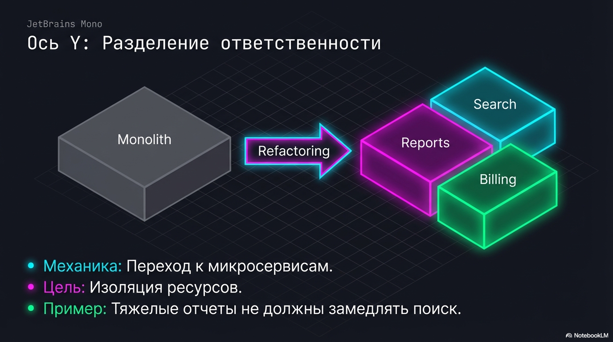

Ось Y — разделение ответственности.
- Это по сути переход к микросервисам: поиск отдельно, отчёты отдельно, биллинг отдельно. каждый на своем стеке, отдельно масштабируется и тд
- Ось Y нужна, когда одна часть системы начинает “убивать” остальные части, и её нужно изолировать и масштабировать отдельно.

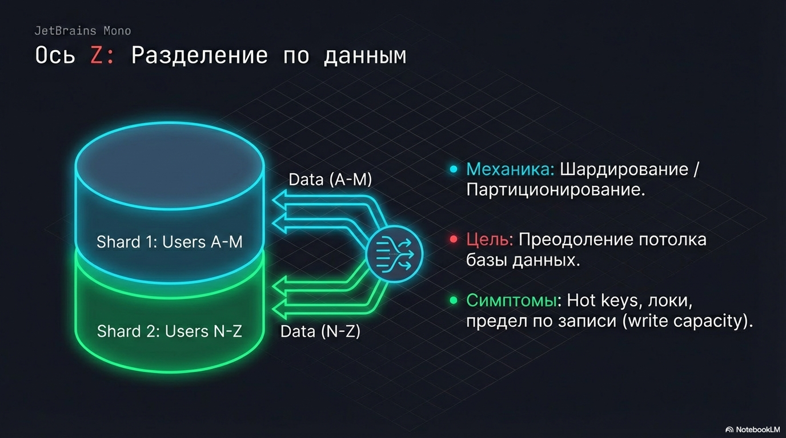

Ось Z — разделение по данным.
- Это например шардирование или партиционирование
- Ось Z нужна, когда потолок — данные: одна база, hot keys, локи, или просто физический предел по записи.

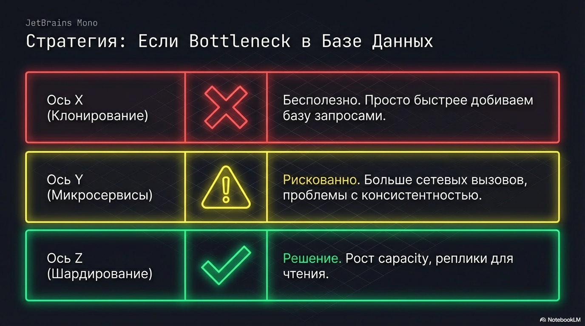

то есть на собесе в зависимости от условий задачи отталкивайтесь от bottleneck'ов и идите по нужной оси, например

Если узкое место — база, то
- X почти не помогает: мы просто быстрее добиваем базу.
- Микросервисы по оси Y тоже часто ухудшают, потому что появляется больше сетевых вызовов и сложнее консистентность.
- А вот Z может дать рост capacity: партиционирование, шардирование, а для чтений — реплики.

Если мы не можем назвать узкое место цифрами и метриками — мы не масштабируем, мы просто усложняем систему.

#### 1.4.1 Балансировка: где она вообще происходит

И раз мы активно говорим о горизонтальном масштабировании, надо пару слов сказать о балансировке: как запрос вообще попадает на конкретный инстанс.

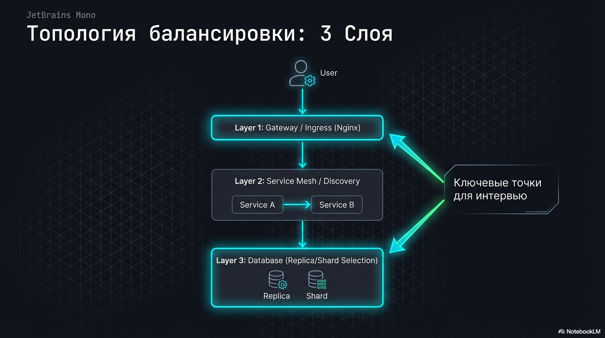

Балансировка обычно есть в нескольких местах.

Первый слой - на входе в систему.

Запрос прилетает в наш ingress контроллер/API gateway/обычный Nginx
Там мы маршрутизируем запрос в нужный сервис и выбираем один из его инстансов.

Второй слой - внутри системы. 

Когда один сервис вызывает другой, там снова нужно выбрать инстанс: 
- либо через service discovery, 
- либо через сервис-меш, 
- либо еще как-то

И третий слой - на уровне данных - это нужно когда мы имеем реплики или шарды

На собеседовании обычно надо сказать про балансировку уровня гейтвей и на уровне базы - то есть 2 слоя

#### 1.4.1 Правила выбора инстанса

Также в зависимости от характера нагрузки на проектируемую систему может понадобиться выбирать разные алгоритмы балансировки

Для собеса достаточно знать 3 основных способа балансировки

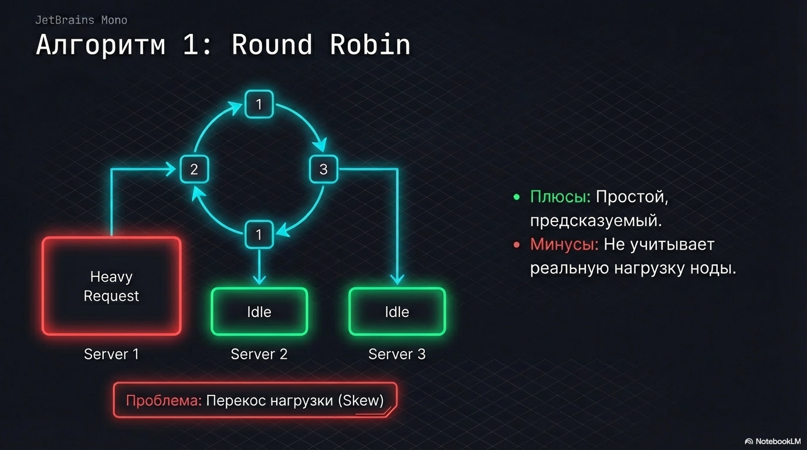

- Самый простой алгоритм — round robin: направляем запросы на каждую ноду по очереди
  Хорошо работает, если ноды одинаковые и запросы одинаковые.
  Если запросы разные по тяжести, то round robin приведет к перекосам нагрузки между нодами
  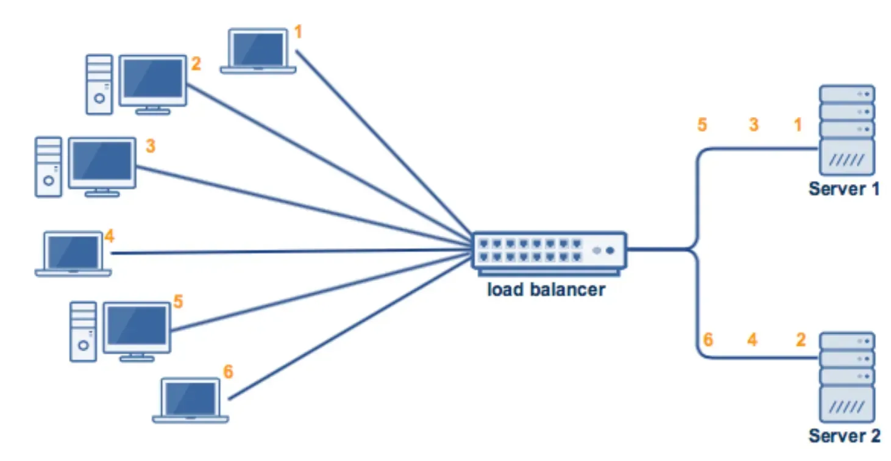

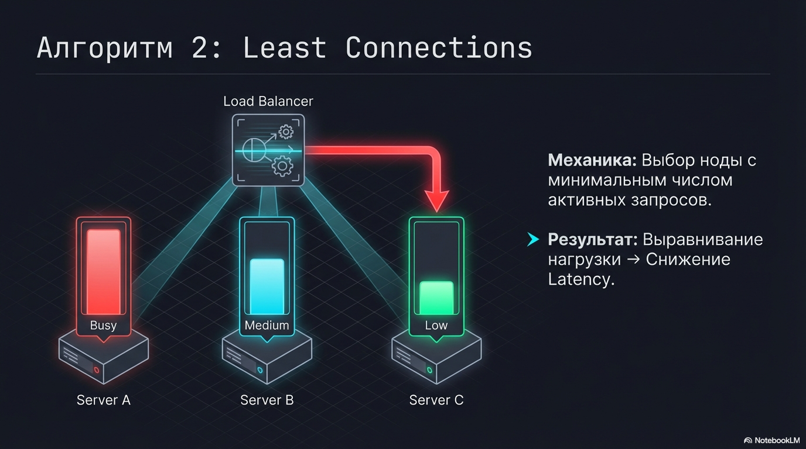

- Чтобы уйти от перекоса, используют least connections или least time: 
  отправляем запрос туда, где сейчас меньше всего активных запросов, или который быстрее всех отвечает
  Таким образом, мы уменьшаем очередь на стороне сервиса — а значит, уменьшаем и latency. 

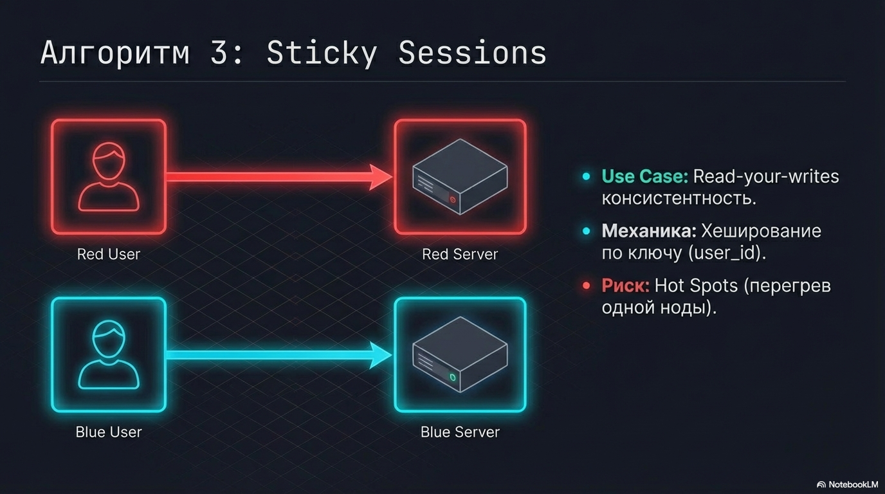

- Иногда нужно отправлять запрос на определенную ноду - как правило используется для соблюдения read-your-writes консистентности при репликации
  называется это sticky sessions или session affinity.
  В таком случае маршрутизируем на основании какого-то ключа, например `user_id`
  Основной минус здесь - можем перегревать отдельные ноды из-за такого подхода

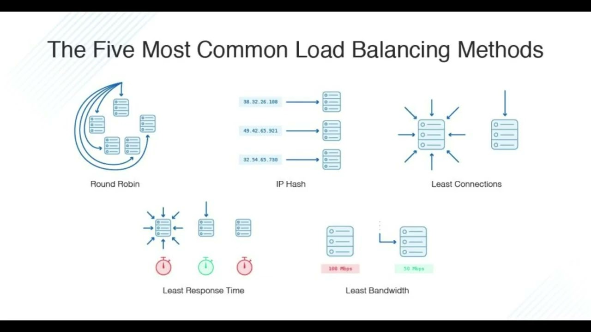

#### 1.4.2 Stateless vs sticky

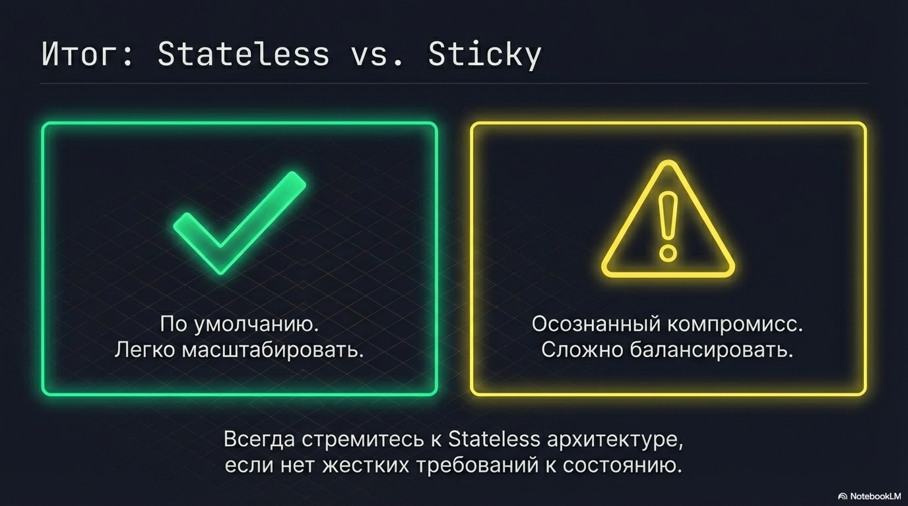

То есть у нас есть развилка здесь: мы или хотим, чтобы сервис был stateless, или нам нужны sticky sessions

По умолчанию лучше все делать stateless, а stateful сервисы - это уже осознанный компромисс
