### 1.5. Observability: как понять, что система тонет

Внимательный слушатель мог заметить, что решения по масштабированию, балансировке, устранению tail latency невозможно без сбора метрик с системы

Для этого и нужна observability - когда мы не гадаем, что именно тормозит или что уже сломалось, а видим. 
и узнаем об этом раньше, чем пользователи начинают жаловаться или вообще исправляем до того как сломалось

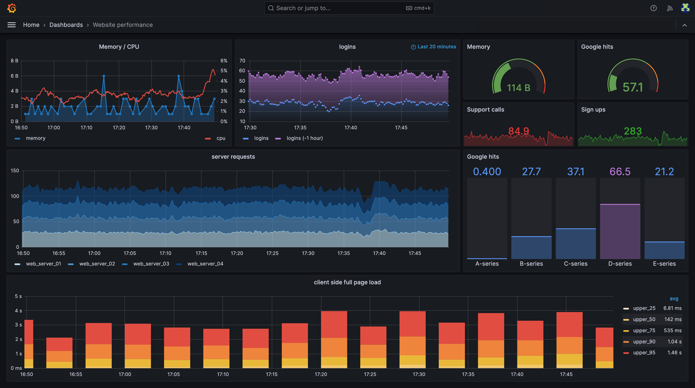

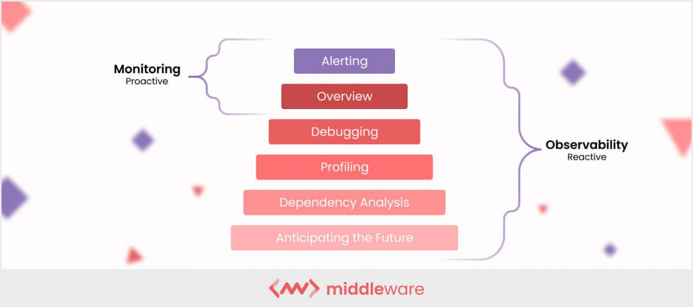

Не будем сильно углубляться, затронем 5 составляющих observability:
- метрики, 
- логи, 
- трейсинг,
- алерты
- профайлинг

И кратко вспомним инструменты благодаря которым это реализуется

#### 1.5.1. Метрики: на что вообще смотреть

Итак, первое - это метрики. Основа основ

Какие метрики стоит собирать? Это

- latency по ключевым эндпоинтам по персентилям
- error rate: доля 5xx, таймаутов, открытых circuit breaker’ов;
- retries:
  - какой процент запросов были ретраями;
  - какие сервисы/клиенты ретраят больше всего
- очереди и пулы:
  - длина очередей сообщений
  - занятость connection pool’ов;
- ресурсы:
  - CPU, память;
  - диск: IOPS, свободное место
  - сеть: throughput, ошибки.

Все они они могут помочь решить инцидент в разы быстрее

Также есть понятие four golden signals - набор метрик, которые Гугл рекомендует отслеживать в SRE
Это latency, traffic, errors и saturation
Считаются базовыми метриками для предотвращения инцидентов
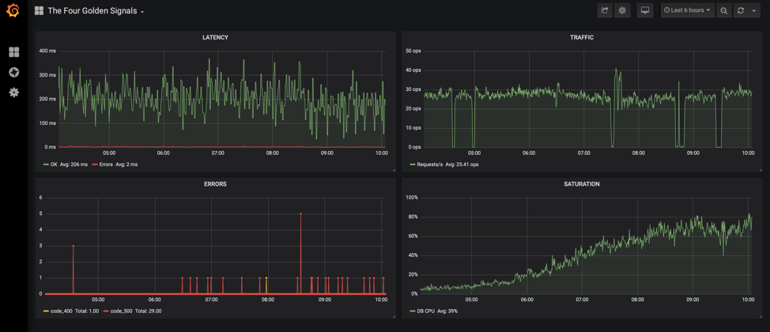

#### 1.5.2. Логи

Если метрики указывают где проблема, то логи нам показывают почему эти ошибки произошли

Основные принципы при сборе логов:

- формат должна быть json, а не текст, потому что json машиночитаемый формат, легче будет фильтровать/аггрегировать/сортировать
- в `error` пишем только то, что реально хотим чинить, а не всё подряд; например 404 не должна быть с уровнем error
- уважайте кардинальность:
  - не тащим в сообщение лога всякие ключи типа  `user_id`, `request_id` и тп, иначе сложно будет искать/аггрегировать логи. их стоит в контекст лога ложить
  - но можно в сообщение включать вещи из маленьких множеств: например имя сервиса, из которого пришел лог

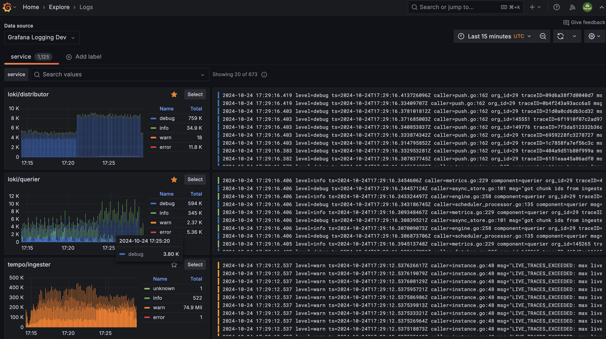

#### 1.5.3. Distributed tracing

Даже с метриками и логами сложно понять, где именно в цепочке фронт → API → очередь → воркер → БД родился хвост. Для этого нужен трейсинг.

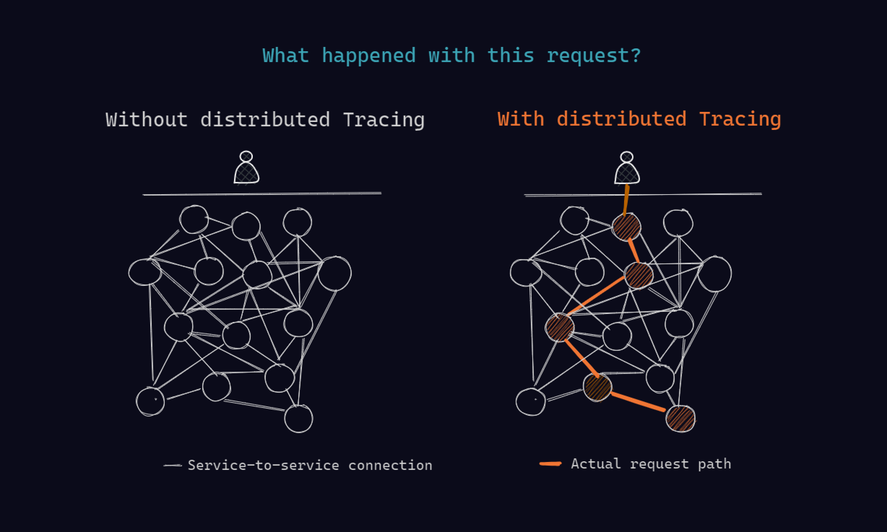

Идея простая:

- каждому запросу присваиваем `trace_id`;
- прокидываем его между сервисами в заголовках;
- внутри строим дерево span’ов: каждый внешний вызов/шаг — отдельный span с временем.

Span — это “кусочек работы” в distributed tracing: один шаг внутри обработки запроса, ограниченный временем start → end.

Обычно span = одна операция вроде:

- SQL-запрос,
- вызов внешнего API,

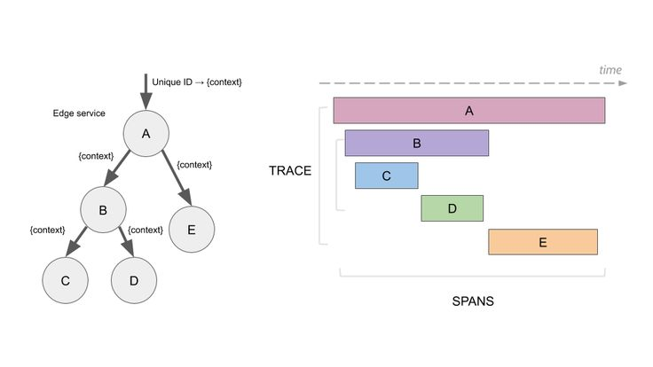

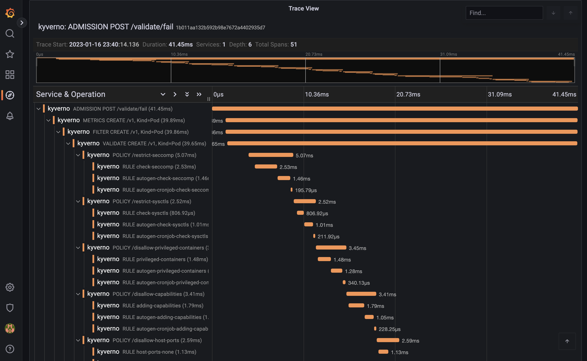

Sampling — это правило, какую долю телеметрии сохранять/отправлять, потому что хранить 100% трасс/логов/метрик дорого (объём, CPU, сеть).

- мы хотим всегда трейсить ошибки и сильно медленные запросы;
- от остального трафика можем брать небольшой процент

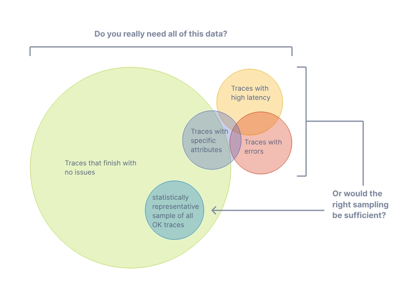

В итоге trace даёт картинку “вот тут 20 ms, тут 12 ms, а вот этот запрос в БД внезапно 800 ms” —
и так мы видим конкретное узкое место, и для этого даже не надо это локально пытаться воспроизвести

#### 1.5.4. Алерты

Метрики и трейсинг сами по себе бесполезны, если никто на них не смотрит. 
Круглосуточно пялиться в Grafanу никто не будет, поэтому нужны алерты

Алерты должны быть редкими и достаточно важными чтобы не игнорировать их. 
Если алертить каждый чих, у команды будет alert fatigue, как в истории про мальчика который кричал "волки, волки"

Хорошие кандидаты для алертов:

- p99 по ключевым эндпоинтам выше порога дольше какого-то продолжительного времени - например 10 минут;
- error rate выше порога для сервиса или эндпоинта;
- ресурсы закончились
- healthcheck не проходит

#### 1.5.5. Профайлинг

Когда метрики/трейсы уже показали проблемный сервис и эндпоинт, дальше вопрос “что там внутри жрёт ресурсы”.

Здесь включается профайлинг:

- ставим профайлер (в PHP — тот же `excimer` или аналоги), практически не есть ресурсы, поэтому можно включать на проде, хорошо если поддерживает стандарт open telemetry
- снимаем срезы CPU/времени по трейсу,

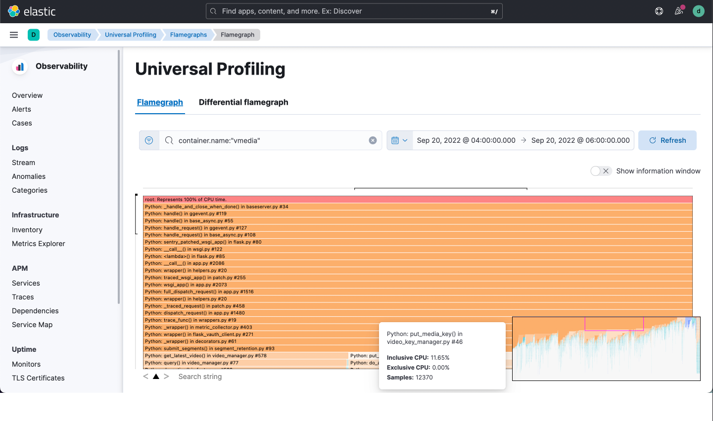

Профайлинг похож на трейсинг, но работает внутри конкретного сервиса, и помогает ровно с тем же - быстрее находить медленные/прожорливые участки запроса

#### 1.5.6. Инструменты: чем это обычно собирают

На собеседовании не требуется знаний как прометеус с нуля настроить, но знать верхнеуровнего какими инструментами мы достигаем цели - надо

- метрики собираем в Prometheus, VictoriaMetrics и тп
  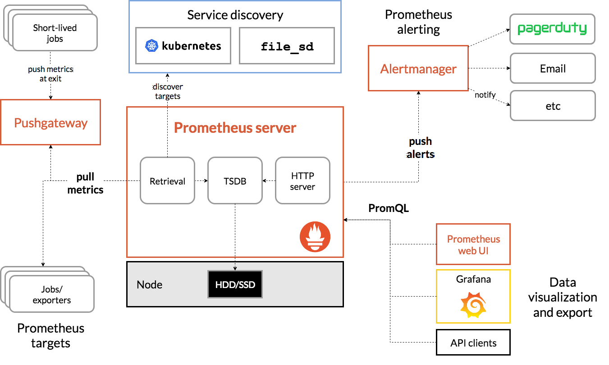
- для визуализации и дешбордов используем Grafana;
- логи и ошибки чаще всего смотрят в Sentry, ELK, Loki + Grafana, Graylog
- трейсинг: OpenTelemetry как стандарт, дальше Jaeger / Tempo  и др.
  
  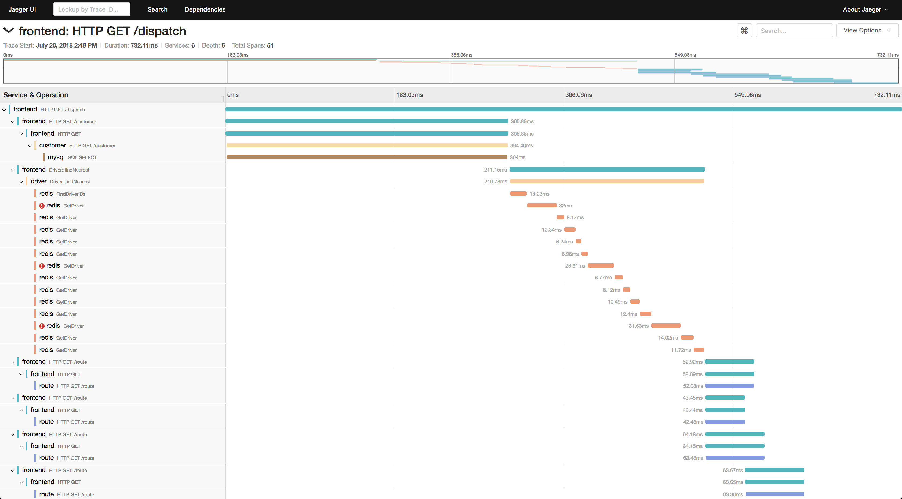

Как итог

- метрики + трейсинг показывают, где проблема
- логи и профайлер помогают понять, в чем причина проблемы
- алерты под SLO дёргают людей вовремя, а не когда пользователи уже жалуются.
