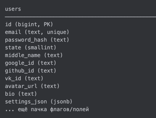
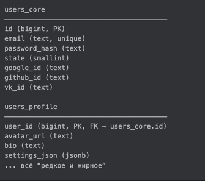
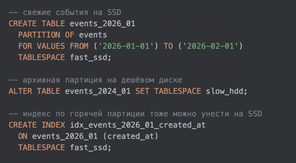
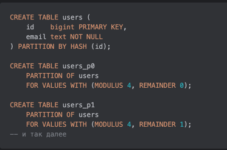
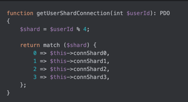

## Часть 2. Шардирование и партиционирование: базовый ликбез

### Блок 2.1. Базовый ликбез: шардирование и партиционирование

Типичная картина:

* есть одна большая таблица `events` / `orders`;
* она растёт годами;
* в ней уже десятки/сотни миллионов строк;
* индексы раздулись, VACUUM жрёт время, бэкапы занимают ночь;
* `seq scan` по этой таблице начинает занимать секунды и жрёт диск/I/O.

Плюс операционные штуки:

* таблица приближается к физическим ограничениям:

  * диск под ней забит;
  * на одной файловой системе жить уже стремно;

* хочется:

  * чтобы “горячие” данные (последние дни/недели) обрабатывались быстро;
  * старые архивы легко удалялись или выгружались;
  * отчёты за год не клали прод.

На этом фоне появляются два базовых инструмента:

* **партиционирование** — разрезать таблицу на части внутри одного инстанса БД;
* **шардирование** — разнести эти части по разным машинам/кластерам.

И тут важное честное предупреждение:

> **Шардирование — тяжёлая артиллерия.
> К нему идут, когда остальные варианты уже упёрлись в стену.**

Пока можно, делаем по порядку:

1. Нормализуем схему, чиним индексы, переписываем самые тупые запросы.
2. Выжимаем **вертикальное масштабирование** (CPU, RAM, диск, быстрые SSD).
3. Вводим **партиционирование** на одном кластере.
4. И только когда всё это уже не спасает по объёму/нагрузке —
   **лезем в шардирование**, с пониманием, что оно привезёт с собой кросс-шардовые транзакции, миграции и прочую боль.

---

#### 2.1.1. Вертикальное и горизонтальное разрезание

Есть два базовых направления, в которых можно резать данные.

##### 1) Вертикальное разрезание (vertical partitioning)

Это не магическая фича Postgres, а просто **разбиение одной толстой таблицы на две по колонкам**.

Типичный жизненный сценарий:

* когда-то была аккуратная таблица `users`;
* потом туда по чуть-чуть навешивали поля:

  * `middle_name`,
  * `google_id`, `github_id`, `vk_id`,
  * куча флажков `is_blocked`, `is_beta`, `is_whatever`,
  * `bio`, `avatar_url`, `settings_json`, и т.п.;
* через пару лет это уже “стройка века” на 40+ колонок.

Пример “до”:



90% запросов по факту делают:

```sql
SELECT id, email, state
FROM users
WHERE email = ?;
```

Но при этом читают с диска **здоровенную строку** со всем барахлом.

Vertical partitioning в таком случае — осознанный шаг:



Дальше:

* все горячие штуки (логин, списки юзеров, проверки прав) ходят только в `users_core`;
* “страница профиля”, настройки и прочий обвес — в `users_profile`.

Зачем это вообще делать:

* **меньше байт на горячем пути**:

  * в кэш Postgres влезает больше строк ядра на страницу;
  * `Seq Scan`/`Index Scan` по `users_core` реально трогает меньше страниц;

* чуть проще держать под контролем блоат/нагрузку на индексы ядра, если “мясо” (`bio`, `settings_json`) меняется чаще, чем core-поля.

И важная оговорка:

> В 80–90% случаев вместо vertical partitioning достаточно:
>
> * перестать делать `SELECT *`;
> * пересмотреть индексы;
> * в крайнем случае — мигрировать данные в **нормально спроектированную** новую таблицу.
>
> Вертикальное разрезание — хирургия для конкретно распухших, очень горячих сущностей, а не стандартный приём “на каждый чих”.

##### 2) Горизонтальное разрезание (horizontal partitioning)

Делим таблицу **по строкам**.

Примеры:

* `events` по дате: “декабрь 2025”, “январь 2026”;
* `users` по регионам: “EU”, “US”, “APAC”;
* `orders` по диапазонам ID.

И вот **горизонтальное разрезание** — это как раз то,
из чего вырастают и **партиции**, и **шарды**.

---

#### 2.1.2. Партиционирование: одна таблица, много кусков

**Партиционирование (partitioning)** — это когда одна логическая таблица разбита на несколько физических кусков по какому-то признаку,
но всё это живёт **в одном инстансе БД** и по возможности **прозрачно для приложения**:

* приложение всё так же делает `INSERT/SELECT` в `events`;
* БД сама решает, в какую партицию складывать и откуда читать.

Например, в Postgres:


Создадим две партиции:


Для приложения это всё ещё **одна таблица** `events`:

```sql
SELECT *
FROM events
WHERE created_at >= now() - interval '1 day';
```

Postgres сам решает:

* в какие партиции лезть (**partition pruning**);
* какие партиции можно вообще не трогать.

Ключевой момент:

> Партиционирование даёт выигрыш **только если ключ партиционирования
> часто фигурирует в фильтрах запросов.**

Если мы режем по `created_at`, а запросы почти никогда не фильтруют по дате —
толку мало, только усложнили схему.

---

Зачем это нам по боли:

* **Seq Scan и Index Scan перестают чесать всю вселенную.**
  Вместо одной таблицы на миллиард строк у нас десятки/сотни партиций.
  Запрос `WHERE created_at >= now() - interval '1 day'` лезет **только в свежие партиции**, а не бежит по всей истории проекта.

* **Индексы и данные становятся “кусками”, а не одним монстром.**
  В Postgres нет глобального индекса на партиционированную таблицу —
  у каждой партиции свои индексы. Это:

  * позволяет обслуживать индексы по кускам (перестраивать/дропать на старых партициях);
  * помогает держать индексы “горячих” партиций в памяти.

  Но важно: если запрос **не фильтрует по ключу партиционирования**,
  планировщик может пойти в **каждую** партицию (index scan по всем партициям),
  и это может быть даже хуже, чем один глобальный индекс.

* **VACUUM/ANALYZE работают по кускам, а не по монстру.**
  Автовакуум и анализ статистики крутятся на конкретных партициях:

  * можно отдельно тюнить параметры для “горячих” и “холодных” партиций;
  * не бывает ситуации, когда один жирный `VACUUM` по всей таблице кладёт I/O.

* **Архивирование и retention-политики превращаются в DROP TABLE.**  
  Старый год логов не нужен?  
  `DROP TABLE events_2023_01` или `ALTER TABLE DETACH PARTITION` — и он исчез:
  * без `DELETE` по миллиарду строк;
  * без чудовищного блоата и последующего отмывания VACUUM’ом.

* **Дальше — разные классы хранилища для “горячего” и “холодного”.**  
  Когда уже есть партиции, можно:
  * свежие (горячие) партиции держать на более быстрых дисках/таблспейсах;
  * старые (холодные) — на более дешёвом/медленном storage;
  * или вообще выносить архивные партиции в отдельный кластер / объектное хранилище.

  Мини-пример для “своего” Postgres (когда ты контролируешь диски):

  1. Монтируем разные диски:

    * `/mnt/ssd_fast` — быстрый SSD под горячие данные;
    * `/mnt/hdd_slow` — медленный и дешёвый HDD под архив.

  2. Создаём TABLESPACE’ы:
  
     

  3. Кладём разные партиции/индексы в разные таблспейсы:
  
     

  В managed-Postgres (RDS/Cloud SQL) так часто нельзя сделать напрямую,  
  но на “своём” железе/VM эта схема очень реально живёт в проде.

Это уже **горизонтальное партиционирование**, но **пока на одном кластере**.

---

#### 2.1.3. Горизонтальное партиционирование по ключу: RANGE, LIST, HASH

Основные способы деления:

##### RANGE — по диапазонам

* по дате (`created_at`);
* по ID (0–1M, 1M–2M).

Хорошо, когда:

* данные естественно упорядочены (временные серии, логи);
* нужно удобно архивировать “старые хвосты”;
* запросы действительно фильтруют по этому диапазону (`WHERE created_at BETWEEN ...`).

Боль:

* если все запросы идут только к “последней” партиции — именно она становится горячей;
* легко получить **hot partition**.

[//]: # (эта боль как будто то что мы и хотели - отрезать горячую часть от холодной чтоб лучше справлялись индексы вакуум и тп)

##### LIST — по конкретным значениям

* по `region`: `EU`, `US`, `APAC`;
* по `tenant_id`, если их немного и они стабильны.

Полезно, когда есть небольшой фиксированный набор категорий.

##### HASH — равномерное разбрасывание по ключу

В Postgres:



Под капотом — тот же самый `user_id % N`, который потом встретится в Dynamic Sharding.

Плюсы:

* равномерное распределение нагрузки и объёма (если ключ нормальный);
* нет одной “горячей” партиции.

Минусы:

* сложнее делать операции “по диапазону”;
* сложнее читать “свежее”/“старое” по временной оси;
* сложнее мигрировать/менять количество партиций.

Все эти штуки — **про то, как горизонтально разрезать таблицу**.
Пока это **partitioning**: всё может жить в одном Postgres-кластере.

---

#### 2.1.4. Ограничения партиционирования: UNIQUE/PK и цена вопроса

У партиционированных таблиц в Postgres есть важное ограничение:

> **UNIQUE / PRIMARY KEY на родительской таблице
> должны включать ключ партиционирования.**

Почему:

* глобального индекса по всем партициям нет;
* проверка уникальности делается на уровне **индексов партиций**;
* чтобы гарантировать, что достаточно проверить одну партицию,
  ключ партиционирования должен входить в UNIQUE/PK.

Примеры:

* Партиционируем по `created_at` и хотим PK:
  
  

  Так можно: PK включает `created_at`.
  Но глобальной уникальности голого `id` уже **нет** — уникальна только пара `(id, created_at)`.

* попробуем `UNIQUE(id)` при партиционировании по `created_at` — Postgres не даст.

* Если партиционируем по `id` (HASH PARTITION BY id):
  
  

  Так можно: partition key = `id`, каждый `id` живёт ровно в одной партиции.

Выводы:

* если нужен **глобально уникальный id** и формальный `UNIQUE(id)`:

  * разумно партиционировать по `id` (HASH);
  * либо полагаться на sequence/identity и жить без глобального UNIQUE, если это устраивает;
* если партиционируем по дате/региону, но хотим жёсткую глобальную уникальность по другому полю (например, номер документа):

  * иногда делают вертикальный split:

    * узкая таблица с `UNIQUE(doc_number)` (без партиционирования);
    * большая партиционированная таблица с текстом/блобами, которая ссылается на ID из узкой.

И общее:

> Партиционирование — это **не бесплатный буст**.
> Оно:
>
> * усложняет схему (родитель + куча дочерних таблиц);
> * накладывает ограничения на UNIQUE/PK;
> * требует думать, как будут жить INSERT/UPDATE/DDL;
> * ломает часть “простых” решений, которые были на одной таблице.

Поэтому его тоже лучше считать **тяжёлым инструментом**:
сначала индексы/запросы/алгоритмы, потом уже “режем стол на части”.

---

#### 2.1.5. Когда partitioning превращается в sharding

Теперь аккуратно фиксируем терминологию.

**Партиционирование**:

* режем таблицу на куски (партиции);
* **всё остаётся на одном инстансе** БД;
* приложение по идее не знает, что внутри что-то порезано.

**Шардирование (sharding)**:

* режем данные на куски (шарды);
* **разносим эти куски по разным инстансам/серверам**;
* появляется задача **routing’а** — куда идти за этим конкретным ключом.

Простейший кейс:

* `users_shard_1`: Postgres #1, данные по `user_id % 4 = 0`;
* `users_shard_2`: Postgres #2, `user_id % 4 = 1`;
* `users_shard_3`: Postgres #3, `user_id % 4 = 2`;
* `users_shard_4`: Postgres #4, `user_id % 4 = 3`.

Грубо:

> Партиционирование — одна логическая таблица, разрезанная на части внутри одного кластера.
> Шардирование — те же части, но разложенные по разным инстансам/кластерам, с отдельным routing-слоем.

Здесь важно проговорить одну терминологическую штуку.

В литературе термины плавают. Например, у Мартина Клеппмана в DDIA "partitioning" — это общий термин
для разрезания данных на части, а shard/region/tablet/vnode — просто разные названия этих кусков
в разных системах.

В этом курсе я буду пользоваться более "прикладным" разделением:

* **partitioning** — логически режем данные, но всё ещё в одном инстансе БД;
* **sharding** — те же куски, но уже разнесённые по разным инстансам/кластерам, с отдельным routing-слоем.

**Зачем вообще идти до шардов, если есть партиции?**

* таблица/индексы уже **физически не лезут** на один сервер/в один диск нормально (или скоро не влезут);
* хотим увеличить **пропускную способность записи**:

  * один HDD даёт сотни MB/s, SSD — больше,
  * несколько шардов на нескольких машинах могут писать **параллельно**;
* хотим распределить **CPU-нагрузку**;
* хотим геораспределение:

  * пользователи из EU → кластер в Европе;
  * US → кластер в США и т.д.

При этом:

* почти всегда шардирование идёт **в паре с репликацией**:

  * каждый шард имеет свои реплики;
  * иначе падение одной машины = смерть куска данных/сервиса.

[//]: # (это правда?)

Простейший “на коленке” routing-код:



Это уже шардирование:

* нам нужно **знать, куда идти** за конкретным пользователем;
* при rebalancing’е такая схема очень быстро становится трудноуправляемой — ровно об этом дальше в Dynamic Sharding.

---

#### 2.1.6. Шардирование по регионам и мапа-шардов

Пример из реальной жизни: гео-шардинг.

* Пользователи живут в разных регионах.
* Хотим:

  * чтобы европейцев обслуживал европейский кластер (меньше RTT);
  * американцев — американский;
  * азиатских — азиатский.

Наивный вариант — захардкодить mapping в коде:


Более взрослый вариант: **таблица-шардмапа**:


Теперь приложение:

* по `region` сначала идёт в `shard_map`;
* получает DSN/кластер;
* и уже туда лезет за данными.

Это важный мостик к **Dynamic Sharding**:

> Как только вы вынесли “куда идти” из `% N` в явную конфигурацию/таблицу,
> вы можете начинать **переезжать** между шардами без перекомпиляции всего приложения.

И ровно это мы будем разбирать в следующей части.

---

#### 2.1.7. Шардирование на уровне БД: Citus и друзья

Чтобы не казалось, что всё делается только через “PHP + 4 коннекшена”, фиксируем:

* в Postgres есть расширения, которые делают распределённую БД:

  * Citus — популярный пример;

* они:

  * сами создают шарды и распределяют их по воркерам;
  * держат у себя routing;
  * умеют выполнять **cross-shard** запросы (join/агрегации) под капотом.

Важно донести идею:

> Всё, что мы обсуждаем — “по какому ключу резать”, “как маршрутизировать”,
> “как жить с кросс-шардовыми операциями” — это не теоретический онанизм.
> Это реальные вопросы, на которые отвечают Citus, Vitess, Cockroach, Yugabyte и прочие движки.

[//]: # (нужны примеры каких-то команд или чего-то может репозиторий где это сделано)

---

#### 2.1.8. Мини-резюме перед углублением

Чтобы не потерять картину:

* Вертикальное разрезание — по столбцам, для оптимизации “ядра” сущностей и уменьшения байтов на горячем пути.
* Горизонтальное разрезание — по строкам; наш основной фокус.
* Partitioning:

  * одна логическая таблица;
  * много партиций;
  * всё ещё один кластер/инстанс;
  * выигрываем там, где ключ партиционирования реально есть в запросах.
* Sharding:

  * те же куски, но разнесённые по разным инстансам;
  * нужен routing и отдельный разговор про миграции и согласованность.
* Ключи разрезания:

  * RANGE / LIST / HASH;
  * региональные мапы, `user_id`, `tenant_id`, временные диапазоны.
* Боль, от которой стартуем:

  * таблица перестаёт влезать на одну машину/диск/индекс;
  * хотим разделить горячее/холодное;
  * хотим увеличить пропускную способность, а один инстанс уже выжат.

И сверху ещё раз:

> Партиционирование и шардирование — не модные фичи, а тяжёлые инструменты.
> Сначала выжимаем всё из одной БД, индексов и нормальных запросов,
> потом — партиционирование,
> и только потом — шардирование с rebalancing’ом и всей остальной болью.

Например аж GitHub долго жил на монолитной базе, вот видео как они шардировали ее  -  https://www.youtube.com/watch?v=Tq1fif3rcnQ
