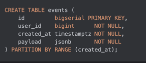
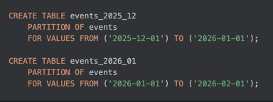

## Часть 2. Шардирование и партиционирование: базовый ликбез

### Блок 2.1. Базовый ликбез: шардирование и партиционирование

### Блок 2.1.0. Введение

Представим такую ситуацию

* есть одна большая таблица `orders`;
* в ней уже десятки и сотни миллионов строк;
* индексы раздулись, VACUUM занимает много времени и никогда не заканчивается, бэкапы занимают  все ночь;
* `seq scan` по этой таблице начинает занимать секунды
* сама таблица весит уже терабайты

Тем временем мы хотим
  * чтобы за последние дни/недели, то есть горячие, обрабатывались быстро;
  * retention старых данных проходил быстро;
  * отчёты за год не перегружали базу
  * бэкап был быстрым

Сначала мы

1. Профилируем и переписываем запросы, работаем над индексами, нормализуем/денормализуем данные где надо
2. Выжимаем **вертикальное масштабирование** (CPU, RAM, диск, быстрые SSD).
3. И только когда всё это уже не спасает - вводим **партиционирование** на одном кластере.

#### 2.1.2. Партиционирование: одна таблица, много кусков

**Партиционирование (partitioning)** — это когда одна логическая таблица разбита на несколько физических кусков по какому-то признаку,
но всё это живёт **в одном инстансе БД** и по возможности **прозрачно для приложения**:

* приложение всё так же делает `INSERT/SELECT` в `events`;
* БД сама решает, в какую партицию складывать и откуда читать.

Мы можем резать таблицу вертикально (по столбцам) и горизонтально (по строкам)


##### 1) Вертикальное партиционирование

Вертикальное партиционирование - это не фича Postgres, а просто **разбиение одной толстой таблицы на две по колонкам**.

Представим такой сценарий:

* когда-то была аккуратная таблица `users`;
* потом туда по чуть-чуть навешивали всякие поля, например `middle_name`, `google_id`, `avatar_url`,`is_blocked`
* в итоге таблица раздулась на 20 колонок

~~Картинка на слайде~~


Но самый частый запрос у нас - на аутентификацию

```sql
SELECT id, password_hash
FROM users
WHERE email = :email
LIMIT 1;
```

Хоть мы и не выбираем все поля, но
- базе все равно приходится читать полную строку, что неэффективно в данном случае,
- в кэш Postgres влезает меньше строк на страницу,
- `Seq Scan`/`Index Scan` затрагивает большее число страниц, чем мог бы
- вакууму было бы проще если б мы отделили часто меняющиеся вещи (например avatar_url, от редко меняющихся (email))

Поэтому мы режем таблицу на 2


Дальше:

* запросы на аутентификацию/авторизацию ходят только в `users_core`;
* “страница профиля”, настройки и тп — в `users_profile`.


##### 1) Горизонтальное разрезание (horizontal partitioning)

Например, в Postgres:



Создадим две партиции, разрезав таблицу по интервалу дат построчно:



Для приложения это всё ещё **одна таблица** `events`:

[//]: # (поменять пример на заказы)

```sql
SELECT *
FROM events
WHERE created_at >= now() - interval '1 day';
```

Postgres сам решает какие партиции использовать для выполнения запроса - это называется **partition pruning**

Ключевой момент:

> Партиционирование даёт выигрыш **только если ключ партиционирования
> часто фигурирует в фильтрах запросов.**

если запрос **не фильтрует по ключу партиционирования**,
планировщик может пойти в **каждую** партицию (index scan по всем партициям),
и это может быть даже хуже, чем один глобальный индекс.

---

Зачем это нам:

* **Seq Scan и Index Scan ускоряются**
  Вместо одной таблицы на миллиард строк у нас десятки/сотни партиций.
  Запрос `WHERE created_at >= now() - interval '1 day'` идет **только в свежие партиции**, а не бежит по всей истории проекта.

* **Индексы и данные дробятся на более управляемые части**
  В Postgres нет глобального индекса на партиционированную таблицу —
  у каждой партиции свои индексы. Это:

  * позволяет обслуживать индексы по кускам (перестраивать/дропать на старых партициях);
  * помогает держать индексы “горячих” партиций в памяти.

* **VACUUM/ANALYZE'y проще работать по относительно небольшим разделам**
  * можно отдельно тюнить параметры для “горячих” и “холодных” партиций;

* **Архивирование и retention-политики превращаются в DROP TABLE.**  
  Старый год логов не нужен?  
  `DROP TABLE events_2023_01` или `ALTER TABLE DETACH PARTITION` — и он исчез:
  * без `DELETE` по миллиарду строк;
  * без большого блоата и последующей работы VACUUM’а.

* **Дальше — разные классы хранилища для “горячего” и “холодного”.**  
  Когда уже есть партиции, можно:
  * свежие (горячие) партиции держать на более быстрых дисках/таблспейсах;
  * старые (холодные) — на более дешёвом/медленном storage;

  Если у вас self-hosted Postgresql:

  1. Монтируем разные диски:

     * `/mnt/ssd_fast` — быстрый SSD под горячие данные;
     * `/mnt/hdd_slow` — медленный и дешёвый HDD под архив.

  2. Создаём TABLESPACE’ы:

     

  3. Кладём разные партиции/индексы в разные таблспейсы:

     

#### 2.1.3. Способы горизонтального партиционирования

Есть три вида: RANGE LIST HASH

##### RANGE

Режем по диапазону
* по дате (от такой-то дату по такую-то)
* по ID (0–1M, 1M–2M).

Хорошо, когда:

* нужно удобно архивировать “старые хвосты”;
* запросы действительно фильтруют по этому диапазону (`WHERE created_at BETWEEN ...`)
* основная работа идет со свежими данными - например за последний месяц

##### LIST

Режем по конкретным значениям, например
* по `region`: `EU`, `US`, `APAC`;
* по `tenant_id`, если их немного и они стабильны.

Полезно, когда есть небольшой фиксированный набор категорий.

##### HASH — равномерное разбрасывание по ключу

В Postgres:


Берется хеш от значения, делится с остатком на количество партиций и идет на ближайшую

Плюсы:

* более равномерное распределение нагрузки и объёма между партициями, хотя и могут быть перекосы, зависит от хешфункции

Минусы:

* сложнее делать операции “по диапазону”;
* сложнее читать “свежее”/“старое” по временной оси;
* сложнее мигрировать/менять количество партиций.

#### 2.1.4. Ограничения партиционирования: UNIQUE/PK и цена вопроса

У партиционированных таблиц в Postgres есть важное ограничение:

> **UNIQUE / PRIMARY KEY на родительской таблице
> должны включать ключ партиционирования.**

Почему:

* глобального индекса по всем партициям нет;
* проверка уникальности делается на уровне **индексов партиций**;
* чтобы гарантировать, что достаточно проверить одну партицию,
  ключ партиционирования должен входить в UNIQUE/PK.

Выводы:

* если нужен **глобально уникальный id** и формальный `UNIQUE(id)`:

  * разумно партиционировать по `id` (HASH);
  * либо полагаться на sequence/identity и жить без глобального UNIQUE, если это устраивает;
* если партиционируем по дате/региону, но хотим жёсткую глобальную уникальность по другому полю (например, номер документа):

  * иногда делают вертикальный split:

    * узкая таблица с `UNIQUE(doc_number)` (без партиционирования);
    * большая партиционированная таблица с текстом/блобами, которая ссылается на ID из узкой.

Таким образом партиционирование может помочь, но принесет новые сложности, поэтому надо подходить с умом

> Партиционирование
> * усложняет схему (родитель + куча дочерних таблиц);
> * накладывает ограничения на UNIQUE/PK;
> * часть фичей которые работали на обычной таблице перестают работать на партиционированной

#### 2.1.5. Когда partitioning превращается в sharding

Понятия партиционирования да и шардирования довольно размыты
Например, у Мартина Клеппмана в DDIA (designing data intensive applications) "partitioning" — это общий термин
для разрезания данных на части, а shard/region/tablet/vnode — просто разные названия этих кусков
в разных системах.

Но все таки чаще эти термины используют в следующем ключе

* **partitioning** - когда мы логически режем данные, но всё ещё в одном инстансе БД;
* **sharding** — те же куски, но уже разнесённые по разным инстансам/кластерам

Зачем вообще идти до шардов, если есть партиции?

* таблица/индексы уже **физически не помещаются** на один сервер/в один диск нормально (или скоро перестанут помещаться);
* хотим увеличить **пропускную способность записи**:

  * один HDD даёт сотни MB/s, SSD — больше,
  * несколько шардов на нескольких машинах могут писать **параллельно**;
* хотим распределить **CPU-нагрузку**;
* хотим геораспределение, например для уменьшения RTT (round trip time):

  * пользователи из EU → кластер в Европе;
  * US → кластер в США и т.д.

При этом: почти всегда шардирование идёт **в паре с репликацией**:

  * каждый шард имеет свои реплики;
  * иначе падение одной машины = смерть куска данных/сервиса.

Это уже шардирование:

* нам нужно **знать, куда идти** за конкретным пользователем;
* при rebalancing’е такая схема очень быстро становится трудноуправляемой — ровно об этом дальше в Dynamic Sharding.

Шардирование, как и партиционирование, сильно усложняет систему, поэтому лучше избегать его пока возможно
Например, аж GitHub долгое время жил на монолитной базе, выдерживали 950 000 tps (transaction per second), вот видео как они шардировали ее  -  https://www.youtube.com/watch?v=Tq1fif3rcnQ
