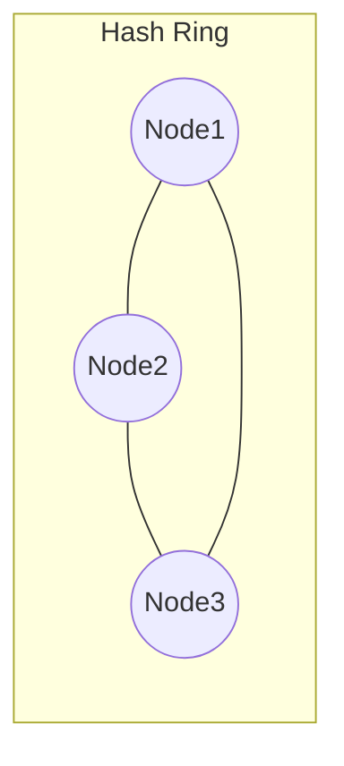

# **Полный сценарий: Dynamic Sharding стратегии (15 минут)**

# Интро (30–40 секунд)

Представьте, что у вас маркетплейс.
Всё красиво: микросервисы, шарды, базы, кеши.
Сервис растёт, бизнес радуется, графики вверх.

Пока однажды не появляется пользователь с `userId = 123`, который почему-то генерирует **30% всего трафика**.
И параллельно бизнес говорит: “давайте добавим ещё пару шардов, а то текущие уже захлёбываются”.

В этот момент выясняется неприятное:

1. “Один раз порезали по шардам и забыли” — это не стратегия, а временная фотография. Данные и нагрузка всё время меняются.
2. Наивная схема `hash(userId) % N` работает **ровно пока N не меняется**.
   Как только нужно добавить/убрать шарды или переразмазать нагрузку — начинается боль: почти все ключи “переезжают”, кеши протухают, база ловит шторм.

В предыдущей части мы разобрались:

* что такое партиционирование и шардирование;
* как выглядят RANGE/LIST/HASH-партиции;
* как можно шардингом разносить данные по разным кластерам и регионам.

Теперь следующий уровень:
**не просто “как один раз порезать”, а как жить, когда шарды нужно постоянно двигать и перевешивать по мере роста и перекоса нагрузки.**

То есть: **динамическое шардирование.**

---

# Часть 1: Что такое Dynamic Sharding (1 минута)

Статическая схема:

* рост нагрузки → перекос (skew);
* появление горячих ключей → отдельные шарды начинают гореть;
* расширение бизнеса → нужно добавлять шарды, регионы, новые кластера;
* заменили железо, сняли старые ноды → всё распределение надо пересобирать.

**Dynamic sharding** — это система, которая умеет:

* добавлять новые шарды в рантайме;
* менять маршрутизацию ключей;
* делить перегретые диапазоны;
* изолировать горячие ключи;
* делать всё это *без остановки сервиса*.

Важно: **сейчас говорим только про стратегии деления и маршрутизации.**
Как переносить данные, как делать миграции и rebalancing без даунтайма — отдельная глава.

---

# 🧱 Часть 2: Базовые понятия (1–2 минуты)

Чтобы понимать стратегии, определимся с базовой терминологией.

## 1. Shard Key

Правило: *по чему мы режем данные / маршрутизируем запрос*.

Примеры:

* `user_id`
* `tenant_id`
* `(country, city)`
* временной диапазон (`created_at`)

Плохой shard key = умирающий прод:

* все транзакции одного крупного клиента на одном шарде;
* все “важные” пользователи — в одном диапазоне.

## 2. Hot Key

Ключ, который генерирует несоразмерно большой трафик.

* видео в трендах → 100k RPS на один `video_id`;
* “звёздный” продавец, по которому постоянно что-то считают.

Один hot key может положить целый шард.

## 3. Skew

Перекос нагрузки, когда одни шарды горят, а другие спят.

* shard1 — 80% RPS;
* shard2–4 — по 5–7% и скучают.

Skew убивает любые красивые “равномерные” схемы, если система не умеет динамически перераспределяться.

---

# 🛰 Часть 2.5. Где живёт роутинг (1–2 минуты)

В прошлой секции (2.0) мы показали shard map / таблицу маршрутизации.

Сейчас зафиксируем, **где вообще может жить логика “куда идти за этим ключом”**.

Есть три классических варианта.

### 1) Client-side routing

* Логика шардирования зашита в сам сервис-клиент.
* Приложение по `user_id` само считает: “куда идти”.

Плюсы:

* нет лишнего хопа по сети;
* меньше latency, меньше точек отказа.

Минусы:

* каждый сервис должен знать про shard layout;
* изменение схемы = деплой всех клиентов;
* легко получить зоопарк разных реализаций.

### 2) Тупой proxy

* Клиент идёт на единый endpoint;
* proxy по какому-то правилу (`hash(key) % N`, shard map) пересылает запрос на нужный шард.

Плюсы:

* прозрачно для приложений;
* можно менять схему под капотом.

Минусы:

* дополнительная latency (ещё один хоп);
* SPOF/бутылочное горлышко, если не масштабировать сам proxy.

### 3) Умный coordinator

* Отдельный сервис-координатор:

    * знает layout шардов;
    * умеет сам делать cross-shard запросы, joins, агрегаты;
    * может выступать как “распределённый планировщик запросов”.

Плюсы:

* централизованный контроль;
* можно прятать от приложений сложные cross-shard операции.

Минусы:

* самый сложный кусок системы;
* легко превратить его в монстра и точку отказа.

В реальной жизни:

* для простых KV/кеша — чаще client-side или тупой proxy;
* для сложных БД — умный coordinator (Citus, Vitess, Cockroach и т.п.).

Дальше, когда будем говорить про стратегии шардирования, подразумеваем, что **где-то** живёт этот routing layer — библиотека, proxy или координатор.

---

# 🧩 Часть 3: Стратегии динамического шардирования (8–10 минут)

Теперь — самое вкусное.

Это реальные подходы, которые используют:

* Redis Cluster
* Cassandra
* Kafka
* MongoDB
* HBase / TiDB / Cockroach
* Twitter / Instagram / Facebook / Uber (в своих хранилищах)

---

# 🚀 Стратегия 1: Consistent Hashing + виртуальные ноды (2 минуты)

Используют: Redis Cluster, Cassandra, Kafka.

Классическая наивная формула:

```text
shard = hash(user_id) % N
```

Работает до тех пор, пока `N` не меняется.

Добавили ещё один шард?

* почти **все** ключи меняют Shard;
* кеш — протух;
* нагрузка на базу/сеть улетела вверх;
* rebalancing превращается в мини-DDoS на собственную систему.

### Что делает Consistent Hashing

Идея:

* строим **кольцо hash-пространства**;
* раскладываем по нему узлы;
* каждый ключ попадает в ближайший узел по часовой.

При добавлении/удалении ноды:

* **меняется только часть ключей**, а не весь мир;
* мы уменьшаем объём миграции и размер кеш-шторма.



Чтобы сгладить перекос, обычно используют **виртуальные ноды**:

* каждая физическая нода представлена десятком–сотней “точек” на кольце;
* это уменьшает skew и даёт гибкость.

⚠ Вариант на заметку:
вместо кольца можно использовать **rendezvous hashing** (HRW-хеширование) —
ключ выбирает “лучший” узел из множества, при изменении набора узлов пересчёт затрагивает только часть ключей.
Но идея та же: уменьшить объём перескока при изменении кластера.

### Проблема

Consistent hashing **не спасает от hot keys**.

Если один `user_id` или `video_id` стал безумно горячим:

* он всё равно сидит на одном сегменте кольца;
* этот сегмент и соответствующий узел перегреваются.

Consistent hashing решает проблему *массовой* миграции,
но **не решает проблему локального перегрева**. Нужны следующие техники.

---

### ⚠ Каскадные отказы между шардами

Отдельная беда шардированных систем — каскадные падения.

Сценка:

* один шард начал деградировать (диск, GC, сеть);
* routing-слой пометил его как unhealthy и начал перенаправлять запросы на остальные;
* соседние шарды не рассчитаны на такой объём, их latency растёт;
* клиенты/ретраи начинают долбить их ещё сильнее.

В результате вместо “минус один шард” получаем:
**минус весь кластер.**

Чтобы этого не ловить, одних стратегий шардирования мало. Нужны:

* **rate limiting** и **backpressure** — ограничивать входной поток на каждый шард;
* **circuit breaker’ы** — не пытаться бесконечно бить в деградировавшие узлы;
* аккуратные правила ретраев (без “всё ретраим на все шарды подряд”).

___

### 🧮 Вариант: Rendezvous (HRW) hashing

Есть ещё один популярный подход — **rendezvous hashing** (HRW).

Идея:

* для каждого ключа считаем “оценку” для КАЖДОГО узла, например `score = hash(key + node_id)`;
* выбираем узел с **максимальным score**;
* при добавлении/удалении ноды меняется только часть выборов.

Плюсы:

* нет кольца и виртуальных нод, реализация проще;
* как и consistent hash, минимизирует количество ключей, которые “перескакивают” при изменении набора нод.

Минусы:

* как и кольцо, **не решает проблему hot keys и каскадных отказов** —
  это всё равно лечится rate limiting’ом, microsharding’ом и hot-key isolation.

___

# 📚 Стратегия 2: Directory-Based Sharding (2 минуты)

Используют: Instagram, Facebook TAO, многие крупные системы.

Суть:

> Вместо чистой формулы (`hash % N`) делаем **явную таблицу маршрутизации**.

Простейший вариант:

```text
0–1M userId   → shard1
1M–2M userId  → shard2
2M–3M userId  → shard3
...
```

Это может быть:

* таблица `shard_map` в базе;
* конфиг в key-value хранилище;
* отдельный metadata service.

С точки зрения приложения:

1. по ключу (`user_id`, `region`) спрашиваем shard-map: “куда идти?”;
2. получаем указание на шард/кластер;
3. уже туда посылаем запрос.

Мы эту идею уже видели в ликбезе (2.0) на примере `shard_map` по `region`.
Здесь делаем её основой **динамического** управления.

### Плюсы

* можно менять схему шардирования в рантайме:

    * разделять диапазоны;
    * перекидывать диапазоны между узлами;
    * мигрировать конкретных клиентов/tenant’ов.
* можно вообще сменить shard key:

    * было по `user_id`, стало по `(region, user_id)` — shard-map просто поменяли.

### Минусы

* нужен быстрый и надёжный metadata слой:

    * shard-map должен быть в кеше почти везде;
    * нужна репликация/HA, иначе это SPOF.
* routing-слой усложняется.

Но в обмен мы получаем **максимальную гибкость**:

* любая миграция — это сначала изменение shard-map, потом перенос данных.

---

# 🌗 Стратегия 3: Dynamic Range Splitting (1.5 минуты)

Используют: MongoDB, HBase, CockroachDB, TiDB.

Core идея:

> “Каждый шард — это диапазон. Диапазон стал слишком жирным или горячим — режем пополам.”

Было:

```text
[0..10M] → shard1
```

Стало:

```text
[0..5M]  → shard1
[5M..10M] → shard2
```

Система:

* мониторит размер и нагрузку на диапазоны;
* при превышении порога:

    * создаёт новый диапазон;
    * переносит часть данных;
    * обновляет метаданные routing’а.

### Плюсы

* подходит для монотонных ключей (автоинкремент, timestamp);
* шарды остаются примерно одинакового размера;
* можно *автоматизировать* разбиение.

### Минусы

* нужна инфраструктура для переноса данных;
* может появиться очень много маленьких диапазонов;
* нужен компонент, который управляет layout’ом диапазонов.

Почти всегда это комбинируется с directory-based подходом:

* meta-service знает, какие диапазоны где лежат;
* range-splitting — всего лишь одна из операций над этим layout’ом.

---

# 🪶 Стратегия 4: Microsharding (2 минуты)

Используют: Twitter Manhattan, Uber и другие крупные ребята.

Вместо того чтобы иметь 8–16 “толстых” шардов, мы делаем **сотни/тысячи виртуальных шардов**:

```text
virtual shards: 0…999
```

Физически они раскладываются так:

```text
Node1 → 13 virtual shards
Node2 → 17 virtual shards
Node3 → 16 virtual shards
...
```

Сценарий:

* узел перегрелся → снимаем с него 5–10 виртуальных шардов → переносим на другие ноды;
* layout можно постоянно подстраивать по нагрузке.

### Плюсы

* очень гибкое выравнивание нагрузки;
* rebalancing делается малыми порциями:

    * не переносим десятки миллионов записей;
    * переносим маленькие куски;
* защита от skew:

    * нагрузка не концентрируется на одной “толстой” партиции.

### Минусы

* routing становится сложнее:

    * сначала находим виртуальный шард для ключа;
    * потом по shard-map смотрим, на какой ноде он живёт;
* нужен отдельный “placement driver” / metadata service.

На практике это часто комбинация:

* **microshards** + **consistent/directory-based hashing** + **routing сервис**.

---

# 🔥 Стратегия 5: Hot-Key Isolation (1.5 минуты)

Используют: DynamoDB Adaptive Capacity, Cloudflare, многие CDN/кеши.

Если проблема не в общем layout’е, а в **паре горячих ключей**,
иногда нет смысла мудрить с глобальной схемой.

Идея:

> “Горячие ключи — на отдельные шарды, остальное — как было.”

Пример:

```text
KEY123 → отдельный hot-shard
KEY777 → отдельный hot-shard
всё остальное → обычное шардирование
```

Можно:

* вынести ключ на отдельный инстанс;
* дать ему отдельный пул ресурсов;
* повесить доп. защиту/лимиты.

### Плюсы

* быстро снимает перегрузку;
* не требует глобального rebalancing’а всех данных.

### Минусы

* усложняется архитектура:

    * часть логики “особенная” для этих ключей;
* нужны хорошие метрики:

    * чтобы вовремя находить hot keys;
    * чтобы не тащить туда всё подряд.

Часто это временная “заплатка”, но в больших системах **hot-key isolation** — нормальный, осознанный паттерн.

---

# 🧨 Часть 4: Главный вывод (1 минута)

Шардирование — это не “одна магическая формула”.

**Dynamic sharding** — это комбинация решений:

* как мы режем данные (range/hash/directory/microshards);
* где живёт routing (клиент, proxy, coordinator, metadata service);
* как мы боремся со skew и hot keys;
* как мы добавляем и удаляем шарды, не убивая прод.

При этом:

* наивное `hash(key) % N` живёт ровно до **первого изменения N**;
* consistent hashing спасает от полного переразбрасывания, но не от hot keys;
* directory-based и microsharding дают гибкость, но требуют умного metadata слоя;
* hot-key isolation — последний рубеж обороны, когда пару ключей нужно “посадить отдельно”.

И это ещё не всё.

Пока мы говорили только о том, **как делить и переразмазывать данные**.
Но остаются два самых неприятных вопроса:

---

# 👉 Следующая глава: Cross-Shard Operations (join’ы, транзакции, агрегаты)

Как жить, когда бизнес-операция затрагивает несколько шардов:

* join по разным шартам;
* агрегаты (`COUNT/AVG/SUM`) по всему кластеру;
* транзакции, которые трогают разные диапазоны;
* поиск по диапазонам, которые пересекают шарды.

И как при этом не убивать latency и не превращать coordinator в монстра.

---

# 👉 Глава после неё: Rebalancing & Migration без downtime

Даже идеальный layout устаревает.

Нужно уметь:

* переносить данные между шардами;
* менять ключи/диапазоны;
* добавлять/удалять ноды;
* делать всё это:

    * **без остановки сервиса**;
    * **без потерь данных**;
    * **без “двойных” или пропущенных записей**.

Это тема отдельной главы — про миграции и rebalancing.
