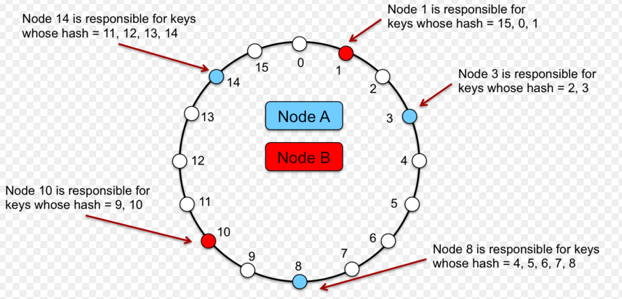
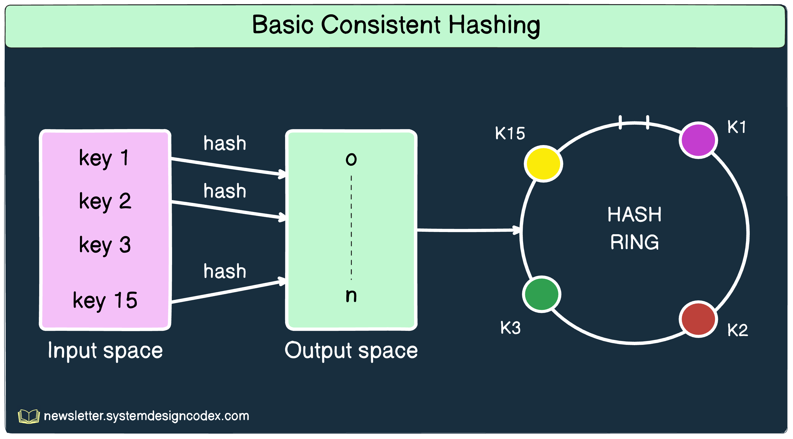

# **Полный сценарий: Dynamic Sharding стратегии (15 минут)**

# Интро (30–40 секунд)

Представьте, что у вас маркетплейс.
Всё красиво: микросервисы, шарды, базы, кеши.
Сервис растёт, бизнес радуется, графики вверх.

Пока однажды не появляется пользователь с `userId = 123`, который почему-то генерирует **30% всего трафика**.
И параллельно бизнес говорит: “давайте добавим ещё пару шардов, а то текущие уже захлёбываются”.

В этот момент выясняется неприятное:

1. “Один раз порезали по шардам и забыли” — это не стратегия, а временная фотография. Данные и нагрузка всё время меняются.
2. Наивная схема `hash(userId) % N` работает **ровно пока N не меняется**.
   Как только нужно добавить/убрать шарды или переразмазать нагрузку — начинается боль: почти все ключи “переезжают”, кеши протухают, база ловит шторм.

В предыдущей части мы разобрались:

* что такое партиционирование и шардирование;
* как выглядят RANGE/LIST/HASH-партиции;
* как можно шардингом разносить данные по разным кластерам и регионам.

Теперь следующий уровень:
**не просто “как один раз порезать”, а как жить, когда шарды нужно постоянно двигать и перевешивать по мере роста и перекоса нагрузки.**

То есть: **динамическое шардирование.**

---

# Часть 1: Что такое Dynamic Sharding (1 минута)

Помним нашу “красивую” схему:

* взяли `user_id`;
* сделали `hash(user_id) % N`;
* разложили пользователей по шардам;
* выдохнули: “ну всё, зашардировали”.

Проходит время — и реальность подвозит сюрпризы:

* сервис растёт, появляются **перекосы нагрузки (skew)**;
* всплывают **горячие ключи** — один клиент/видео/продавец жрёт целый шард;
* бизнес лезет в новые страны → нужны новые шарды, регионы, кластера;
* железо меняем, старые ноды выкидываем → старое распределение перестаёт совпадать с физикой.

И вот в этот момент становится ясно:

> “Один раз порезали и забыли” — не работает.
> Раскладку данных нужно **постоянно подстраивать под жизнь**.

Под **Dynamic sharding** здесь будем понимать не конкретный алгоритм, а свойство системы:

* уметь **добавлять** новые шарды в рантайме;
* **перекладывать** диапазоны и tenants между шардами;
* **делить** перегретые куски;
* **изолировать** горячие ключи;
* и делать всё это **без остановки сервиса и без тотального шторма по базе и кешам**.

Важно: в этой главе мы говорим только про **стратегии деления и маршрутизации**:

* как выбирать shard key;
* как решать, какой ключ куда пойдёт;
* какие схемы позволяют менять layout без тотального переезда всех данных.

А вот как физически переносить данные, как делать rebalancing без даунтайма и потерь — это уже тема отдельной главы.

---

# Часть 2: Базовые понятия (1–2 минуты)

Чтобы понимать стратегии, определимся с базовой терминологией.

## 1. Shard Key

Shard key — это ответ на вопрос:
**“по какому признаку мы режем данные и решаем, на какой шард пойдёт запрос?”**

Примеры:

* `user_id`
* `tenant_id` (идентификатор клиента/компании в мульти-арендном SaaS)
* `(country, city)`
* временной диапазон (`created_at`)

От выбора shard key зависит почти всё: баланс нагрузки, сложность запросов, цена миграций.

Что делает shard key **хорошим**:

* он более-менее равномерно размазывает нагрузку и объём данных;
* типичные бизнес-операции влезают **в один шард** (или в небольшое число);
* ключ стабильный (редко меняется), его легко пробросить через сервисы.

Что ломает **плохой shard key**:

1. **Перекос нагрузки (skew) и горячие шарды**

  * Режем по `tenant_id`, а один enterprise-клиент даёт 50% всего трафика.  
    → этот tenant сидит на одном шарде и жарит его, остальные скучают.
  * Режем по диапазону `user_id`, а “старые” активные пользователи оказались в одном диапазоне.  
    → один “горячий” диапазон/шард + куча холодного хлама.

2. **Кросс-шард там, где по смыслу должно быть локально**

  * Режем по `user_id`, а бизнес-операции крутятся вокруг `shop_id` или `project_id`.  
    → любой отчёт по магазину собирает данные со **всех** шардов (scatter-gather).
  * Режем по `country`, а в рамках одной компании (tenant) есть команды из разных стран.  
    → простая операция “показать все данные клиента” превращается в квест по шардам.

3. **Невозможность эволюции**

  * Шардимся по полю, которое меняется: `region`, `tariff`, `status`.  
    → каждый “переезд” пользователя между регионами/тарифами — это физическая миграция между шардами.
  * Используем составной shard key из трёх полей, половина сервисов его не может нормально прокинуть.  
    → начинаются костыли вида “у нас тут отдельная табличка/сервис, чтобы узнать, куда вообще идти”.

4. **Запросы не попадают в шард**

  * Популярные запросы **не содержат** shard key.  
    Например, шардимся по `user_id`, а бегаем по `email` или `phone`.  
    → чтобы ответить на запрос, приходится трогать все шарды: либо seq scan, либо index scan в каждом.

Итого:

> Shard key — это не “рандомное поле из таблицы”.  
> Это компромисс между балансом нагрузки, локальностью бизнес-операций и тем, какие запросы вы реально будете выполнять.

Дальше, когда будем разбирать стратегии (consistent hashing, directory-based схемы, microsharding, hot-key isolation), мы всё время будем возвращаться к этому вопросу:  
**выбранный shard key помогает системе жить или гарантирует вам вечный кросс-шардовый ад?**

## 2. Hot keys и skew нагрузки

**Hot key** — это ключ, который генерирует **несоразмерно большой** трафик по сравнению с остальными.

Примеры:

* видео в трендах → 100k RPS на один `video_id`;
* “звёздный” продавец, по которому постоянно считают метрики;
* топовый игровой сервер / гильдия / чат-канал.

Даже если shard key в целом выбран нормально, один такой ключ может фактически
**превратить целый шард в bottleneck**:

* CPU, диск, коннекты — всё упирается в обработку одного `video_id` / `tenant_id`;
* остальные шарды живут спокойно, но пользователям от этого не легче — всё упирается в горячий шард.

Это подводит нас к следующему понятию.

**Skew (перекос нагрузки)** — это когда нагрузка и данные по шардам распределились криво:

* shard1 — 80% RPS,
* shard2–4 — по 5–7% и скучают.

Hot key — частный случай причины skew’а: один ключ перегревает один шард.  
Но skew может возникать и без явно выраженного hot key:

* один крупный `tenant_id` даёт половину всех запросов;
* диапазон ID или регион, на который внезапно приходится почти весь трафик;
* маркетинговая кампания, которая цепляет только часть шардов.

**Почему это беда:**

* масштабируешь кластер “симметрично”, добавляя узлы, а основная боль остаётся на одном–двух шардах;
* средний RPS на кластер выглядит красиво, а p95/p99 latency для запросов,
  попадающих на перегретые шарды, улетает в космос;
* любое падение горячего шарда может спровоцировать каскадный отказ:
  часть трафика переезжает на соседей → они тоже начинают задыхаться.

**Что с этим обычно делают (намётки, детали дальше по сценарию):**

* **hot-key isolation** — вынос особо горячих ключей (или tenants) на отдельные шарды/кластера;
* **microsharding** — дробим большие шарды на много мелких логических кусочков, чтобы нагрузку можно было перераспределять тонко;
* **умный routing** (latency-aware, load-aware) — чтобы не забивать уже страдающие шарды;
* **дополнительный кеш / fan-out через очередь** — не бить по базе/ядру на каждый запрос к hot key;
* **rate limiting / backpressure** — один шумный клиент не должен иметь возможности сжечь кластер.

Важно: ни hot keys, ни skew не лечатся “ещё одним `% N`”.  
Их нужно **видеть по метрикам** и целенаправленно разгружать архитектурными решениями.

---

# Часть 2.5. Где живёт роутинг (1–2 минуты)

В прошлой секции мы показали shard map / таблицу маршрутизации.

Сейчас зафиксируем, **где вообще может жить логика “куда идти за этим ключом”**.

Есть три верхнеуровневых варианта.

---

### 1) Routing в приложении (самый честный и самый частый)

Самый приземлённый вариант:

* приложение держит **несколько DSN** (`db_shard_1`, `db_shard_2`, …);
* есть слой `ShardRouter`, который по `userId` / `tenantId` выбирает нужный коннект;
* вся логика:
    * какой ключ на каком шарде,
    * как делать кросс-шардовые операции,
    * как мигрировать между шардами —
      лежит в коде приложения.

С точки зрения Symfony это выглядит так:

* в конфиге — несколько коннектов к разным базам;
* в сервисе — что-то вроде:

```php
  $conn = $router->forUser($userId); // выбираем нужный shard
  $conn->executeQuery('SELECT ...');
````

Плюсы:

* полный контроль, никаких чёрных ящиков;
* проще дебажить и понимать, что реально происходит.

Минусы:

* весь “мозг” шардирования — это ваш код;
* кросс-шардовые запросы и миграции придётся продумывать самим.

---

### 2) Pooler / простой proxy (pgbouncer, Odyssey, ProxySQL и т.п.)

Следующий слой — **инфраструктурные прокси/пулер**ы.

* Говорят на том же протоколе, что и клиент (Postgres / MySQL wire).
* Сидят между приложением и реальными базами.
* Умеют:

    * пулить коннекты;
    * балансировать по нескольким одинаковым backend’ам;
    * иногда разводить чтение/запись (master/replica) или разных пользователей по разным серверам.

Но важно:

* они **не знают ни про shard key, ни про layout данных**;
* не строят распределённый план запросов;
* не джойнят и не агрегируют данные с разных шардов;
* key-based шардинг (`user_id`, `tenant_id`) всё равно делает **либо приложение**, либо более умный слой.

Исторически pgpool-II пытался играть в “шардирование по колонке” (hash по `shard_key`),
но с кучей ограничений и боли. Сейчас это скорее legacy-подход, чем база для нового продового дизайна.

---

### 3) Координатор (распределённый движок: Citus, Vitess и т.п.)

Отдельный класс решений — **координаторы**, по сути распределённые движки поверх обычной СУБД.

* Для приложения это выглядит как **одна база и один DSN**.
* Координатор:

    * понимает схему: какие таблицы распределённые, какой shard key;
    * сам решает, какие шарды трогать для конкретного запроса;
    * строит **распределённый план**:

        * какие части запроса отправить на шарды;
        * где делать фильтрацию/агрегации;
        * где собирать и мёржить результат;
    * умеет работать с транзакциями в распределённом мире (в рамках своих ограничений).

Примеры:

* **Citus** поверх Postgres — де-факто лидер в Postgres-мире для шардинга и распределённых запросов;
* **Vitess** поверх MySQL — координатор, на котором живут большие кластера (включая YouTube).

Это уже **не “просто прокси”**, а по сути распределённая СУБД с координатором.

---

В этой главе, когда я говорю “routing-слой”, речь не про конкретный продукт, а про принцип:

> клиент знает один “вход”,
> а “куда на самом деле пойдут данные” решает отдельный слой —
> будь то application-level роутер, pooler + своя логика, или полноценный координатор типа Citus/Vitess.

А какой именно стек выбрать — это уже отдельный инженерный выбор с кучей trade-off’ов.

[//]: # (здесь бы ссылку на репозиторий с примером приложения с  динамическим шардированием чтоб можно было легко посмотреть/потрогать руками чтоб не оставалось магией)

---

# Часть 3: Стратегии динамического шардирования (8–10 минут)

Теперь — самое вкусное.

Это реальные подходы, которые используют:

* Redis Cluster
* Cassandra
* Kafka
* MongoDB
* HBase / TiDB / Cockroach
* Twitter / Instagram / Facebook / Uber (в своих хранилищах)

---

# Стратегия 1: Consistent Hashing + виртуальные ноды (2–3 минуты)

По типу это **HASH-шардирование** на уровне роутинга.

Наивный вариант, который все сначала делают:

```text
shard = hash(user_id) % N
```

* `hash()` — любая более-менее ровная хеш-функция;
* `N` — количество шардов.

Пока `N` фиксировано — жить можно.

Но как только:

* добавили новый шард,
* или убрали старый,

**меняется `N` → меняется остаток → почти все ключи “переезжают”**:

* кеш  — мимо, прогрев с нуля;
* база — ловит лавину миграций;
* сеть — забита перекладкой данных.

Это не динамическое шардирование, а минное поле.

---

## Consistent Hashing: меньше перескока при изменении кластера

Идея: вместо “остатка от деления” работаем с **кольцом hash-пространства**.

1. Представляем диапазон хеша как круг `0 … 2^32-1`.
2. Для каждого шарда считаем `hash(shard_id)` и ставим его на кольцо.
3. Для каждого ключа считаем `hash(key)` и идём по часовой стрелке до ближайшего шарда.

На слайде здесь — **картинка**: круг, по нему несколько точек (шарды), и стрелка от `hash(key)` до ближайшего по часовой.




Что это даёт:

* при добавлении нового шарда он появляется в нескольких точках кольца;
* **только ключи, чей hash попал “между соседями” нового узла, переедут на него**;
* остальные продолжат ходить на старые шарды.

Если было 3 шарда и мы добавили 4-й,
в среднем переедет примерно `1 / (3+1) ≈ 25%` ключей, а не почти все.

Это всё тот же **HASH-подход**, просто не “mod N”, а “по позиции на кольце”.

---

## Виртуальные ноды: зачем они вообще

Возникает закономерный вопрос:

> “Я добавлю новый физический шард — мне всё равно столько же ключей переливать, нет?”

По порядку.

### Проблема без виртуальных нод

Если на кольце всего 3–4 узла:

* их позиции по `hash(shard_id)` могут лечь криво — один шард “накроет” большую дугу, другой — маленькую;
* при добавлении нового шарда он может откусить большой кусок только у одного соседа;
* получаем перекос по данным и нагрузке, хотя в теории “должно быть ровно”.

### Что делают виртуальные ноды

Мы не ставим на кольцо “одну точку = один физический шард”.
Вместо этого:

* каждый физический шард представляем десятком–сотней **виртуальных нод**;
* для каждой виртуальной ноды считаем `hash(shard_id + "#" + replica_index)` и размещаем её на кольце;
* **физический шард = множество точек на кольце**.

Что это даёт:

1. **Более ровное распределение**

   Вместо того, чтобы одна дуга кольца принадлежала целиком одному шарду,
   кольцо подрезано на мелкие отрезки — виртуальные ноды перемешаны.

   В среднем:

    * каждый шард получает примерно одинаковую долю ключей;
    * дисбаланс между шардами падает.

2. **Гибкость при добавлении нового физического шарда**

   Когда добавляем новый шард:

    * создаём для него тоже пачку виртуальных нод;
    * раскидываем их по кольцу;
    * **часть мелких интервалов** откусывается у разных существующих шардов.

   В итоге:

    * тот же самый “в среднем ~1/(N+1) ключей переезжает”,
    * но переезд **размазан** по всем шардам, а не вырван у одного толстым куском;
    * можно играть количеством виртуальных нод, чтобы учесть разную мощность серверов.

3. **Weighted sharding**

   Хотим, чтобы новый шард был полегче (hardware слабее) — даём ему меньше виртуальных нод.
   Хотим более мощный шард — даём ему больше виртуальных нод.

То есть да:

* **доля переезжающих ключей при добавлении новой машины всегда примерно `1/(N+1)`** — от этого никуда не деться;
* но виртуальные ноды делают:

    * распределение **ровным**,
    * rebalancing — **контролируемым и равномерным** по всем шартам,
    * а не “один шард внезапно страдает за всех”.

---

## Пример роутинга “на пальцах”

Пусть у нас 3 физ. шарда: `A`, `B`, `C`.
Каждый представлен 4 виртуальными нодами на кольце.

1. Ключ `user_id = 42`:

    * считаем `h = hash("42")`;
    * на кольце идём по часовой до ближайшей виртуальной ноды, допустим `A#3`;
    * роутим на физический шард `A`.

2. Добавили новый шард `D` (тоже с 4 виртуальными нодами):

    * на кольце появились новые точки `D#0..3`;
    * только ключи, чьи хеши попали в интервалы, захваченные `D#*`, переедут на `D`;
    * остальная масса продолжит ходить в `A/B/C`.

На слайдах можно показать две картинки кольца: “до” и “после” добавления `D`, и подчеркнуть, что **большинство ключей остались привязаны к тем же шартам**.

---

## Что с hash-функциями (особенно для UUID)

Требование к hash-функции тут простое:

* **равномерное распределение** по кольцу;
* **стабильность** (один и тот же ключ → один и тот же hash).

Типичные варианты:

* для строк/UUID:

    * MurmurHash, xxHash, SipHash — быстрые и достаточно ровные;
* для числовых id (int/bigint):

    * можно хешировать как есть (`hash(id)`), не надо брать `id % N` напрямую;
    * “просто id” иногда нормально, но хуже при последовательном выделении и короткой шкале.

Главный анти-паттерн:

* “берём первые 8 байт UUID и считаем, что это нормально” —
  разные реализации UUID могут давать коррелированные отрезки, лучше прогонять через нормальную hash-функцию.

---

## Ограничения стратегии

Важно зафиксировать честно:

* **Consistent hashing — это про уменьшение массовых миграций**, когда меняется состав кластера.
* Он:

    * не убирает **hot keys** — один горячий ключ всё равно ляжет на один сегмент кольца;
    * не решает сам по себе **skew** по бизнес-ключам (например, один жирный `tenant_id`);
    * не делает кросс-шардовые запросы “магически локальными”.

То есть это хороший базовый слой для **HASH-шардирования в динамичном кластере**,
но бороться с hot keys, skew и сложными запросами всё равно придётся отдельными техниками.

---

### Каскадные отказы между шардами

Отдельная беда шардированных систем — каскадные падения.

Сценка:

* один шард начал деградировать (диск, GC, сеть);
* routing-слой пометил его как unhealthy и начал перенаправлять запросы на остальные;
* соседние шарды не рассчитаны на такой объём, их latency растёт;
* клиенты/ретраи начинают долбить их ещё сильнее.

В результате вместо “минус один шард” получаем:
**минус весь кластер.**

Чтобы этого не ловить, одних стратегий шардирования мало. Нужны:

* **rate limiting** и **backpressure** — ограничивать входной поток на каждый шард;
* **circuit breaker’ы** — не пытаться бесконечно бить в деградировавшие узлы;
* аккуратные правила ретраев (без “всё ретраим на все шарды подряд”).

___

###  Вариант: Rendezvous (HRW) hashing

Есть ещё один популярный подход — **rendezvous hashing** (HRW).

Идея:

* для каждого ключа считаем “оценку” для КАЖДОГО узла, например `score = hash(key + node_id)`;
* выбираем узел с **максимальным score**;
* при добавлении/удалении ноды меняется только часть выборов.

Плюсы:

* нет кольца и виртуальных нод, реализация проще;
* как и consistent hash, минимизирует количество ключей, которые “перескакивают” при изменении набора нод.

Минусы:

* как и кольцо, **не решает проблему hot keys и каскадных отказов** —
  это всё равно лечится rate limiting’ом, microsharding’ом и hot-key isolation.

___

# Стратегия 2: Directory-Based Sharding (2–3 минуты)

По типу это всё ещё **горизонтальное шардирование**,  
но вместо жёсткой формулы (`hash % N`) у нас появляется **слой перенаправления по таблице**.

Суть:

> Не вычислять шард напрямую из ключа,  
> а сначала спросить: “а где вообще сейчас лежит этот диапазон/tenant/бакет?”

---

## Как это выглядит

Простейший, “учебный” вариант:

```text
0–1M userId   → shard1
1M–2M userId  → shard2
2M–3M userId  → shard3
...
````

Это уже directory-подход:
у тебя есть явная карта “диапазон → шард”.

Где она может жить:

* таблица `shard_map` в базе;
* конфиг в key-value хранилище;
* отдельный metadata-сервис.

С точки зрения приложения:

1. по ключу (`user_id`, `tenant_id`, `region`) сначала обращаемся к shard-map: “куда идти?”;
2. получаем “логический шард” или конкретный кластер;
3. уже туда шлём запрос.

Мы это уже видели в ликбезе (раздел с `shard_map` по `region`).
Здесь та же идея, но **возведённая в принцип для динамики**.

---

## Как делают в реальных системах

В жизни почти никто не пишет “0–1M → shard1” в лоб.
Чаще вводят **ещё один уровень косвенности**:

1. Ключ (`user_id`) хешируем в **бакет**:

   ```text
   bucket = H(user_id) % 4096
   ```

2. В shard-map храним **bucket → физический шард**:

   ```text
   bucket 0–127     → shard1
   bucket 128–511   → shard2
   bucket 512–1023  → shard3
   ...
   ```

3. При росте/ребалансинге:

    * докидываем новые шарды,
    * перекидываем **часть бакетов** между ними,
    * а формула `bucket = H(key) % 4096` при этом не меняется.

Эту идею в разных вариациях используют:

* Instagram, Facebook TAO, куча внутренних storage-систем;
* Citus делает по сути то же самое у себя в системных таблицах: хранит mapping “шард → ноды кластера” и умеет его менять, не ломая приложение;
* почти любой “нормальный” распределённый storage опирается на какой-то directory / метаданные, а не на голый `hash % N`.

---

## Плюсы directory-подхода

* **Гибкость при росте**:

    * можно делить диапазоны/бакеты;
    * можно перекидывать их между узлами;
    * можно мигрировать конкретных клиентов/tenant’ов.

* **Можно сменить схему шардирования без переписывания всего мира**:

    * сначала резали по `user_id`, потом решили учитывать `region` —
      меняем логику заполнения shard-map, а не весь прод.

* **Удобно делать “ручные” операции**:

    * “этого клиента срочно перевезти на отдельный кластер”;
    * “этот горячий диапазон временно живёт на более жирной ноде”.

По сути: **любой rebalancing** превращается в два шага:

1. меняем shard-map (кто за что отвечает);
2. физически переносим данные (по плану, throttled, без DDoS на систему).

---

## Минусы

* Нужен **быстрый и надёжный metadata-слой**:

    * shard-map должен быть в памяти маршрутизатора/приложения;
    * должна быть репликация/HA, иначе это новый SPOF.

* Routing-слой толстеет:

    * появляется ещё одна сущность (directory/метаданные),
    * отдельные задачи по его мониторингу, deploy’ю и миграциям.

Но это плата за то, что ты перестаёшь быть рабом формулы `hash(key) % N`
и получаешь **управляемую эволюцию схемы шардирования**, а не вечный “дропни кластер и молись”.

___

# Стратегия 3: Dynamic Range Splitting (1.5 минуты)

Используют: MongoDB, HBase, CockroachDB, TiDB.

Core идея:

> “Каждый шард — это диапазон. Диапазон стал слишком жирным или горячим — режем пополам.”

Было:

```text
[0..10M] → shard1
```

Стало:

```text
[0..5M]  → shard1
[5M..10M] → shard2
```

Система:

* мониторит размер и нагрузку на диапазоны;
* при превышении порога:

    * создаёт новый диапазон;
    * переносит часть данных;
    * обновляет метаданные routing’а.

### Плюсы

* подходит для монотонных ключей (автоинкремент, timestamp);
* шарды остаются примерно одинакового размера;
* можно *автоматизировать* разбиение.

### Минусы

* нужна инфраструктура для переноса данных;
* может появиться очень много маленьких диапазонов;
* нужен компонент, который управляет layout’ом диапазонов.

Почти всегда это комбинируется с directory-based подходом:

* meta-service знает, какие диапазоны где лежат;
* range-splitting — всего лишь одна из операций над этим layout’ом.

---

# Стратегия 4: Microsharding (2 минуты)

Используют: Twitter Manhattan, Uber и другие крупные ребята.

Вместо того чтобы иметь 8–16 “толстых” шардов, мы делаем **сотни/тысячи виртуальных шардов**:

```text
virtual shards: 0…999
```

Физически они раскладываются так:

```text
Node1 → 13 virtual shards
Node2 → 17 virtual shards
Node3 → 16 virtual shards
...
```

Сценарий:

* узел перегрелся → снимаем с него 5–10 виртуальных шардов → переносим на другие ноды;
* layout можно постоянно подстраивать по нагрузке.

### Плюсы

* очень гибкое выравнивание нагрузки;
* rebalancing делается малыми порциями:

    * не переносим десятки миллионов записей;
    * переносим маленькие куски;
* защита от skew:

    * нагрузка не концентрируется на одной “толстой” партиции.

### Минусы

* routing становится сложнее:

    * сначала находим виртуальный шард для ключа;
    * потом по shard-map смотрим, на какой ноде он живёт;
* нужен отдельный “placement driver” / metadata service.

На практике это часто комбинация:

* **microshards** + **consistent/directory-based hashing** + **routing сервис**.

---

# Стратегия 5: Hot-Key Isolation (1.5 минуты)

Используют: DynamoDB Adaptive Capacity, Cloudflare, многие CDN/кеши.

Если проблема не в общем layout’е, а в **паре горячих ключей**,
иногда нет смысла мудрить с глобальной схемой.

Идея:

> “Горячие ключи — на отдельные шарды, остальное — как было.”

Пример:

```text
KEY123 → отдельный hot-shard
KEY777 → отдельный hot-shard
всё остальное → обычное шардирование
```

Можно:

* вынести ключ на отдельный инстанс;
* дать ему отдельный пул ресурсов;
* повесить доп. защиту/лимиты.

### Плюсы

* быстро снимает перегрузку;
* не требует глобального rebalancing’а всех данных.

### Минусы

* усложняется архитектура:

    * часть логики “особенная” для этих ключей;
* нужны хорошие метрики:

    * чтобы вовремя находить hot keys;
    * чтобы не тащить туда всё подряд.

Часто это временная “заплатка”, но в больших системах **hot-key isolation** — нормальный, осознанный паттерн.

---

# Часть 4: Главный вывод (1 минута)

Шардирование — это не “одна магическая формула”.

**Dynamic sharding** — это комбинация решений:

* как мы режем данные (range/hash/directory/microshards);
* где живёт routing (клиент, proxy, coordinator, metadata service);
* как мы боремся со skew и hot keys;
* как мы добавляем и удаляем шарды, не убивая прод.

При этом:

* наивное `hash(key) % N` живёт ровно до **первого изменения N**;
* consistent hashing спасает от полного переразбрасывания, но не от hot keys;
* directory-based и microsharding дают гибкость, но требуют умного metadata слоя;
* hot-key isolation — последний рубеж обороны, когда пару ключей нужно “посадить отдельно”.

И это ещё не всё.

Пока мы говорили только о том, **как делить и переразмазывать данные**.
Но остаются два самых неприятных вопроса:

- Как жить, когда бизнес-операция затрагивает несколько шардов:
- как переносить данные между шардами;
  * **без остановки сервиса**;
  * **без потерь данных**;
  * **без “двойных” или пропущенных записей**.

Это тема отдельной главы — про миграции и rebalancing.
