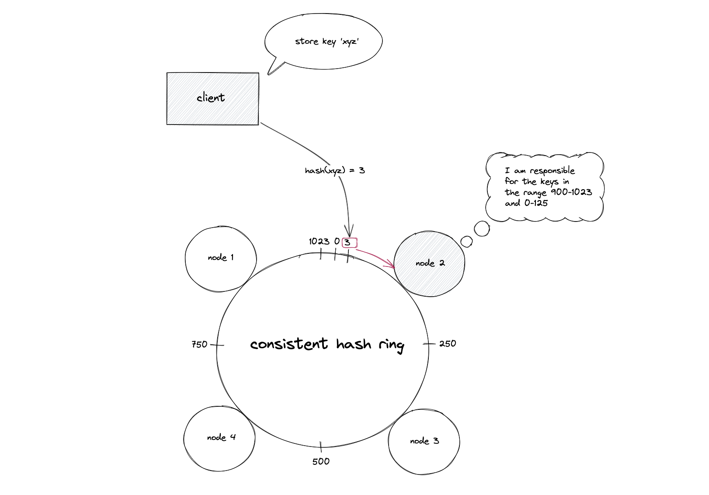
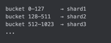

# Блок 2.3. Dynamic Sharding стратегии

## Интро

Мы уже видели что отдельные шарды могут перекреватся по разным причинам и нам надо менять как-то способы шардирования
Вдобавок мы можем добавлять новые или убирать старые шарды в зависимости от роста бизнеса и обслуживания железа

Таким образом мы понимаем
> “Один раз порезали и забыли” — работает не всегда
> Часто аскладку данных нужно **постоянно подстраивать под жизнь**.

Это и приводит нас к динамическому шардированию

## Что такое Dynamic Sharding

Под **Dynamic sharding** здесь будем понимать не конкретный алгоритм, а свойство системы:

* уметь **добавлять** новые шарды в рантайме;
* **перекладывать** диапазоны и tenants между шардами;
* **делить** перегретые куски;
* **изолировать** горячие ключи;
* и делать всё это **без остановки сервиса и без тотального шторма по базе и кешам**.

В этой главе мы говорим только про **стратегии деления и маршрутизации**:

* как выбирать shard key;
* как решать, какой ключ куда пойдёт;
* какие схемы позволяют менять layout без тотального переезда всех данных.

А вот как физически переносить данные, как делать rebalancing без даунтайма и потерь — это уже тема отдельной главы.

## 2.3.1. Стратегии динамического шардирования

### Стратегия 1: Consistent Hashing + виртуальные ноды (2–3 минуты)

Обычное HASH-шардирование выглядит так

```text
shard = hash(user_id) % N
```

* `hash()` — любая более-менее ровная хеш-функция;
* `N` — количество шардов.

Пока `N` фиксировано — жить можно.

Но как только:

* добавили новый шард,
* или убрали старый,

меняется `N` → меняется остаток для всех хешей → почти все ключи “переезжают”,  что создает значительную нагрузку на систему

чтобы этого избежать нужна схема, при которой при изменении числа шардов переезжает только часть ключей.

## Consistent Hashing: кольцо вместо деления на N

стратегия consistent hashing — базовый кирпич, чтобы при добавлении/удалении ноды не перекраивать все шарды

Идея: вместо “остатка от деления” работаем с **кольцом hash-пространства**.

1. Представляем диапазон хеша как круг `0 … 2^32-1`.
2. Для каждого шарда считаем `hash(shard_id)` и ставим его на кольцо.
3. Для каждого ключа считаем `hash(key)` и идём по часовой стрелке до ближайшего шарда.

На слайде здесь — **картинки**: кольцо, по нему несколько точек (шарды), стрелка от `hash(key)` до ближайшего по часовой и примеры перераспределения ключей.


При добавлении нового шарда:

* он появляется в своей точке на кольце;
* на него переезжают только ключи с хешами в его локальном интервале;
* остальные ключи остались привязаны к прежним шартам.

Если было 3 шарда и мы добавили 4-й,
в среднем переедет примерно `1 / (3+1) ≈ 25%` ключей, а не почти все.

Что это даёт:

* при добавлении нового шарда он появляется в нескольких точках кольца;
* **только ключи, чей hash попал “между соседями” нового узла, переедут на него**;
* остальные продолжат ходить на старые шарды.
### Зачем нужны виртуальные ноды

Если на кольце по одной точке на шард, могут возникнуть перекосы:

* хеши `shard_id` легли неравномерно;
* один шард накрыл большую дугу кольца и получил больше ключей;
* новый шард откусит крупный кусок у одного соседа — дисбаланс по данным и трафику.

Решение — **виртуальные ноды**:

* каждый физический шард представляется множеством виртуальных: `A#0`, `A#1`, …;
* для каждой виртуальной ноды считаем `hash(shard_id + "#" + i)` и размещаем её на кольце;
* один физический шард = несколько точек на кольце, размазанных по кругу.


Что это даёт:

1. **Ровнее распределение**

   Мелкие интервалы (виртуальные ноды) перемешаны между шардиями.
   В среднем каждый шард получает близкую долю ключей, перекосы меньше.

2. **Равномерный ребаланс**

   При добавлении нового шарда:

    * создаём ему тоже набор виртуальных нод;
    * он откусывает много мелких кусочков у разных шардов,
    * миграция данных и нагрузки равномерно размазана по кластеру.

3. **Взвешенное шардирование**

   Мощному серверу даём больше виртуальных нод, слабому — меньше → он обслуживает меньшую долю ключей.

---

### Жизненный пример роутинга

* Физические шарды: `A`, `B`, `C`.
* У каждого по 64 виртуальные ноды на кольце.

Запрос:

1. берем `user_id = 42`;
2. считаем `h = hash("42")`;
3. находим на кольце первую виртуальную ноду по часовой стрелке после `h`, допустим `B#17`;
4. роутим на физический шард `B`.

Добавили новый шард `D` с 64 виртуальными нодами:

* на кольце появляются новые точки `D#*`;
* часть интервалов теперь принадлежит `D`;
* переезжают только ключи из этих интервалов, остальные продолжают ходить в `A/B/C`.

---

### Ограничения подхода

Consistent hashing + виртуальные ноды решают **массовые миграции при изменении числа шардов** и дисбаланс по ключам.

Чего он не решает:

* **hot key** — один сверхгорячий ключ всё равно окажется на одном сегменте и нагружает один шард;
* **бизнес-скос по ключу** — если shard key выбран неудачно, skew останется;

### Вариант: Rendezvous / HRW hashing (Highest Random Weight)

**Rendezvous hashing (HRW)** — альтернатива consistent hashing без кольца и виртуальных нод.

Идея очень простая:

1. Для каждого ключа `K` и для каждого узла `N` считаем:

   ```text
   score(K, N) = hash(K + N)
   ```

2. Выбираем узел с **максимальным score**.

3. Если набор нод меняется (добавили/удалили), пересчёт касается только части ключей.

По свойствам HRW совпадает с consistent hashing:

* минимальное перекладывание данных при изменениях кластера;
* равномерность распределения при нормальном числе нод.

Но реализуется проще — **никакого кольца, только сортировка по score**.

### Мини-пример

Пусть есть ключ `"user42"` и 3 шарда: `A`, `B`, `C`.

Считаем:

```
score(user42, A) = hash("user42A") = 128
score(user42, B) = hash("user42B") = 512   ← максимум
score(user42, C) = hash("user42C") = 301
```

→ ключ роутится на шард **B**.

Добавили новый шард `D`:

```
score(user42, D) = hash("user42D") = 900  ← новый максимум
```

→ только этот конкретный ключ “переедет” на `D`, остальные ключи, у которых `D` не дал максимального score, останутся на прежних узлах.

## Стратегия 2: Directory-Based Sharding

В этой стратегии вместо жёсткой формулы (hash % N) есть явный слой маршрутизации (directory / shard-map).

Идея в том чтобы не вычислять шард из ключа, а идти в эту шард мапу и смотреть к какому шарду принадлежит этот ключ или этот диапазон ключей

### Как это выглядит

представим что мы хотим распределить пользователей между шардами на основе их региона

* чтобы европейцев обслуживал европейский кластер ();
* американцев — американский;
* азиатских — азиатский.

Мы можем либо захардкодить mapping в коде:


Но для изменения мапы надо будет передеплаивать приложение

Либо мы можем сделать **таблицу для шардмапа**:


Теперь приложение:

* по `region` сначала идёт в `shard_map`;
* получает шард/DSN;
* и уже туда идет за данными.

То есть имеем явную карту “диапазон → шард”

Также можно и с диапазонами:

```
0–1M → shard1
1–2M → shard2
```

Таким образом можем мы можем менять эту мапу и все инстансы приложения смогут без редеплоя переключиться

## Микрошардинг

Равно как в consistent hashing мы использовали virtual nodes для исправления перекосов 
и меньшей нагрузки при распределении данных между шардами, так и тут мы можем сделать не 10 больших дапазонов, 
а тысячи поменьше, они называются бакеты, и распределить их между шардами

1. Ключ (`user_id`) хешируем в **бакет**:

   ```text
   bucket = H(user_id) % 4096
   ```

2. В shard-map храним **bucket → физический шард**:

   

> Если бакетов много (сотни/тысячи), и вы постоянно перекидываете их между нодами, чтобы лечить skew, hot shard
> это называется **microsharding**: много мелких логических шардов (бакетов), которыми управляет directory.

---

## Плюсы directory-подхода

* **Гибкость при росте**:

    * можно делить диапазоны/бакеты;
    * можно перекидывать их между узлами;
    * можно мигрировать конкретные ключи на отдельные инстансы.

* **Можно сменить схему шардирования без переливания всех записей**:

    * сначала резали по `user_id`, потом решили учитывать `region` — меняем логику заполнения shard-map, а не весь прод.

* **Удобно делать “ручные” операции**:

    * “этого клиента срочно перевезти на отдельный кластер”;
    * “этот горячий ключ вынести на отдельный шард”.

## Минусы

* Нужен **быстрый и надёжный metadata-слой**:

    * shard-map должен быть в памяти маршрутизатора/приложения;
    * должна быть репликация/HA(High Availability), иначе это новый SPOF (single point of failure).

## Автоматическое управление диапазонами: dynamic range splitting

Если у вас монотонный ключ (автоинкремент, timestamp) и “хвост” этой шкалы перегревает один шард,
то можно автоматизировать распределение нагрузки с помощью подхода dynamic range splitting. 
Он позволяет автоматически резать горячий диапазон на части и разносить их по нодам, не переписывая схему ключей

Dynamic range splitting сам по себе не новая стратегия шардирования, а автоматика поверх directory.

Например, у нас есть шардмапа с диапазонами айдишников

[0..10M] → Node1
~~на экран~~

хвост диапазона ([9M..10M]) перегревается.

Контроллер (balancer):

* по метрикам видит, что диапазон [0..10M] стал слишком большим/горячим;
* режет его на два:
  [0..5M]   → node1
  [5M..10M] → node2
* переносит данные [5M..10M] на node2;
* обновляет directory.

В конце концов на каждой ноде лежит **несколько диапазонов**, а layout постоянно подстраивается под живую нагрузку.

### Плюсы

* шарды остаются примерно одинакового размера или загруженности;
* можно *автоматизировать* разбиение.

### Минусы

* нужна инфраструктура для переноса данных;
* может появиться очень много маленьких диапазонов, что может замедлить routing
* нужен компонент, который управляет layout’ом диапазонов.

## 2.3.2. Главный вывод

Как мы видим из примеров **Dynamic sharding** — это комбинация решений:

* как мы режем данные (range/hash/directory/microshards);
* как мы боремся со skew и hot keys;
* как меняем layout без остановки продакшена.

При этом:

* простое `hash(key) % N` живёт ровно до **первого изменения N**;
* consistent hashing уменьшает миграции, но не лечит hot keys;
* directory + microsharding дают гибкость, но требуют зрелого metadata-слоя и автоматизации (включая range splitting).

Схему шардирования придётся менять по мере роста.
Вопрос не “смогу ли я обойтись одной формулой навсегда”, а “насколько легко моя текущая схема эволюционирует, когда бизнес поедет вбок”.
