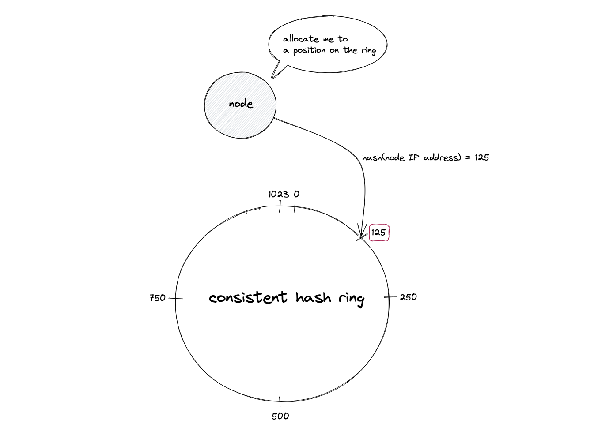

# **Полный сценарий: Dynamic Sharding стратегии (15 минут)**

# Интро (30–40 секунд)

Представьте, что у вас маркетплейс.
Всё красиво: микросервисы, шарды, базы, кеши.
Сервис растёт, бизнес радуется, графики вверх.

Пока однажды не появляется пользователь с `userId = 123`, который почему-то генерирует **30% всего трафика**.
И параллельно бизнес говорит: “давайте добавим ещё пару шардов, а то текущие уже захлёбываются”.

В этот момент выясняется неприятное:

1. “Один раз порезали по шардам и забыли” — это не стратегия, а временная фотография. Данные и нагрузка всё время меняются.
2. Наивная схема `hash(userId) % N` работает **ровно пока N не меняется**.
   Как только нужно добавить/убрать шарды или переразмазать нагрузку — начинается боль: почти все ключи “переезжают”, кеши протухают, база ловит шторм.

В предыдущей части мы разобрались:

* что такое партиционирование и шардирование;
* как выглядят RANGE/LIST/HASH-партиции;
* как можно шардингом разносить данные по разным кластерам и регионам.

Теперь следующий уровень:
**не просто “как один раз порезать”, а как жить, когда шарды нужно постоянно двигать и перевешивать по мере роста и перекоса нагрузки.**

То есть: **динамическое шардирование.**

---

# Часть 1: Что такое Dynamic Sharding (1 минута)

Помним нашу “красивую” схему:

* взяли `user_id`;
* сделали `hash(user_id) % N`;
* разложили пользователей по шардам;
* выдохнули: “ну всё, зашардировали”.

Проходит время — и реальность подвозит сюрпризы:

* сервис растёт, появляются **перекосы нагрузки (skew)**;
* всплывают **горячие ключи** — один клиент/видео/продавец жрёт целый шард;
* бизнес лезет в новые страны → нужны новые шарды, регионы, кластера;
* железо меняем, старые ноды выкидываем → старое распределение перестаёт совпадать с физикой.

И вот в этот момент становится ясно:

> “Один раз порезали и забыли” — не работает.
> Раскладку данных нужно **постоянно подстраивать под жизнь**.

Под **Dynamic sharding** здесь будем понимать не конкретный алгоритм, а свойство системы:

* уметь **добавлять** новые шарды в рантайме;
* **перекладывать** диапазоны и tenants между шардами;
* **делить** перегретые куски;
* **изолировать** горячие ключи;
* и делать всё это **без остановки сервиса и без тотального шторма по базе и кешам**.

Важно: в этой главе мы говорим только про **стратегии деления и маршрутизации**:

* как выбирать shard key;
* как решать, какой ключ куда пойдёт;
* какие схемы позволяют менять layout без тотального переезда всех данных.

А вот как физически переносить данные, как делать rebalancing без даунтайма и потерь — это уже тема отдельной главы.

---

# Часть 3: Стратегии динамического шардирования (8–10 минут)

Теперь — самое вкусное.

Это реальные подходы, которые вы встретите:

* в кластерах Redis / Kafka;
* в распределённых БД уровня Cassandra / MongoDB;
* во внутренних key-value стораджах больших компаний.

Важно: это не взаимоисключающие схемы, а кирпичики.
На практике системы типа Cassandra / Dynamo / Cockroach комбинируют:
* hash / consistent hash,
* directory / бакеты,
* range-splitting,
* и точечные override’ы для hot keys.

Дальше разберём четыре базовые стратегии и для каждой поговорим не только “как это устроено”, но и “зачем это вам на работе”.


---

# Стратегия 1: Consistent Hashing + виртуальные ноды (2–3 минуты)

По типу это **HASH-шардирование** на уровне роутинга.

Наивный вариант, который все сначала делают:

```text
shard = hash(user_id) % N
```

* `hash()` — любая более-менее ровная хеш-функция;
* `N` — количество шардов.

Пока `N` фиксировано — жить можно.

Но как только:

* добавили новый шард,
* или убрали старый,

**меняется `N` → меняется остаток → почти все ключи “переезжают”**:

* кеш  — мимо, прогрев с нуля;
* база — ловит лавину миграций;
* сеть — забита перекладкой данных.

Это не динамическое шардирование, а минное поле.

Где это живёт в проде:

* тот же подход лежит под Redis Cluster и распределением Kafka partitions.

Зачем вам:
если вы шардите Redis/кеш для high-load сервиса или пилите свой Kafka‑подобный кусок (очереди, стриминг‑сервис),
consistent hashing — базовый кирпич, чтобы при добавлении/удалении ноды не перекладывать весь мир и не прогревать кеш с нуля.

---

## Consistent Hashing: меньше перескока при изменении кластера

Идея: вместо “остатка от деления” работаем с **кольцом hash-пространства**.

1. Представляем диапазон хеша как круг `0 … 2^32-1`.
2. Для каждого шарда считаем `hash(shard_id)` и ставим его на кольцо.
3. Для каждого ключа считаем `hash(key)` и идём по часовой стрелке до ближайшего шарда.

На слайде здесь — **картинка**: круг, по нему несколько точек (шарды), и стрелка от `hash(key)` до ближайшего по часовой.





Что это даёт:

* при добавлении нового шарда он появляется в нескольких точках кольца;
* **только ключи, чей hash попал “между соседями” нового узла, переедут на него**;
* остальные продолжат ходить на старые шарды.

Если было 3 шарда и мы добавили 4-й,
в среднем переедет примерно `1 / (3+1) ≈ 25%` ключей, а не почти все.

Это всё тот же **HASH-подход**, просто не “mod N”, а “по позиции на кольце”.

---

## Виртуальные ноды: зачем они вообще

Возникает закономерный вопрос:

> “Я добавлю новый физический шард — мне всё равно столько же ключей переливать, нет?”

По порядку.

### Проблема без виртуальных нод

Если на кольце всего 3–4 узла:

* их позиции по `hash(shard_id)` могут лечь криво — один шард “накроет” большую дугу, другой — маленькую;
* при добавлении нового шарда он может откусить большой кусок только у одного соседа;
* получаем перекос по данным и нагрузке, хотя в теории “должно быть ровно”.

### Что делают виртуальные ноды

Мы не ставим на кольцо “одну точку = один физический шард”.
Вместо этого:

* каждый физический шард представляем десятком–сотней **виртуальных нод**;
* для каждой виртуальной ноды считаем `hash(shard_id + "#" + replica_index)` и размещаем её на кольце;
* **физический шард = множество точек на кольце**.

Что это даёт:

1. **Более ровное распределение**

   Вместо того, чтобы одна дуга кольца принадлежала целиком одному шарду,
   кольцо подрезано на мелкие отрезки — виртуальные ноды перемешаны.

   В среднем:

    * каждый шард получает примерно одинаковую долю ключей;
    * дисбаланс между шардами падает.

2. **Гибкость при добавлении нового физического шарда**

   Когда добавляем новый шард:

    * создаём для него тоже пачку виртуальных нод;
    * раскидываем их по кольцу;
    * **часть мелких интервалов** откусывается у разных существующих шардов.

   В итоге:

    * тот же самый “в среднем ~1/(N+1) ключей переезжает”,
    * но переезд **размазан** по всем шардам, а не вырван у одного толстым куском;
    * можно играть количеством виртуальных нод, чтобы учесть разную мощность серверов.

3. **Weighted sharding**

   Хотим, чтобы новый шард был полегче (hardware слабее) — даём ему меньше виртуальных нод.
   Хотим более мощный шард — даём ему больше виртуальных нод.

То есть да:

* **доля переезжающих ключей при добавлении новой машины всегда примерно `1/(N+1)`** — от этого никуда не деться;
* но виртуальные ноды делают:

    * распределение **ровным**,
    * rebalancing — **контролируемым и равномерным** по всем шартам,
    * а не “один шард внезапно страдает за всех”.

---

## Пример роутинга “на пальцах”

Пусть у нас 3 физ. шарда: `A`, `B`, `C`.
Каждый представлен 4 виртуальными нодами на кольце.

1. Ключ `user_id = 42`:

    * считаем `h = hash("42")`;
    * на кольце идём по часовой до ближайшей виртуальной ноды, допустим `A#3`;
    * роутим на физический шард `A`.

2. Добавили новый шард `D` (тоже с 4 виртуальными нодами):

    * на кольце появились новые точки `D#0..3`;
    * только ключи, чьи хеши попали в интервалы, захваченные `D#*`, переедут на `D`;
    * остальная масса продолжит ходить в `A/B/C`.

На слайдах можно показать две картинки кольца: “до” и “после” добавления `D`, и подчеркнуть, что **большинство ключей остались привязаны к тем же шартам**.

---

## Что с hash-функциями (особенно для UUID)

Требование к hash-функции тут простое:

* **равномерное распределение** по кольцу;
* **стабильность** (один и тот же ключ → один и тот же hash).

Типичные варианты:

* для строк/UUID:

    * MurmurHash, xxHash, SipHash — быстрые и достаточно ровные;
* для числовых id (int/bigint):

    * можно хешировать как есть (`hash(id)`), не надо брать `id % N` напрямую;
    * “просто id” иногда нормально, но хуже при последовательном выделении и короткой шкале.

Главный анти-паттерн:

* “берём первые 8 байт UUID и считаем, что это нормально” —
  разные реализации UUID могут давать коррелированные отрезки, лучше прогонять через нормальную hash-функцию.

---

## Ограничения стратегии

Важно зафиксировать честно:

* **Consistent hashing — это про уменьшение массовых миграций**, когда меняется состав кластера.
* Он:

    * не убирает **hot keys** — один горячий ключ всё равно ляжет на один сегмент кольца;
    * не решает сам по себе **skew** по бизнес-ключам (например, один жирный `tenant_id`);
    * не делает кросс-шардовые запросы “магически локальными”.

То есть это хороший базовый слой для **HASH-шардирования в динамичном кластере**,
но бороться с hot keys, skew и сложными запросами всё равно придётся отдельными техниками.

---

### Каскадные отказы между шардами

Отдельная беда шардированных систем — каскадные падения.

Сценка:

* один шард начал деградировать (диск, GC, сеть);
* routing-слой пометил его как unhealthy и начал перенаправлять запросы на остальные;
* соседние шарды не рассчитаны на такой объём, их latency растёт;
* клиенты/ретраи начинают долбить их ещё сильнее.

В результате вместо “минус один шард” получаем:
**минус весь кластер.**

Чтобы этого не ловить, одних стратегий шардирования мало. Нужны:

* **rate limiting** и **backpressure** — ограничивать входной поток на каждый шард;
* **circuit breaker’ы** — не пытаться бесконечно бить в деградировавшие узлы;
* аккуратные правила ретраев (без “всё ретраим на все шарды подряд”).

___

###  Вариант: Rendezvous (HRW) hashing

Есть ещё один популярный подход — **rendezvous hashing** (HRW).

Идея:

* для каждого ключа считаем “оценку” для КАЖДОГО узла, например `score = hash(key + node_id)`;
* выбираем узел с **максимальным score**;
* при добавлении/удалении ноды меняется только часть выборов.

Плюсы:

* нет кольца и виртуальных нод, реализация проще;
* как и consistent hash, минимизирует количество ключей, которые “перескакивают” при изменении набора нод.

Минусы:

* как и кольцо, **не решает проблему hot keys и каскадных отказов** —
  это всё равно лечится rate limiting’ом, microsharding’ом и hot-key isolation.

___

# Стратегия 2: Directory-Based Sharding (2–3 минуты)

По типу это всё ещё **горизонтальное шардирование**,  
но вместо жёсткой формулы (`hash % N`) у нас появляется **слой перенаправления по таблице**.

Суть:

> Не вычислять шард напрямую из ключа,  
> а сначала спросить: “а где вообще сейчас лежит этот диапазон/tenant/бакет?”

---

## Как это выглядит

Простейший, “учебный” вариант:

```text
0–1M userId   → shard1
1M–2M userId  → shard2
2M–3M userId  → shard3
...
````

Это уже directory-подход:
у тебя есть явная карта “диапазон → шард”.

Где она может жить:

* таблица `shard_map` в базе;
* конфиг в key-value хранилище;
* отдельный metadata-сервис.

С точки зрения приложения:

1. по ключу (`user_id`, `tenant_id`, `region`) сначала обращаемся к shard-map: “куда идти?”;
2. получаем “логический шард” или конкретный кластер;
3. уже туда шлём запрос.

Мы это уже видели в ликбезе (раздел с `shard_map` по `region`).
Здесь та же идея, но **возведённая в принцип для динамики**.

---

## Как делают в реальных системах

В жизни почти никто не пишет “0–1M → shard1” в лоб.
Чаще вводят **ещё один уровень косвенности**:

1. Ключ (`user_id`) хешируем в **бакет**:

   ```text
   bucket = H(user_id) % 4096
   ```

2. В shard-map храним **bucket → физический шард**:

   ```text
   bucket 0–127     → shard1
   bucket 128–511   → shard2
   bucket 512–1023  → shard3
   ...
   ```

3. При росте/ребалансинге:

    * докидываем новые шарды,
    * перекидываем **часть бакетов** между ними,
    * а формула `bucket = H(key) % 4096` при этом не меняется.

Эту идею в разных вариациях используют:

* Citus и похожие Postgres-кластеры;
* внутренние multi-tenant стораджи в крупных компаниях.

Если вы шардите Postgres/БД маркетплейса по продавцам или регионам,
directory-based подход — это способ перекидывать клиентов и диапазоны между нодами,
не переписывая приложение и не завязываясь навсегда на одну формулу `hash(key) % N`.

Почти любой “нормальный” распределённый storage опирается на какой-то directory / метаданные, а не на голый `hash % N`.

> Если бакетов много (сотни/тысячи), и вы постоянно перекидываете их между нодами, чтобы лечить перекосы по tenant’ам и SLO —  
> это по сути и есть **microsharding**. В больших системах (Twitter Manhattan, Uber) это отдельная архитектурная единица.

---

## Плюсы directory-подхода

* **Гибкость при росте**:

    * можно делить диапазоны/бакеты;
    * можно перекидывать их между узлами;
    * можно мигрировать конкретных клиентов/tenant’ов.

* **Можно сменить схему шардирования без переписывания всего мира**:

    * сначала резали по `user_id`, потом решили учитывать `region` —
      меняем логику заполнения shard-map, а не весь прод.

* **Удобно делать “ручные” операции**:

    * “этого клиента срочно перевезти на отдельный кластер”;
    * “этот горячий диапазон временно живёт на более жирной ноде”.

По сути: **любой rebalancing** превращается в два шага:

1. меняем shard-map (кто за что отвечает);
2. физически переносим данные (по плану, throttled, без DDoS на систему).

---

## Минусы

* Нужен **быстрый и надёжный metadata-слой**:

    * shard-map должен быть в памяти маршрутизатора/приложения;
    * должна быть репликация/HA, иначе это новый SPOF.

* Routing-слой толстеет:

    * появляется ещё одна сущность (directory/метаданные),
    * отдельные задачи по его мониторингу, deploy’ю и миграциям.

Но это плата за то, что ты перестаёшь быть рабом формулы `hash(key) % N`
и получаешь **управляемую эволюцию схемы шардирования**, а не вечный “дропни кластер и молись”.

___

# Стратегия 3: Dynamic Range Splitting (1.5 минуты)

Используют: MongoDB sharded clusters, HBase regions.

Если у вас монотонный ключ (автоинкремент, timestamp) и “хвост” этой шкалы перегревает один шард,
dynamic range splitting позволяет автоматически резать горячий диапазон на части и разносить их по нодам,
не переписывая схему ключей и не устраивая ручной “шахматный турнир” по переносу пользователей.

Core идея:

> Делаем шардинг по диапазонам ключей,  
> а сами диапазоны (range/region) умеем **динамически дробить и переносить между нодами**.

Пример:

Было (один крупный range на одной ноде):

[0..10M] → Node1

Стало (после split + rebalance):

[0..5M]   → Node1
[5M..10M] → Node2

Дальше система продолжает следить за каждым range:

* если range стал слишком большим или горячим — режем ещё;
* новый кусок вешаем на свободную или менее загруженную ноду;
* метаданные маршрутизации (directory) обновляем.

В конце концов на каждой ноде лежит **несколько диапазонов**,
а layout постоянно подстраивается под живую нагрузку.

### Плюсы

* подходит для монотонных ключей (автоинкремент, timestamp);
* шарды остаются примерно одинакового размера;
* можно *автоматизировать* разбиение.

### Минусы

* нужна инфраструктура для переноса данных;
* может появиться очень много маленьких диапазонов;
* нужен компонент, который управляет layout’ом диапазонов.

Почти всегда это комбинируется с directory-based подходом:

* meta-service знает, какие диапазоны где лежат;
* range-splitting — всего лишь одна из операций над этим layout’ом.

# Стратегия 4: Hot-Key Isolation (1.5 минуты)

Используют: DynamoDB Adaptive Capacity, крупные CDN/кеши.

Зачем вам:
если один tenant или ключ (“самый жирный продавец маркетплейса”, “одна суперпопулярная акция”)
кладёт на бок весь кластер, hot-key isolation позволяет вынести его на отдельные ресурсы
и повесить отдельные лимиты, не перекраивая схему шардирования для остальных.

Если проблема не в общем layout’е, а в **паре очень горячих ключей**,
нет смысла перекраивать всё шардирование.

Идея:

> Сначала работаем по обычной схеме (hash / directory / range),  
> но для нескольких hot keys делаем явные “override’ы” маршрутизации.

Схематично:

```text
обычный путь:
  key → (hash / range) → shard

с hot-key isolation:
  if key in HOT_MAP:
      → hot_shard_for(key)
  else:
      → (hash / range) → shard
```

Пример:

```text
KEY123 → отдельный hot-shard
KEY777 → отдельный hot-shard
всё остальное → как жило, так и живёт
```

Реализация почти всегда **directory-based**:

* есть базовая схема (hash / бакеты / ring);
* есть дополнительная карта `HOT_MAP`, которая для конкретных ключей/tenant’ов
  переопределяет маршрут.

Что можем делать с hot keys:

* вынести ключи / tenant’ов на отдельный инстанс или кластер;
* дать им отдельный пул ресурсов (CPU, коннекты, кеш);
* повесить более жёсткие лимиты / защиту.

### Плюсы

* быстро снимает перегрузку с горячих ключей;
* не требует глобального rebalancing’а всех данных;
* хорошо работает вместе с microsharding’ом и directory-подходом.

### Минусы

* архитектура становится “кусочной”:

    * для нескольких ключей действует особая логика;
* нужны хорошие метрики и алерты:

    * чтобы вовремя находить hot keys;
    * чтобы не начать тащить в HOT_MAP всех подряд “на всякий случай”.

В маленьких системах это часто выглядит как временный костыль:
“вынесли одного монстра на отдельный сервер”.

В больших — это **осознанный паттерн поверх базовой схемы шардирования**:
обычное правило для всех, и несколько специальных правил для тех, кто умеет прожечь кластер в одиночку.

---

# Часть 5: Главный вывод (1 минута)

Шардирование — это не “одна магическая формула”.

**Dynamic sharding** — это комбинация решений:

* как мы режем данные (range/hash/directory/microshards);
* где живёт routing (клиент, proxy, coordinator, metadata service);
* как мы боремся со skew и hot keys;
* как мы добавляем и удаляем шарды, не убивая прод.

При этом:

* наивное `hash(key) % N` живёт ровно до **первого изменения N**;
* consistent hashing спасает от полного переразбрасывания, но не от hot keys;
* directory-based и microsharding дают гибкость, но требуют умного metadata слоя;
* hot-key isolation — последний рубеж обороны, когда пару ключей нужно “посадить отдельно”.

> “И да, вы почти наверняка будете менять схему шардирования несколько раз по мере роста.  
> Поэтому лучше сразу выбирать такие подходы, которые допускают эволюцию, а не “одна формула на века”.”


И это ещё не всё.

Пока мы говорили только о том, **как делить и переразмазывать данные**.
Но остаются два самых неприятных вопроса:

- Как жить, когда бизнес-операция затрагивает несколько шардов:
- как переносить данные между шардами;
  * **без остановки сервиса**;
  * **без потерь данных**;
  * **без “двойных” или пропущенных записей**.

Это тема отдельной главы — про миграции и rebalancing.
