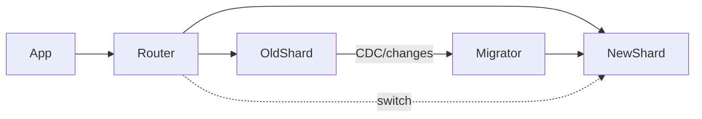

# Rebalancing и миграции без downtime — сценарий

## 1. Вступление (1 минута)

Мы уже частично затронули проблему перемещения данных между шардами в главе о динамическом шардировании, теперь поговорим об этом подробнее

---

## 2. Зачем нужен rebalancing (1 минута)

По сути, rebalancing — это ответ на один простой вопрос:

> “Как сделать так, чтобы **распределение данных и нагрузки** снова стало здоровым?”

Основные причины:

1. **Неравномерный рост данных**
   Один шард распух до терабайта, остальные по 100 ГБ.

2. **Горячие пользователи / категории / сущности**
   Один шард получает 80–90% RPS.

3. **Добавление новых шардов (upscaling)**
   Ноды добавили → данные как-то надо перекинуть на них.

4. **Удаление шардов (downscaling)**
   Убрали лишнее железо → данные надо слить обратно.

5. **Изменение shard key**
   Самое неприятное — когда бизнес понял, что резать по `user_id` было ошибкой, а жить надо по `tenant_id` или `region`.

Важно проговорить:

> Миграция — это не “переложить данные”.
> Миграция — это “переключить сервис на **новую карту мира** так, чтобы пользователи не заметили”.

И всё это происходит **в продакшене**, под нагрузкой, с пользователями, которые вообще не в курсе, что вы там перелопачиваете.

---

## 3. Виды миграций (2 минуты)

Чтобы не путаться в словах, введём базовую типологию.

1. **Resharding внутри того же кластера**
   Распределяем ключи по-новому между теми же нодами:
   например, дробим диапазон `[0..1М]` на два: `[0..500k]` и `[500k..1М]`.

2. **Upscaling**
   Было 4 шарда, стало 8.
   Нужно часть ключей “снять” со старых и положить на новые.

3. **Downscaling**
   Было 16 шардов, хотим 8.
   Данные с “лишних” шардов надо аккуратно слить на остальные.

4. **Online relocation**
   Точечно переносим отдельные диапазоны / tenant’ов / регионов:
   например, “всех EU-клиентов вывезти из US-кластера в EU-кластер”.

5. **Shard key migration**
   Самый тяжёлый случай: меняем саму идею шардирования.
   Пример: было `hash(user_id)`, стало `tenant_id` → дальнейший rebalancing уже живёт в другой модели.

Эта типология нужна, чтобы дальше понимать:
какой из подходов вообще уместен для какой задачи.

---

## 4. Боль статического шардирования (1 минута)

Классика:

```text
shard = customer_id % 8
```

Так и рождается “вечная” схема:

* “нам достаточно восьми шардов, мы посчитали на салфетке”;
* “писать быстро, тянуть долго”.

Проблемы у такой схемы предсказуемы:

* удвоить количество шардов без тотального перетаскивания **нельзя**;
* расширить диапазон / поменять функцию **нельзя**;
* hot key кладёт один шард → и всё, приехали;
* любой rebalancing превращается в “переписать половину системы”.

Коротко:

> Статическое шардирование по `id % N` — это татуировка на архитектуре.
> Сделать просто, жить потом больно.

---

## 5. Основные проблемы при миграции (3 минуты)

Прежде чем обсуждать техники, честно перечислим, что **обязательно сломается**, если не подумать.

1. **Неконсистентность во время переноса**

   Если просто “копировать строки”:

    * часть данных может оказаться только на старом;
    * часть — только на новом;
    * что-то задублируется.

2. **In-flight writes**

   Пока вы копируете 500 ГБ, в базу продолжают прилетать новые записи:

    * кто-то обновляет профиль;
    * кто-то создаёт заказ;
    * кто-то меняет статус.

   Если эти изменения не учесть — новый шард при переключении будет отставать.

3. **Гонки (race conditions)**

   Одна часть кода читает из старого, другая — уже из нового.
   Клиент делает два запроса подряд — и вдруг видит разные данные.

4. **Atomic cutover**

   Момент “теперь правда читаем и пишем в новый шард” должен быть:

    * быстрым,
    * атомарным в пределах системы,
    * откатываемым.

5. **Нагрузка на сеть и базу**

   Прямолинейный backfill типа:

   ```sql
   INSERT INTO new_shard.table
   SELECT * FROM old_shard.table;
   ```

   под нагрузкой легко кладёт:

    * старый шард (I/O, CPU),
    * новый шард,
    * сеть.

6. **Кеши**

   L1/L2-кеш могут продолжить держать старые данные:

    * старые shard map’ы;
    * старые значения по ключам;
    * стейт в приложении.

   В итоге часть запросов идёт уже по новой схеме, часть — по старой.

Если эти вещи не учесть — любая сложная миграция гарантированно превращается в “ночной кошмар с откатом”.

---

## 6. Общая структура online-миграции (1–2 минуты)

Почти все взрослые схемы rebalancing’а раскладываются на три шага:

1. **Перенос bulk-данных (backfill)**
   Перекачиваем основной объём из старого layout’а в новый.

2. **Синхронизация изменений (CDC / журнал изменений)**
   Пока идёт backfill, фиксируем все новые изменения и доносим их до нового шарда.

3. **Переключение маршрутизации (cutover)**
   Переводим чтение/запись на новый layout, минимизируя окно гонок.

Можно показать упрощённую картинку:



Дальше всё, что мы будем обсуждать — вариации на тему этих трёх шагов.

---

## 7. Подход 1: Dual Write (двойная запись) (2 минуты)

Первое, что приходит в голову:

> “Давайте просто будем писать и туда, и туда, а потом аккуратно выключим старое”.

Алгоритм:

1. При каждом изменении пишем **одновременно** в старый и в новый шард.
2. Чтения какое-то время идут всё ещё из старого.
3. Когда уверены, что новый шард догнал — переворачиваем чтения на новый.
4. Старый шард либо выключаем, либо оставляем как бэкап и затем чистим.

Звучит просто. На практике:

* расхождение во времени:

    * запись в старый прошла, в новый отвалилась → данные расходятся;
* двойные инкременты / side-effects:

    * если апдейты не идемпотентные — легко сделать “+2” вместо “+1”;
* падение одной из сторон:

    * старый шард жив, новый нет / наоборот — консистентности нет.

Итог:

> Dual write — это прихватка скотчем.
> Иногда сгодится, но как базовое решение для серьёзной миграции — так себе идея.

Можно оставить его как “паттерн, который вы точно увидите в кодовой базе”,
но честно пометить, что жить на нём долго опасно.

---

## 8. Подход 2: “Write to new, read from old” + мигратор (3 минуты)

Более адекватный компромисс.

Идея:

1. **Все новые записи сразу направляем в новый шард.**
2. Чтения пока выполняем **из старого** (чтобы пользователи видели старую “истину”).
3. Фоновый мигратор постепенно переносит данные из старого в новый:

    * либо по диапазонам (`id` / `created_at`);
    * либо по tenant’ам / shard key.
4. Когда новый шард догнал старый — переключаем чтения на него.

Плюсы:

* нет двойной записи в обоих направлениях;
* все “новые” данные гарантированно есть в новом шарде;
* rollback понятен: если что-то пошло не так, возвращаем reading на старый и докатываем миграцию.

Минусы:

* нужно аккуратно чистить мусор/расхождения;
* сложнее, чем dual write, по реализации.

В коде это обычно выглядит так:

```php
// запись — только в новый layout
$newShard->upsert($entity);

// чтение — пока из старого, до момента переключения
$entity = $oldShard->find($id);
```

А рядом крутится воркер:

```php
while ($chunk = $oldShard->fetchChunkForMigration()) {
    foreach ($chunk as $row) {
        $newShard->upsert($row);
    }
}
```

После того как мигратор догнал, переключаем чтения в роутере/фичефлагом.

---

## 9. Подход 3: “Routing First” (2 минуты)

Ещё одна популярная стратегия, особенно там, где уже есть нормальный routing-layer.

Идея:

1. Сначала меняем **shard-map / routing**:

    * новые запросы по ключу начинают идти в новый шард;
2. Старый шард некоторое время продолжает держать “хвост”:

    * холодные данные,
    * остатки старых ключей;
3. Фоновый процесс “выгрызает” холодные данные из старого шарда и переносит их в новый;
4. В какой-то момент старый шард становится пустым/архивным → его можно выключить или использовать как бэкап.

Плюсы:

* минимальный downtime по сути отсутствует — мы меняем карту и живём дальше;
* нет двойной записи;
* **горячие ключи переезжают сразу**, потому что роутер их с этого момента шлёт в новый layout.

Минусы:

* сложнее reasoning в переходный период:

    * часть данных может жить только в старом;
    * нужно предусматривать fallback-набор: “если на новом не нашли — попробуй на старом”.

Этот подход хорошо ложится на системы, где у тебя уже есть:

* централизованный router/coordinator;
* shard-map в базе/конфиге/ключ-значение хранилище.

---

## 10. Подход 4: CDC + Backfill (3–4 минуты)

Самый взрослый и надёжный, если у тебя много данных и серьёзные требования к консистентности.

Алгоритм:

1. **Backfill (snapshot)**
   Берём большой “снимок” данных:

    * читаем старый шард по чанкам;
    * заливаем всё в новый layout;
    * при этом согласовываем нагрузку, чтобы не убить базу.

2. **CDC (Change Data Capture)**
   Параллельно включаем слежение за изменениями:

    * из журнала транзакций / Debezium / logical replication;
    * каждое изменение (`INSERT/UPDATE/DELETE`) превращается в событие.

3. **Migrator**
   Отдельный воркер читает эти события и **повторяет** изменения на новом шарде:

    * гарантированная доставка;
    * корректный порядок для каждого ключа (по offset/LSN).

4. **Дожидаемся, пока лаг станет ≈ 0**
   То есть все изменения со старого уже догнаны в новый.

5. **Переключаем чтения и записи**
   Роутер/фичефлаг переводит трафик на новый layout.

6. Старый шард превращается в архив / временный бэкап, позже чистится.

Плюсы:

* отлично работает на больших объёмах;
* чёткая модель консистентности;
* нет потерь данных при in-flight writes.

Минусы:

* инфраструктурно сложнее:

    * нужен брокер (Kafka/Pulsar) или логическая репликация;
    * нужен надёжный мигратор;
    * нужно мониторить лаг/отставание.

Это, по сути, общий паттерн, который используют Uber, Pinterest, Shopify и прочие ребята с “миграциями на миллиарды записей”.

---

## 11. Подход 5: Live Traffic Replay (2 минуты)

Hardcore-вариант для тех, у кого:

* трафик огромный,
* много вариантов запросов,
* и хочется “натренировать” новый шард на реальном трафике.

Идея:

1. Перехватываем весь входящий трафик (логирование запросов, HTTP-mirror, TCP-tap).
2. Реплеим его на новый шард **параллельно** со старым:

    * старый шард отвечает пользователям;
    * новый — молча повторяет те же операции.
3. Сравниваем состояние / метрики / ответы (где возможно).
4. Когда уверены, что новый ведёт себя так же, как старый, плюс догнали состояние — переключаем трафик.

Это используется там, где:

* есть сложная бизнес-логика поверх данных;
* нужно не только перенести данные, но и проверить, что новый layout/код ведёт себя корректно.

Для большинства систем это “из пушки по воробьям”, но полезно хотя бы знать, что такой паттерн существует.

---

## 12. Atomic cutover (3 минуты)

Как бы красиво мы ни переносили данные, всегда останется один ключевой момент:

> “С какой секунды мы считаем новым источником правды **новый layout**?”

Этот момент должен быть:

* коротким;
* контролируемым;
* откатываемым.

Приёмы:

1. **Feature flag**

    * В коде есть переключатель `useNewShardLayout`.
    * Пока он `false` — все чтения/записи идут по старой схеме.
    * Переключаем флаг — и весь трафик идёт по новой карте.

2. **Поколения (generation / epoch)**

    * У shard-map’а есть версия: `generation = 17`.
    * Клиент/роутер помечает запросы `X-Shard-Generation: 17`.
    * Когда переключаем layout на `generation = 18`,
      старый layout продолжает жить какое-то время, но новые запросы уже идут по 18-й версии.
    * Это помогает избежать гонок между разными экземплярами приложения.

3. **Короткий freeze писателей**

    * На очень маленькое окно (десятки миллисекунд) можно остановить запись:

        * через блокировку в БД;
        * через флаг в роутере.
    * За это время меняем shard-map / переключаем координатор.
    * Пользователь на таком окне обычно ничего не замечает, если это <100ms.

4. **Write fencing**

    * Запись проходит только если версия совпадает:

      ```sql
      UPDATE users
      SET ...
      WHERE id = :id AND generation = 18;
      ```

    * Всё, что прилетело “не в ту эпоху” — либо отклоняется, либо переповторяется.

Общая идея:

> Cutover — это не “нажать одну волшебную кнопку”,
> а аккуратно продуманный переход с возможностью быстро откатиться назад.

---

## 13. In-flight writes (1 минута)

Отдельно проговорим проблему:

* пока идёт миграция, система не стоит на паузе;
* новые записи и апдейты продолжают прилетать.

Если их не учитывать, получаем:

* “дырки” в новых шардах;
* дубли;
* странные расхождения, которые вылезут через неделю в отчётах.

Техники, которые помогают:

* **идемпотентные операции**:

    * чтобы повторное применение “того же” события не ломало данные;
* **write fencing / generation checks**:

    * писать только в правильный layout;
* **drain очередей**:

    * перед финальным cutover вычищаем очереди задач/сообщений;
* **короткие freeze-окна для критичных операций**:

    * лучше 50ms легкого фриза, чем вечный бардак в состояниях.

---

## 14. Post-migration cleanup (1 минута)

После успешного cutover работа не заканчивается.

Нужно:

* почистить старые данные:

    * либо сразу дропнуть старый шард,
    * либо повесить на него TTL / GC-воркеры;
* выбросить старые shard-map’ы и конфиги,
  чтобы к ним не откатывались случайно;
* убедиться, что кеши не держат старые маршруты и значения;
* собрать метрики до/после:

    * latency,
    * error rate,
    * нагрузка на новые шарды.

И очень желательно:

* оставить фонового уборщика “мусора” на время:

    * данные с устаревшими generation’ами;
    * странные хвосты, которые могли появиться на границах.

---

## 15. Анти-паттерны (1 минута)

Короткий список того, что почти всегда заканчивается плохо.

1. **Полная остановка сервиса “на время миграции”**

    * “Мы ночью всё выключим, покрутим SQL, утром включим”.
    * В реальном бизнесе — это час+ простоя, с неясным исходом.

2. **Один гигантский SQL-скрипт**

    * `ALTER TABLE`, `INSERT INTO ... SELECT ...` на сотни гигабайт одним махом.
    * Любая ошибка — и ты откатываешься не к “минус 5 секунд”, а к “минус ночь”.

3. **Клиент знает, на какой шард идти**

    * Шардирование зашито в клиентские приложения / мобильники.
    * Любой rebalancing теперь = обновить весь зоопарк клиентов.

4. **“Сначала вырубим старый шард, потом перенесём данные”**

    * В этот момент у тебя нет “источника правды”.
    * Любой косяк в переносе → данные ушли навсегда.

---

## 16. Итоги и мостик (1 минута)

Собираем всё в одну мысль:

* Шардирование без rebalancing — это бомба с таймером.
* Неизбежно наступит момент, когда layout надо будет менять:

    * из-за роста,
    * из-за ошибок в shard key,
    * из-за новых регионов и требований бизнеса.
* Важно не “надеяться, что обойдётся”,
  а заранее иметь понятную схему:

    * backfill,
    * CDC/журнал изменений,
    * аккуратный cutover,
    * и план уборки.

Мы упомянули проблему транзакций между шардами - сейчас разберем подробнее
