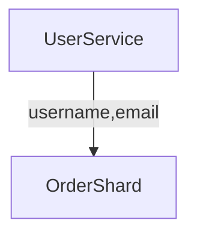
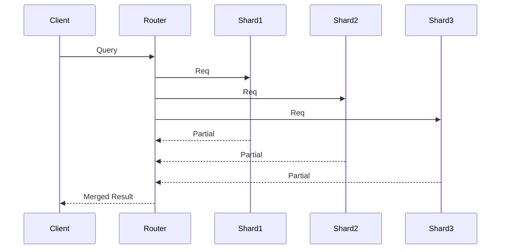

# 🎬 **СЦЕНАРИЙ: Cross-Shard операции и оптимизации**

## 🔗 ВСТУПЛЕНИЕ (1 минута)

“Мы научились шардировать данные и даже динамически перестраивать шарды так, чтобы система не ложилась при росте нагрузки.
Но у шардирования есть обратная сторона.

Когда мы разрезали данные по шардам (userId, tenantId, range), у нас появляется обратная сторона — бизнес-логика вообще не обязана жить по тем же границам

И тогда появляется штука, с которой сталкивается каждое большое приложение…

**Cross-shard операции.**
Самая неприятная часть шардирования.”

Это тот момент, где у инженеров обычно начинается лёгкая тоска, а у менеджеров — искреннее недоумение: “Почему нельзя просто сделать JOIN?”

---

# 🧨 1. ПОЧЕМУ CROSS-SHARD ОПЕРАЦИИ НЕИЗБЕЖНЫ (2 минуты)

“Шардирование ускоряет работу БД, но ломает привычные способы думать о данных.”

Приводим реальные кейсы:

### ✔ 1) Сущности оказываются на разных шардах

* пользователь покупает у продавца
* комментарий хранится в шардe поста, а профиль автора в другом
* чат между двумя людьми живёт на двух разных шардах

### ✔ 2) Запрос не содержит shard key

```
GET /orders?status=pending
```

Невозможно понять, где лежит ответ → приходится обходить все шарды.

### ✔ 3) Фильтр / поиск по атрибуту

Возраст, категория, цена, рейтинг — почти всегда cross-shard.

### ✔ 4) Глобальные агрегаты

Количество заказов за неделю, топ товаров, число активных пользователей.

### ✔ 5) Транзакции между шардами

Деньги списать с одного аккаунта и зачислить на другой → разные шарды.

### ✔ 6) Глобальная сортировка

“Покажи последние заказы”, “выведи последние сообщения”, “топ-10 рейтинга”.

После этой части у слушателя уже должно быть ощущение:

> “Ну да, логично. Тут не выкрутишься.”

---

# 🧩 2. КАТАЛОГ CROSS-SHARD ОПЕРАЦИЙ (2 минуты)

Это нужно для структурности:

* **Cross-shard JOIN**
* **Cross-shard Aggregation (SUM / COUNT / GROUP BY)**
* **Cross-shard Filtering / Search**
* **Cross-shard Transactions**
* **Cross-shard Ordering / Pagination**
* **Scatter-Gather Queries**

Это создаёт рамку, на которую мы нанизваем решения.

---

# 🛠 3. ПРАКТИЧЕСКИЕ СТРАТЕГИИ ОПТИМИЗАЦИИ (7–10 минут)

Самый важный блок.

---

# 🟦 3.1. Data Locality (правильный shard key)

Мини-блок, без повторов из предыдущей части.

“90% cross-shard операций — следствие того,
что шардирование было сделано не по тому ключу.”

Примеры:

* соцсеть → по userId
* SaaS → по tenantId
* маркетплейс → по sellerId
* мессенджер → по chatId

Пояснение:

Если корректно выбрать ключ, данные, связанные бизнесом, окажутся на одном шарде → JOIN не нужен → запросы локальны → latency минимальна.

Фраза:

> “Правильный choice of shard key — это лучшая оптимизация cross-shard.”

---

# 🟧 3.2. Денормализация — убить JOIN любой ценой (3 минуты)

“JOIN — это смерть в распределённых системах.
Потому что JOIN = сетевой вызов.”

Решение:

### Дублировать нужные данные.

* username в таблицу orders
* price в order_items
* sellerName в product_listing

Плюсы:

* локальные запросы
* скорость
* нет cross shard

Минусы:

* eventual consistency
* нужны события: UserUpdated, ProductUpdated

Диаграмма:



Эмоциональная реплика, чтобы закрепить мысль:

> “Нормализация — хорошо. Масштабируемость — лучше.”

---

# 🟩 3.3. Scatter-Gather (Fan-Out) (2 минуты)

“Иногда избежать cross-shard нельзя. Тогда используется fan-out.”

Алгоритм:

1. Запрос раскладывается на N шардов
2. Каждый шард считает частичный результат
3. Центральный узел мержит

Диаграмма:



Проблема:

> Один медленный шард делает весь запрос медленным.
> Tail latency растёт кратно количеству шардов.

Оптимизации:

* shard filtering
* caching
* early termination
* skip пустых шардов

---

# 🟨 3.4. Routing Index / Directory Sharding (2 минуты)

“Как не ходить по всем шардам?”

Идея:

> заведём отдельный индекс, где написано, на каком шарде что лежит.

Пример:

```
age=18-25 → shards [2,5,7]
premium=true → shard 3
```

Используется в:

* Cassandra
* Elastic
* Solr
* Pinterest User Graph

Эффект:

* уменьшается fan-out
* запросы становятся предсказуемыми
* tail latency падает

---

# 🟪 3.5. Cross-Shard Transactions → Saga / Outbox (3 минуты)

“ACID между шардами — это миф для большинства компаний.”

Почему 2PC невозможен:

* coordinator death
* global locks
* cluster-wide freeze
* огромный latency

Реальное решение:

### ✔ Saga Pattern

* каждый шаг имеет компенсирующий шаг
* транзакция становится workflow, а не атомарной операцией

### ✔ Orchestration / Choreography

* централизованно или event-driven

### ✔ Outbox + CDC

Гарантированная доставка событий.

Идея:

> Либо всё выполняем до конца,
> либо откатываемся компенсирующими действиями.

(компенсация всегда сложнее, чем кажется — подчёркиваем это)

---

# 🟥 3.6. Pre-Aggregation (MapReduce стиль) (2 минуты)

“Если глобальные агрегаты неизбежны — делай их заранее.”

Примеры:

* суммарные лайки
* просмотры
* общие продажи
* топ-100 товаров

Идея:

1. Каждый шард считает свой маленький агрегат
2. Центральный узел склеивает

Это масштабируемо, линейно и надёжно.

---

# 🟫 3.7. Кэширование cross-shard запросов (1–2 минуты)

Техники:

* кешировать partial результаты
* кешировать merge
* делать materialized views
* precomputed time buckets (“за 1 мин”, “за 1 час”)

Пример:

Топ-100 товаров в категории можно обновлять раз в минуту — и всем норм.

---

# 🚫 4. АНТИ-ПАТТЕРНЫ (1 минута)

Быстрый блок боли:

### ❌ JOIN через REST другого сервиса

Distributed N+1, адовая latency.

### ❌ Scatter-gather на все шарды

Универсальный способ убить tail latency.

### ❌ ACID между шардами

это Spanner-level инфраструктура, не наш случай.

### ❌ Клиент знает шард, куда идти

ломает динамическое шардирование и rebalancing.

---

# 🔥 5. HOT KEYS — отдельная категория боли (1 минута)

Объясняем:

* даже с хорошим шардированием hot keys могут убить один шард
* → это автоматически ломает любой cross-shard, зависящий от него

Техники решения:

* microsharding
* отдельный tier под горячие ключи
* caching
* token bucket / throttling

---

# 🚀 6. ЗАКРЫТИЕ И МОСТИК К СЛЕДУЮЩЕЙ ТЕМЕ (30 секунд)

Итоговые тезисы:

* cross-shard операции — не баг, а нормальная цена масштабируемости
* почти всегда это комбинация техник
* главное — минимизировать их количеством engineering-подходов
* когда cross-shard работает плохо → надо менять балансировку шардов

И финальная связка:

> “Но даже идеальные cross-shard операции развалятся,
> если один шард будет перегружен.
> Поэтому следующая тема — как переносить данные между шардов без downtime и без взрывов:
> **Rebalancing & Online Migrations**.”

---

Если хочешь — напишу такой же подробный сценарий для **Rebalancing**, или для **Strong Consistency**, или любой части System Design.
