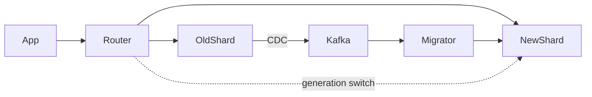
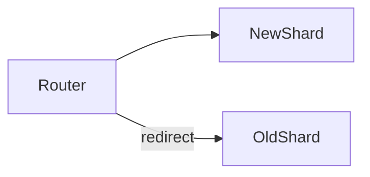
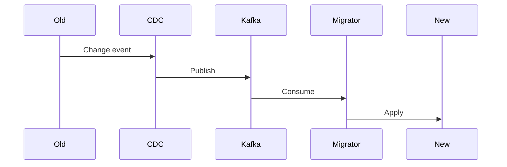

# 🎬 **СЦЕНАРИЙ: Rebalancing и Migration без downtime**

## 🧨 1. ВСТУПЛЕНИЕ (1 минута)

“Шардирование само по себе — несложная идея.
Сложность начинается тогда, когда данные **надо переставить**.”

И дальше бросок боли:

* один шард перегружен
* один шард разросся быстрее остальных
* один шард стал hot spot
* у shard key плохая кардинальность
* проект вырос, нужно добавить шардов
* или наоборот — нужно слить лишние

И всё это — **в продакшене**, под нагрузкой, без остановки сервиса.

Фраза для драматичности:

> “Шардирование — это как полет на вертолёте.
> Взлететь легко. А вот переставить лопасти во время полёта — это уже rebalancing.”

---

# 🧩 2. ЗАЧЕМ НУЖЕН REBALANCING (1 минута)

Коротко и по делу:

### ✔ 1) Неравномерный рост данных

Один шард может быть в 10 раз больше других.

### ✔ 2) Горячие пользователи/категории/сущности

Один шард — 90% всей нагрузки.

### ✔ 3) Добавление новых шардов

Нужно “распаковать” старые.

### ✔ 4) Перенос регионов/тенантов

Бизнес растёт → layout приходится менять.

### ✔ 5) Изменение shard key

Самая большая боль.

---

# 🧱 3. ВИДЫ МИГРАЦИЙ (2 минуты)

Коротко, чтобы зритель не потерялся:

### ⭐ Resharding

Перераспределить ключи между теми же нодами.

### ⭐ Upscaling

Добавили шард → нужно переложить часть данных.

### ⭐ Downscaling

Удалили шард → нужно слить его в другие.

### ⭐ Online relocation

Перенос отдельных диапазонов ключей.

### ⭐ Shard key migration

Самый сложный случай: меняем саму логику шардирования.

Тебе здесь важно зафиксировать мысль:

> “Миграция — это не ‘переложить данные’.
> Миграция — это ‘переключить сервис на новую карту мира’.”

---

# 🛑 4. БОЛЬ СТАТИЧЕСКОГО ШАРДИРОВАНИЯ (1 минута)

“customer_id % 8” — это не шардирование.
Это технический долг.

Проблемы:

* удвоить шардов нельзя
* расширить диапазон нельзя
* изменить функцию нельзя
* hot key убивает шард
* cross-shard операции растут
* добавление новых нод → полный апокалипсис

Короткая фраза:

> “Статическое шардирование — это как татуировка.
> Легко сделать, больно жить.”

---

# ⚠ 5. ПРОБЛЕМЫ, КОТОРЫЕ СЛЕДУЕТ РЕШАТЬ (3 минуты)

Объясняем инженерную подоплёку:

### ✔ 5.1. Неконсистентность во время переноса

Дубли, отсутствие данных, расхождение версий.

### ✔ 5.2. In-flight writes

Записи, которые прилетают в момент миграции.

### ✔ 5.3. Race conditions

Одни воркеры читают старый шард, другие — новый.

### ✔ 5.4. Atomic cutover

Переключение чтения и записи должно быть атомарным.

### ✔ 5.5. Нагрузка на сеть и базу

Backfill может положить весь кластер.

### ✔ 5.6. Кеши

L1/L2 кеш держат старые данные → начинаются жуткие stale.

Мы подогреваем зрителя:

> “Если не решить каждую из этих проблем — миграция превращается в катастрофу.”

---

# ⚙ 6. СТРУКТУРА СИСТЕМЫ ONLINE-МИГРАЦИИ (мостик перед реальными техниками)

Показываем общую картинку, которую будем раскрывать:



Три ключевых этапа:

1. **Перенос данных (backfill)**
2. **Синхронизация изменений (CDC)**
3. **Переключение маршрутизации (switch)**

Теперь баланс идеальный → продолжаем.

---

# 🟦 7. ПОДХОД 1: Dual Write (двойная запись) (2 минуты)

Простой вариант, который используют только новички, поэтому показываем и сразу критикуем.

Алгоритм:

1. Пишем сразу в старый и новый шард
2. Читаем пока из старого
3. Как только всё догнано → switched
4. Старый выключаем

Плюсы:

* просто начать
* просто объяснить менеджерам

Минусы:

* рассинхрон
* двойные инкременты
* разные тайминги достижений
* сложные гонки при отменах

Фраза:

> “Dual write — прихватка скотчем. Работает, но не стоит.”

---

# 🟩 8. ПОДХОД 2: “Write to new, Read from old” + Repair Worker (3 минуты)

Надёжнее, часто применяется:

Ход:

1. Пишем только в новый шард
2. Читаем пока из старого
3. Фоновый мигратор переносит записи
4. Когда новый догнал → переключаем чтение

Плюсы:

* проще добиться консистентности
* меньше гонок
* rollback простой

Минусы:

* трудно чистить мусор

Этот паттерн хорошо ложится на PHP + Symfony + RabbitMQ:

```php
// Consumer miggration worker
while ($msg = $queue->receive()) {
    $data = unserialize($msg->body);
    $newShard->upsert($data);
}
```

---

# 🟧 9. ПОДХОД 3: “Routing First” (2 минуты)

Используют LinkedIn, Twitter.

Идея:

1. Меняем shard map → клиент пишет в новый
2. Но данные ещё в старом
3. Фоновый процесс переносит холодные данные
4. Старый шард очищается

Плюсы:

* минимальный downtime
* нет двойной записи
* hot keys мигрируют сразу

Диаграмма:



---

# 🟥 10. ПОДХОД 4: CDC + Backfill (3–4 минуты)

Самый современный, самый надёжный.

Используют Uber, Pinterest, DoorDash, Shopify.

Ход:

1. Делаем snapshot (backfill) → грузим bulk данные в новый
2. CDC слушает изменения старого → Kafka → Migrator
3. Migrator применяет изменения в новый
4. Дожидаемся, пока lag = 0
5. Переключаем чтение и запись

Плюсы:

* идеально при больших объёмах
* нет гонок
* нет потерь данных

Минусы:

* сложнее в реализации
* нужен брокер (Kafka/Pulsar)

Диаграмма будет:



---

# 🟪 11. ПОДХОД 5: Live Traffic Replay (2 минуты)

Это hardcore.

Подходит для high-throughput сервисов.

Суть:

1. Перехватываем весь трафик
2. Реплеим его в новый шард
3. Когда новый = старый → переключаем

Используется Amazon DynamoDB, Spanner migrations.

---

# 🧬 12. Atomic Cutover (3 минуты)

Самая важная часть миграции.

### Техника 1: Feature Flag

Быстрый переключатель newShardEnabled=true.

### Техника 2: Routing Map Generation

Карта N → карта N+1.

### Техника 3: Epoch / Generation

Каждый запрос несёт “поколение”.

Если старое поколение:

```text
X-Generation: 7   → redirect на новый шард
```

### Техника 4: Pausing writers

Фриз писателей на 20–50ms.

Это нормально; пользователи не замечают.

### Техника 5: Write fencing

Пишем только если generation совпадает:

```sql
UPDATE users
SET ...
WHERE id = :id AND generation = 18;
```

---

# 🧨 13. In-Flight Writes (1 минута)

Объясняем:

* записи прилетают во время миграции
* надо их маршрутизировать безопасно

Решения:

* idempotency
* write fencing
* queue draining
* короткие freeze окна

---

# 🧹 14. Post-Migration Cleanup (1 минута)

Очистить:

* старые записи
* старые кеши
* устаревшие shard map
* orphaned data

Обязательно оставить:

* GC воркер
* TTL
* Version purge

---

# 🚫 15. АНТИ-ПАТТЕРНЫ (1 минута)

### ❌ Полная остановка сервиса

не вариант

### ❌ Один гигантский SQL скрипт

никогда не проходит

### ❌ Клиент знает shard layout

убивает возможность rebalancing

### ❌ “Сначала вырубим старый шард, потом перенесём данные”

тут даже комментировать не надо

---

# 🔥 16. ИТОГИ + ПЕРЕХОД К ДРУГОЙ ТЕМЕ (1 минута)

Финальная мысль:

> “Шардирование без rebalancing — просто бомба с таймером.
> Чтобы система была живой, шарды должны уметь двигаться.
> И двигаться онлайн.”

Мостик:

> “Теперь переходим к практическим примерам реальных компаний:
> как Uber, Amazon, LinkedIn, TikTok переносили данные,
> и почему большинство миграций в мире проваливается.”
