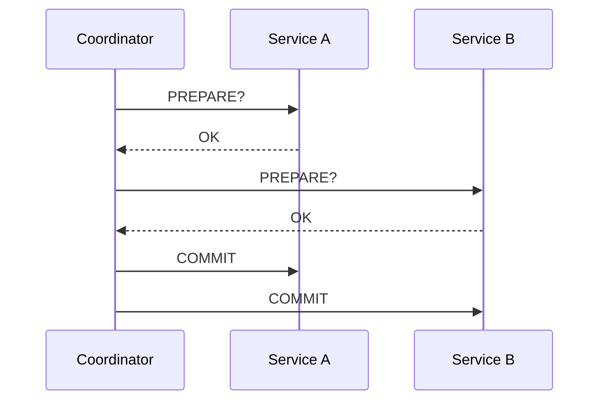

```mermaid
sequenceDiagram
    participant C as Coordinator
    participant A as Service A
    participant B as Service B

    C->>A: PREPARE?
    A-->>C: OK
    
    C->>B: PREPARE?
    B-->>C: OK
    
    C->>A: COMMIT
    C->>B: COMMIT
```

