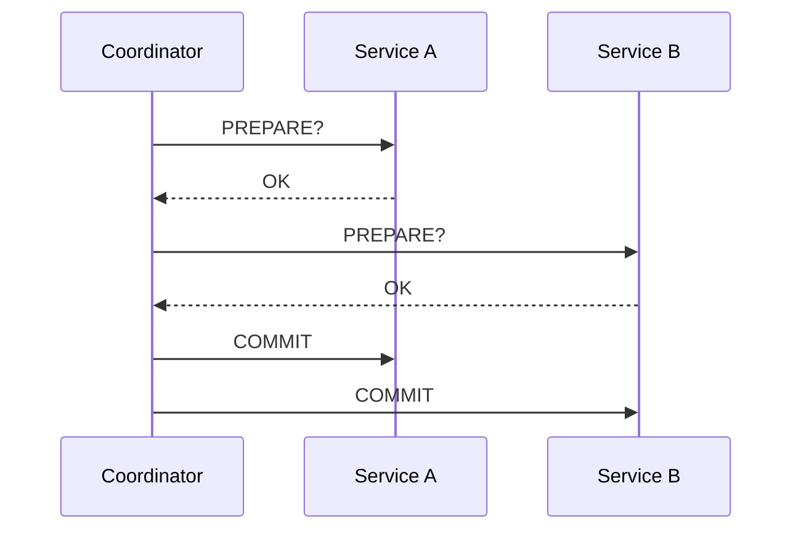
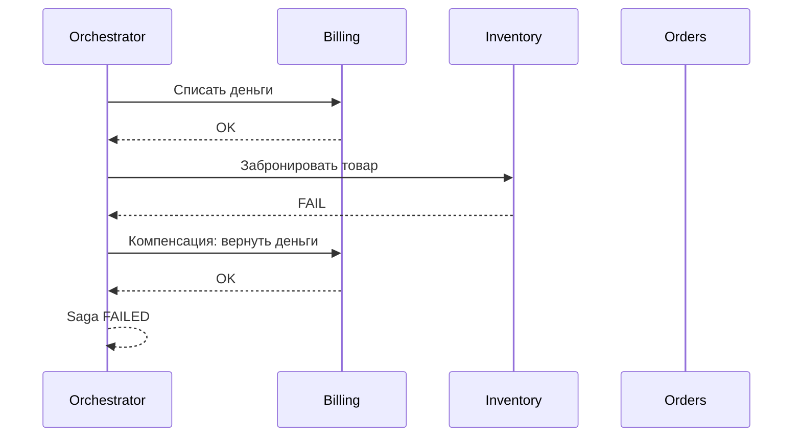
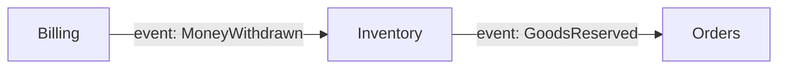
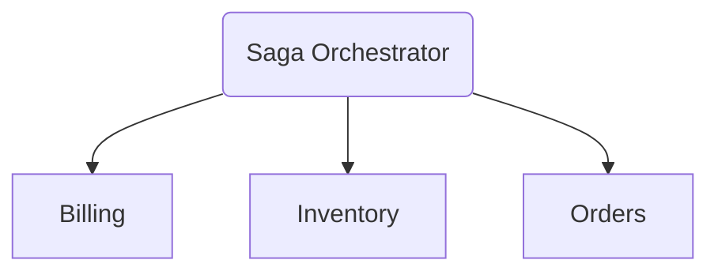
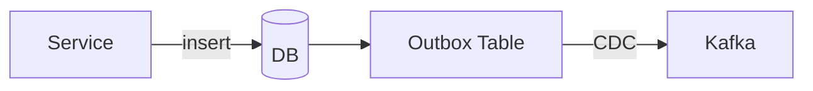

#  ВСТУПЛЕНИЕ (1–2 мин)

Представьте задачу:

> “Нужно списать деньги, забронировать товар, создать заказ и отправить пуш-уведомление. И всё это — атомарно.”

И вот ты сидишь перед этим ТЗ и понимаешь:

* у каждого микросервиса своя база,
* RPC ненадёжный,
* один сервис живёт в AWS, другой в GCP,
* третий вообще на bare-metal,
* сеть врёт, задержки пляшут, сообщения теряются…

**И как тут сделать атомарность?**

Добро пожаловать в мир распределённых транзакций.
Мир, где ACID больше не работает,
а “откатить всё назад” — это сказки из монолита.

Сегодня разберём:

* почему обычные транзакции в микросервисах невозможны,
* как работает 2PC (и почему оно почти умерло),
* что такое Saga и почему весь современный прод на ней,
* реальные проблемы и решения: orchestration, Temporal, outbox, CDC, idempotency.

Поехали.

---

# 🧨 БЛОК 1. ПОЧЕМУ ТРАНЗАКЦИИ ЛОМАЮТСЯ В МИКРОСЕРВИСАХ (3–4 мин)

Монолит:

* один процесс
* одна база
* один менеджер транзакций
* ACID выполняется строго

Микросервисы:

* несколько БД
* несколько API
* несколько сетей
* несколько точек отказа
* latency непредсказуема
* сервисы могут умереть в любой момент

Зрителю важно услышать:

> “Транзакция через микросервисы **невозможна в принципе**.
> Всё, что мы делаем — это попытки имитировать атомарность.”

Причины:

* нет shared lock manager
* нет глобального ACID
* сеть ненадёжна
* координатор может умереть
* каждый сервис живёт своей жизнью

Это важно зафиксировать — и идти дальше.

---

# 🧩 БЛОК 2. КЛАССИКА: Two-Phase Commit (2PC) (4–5 мин)

Объясняем **коротко**, но с болью.



Проблемы:

* координатор — SPoF
* завис B → блокируем ВСЁ
* prepare держит долгие локи
* медленная сеть убивает протокол
* нельзя горизонтально масштабировать

Вывод:

> 2PC — это красиво в учебниках.
> В продакшене — почти нереализуемый кошмар.

---

# 🧩 БЛОК 3. 3PC (Three-Phase Commit) (1 мин)

Упоминаем, но не тратим время:

* добавили intermediate phase
* чуть лучше fault tolerance
* всё равно требует синхронных таймаутов
* бессмысленно в реальном облаке

Честный вывод:

> “3PC — попытка починить 2PC, которая всё равно не работает.”

---

# 🚀 БЛОК 4. SAGA — КАК ДЕЛАЮТ ВСЕ РЕАЛЬНЫЕ СИСТЕМЫ (10–12 мин)

Основная идея:

> Не делаем атомарность.
> Делаем **workflow**, в котором каждая операция имеет откат.

Показываем:



Простая, визуальная сага. Понятно даже джуну.

---

# ⚙️ Детализация SAGA

### Преимущества:

* нет глобальных блокировок
* нет координатора, который держит локи
* каждая операция = независимый сервис
* можно жить с eventual consistency
* процесс можно безопасно ретраить
* легко восстанавливаться после креша

### Недостатки:

* нет atomicity
* нет isolation
* компенсации могут быть “грязными”
* внешние API неоткатные
* требуется мощная идемпотентность
* ошибки могут протащиться цепочкой

---

# 🧭 БЛОК 5. ОРКЕСТРАЦИЯ vs ХОРЕОГРАФИЯ (4–5 мин)

Объясняем на примере заказа.

## 1. Хореография (event-driven)



Плюсы:

* просто
* не нужен центральный сервис

Минусы:

* хаос
* сложно мониторить
* event-storm
* тестирование сложное

## 2. Оркестрация (Saga Coordinator)



Плюсы:

* один мозг управляет процессом
* легко тестировать
* легко мониторить

Минусы:

* нужен отдельный сервис

### Вывод:

> 95% реальных продовых саг делаются через ORCHESTRATOR.

---

# 🧠 БЛОК 6. Temporal, Camunda, Conductor (5–6 мин)

Объясняем не как “берём готовый инструмент”, а почему такие штуки вообще существуют.

Они решают то, что ручное решение НЕ решит:

✔ гарантия доставки шага
✔ гарантированные ретраи
✔ сохранение состояния саги
✔ автоматические таймауты
✔ дедупликация событий
✔ идемпотентность
✔ отложенные операции
✔ детерминированные workflow

Пример для Temporal:

* workflow описывается как обычный код
* Temporal хранит state
* Temporal гарантирует retry
* Temporal гарантирует recovery

Саги ничего “не упрощают”, но делают их реализуемыми.

---

# 🧱 БЛОК 7. Outbox Pattern + CDC (5–6 мин)

Это **маст-хэв** тема, без которой любая сага ломается.

Боль:

* “Мы записали в БД, но событие в Kafka потерялось”
* “Kafka уже обработала событие, а в БД его нет”

Outbox решает это:



Механизм:

1. Пишем данные + запись в outbox в одной локальной транзакции.
2. Debezium читает изменения и гарантированно отправляет в Kafka.

Преимущества:

* нет дублей
* нет потерь сообщений
* нет рассинхронов
* строгое соответствие состоянию БД

В 2025 году — MUST-HAVE.

---

# 🔁 БЛОК 8. Idempotency (3–4 мин)

Idempotency — основа всего.

Объясняем:

> Если твоя операция не идемпотентна — она НЕ МОЖЕТ быть частью саги.

Примеры:

* списание денег → всегда с operation_id
* повторный вызов → не должен списывать снова
* компенсации тоже должны быть идемпотентны
* API должно быть безопасно ретраить

Пример кода (Symfony):

```php
if ($repo->hasProcessed($operationId)) {
    return SavedState::OK;
}

$repo->markProcessed($operationId);
$billing->withdraw($userId, $amount);
```

---

# 🔥 БЛОК 9. Типичные фейлы распределённых транзакций (3–5 мин)

Нужно показать реальные боли.

* компенсация не прошла
* компенсация прошла частично
* внешняя интеграция зависла
* координатор умер
* duplicate messages
* duplicate compensation
* message reordering
* dead-letter queue переполняется
* “уже зарезервировано, но ещё не оплачено”
* race condition между шагами

---

# 🚫 БЛОК 10. Когда Saga НЕ подходит (2 мин)

* денежные транзакции, где rollback недопустим
* high-frequency trading, где latency критична
* сценарии без компенсируемых действий
* операции уровня ядра: ACL, разрешения, security
* сценарии, требующие полного ACID

---

# 🔁 БЛОК 11. Альтернативы Saga (2–3 мин)

Даем альтернативы, чтобы зритель понял:
**сага — не серебряная пуля.**

### ✔ Try-Confirm-Cancel (TCC)

* подходит для банковских операций
* имеет explicit prepare state

### ✔ Event Sourcing

* состояние = поток событий
* откат = ещё одно событие

### ✔ Transactional Outbox

* фактически must-have для всех EDA систем

### ✔ Dual writes avoidance

* “не делай запись в 2 источника одновременно”
* всегда делай через журнал → CDC

---

# 📚 БЛОК 12. Материалы для углубления (список)

Прям must-read:

* “Life Beyond Distributed Transactions” — Pat Helland
* “Sagas” — 1987 (!) Hector Garcia-Molina
* Kleppmann — DDIA
* Netflix Conductor docs
* Temporal: “Retry Semantics”
* Uber Payments architecture

---

# 🏁 ФИНАЛ

Distributed transactions — это не про ACID.
И не про “как вернуть всё назад”.

Это про:

* управление хаосом,
* проектирование workflow,
* идемпотентность,
* надежную доставку событий,
* и способность системы восстановиться из любой жопы.

Саги не решают проблемы —
они делают их **контролируемыми**.

И именно поэтому весь современный прод держится на:

* Saga orchestration
* Outbox + CDC
* Idempotent operations
* Temporal-like workflow engines

На этом блок можно завершать.
