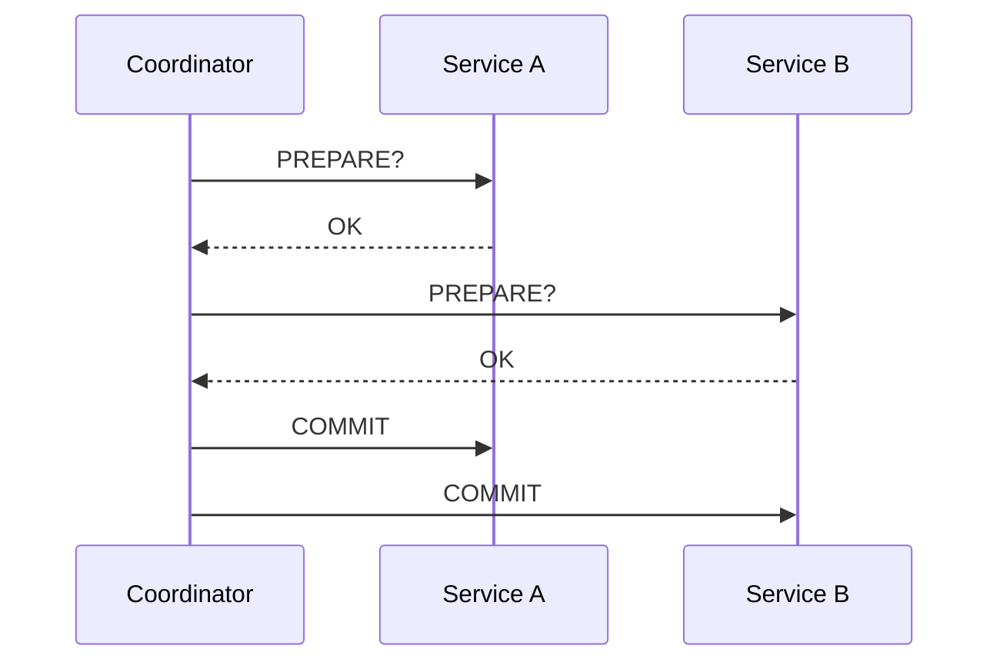
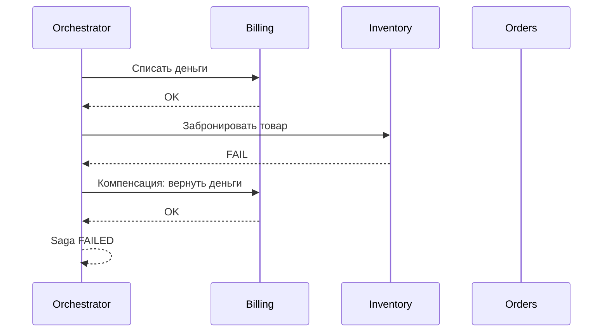
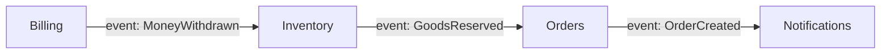
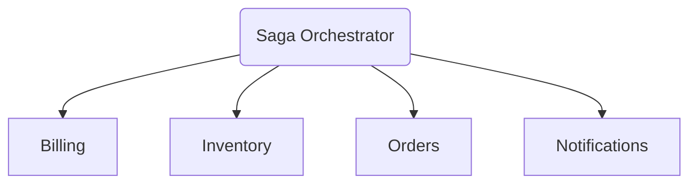
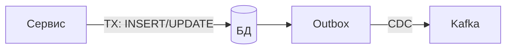

# Распределенные транзакции

# Вступление (1–2 мин)

Представьте задачу:

> “Нужно списать деньги, забронировать товар, создать заказ и отправить пуш. И всё это — атомарно.”

С виду обычный e-commerce. Но потом открываешь схему:

* у каждого микросервиса своя база;
* общение через RPC, который иногда молчит;
* часть сервисов в AWS, часть в GCP, один вообще на bare metal;
* сеть врет, задержки плавают, сообщения теряются.

И вот главный вопрос:

**как тут вообще сделать “всё или ничего”?**

Добро пожаловать в мир распределённых транзакций.
Мир, где привычный ACID начинает разваливаться,
а фраза “просто откатим всё назад” — это уже не архитектура, а фанфик по монолиту.

Что разберём:

* почему “обычные” транзакции в микросервисах не работают;
* как устроен 2PC и почему он почти никому не заходит в проде;
* что такое Saga и почему половина нормальных продов живёт на ней;
* какие паттерны вокруг: orchestration, Temporal-подобные движки, outbox, CDC, идемпотентность.

Поехали.

---

# Блок 1. Почему транзакции ломаются в микросервисах (3–4 мин)

В монолите всё просто:

* один процесс;
* одна база;
* один менеджер транзакций;
* ACID гарантируется СУБД.

Схема “списали → забронировали → сохранили заказ” там реально может быть **одной** транзакцией.

В микросервисах картинка другая:

* несколько БД/шарды;
* несколько API;
* несколько сетей;
* каждый сервис может упасть в любой момент;
* latency дёргается от “10 ms” до “секунда и таймаут”.

> **Глобальная транзакция через микросервисы невозможна в том же смысле, как в одном Postgres.**
> Всё, что мы делаем — это костыли над реальностью, а не “настоящий ACID”.

Почему:

* нет единого lock manager’а;
* нет глобального журнала транзакций;
* сеть ненадёжна (потеря пакета = “вроде отправили, но что там произошло — неизвестно”);
* координатор может умереть между “сделай” и “подтвердил”;
* каждый сервис живёт в своём мире: у кого-то Postgres, у кого-то Dynamo, у кого-то вообще сторонний SaaS.

Фиксируем факт: **“BEGIN; … COMMIT;” на три сервиса сразу — это фантазия.**
Дальше будем разбирать, как люди пытались к этой фантазии приблизиться, и к чему в итоге пришли.

---

# Блок 2. Классика: Two-Phase Commit (2PC) (4–5 мин)

Первая попытка “сделать всё по-взрослому” — протокол 2PC.

Идея:

* есть координатор;
* есть участники (несколько БД/сервисов);
* координатор сначала всех спрашивает: “готовы ли вы закоммититься?”;
* если все сказали ОК — говорит всем “коммитимся”.

Схема:



На бумаге выглядит аккуратно. Теперь смотрим на реальность.

Проблемы:

* координатор — точка отказа:

    * если он умер после того, как кому-то сказал COMMIT, а кому-то нет — состояние разных участников расходится;
* фаза `PREPARE` держит у всех локи:

    * пока они “готовы, но ждут финального решения”, данные заблокированы;
* latency накапливается:

    * общее время = сумма всех сетевых вызовов + ожидания самого медленного участника;
* добавляем облако: таймауты, GC-паузы, рестарты нод — и вся эта конструкция становится хрупкой.

Сделать рабочий 2PC в проде **можно**, если ты Google/Meta и пишешь что-то уровня Spanner.
В обычном продукте 2PC почти всегда вылезает:

* либо в виде дикой сложности и редких, но жирных инцидентов;
* либо в виде “ну мы вроде как делаем 2PC, но без гарантий”.

Вывод:

> 2PC — это хороший теоретический базис,
> но для большинства продуктовых команд — слишком дорогая игрушка.

---

# Блок 3. Три-фазный commit (3PC) (1 мин)

Кто-то скажет:

> “Хорошо, 2PC ломается. Давайте сделаем 3PC — добавим ещё одну фазу и всё починим”.

3PC пытается сделать координатор менее смертельным, добавить промежуточное состояние и улучшить fault tolerance.

На практике:

* по-прежнему требует предположений о сетевых таймаутах;
* по-прежнему не дружит с реальными падениями и стоп-мир GC;
* практически не используется в мейнстрим-продах.

Честный комментарий:

> 3PC — это попытка залить 2PC эпоксидкой. На слайдах красиво, в реальном облаке почти бесполезно.

Дальше можно не залипать на этом, просто зафиксировать: “есть, но жить на этом мы не будем”.

---

# Блок 4. Saga — как это делают нормальные системы (10–12 мин)

После того как архитекторы наигрались в “глобальный ACID”, индустрия по сути пришла к другой модели — **Saga**.

Главный поворот мысли:

> Не делаем одну большую атомарную транзакцию.
> Делаем **последовательность шагов**, у каждого шага есть компенсация.

Пример с заказом:

1. Списать деньги.
2. Забронировать товар на складе.
3. Создать заказ.
4. Отправить уведомление.

Сага говорит:

* каждый шаг — отдельная операция в своём сервисе, со своей локальной транзакцией;
* если где-то посередине всё развалилось — мы не “откатываем весь мир”,
  а вызываем **компенсации** к уже выполненным шагам.

Схема:



Важный момент: мы **сознательно отказываемся от строгой атомарности**.
Здесь возможны промежуточные состояния:

* деньги списаны, но заказ ещё не создан;
* заказ создан, но уведомление ещё не ушло.

Но:

* для каждого шага у нас есть компенсирующее действие;
* систему можно возвращать в согласованное состояние без глобальных блокировок.

Плюсы по сравнению с 2PC:

* нет глобальных долгих локов;
* нет единого координатора, который держит всю систему за горло в состоянии “prepared”;
* операции можно ретраить;
* можно переживать падения отдельных сервисов.

Минусы:

* это уже не ACID, а **workflow** со своими углами;
* компенсация не всегда “симметрична”:

    * деньги списали — вернуть проще;
    * отправленный email откатить уже нельзя;
* в голове у разработчика становится сложнее: нужно думать не в терминах “BEGIN/COMMIT”, а в терминах “сценарий + обратные шаги”.

Но реальность такая: **подавляющее большинство микросервисных систем, где есть бизнес-процессы из многих шагов, живут именно на сагах**, а не на 2PC.

---

# Блок 5. Оркестрация против хореографии (4–5 мин)

Сагу можно организовать двумя способами.

## Хореография (event-driven бардак)

Каждый сервис реагирует на события других:



Картина:

* Billing выдал событие “деньги списаны”;
* Inventory на него подписан, зарезервировал товар → выдал “зарезервировано”;
* Orders услышал “зарезервировано” → создал заказ;
* Notifications услышал “заказ создан” → отправил письмо.

Плюсы:

* локально просто — каждый сервис слушает события и делает своё;
* нет “большого брата” в центре.

Минусы:

* через полгода уже никто не помнит, кто за кем следует;
* чтобы понять, как работает общий процесс, приходится рисовать полстены диаграмм;
* отладка и тестирование — боль;
* добавить один шаг в середину цепочки = поломать кучку сервисов.

## Оркестрация (Saga Orchestrator)

Другой вариант — завести отдельный компонент, который **явно управляет** шагами.



Он знает:

* в каком порядке вызывать сервисы;
* какие шаги уже прошли;
* какие компенсации нужно вызвать при фейле;
* какие таймауты и ретраи применять.

Плюсы:

* вся логика процесса в одном месте;
* легко анализировать и дебажить;
* можно логировать/метрить прогресс каждой саги.

Минусы:

* это ещё один сервис, который нужно писать и поддерживать.

На практике:

> “100% саг у нас через чистую хореографию” — это обычно младенческий период системы.
> Дальше, как только начинается реальная сложность, появляется оркестратор — свой кастомный или готовый движок.

---

# Блок 6. Temporal, Camunda, Conductor и прочие движки (5–6 мин)

В какой-то момент разработчики устают собирать свой самопальный оркестратор из очередей и кронов — и приходят к специализированным workflow-движкам: Temporal, Camunda, Netflix Conductor и т.п.

Зачем они вообще нужны:

* гарантировать ретраи шагов;
* хранить **состояние** саги (какие шаги прошли, какие нет);
* автоматически восстанавливаться после падений;
* нормально работать с таймаутами;
* обеспечивать идемпотентность на уровне движка;
* давать админам UI, где видно, какие саги в каком состоянии застряли.

Например, Temporal:

* ты описываешь workflow как обычный код (функция, которая вызывает “активити”);
* Temporal сам:

    * сериализует состояние;
    * воспроизводит его после рестарта;
    * ретраит упавшие шаги;
    * следит за таймингами.

Он не отменяет сложность — он помогает не писать всё это руками на очередях/кронах/таблицах.

Важно пояснить:

> Saga сама по себе — это только паттерн.
> Чтоб он не превратился в свалку кронов, очередей и ручных ретраев,
> обычно добавляют workflow-движок.

---

# Блок 7. Outbox + CDC (5–6 мин)

Теперь к самому больному месту любой саги: **как вообще надёжно доставлять события между сервисами.**

Типичный фейл:

* “мы обновили запись в БД, отправили событие в Kafka… но Kafka упала/таймаут, и мы не знаем, что именно произошло”;
* или наоборот: “сообщение в Kafka есть, а в БД соответствующей записи ещё нет”.

Паттерн **Outbox** решает это.

Идея:

1. При любом изменении состояния в сервисе мы пишем:

* бизнес-данные (например, заказ) **и**
* запись в таблицу `outbox`
  **в одной локальной транзакции**.
2. Отдельный процесс/CDC-коннектор (Debezium и т.п.) читает `outbox` и гарантированно публикует события в брокер (Kafka/ RabbitMQ/что угодно).

Схема:



Важные эффекты:

* либо транзакция в БД закоммитилась целиком (и данные, и запись в outbox),
  либо не закоммитилось ничего;
* потерять событие можно только вместе с потерей самой записи в БД;
* коннектор, читающий из outbox, идемпотентен и может ретраить публикацию, пока не получится.

В 2025 году это реально must-have паттерн для всего event-driven:

> “События идут только из outbox, а не из воздуха”.

Без этого любая сага разваливается в гонках “событие ушло, данные не записались / наоборот”.

---

# Блок 8. Idempotency (3–4 мин)

Следующий кирпич — **идемпотентность**.

Формально: операция идемпотентна, если повторный запуск даёт тот же эффект, что и первый.

В реальной жизни:

* сообщение может прийти два раза;
* запрос может быть ретрайнут клиентом, гейтвеем, ретрай-механизмом;
* workflow-движок может повторить шаг после падения.

Если твоя операция базово не идемпотентна — её нельзя безопасно ретраить, а значит, она плохо вписывается в сага-процесс.

Пример с биллингом:

* любое списание должно иметь `operation_id`;
* сервис биллинга:

    * сначала проверяет, обрабатывал ли он уже этот `operation_id`;
    * если да — спокойно отвечает “OK” ещё раз и ничего не делает;
    * если нет — выполняет списание и помечает `operation_id` как обработанный.

Псевдо-код:

```php
if ($repo->hasProcessed($operationId)) {
    return; // уже всё сделали, повтор просто проходит мимо
}

$repo->markProcessed($operationId);
$billing->withdraw($userId, $amount);
```

То же самое относится к компенсирующим шагам — их тоже могут вызвать повторно.

Без идемпотентности:

* ретраи превращаются в “иногда списали дважды”;
* компенсации могут усугублять ситуацию.

---

# Блок 9. Типичные фейлы распределённых транзакций (3–5 мин)

Полезно честно проговорить, как всё падает в реальности.

* Компенсация не прошла:

    * деньги списали, товар не зарезервировался, компенсация по биллингу упала → зависшее состояние.
* Компенсация прошла частично:

    * часть шагов откатили, часть — нет.
* Внешнее API висит:

    * сага ждёт 40 секунд какого-то SOAP-сервиса, пользователю давно больно.
* Дублирующиеся события:

    * ретраи в брокере привели к тому, что сообщение применили дважды.
* Перестановка сообщений:

    * события пришли в другом порядке, чем выполнялись операции.
* Dead-letter очередь:

    * туда складывают “битые” сообщения, но никто не обрабатывает — через месяц там склад ядерных отходов.

Смысл этого блока — выбить из головы идею “сага всё чинит магией”.
Сага только делает хаос управляемым, а грязную работу всё равно нужно продумывать.

---

# Блок 10. Когда Saga — плохая идея (2 мин)

Важно проговорить и обратную сторону: **сага — не серебряная пуля.**

Примеры, где она плохо подходит:

* жёсткие денежные операции, где *любой* рассинхрон недопустим:

    * high-frequency trading;
    * внутрибанковские реестры, где регулятору плевать на ваши “eventual consistency”.
* сценарии, где нет разумной компенсации:

    * пуш уже ушёл, письмо уже прочитано — “откатить” нельзя;
* критичная безопасность:

    * изменения прав доступа, ACL, security-политик;
* всё, где требуются строгие глобальные инварианты “в каждый момент времени”.

Там либо используют другие подходы (TCC, строго синхронные транзакции, один общий storage),
либо осознанно ограничивают требования (“в этом куске системы **не будет** горизонтального масштабирования”).

---

# Блок 11. Альтернативы и дополнения к Saga (2–3 мин)

Важно показать, что кроме Sagas, в арсенале есть и другие паттерны.

1. **TCC (Try-Confirm-Cancel)**

   Более строгий вариант:

* сначала все участники делают `Try` (резервируют ресурсы);
* если все ОК — делаем `Confirm`;
* если нет — `Cancel`.

Это ближе к контролируемому 2PC на уровне бизнес-логики, часто используется в финтехе.

2. **Event Sourcing**

* состояние системы = поток событий;
* “откат” = новое событие, фиксирующее изменение.

Здесь проще reasoning по истории, но выше когнитивная нагрузка.

3. **Transactional Outbox**

   По сути не альтернатива, а обязательный спутник:

* любые межсервисные события идут через outbox + CDC;
* это база для Sagas, TCC и всего остального.

4. **Не делать dual writes**

   Важный принцип:

   > “Не пиши одновременно в два независимых хранилища”.
   > Пиши в одно + журнал, а остальное достраивай через CDC.

---

# Финал

Distributed transactions — это не “как растянуть ACID на весь зоопарк микросервисов”.

Это про:

* осознанную работу с хаосом;
* дизайн процессов как workflow, а не одной транзакции;
* идемпотентность операций;
* надёжную доставку и воспроизведение событий;
* способность системы выбраться из любой жопы без ручного шаманства в проде.

Саги не отменяют ошибок и отказов.
Они делают так, что:

* ошибки происходят предсказуемо;
* есть понятный сценарий отката;
* у тебя есть инструменты, чтобы восстановить систему.

И поэтому в современном проде нормальный стек выглядит примерно так:

* бизнес-процессы — через **Saga / workflow** (оркестратор, а не россыпь событий);
* доставка сообщений — через **Outbox + CDC**;
* действия — **идемпотентные**;
* сложные процессы — на движках уровня **Temporal / Camunda / Conductor**, а не на крон-тасках и “скриптиках админа”.

А дальше уже честный выбор:
что именно из этого стека ваша система реально готова тащить — и где вы осознанно скажете “здесь мы живём попроще, но и требования другие”.
