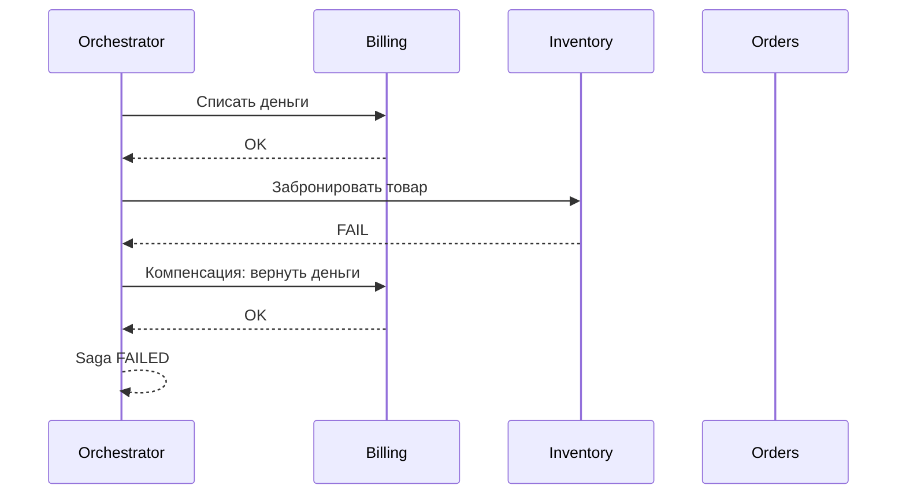

```mermaid
sequenceDiagram
    participant O as Orchestrator
    participant B as Billing
    participant I as Inventory
    participant R as Orders

    O->>B: Списать деньги
    B-->>O: OK
    
    O->>I: Забронировать товар
    I-->>O: FAIL
    
    O->>B: Компенсация: вернуть деньги
    B-->>O: OK
    
    O-->>O: Saga FAILED
```

