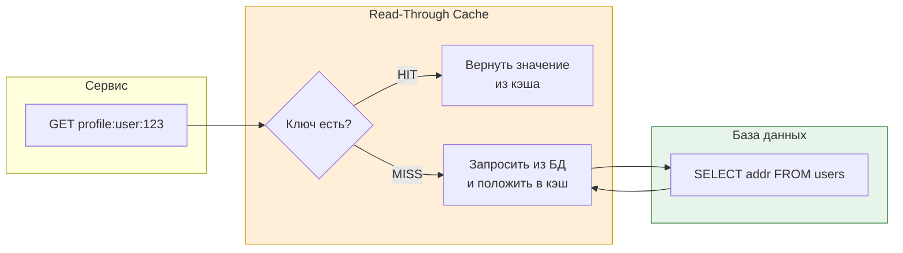

```mermaid
flowchart LR
    subgraph S["Сервис"]
        A[GET profile:user:123]
    end

    subgraph C["Read-Through Cache"]
        B{Ключ есть?}
        C1[Вернуть значение<br/>из кэша]
        C2[Запросить из БД<br/>и положить в кэш]
    end

    subgraph DB["База данных"]
        D[SELECT addr FROM users]
    end

    A --> B
    B -- HIT --> C1
    B -- MISS --> C2
    C2 --> D
    D --> C2

    style C fill:#ffefd9,stroke:#d39e00
    style DB fill:#e6f4ea,stroke:#2e7d32

```

