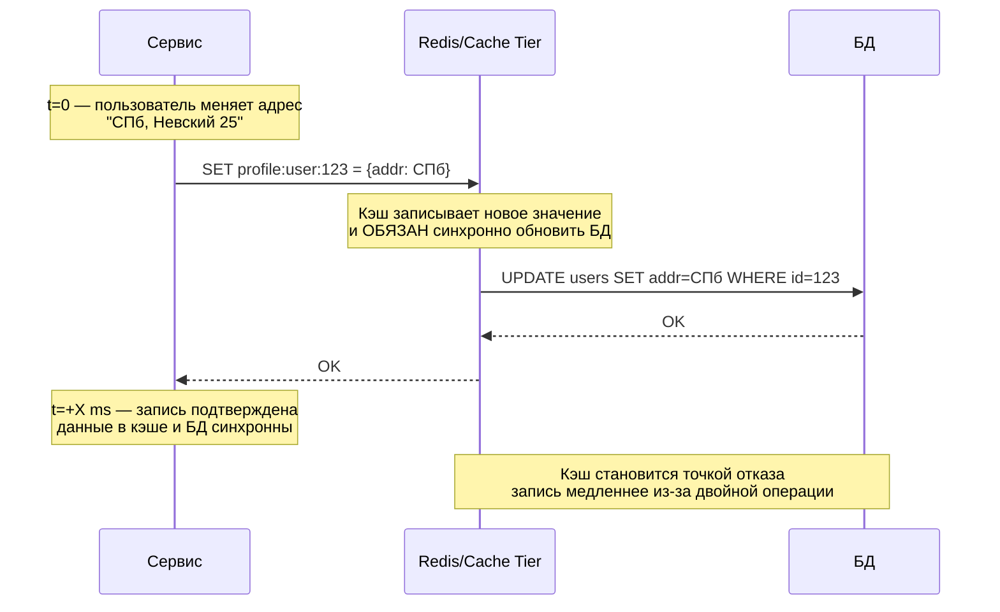

```mermaid
sequenceDiagram
    participant Service as Сервис
    participant Cache as Redis/Cache Tier
    participant DB as БД

    Note over Service: t=0 — пользователь меняет адрес<br/>"СПб, Невский 25"

    Service->>Cache: SET profile:user:123 = {addr: СПб}
    Note over Cache: Кэш записывает новое значение<br/>и ОБЯЗАН синхронно обновить БД

    Cache->>DB: UPDATE users SET addr=СПб WHERE id=123
    DB-->>Cache: OK

    Cache-->>Service: OK
    Note over Service: t=+X ms — запись подтверждена<br/>данные в кэше и БД синхронны

    Note over Cache,DB: Кэш становится точкой отказа<br/>запись медленнее из-за двойной операции

```

