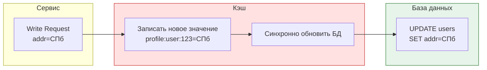

```mermaid
flowchart LR
    subgraph S["Сервис"]
        A[Write Request<br/>addr=СПб]
    end

    subgraph C["Кэш"]
        B[Записать новое значение<br/>profile:user:123=СПб]
        B2[Синхронно обновить БД]
    end

    subgraph DB["База данных"]
        E[UPDATE users<br/>SET addr=СПб]
    end

    A --> B
    B --> B2
    B2 --> E

    style C fill:#ffe1e1,stroke:#c62828
    style DB fill:#e6f4ea,stroke:#2e7d32

```

