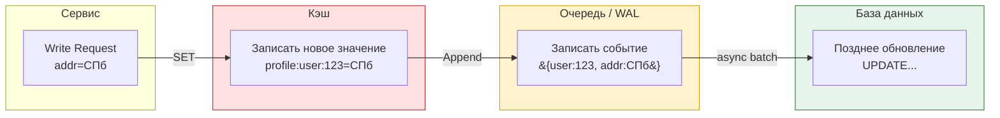

```mermaid
  flowchart LR
  subgraph S["Сервис"]
    A["Write Request<br/>addr=СПб"]
  end

  subgraph C["Кэш"]
    B["Записать новое значение<br/>profile:user:123=СПб"]
  end

  subgraph Q["Очередь / WAL"]
    D["Записать событие<br/>&#123;user:123, addr:СПб&#125;"]
  end

  subgraph DB["База данных"]
    E["Позднее обновление<br/>UPDATE..."]
  end

  A -- SET --> B
  B -- Append --> D
  D -- async batch --> E

  style C fill:#ffe1e1,stroke:#c62828
  style Q fill:#fff3cd,stroke:#d39e00
  style DB fill:#e6f4ea,stroke:#2e7d32

```

