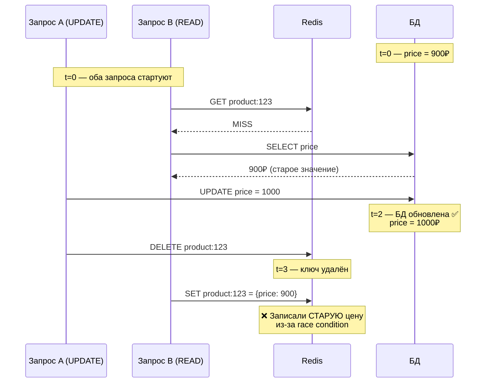

```mermaid
sequenceDiagram
    participant A as Запрос A (UPDATE)
    participant B as Запрос B (READ)
    participant Cache as Redis
    participant DB as БД

    Note over DB: t=0 — price = 900₽

    Note over A,B: t=0 — оба запроса стартуют

    B->>Cache: GET product:123
    Cache-->>B: MISS

    B->>DB: SELECT price
    DB-->>B: 900₽ (старое значение)

    A->>DB: UPDATE price = 1000
    Note over DB: t=2 — БД обновлена ✅<br/>price = 1000₽

    A->>Cache: DELETE product:123
    Note over Cache: t=3 — ключ удалён

    B->>Cache: SET product:123 = {price: 900}
    Note over Cache: ❌ Записали СТАРУЮ цену<br/>из-за race condition


```
