## Часть 3. Data scaling (replication, partitioning, sharding)

### Блок 3.1. Базовый ликбез

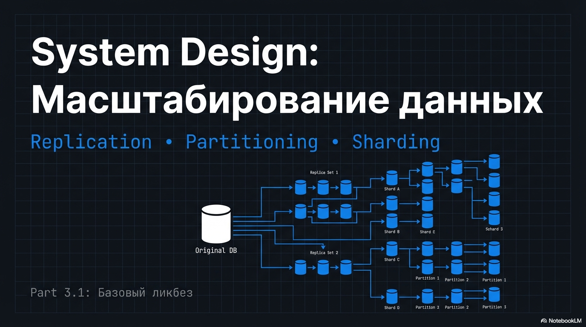

#### 3.1.0 Введение: почему мы вообще заговорили про масштабирование БД

В прошлом примере узкое место было не в базе, поэтому масштабировать БД не пришлось.

Теперь представим другой типичный для собеседований сценарий.

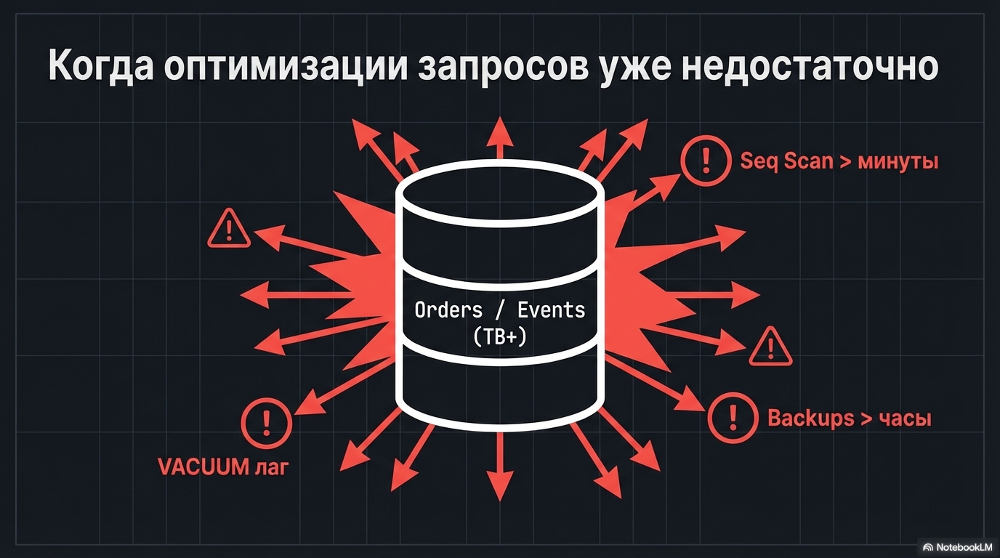

Есть одна огромная таблица `orders` или `events`, на сотни миллионов строк, весит уже терабайты.
Seq Scan начинает занимать минуты, бэкапы - часы, а VACUUM не успевает разгребать блоат

И вот в такой ситуации одной оптимизацией запросов нам не отделаться, и приходит пора думать про масштабирование базы.

#### 3.1.1 Вертикальное и горизонтальное масштабирование

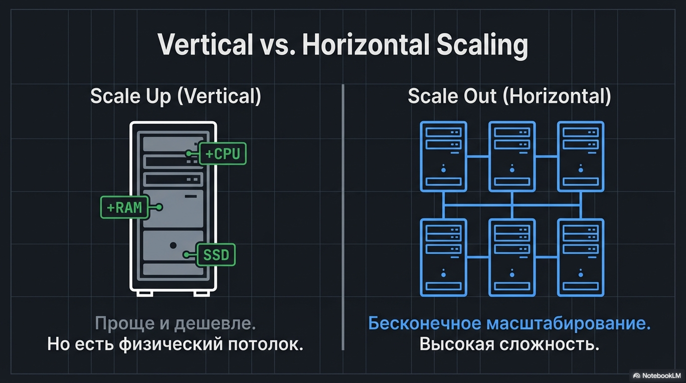

Сначала необходимо выжать все из вертикального масштабирования: добавить CPU/RAM и поставить быстрый диск.
Это проще, быстрее и часто дешевле, чем сразу делать распределённую систему.
Но у вертикального подхода есть потолок — физический и экономический. 
Поэтому следующий шаг — горизонтально распределять нагрузку.

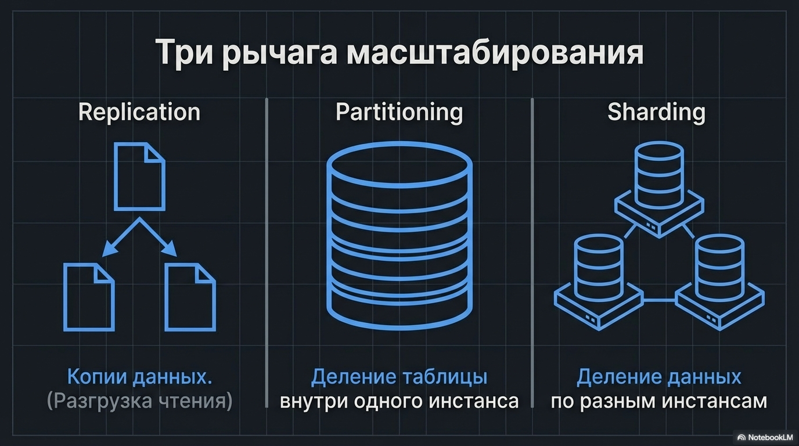

Тут есть три техники: репликация, партиционирование и шардирование. 
Разработчики на собеседованиях часто в них путаются, поэтому напомню определения

#### 3.1.2 Три рычага масштабирования данных: что это и когда применяется

Репликация — это копии одних и тех же данных: есть primary и одна или несколько readonly реплик.
Делают это по двум причинам:
- первая - чтобы перенести часть чтений на реплики, тем самым разгрузив primary, 
- вторая - чтобы повысить отказоустойчивость

Партиционирование — это когда одна логическая таблица разбита на несколько физических кусков, но всё живёт в одном инстансе БД.
Цель - ускорение типовых запросов за счёт pruning, и облегчить обслуживание базы за счет меньших индексов и таблиц

Шардирование — это те же “куски”, но уже разнесённые по разным инстансам
Цель — масштабировать запись и совокупные ресурсы (диск/CPU/IO)

Между этими терминами существует путаница. 
Например, то, что в Elasticsearch называется shard, по смыслу ближе к партиции (кусок индекса внутри одного кластера),
а не к шардированию в смысле “разнесли данные по разным БД-инстансам”.

Мы же будем придерживаться озвученных определений, как наиболее распространенных

#### 3.1.3 Три типовых кейса

Разберем что из этого когда применять на кейсах

##### 3.1.3.1 Кейс A — чтения доминируют: идём в репликацию

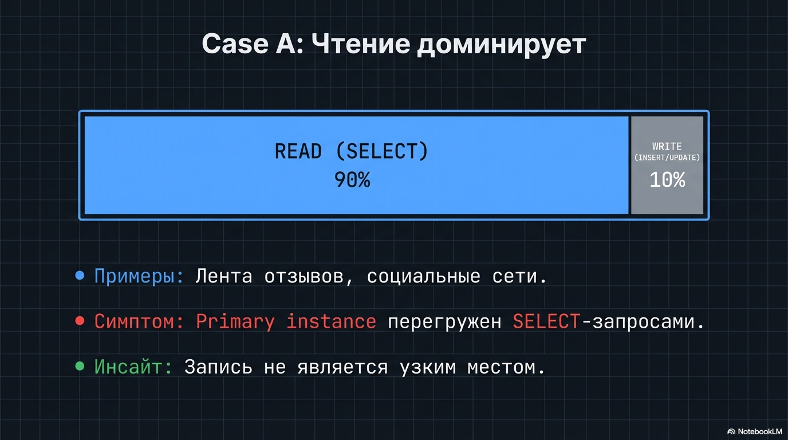

Первый кейс — система, в которой нагрузка на чтение многократно выше нагрузки на запись
Например, как у нас было с лентой отзывов: чтение в пике на порядок выше записи. 

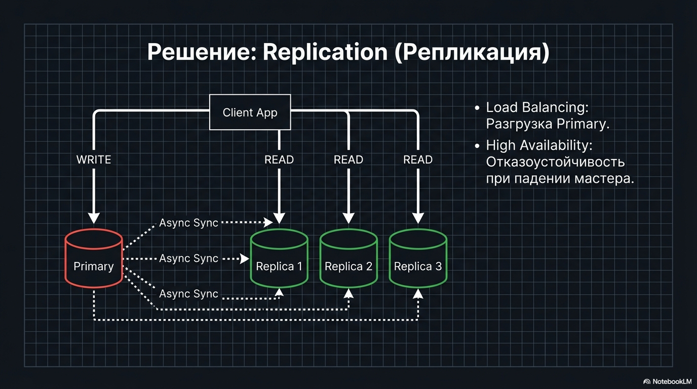

В таком случае можем добавить реплики на чтение: часть нагрузки уйдёт туда, и тем самым разгрузим primary. Чтение не будет мешать записи

Но появляются новые проблемы:

- асинхронная репликация даёт replication lag. То есть чтение с реплики может вернуть старые данные;
- синхронная репликация повышает latency записи: нужно дождаться подтверждения от синхронных реплик - в зависимости от настройки синхронизации

Например, пользователь только что создал заказ и ожидает увидеть его сразу - этот уровень консистентности называется read-your-writes

Там, где нужен такой уровень консистентности, обычно читаем с primary хотя бы для автора операции.

А если всё-таки нужно читать с реплики, то делаем sticky-сессии/пиннинг на ту реплику, которая уже догнала нужную позицию в журнале репликации

При этом репликацию имеет смысл делать даже на небольшой базе,
если нужна отказоустойчивость и вы готовы принять цену в виде консистентности/latency и операционной сложности.

Для собеседования не обязательно знать, как именно настраивается репликация, но важно понимать плюсы и минусы.

Решение о репликации, как и большинство решений в system design,  принимается исходя из требований (SLO/RPO/RTO) и метрик

##### 3.1.3.2 Кейс B — горячее/холодное и retention: идём в партиционирование

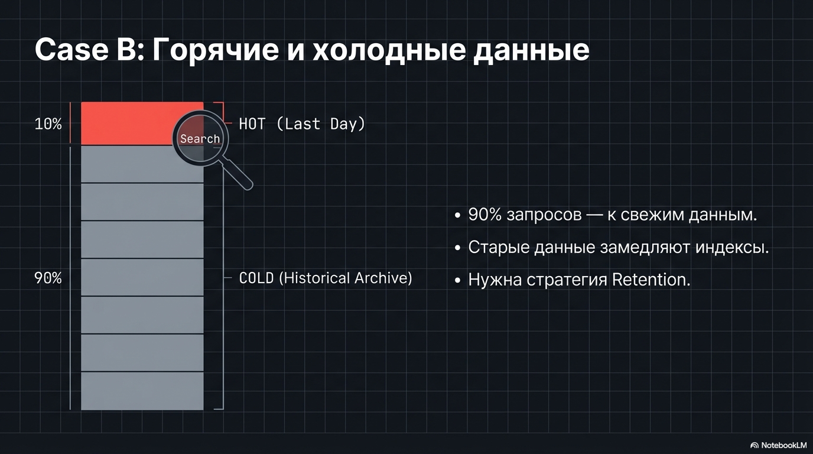

Следующий кейс - у нас есть события или заказы, где 90% запросов работают именно со свежими данными - за последний день/месяц/год

Тогда мы режем таблицу на партиции, тем самым отделяя горячие данные которые постоянно нужны, от большого количества холодных данных

```sql
CREATE TABLE events (
    ...
    PRIMARY KEY (id, created_at)   -- в Postgres ключ/уникальность должны включать ключ партиционирования
) PARTITION BY RANGE (created_at);

-- Партиции по месяцам (пример: январь/февраль 2026)
CREATE TABLE events_2026_01
    PARTITION OF events
        FOR VALUES FROM ('2026-01-01') TO ('2026-02-01');
```

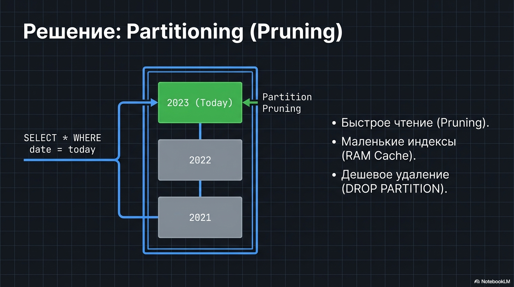

Если ключ партиционирования совпадает с фильтром, Postgres сам выберет только свежие партиции - это и есть partition pruning.

Благодаря такому механизму:
- меньше данных читаем, а значит быстрее
- так как индексы меньше по размеру, выше шанс иметь их в кэше
- `VACUUM'у` проще работать на небольших таблицах
- от старых данных можем избавиться дёшево: просто drop/detach партиции, а не DELETE'ом с последующим VACUUM
- Если база self-hosted, можно хранить горячие партиции на быстрых дисках, а холодные - на медленных и дешевых. 
  В посгресе это через tablespaces делается

Однако, если в фильтре нет ключа партиционирования, база может сходить во все партиции, и выигрыша мы не получим

Вдобавок часть фич, которые работали на обычной таблице, недоступны на партициях

К примеру в Postgresql `UNIQUE` / `PRIMARY KEY` должны включать ключ партиционирования, иначе Postgres не может гарантировать уникальность на всех партициях

###### 3.1.3.2.1 Три основных способа партиционирования: RANGE, LIST, HASH

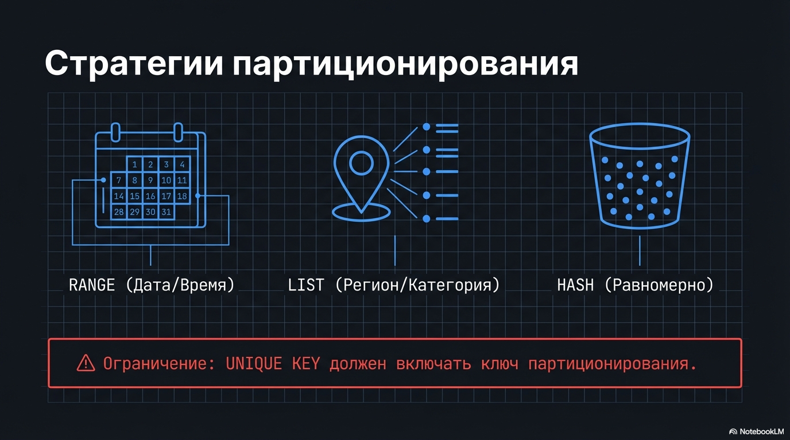

И есть три варианта партиционирования:

- RANGE — режем по диапазону, например по дате - по дням/месяцам или годам. Позволяет отрезать холодное от горячего
- LIST — режем по фиксированному набору значений, например по региону/категории
- HASH — более равномерно разбрасываем по ключу, но хуже для запросов “по диапазону” и сложнее менять число партиций.

Есть ещё вертикальное партиционирование, когда “отрезаем” столбцы, но встречается редко.
В Postgres например это не отдельный механизм, а создание новой таблицы и изменение старой. 

Бывает полезно если условная таблица юзера обрасла всякими флагами и полями, 
а основная нагрузка - на авторизацию для которой только 3-4 поля нужно

##### 3.1.3.3 Кейс C — упёрлись в запись/объём одной машины: идём в шардирование

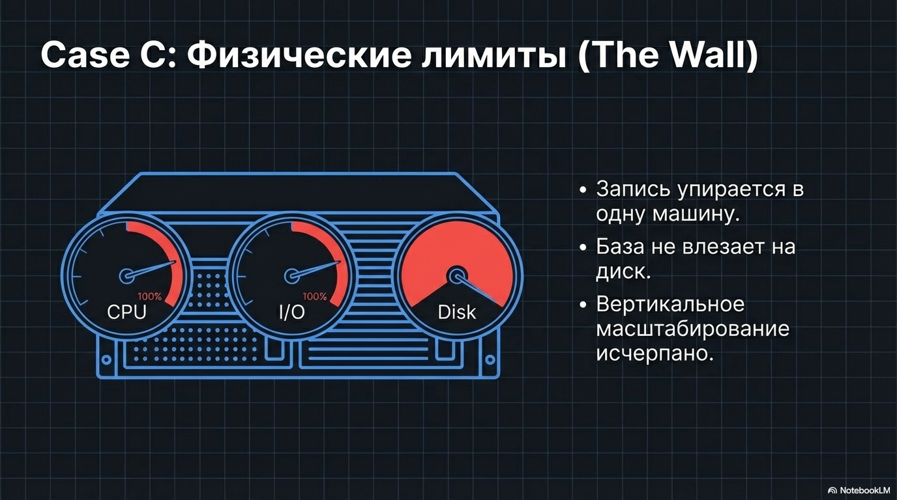

Третий кейс — когда проблема это физические лимиты одного инстанса:

- запись упирается в CPU/IO одной машины, и дальше вертикально масштабировать уже некуда/дорого;
- или слишком большая база и уже не помещается на диск одной машины

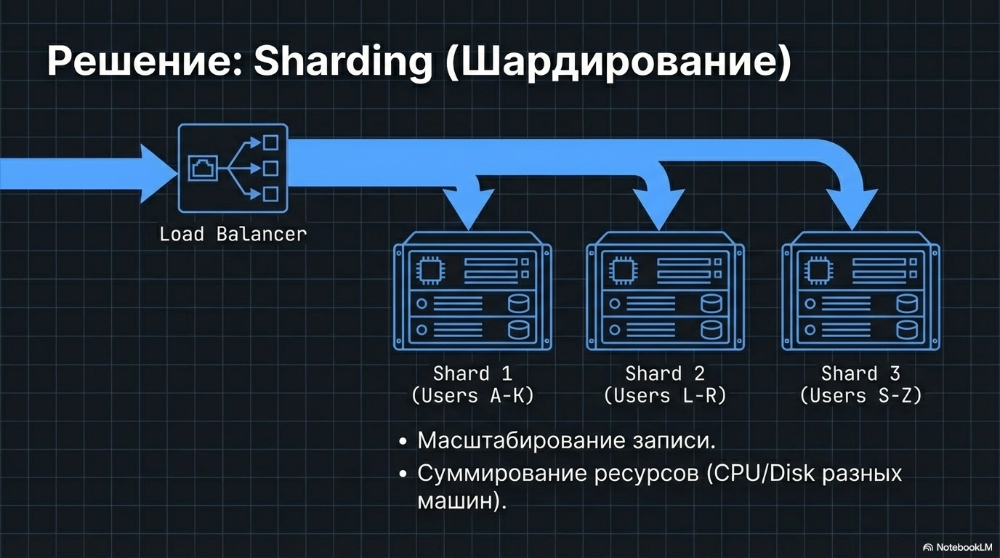

В таком случае нам может помочь шардирование

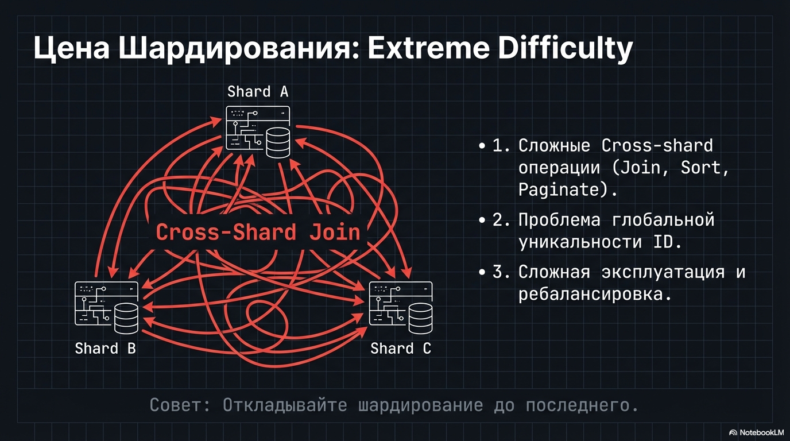

Цена шардирования:

- резкое усложнение любых cross-shard операций (пагинация, сортировка и тп)
- нужно решать вопросы глобальных инвариантов (например, уникальность)
- операционная сложность - сложнее поддерживать такую инфраструктуру, разбирать инциденты, мигрировать данные между шардами

Как видно, это довольно высокая цена, в отличие от репликации/партиционирования.
Поэтому на собеседованиях очень аккуратно стоит предлагать шардирование.

Например, гитхаб имел в среднем аж 950к запросов в секунду на своем MySQL кластере
это хороший пример того, что шардирование обычно откладывают до последнего.

https://www.youtube.com/watch?v=Tq1fif3rcnQ

[GitHub sharding](github_sharding.jpeg)

~~qr?~~

Я сделал простенький пример хэш шардирования и директори-мэп шардирования на базе пхп и посгреса
там есть демонстрационные команды, можете запустить поиграться, все не так страшно как может показаться

https://github.com/savinmikhail/sharding-example

[php sharding example](php_sharding_example.jpeg)

~~qr?~~

#### 3.1.4 Выбор хранилища под характер нагрузки

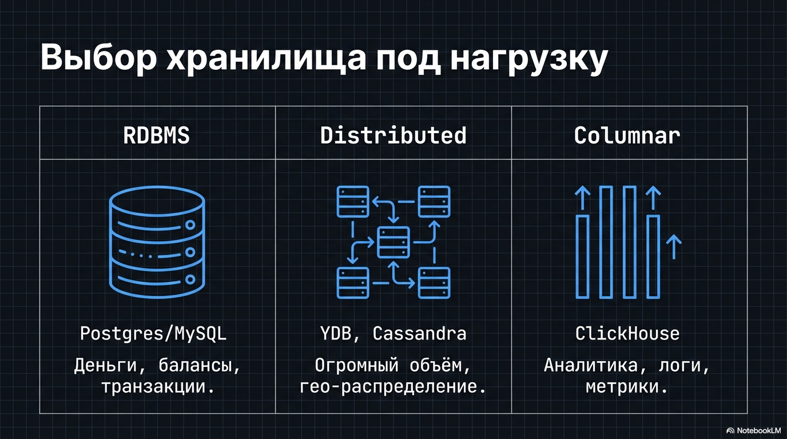
  
Ещё один важный момент: выбор СУБД — это тоже часть масштабирования.
Потому что это напрямую влияет на то, насколько легко будет реализовать репликацию/партиционирование/шардирование и какие ограничения у этих техник в выбранной СУБД.
Часто правильнее не “всё тащить в одну базу”, а комбинировать хранилища под разные требования:

- для денег, балансов, жёстких инвариантов подойдет реляционная СУБД с транзакциями и блокировками (Postgres/MySQL);
- для огромных объёмов и горизонтального масштаба при допустимом лаге — изначально распределённые СУБД. Например, YDB / Cassandra / CockroachDB
- для событий, логов, метрик, аналитики — колоночные/таймсерийные хранилища (ClickHouse/InfluxDB).

Это не “серебряная пуля”, но на практике сильно упрощает жизнь

##### 3.1.5 Финальная связка к собеседованию: что от тебя ждут услышать

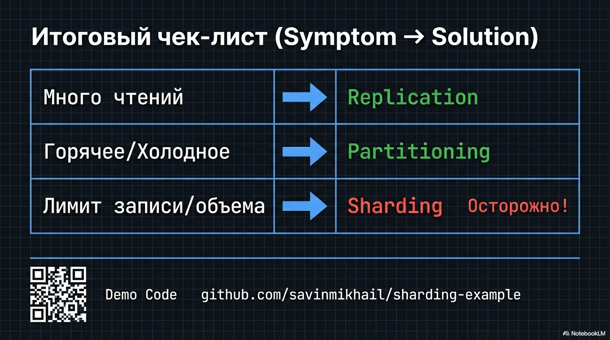

На интервью важно не перечислить термины, а показать, что ты выбираешь решение по симптомам:

- если доминирует чтение — реплики и lag/консистентность;
- если проблема в горячем/холодном и retention — партиционирование и pruning;
- если упёрся в запись/объём одной машины —  шардирование и  цена cross-shard запросов
- для разных доменов подбирать подходящие технологии
