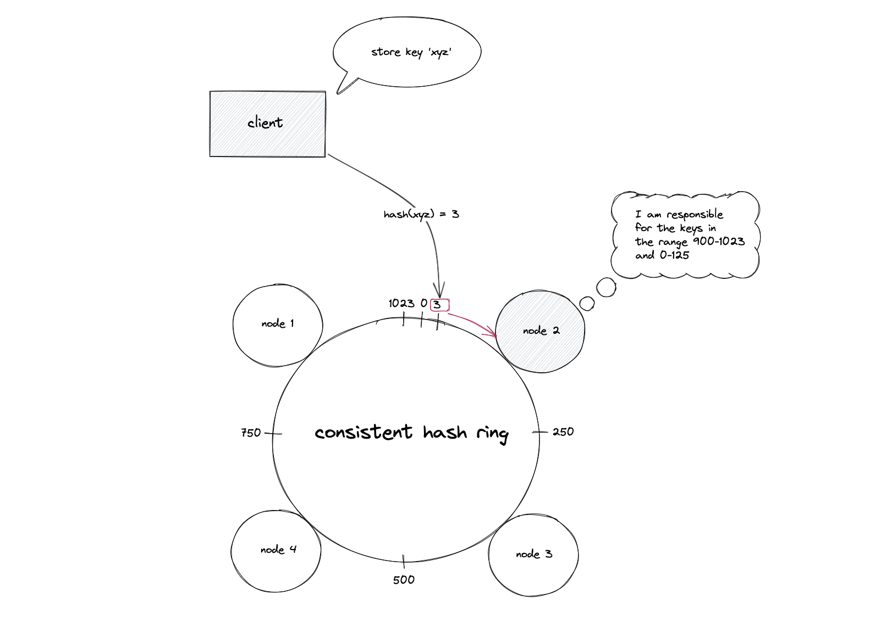
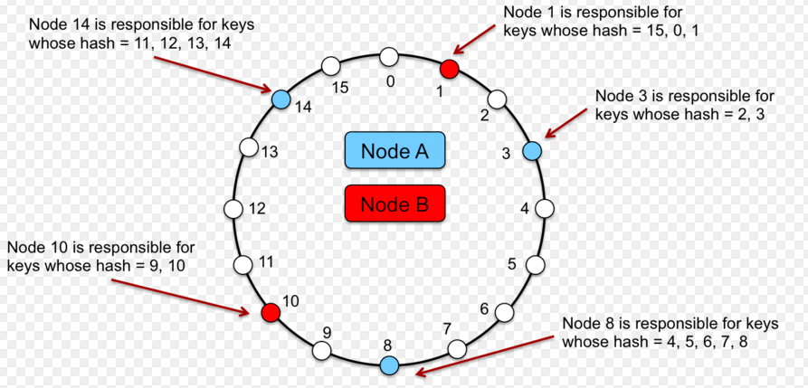
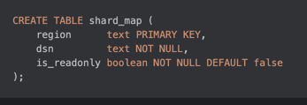

### Блок 3.3. Dynamic Sharding стратегии

#### Введение

Мы уже видели, что отдельные шарды могут перегреваться по разным причинам: skew по данным, hot tenants, hot keys, рост нагрузки.
Плюс со временем нам приходится добавлять новые шарды или убирать старые (рост бизнеса, обслуживание железа).

То есть “один раз порезали и забыли” — работает не всегда.
Часто раскладку данных нужно подстраивать под жизнь без даунтайма

Это и приводит нас к динамическому шардированию.

#### Что такое Dynamic Sharding

Dynamic sharding — это не конкретный алгоритм, а свойство системы:

- уметь добавлять/убирать шарды в рантайме;
- перекладывать tenants/диапазоны между шардами;
- дробить перегретые куски;
- и делать это без даунтайма.

#### 3.3.1. Стратегии динамического шардирования

##### Стратегия 1: Hash sharding → Consistent hashing / HRW + виртуальные ноды

Обычное HASH-шардирование выглядит так

```text
shard = hash(user_id) % N
````

Пока N фиксировано — жить можно.
Но как только добавили/убрали шард, N изменился → меняется результат почти для всех ключей → “переезжает” почти всё.
Это делает рост кластера дорогим и рискованным.

Идея consistent hashing (или HRW/rendezvous hashing) в том, чтобы при изменении числа шардов переезжала только часть ключей, а не почти все.
Подробности “кольца” на собеседовании обычно не требуют

1. Представляем диапазон хеша как круг `0 … 2^32-1`.
2. Для каждого шарда считаем `hash(shard_id)` и ставим его на кольцо.
3. Для каждого ключа считаем `hash(key)` и идём по часовой стрелке до ближайшего шарда.



При добавлении нового шарда:

- он появляется в своей точке на кольце;
- на него переезжают только ключи с хешами в его локальном интервале;
- остальные ключи остались привязаны к прежним шартам.

###### Зачем нужны виртуальные ноды

Проблема следующая: несмотря на кольцо, может быть перекос по нагрузке — например, 8 из 10 запросов попали на один шард.
Поэтому используют виртуальные ноды (vnodes):

* один физический шард представлен множеством виртуальных “кусочков”;
* это выравнивает распределение;
* и делает ребаланс “мелкими порциями” (перекладываем кусочки, а не половину базы).



Ограничение, которое важно проговорить:
vnodes/consistent hashing не лечат hot key — один сверхпопулярный ключ всё равно может перегреть один шард.

##### Стратегия 2: Directory-Based Sharding

второй подход - Directory-based sharding

Вместо жёсткой формулы есть явная “карта маршрутизации” (shard-map):
мы сначала определяем бакет/диапазон/tenant, а потом смотрим, к какому физическому шарду он привязан.



Плюсы:

* можно переносить конкретных tenants/диапазоны без глобального переезда;
* можно делать исключения (“этого крупного клиента — на отдельный шард”).

Чтобы переносить было проще, вводят microsharding:
делим ключи на много бакетов, и бакеты назначаем шардам.

```text
bucket = H(user_id) % 4096
bucket → shard (в shard-map)
```

Этого понимания обычно достаточно, чтобы уверенно отвечать на вопросы на собеседовании.
