### Блок 3.3. Dynamic Sharding стратегии

#### Введение

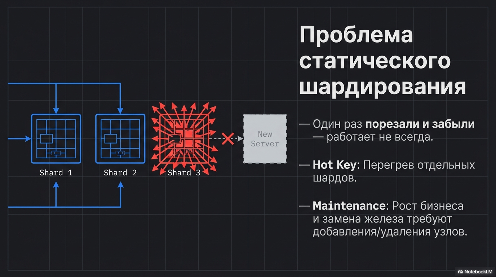

Мы уже видели, что отдельные шарды могут перегреваться по разным причинам (hot key, свежие диапазоны)

Плюс со временем нам приходится добавлять новые шарды или убирать старые из-за роста бизнеса/обслуживания железа

То есть “один раз порезали и забыли” — работает не всегда.

Это и приводит нас к динамическому шардированию.

#### Что такое Dynamic Sharding

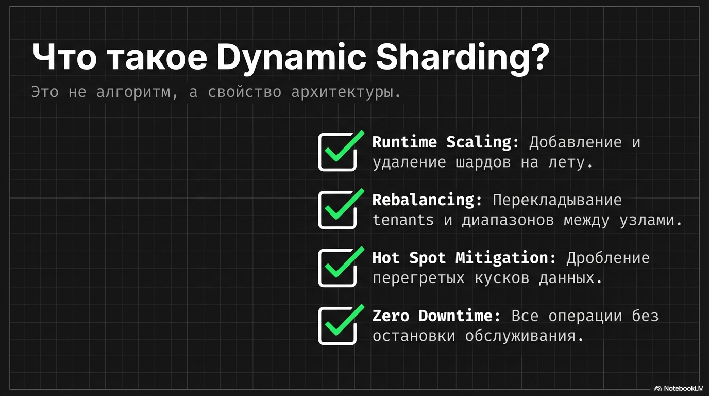

Dynamic sharding — это не конкретный алгоритм, а свойство системы:

- уметь добавлять/убирать шарды в рантайме;
- перекладывать tenants/диапазоны между шардами;
- дробить перегретые куски;
- и делать это без даунтайма.

#### 3.3.1. Стратегии динамического шардирования

Разберем 2 основные стратегии динамического шардирования: consistent hashing и directory based

##### Стратегия 1: Hash sharding → Consistent hashing / HRW + виртуальные ноды

Пример обычного HASH-шардирования

```text
shard = hash(user_id) % N

где N - число шардов
````

```text
shard = hash(42) % 4 = 1234567 % 4 = 3
````

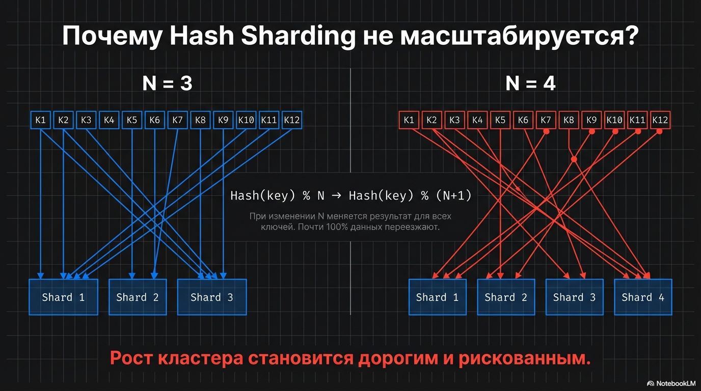

Но у такой схемы есть серьезный недостаток:
как только мы добавили/убрали шард, N изменился, следовательно меняется результат почти для всех ключей  и почти все данные переезжают между шардами

Это делает рост кластера дорогим и рискованным.

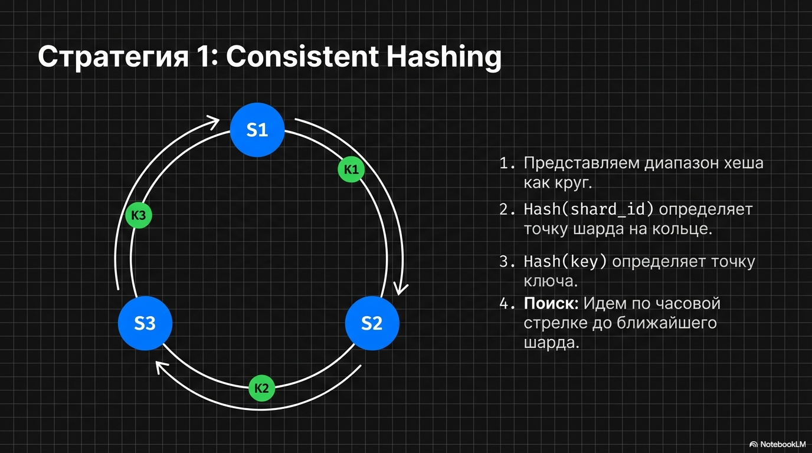

Идея подхода consistent hashing в том, 
чтобы при изменении числа шардов переезжала только часть ключей, а не почти все.

1. Представляем диапазон хеша как круг
2. Для каждого шарда считаем `hash(shard_id)` и ставим его на кольцо.
3. Для каждого ключа считаем `hash(key)` и идём по часовой стрелке до ближайшего шарда.

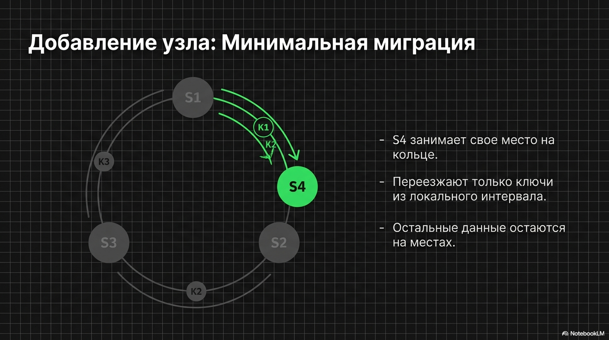

При добавлении нового шарда:

- он появляется в своей точке на кольце;
- на него переезжают только ключи с хешами в его локальном интервале;
- остальные ключи остались привязаны к прежним шартам.


Есть и аналоги - Highest Random Weight (HRW) hashing, он же rendezvous hashing, не будем подробно на этом останавливаться

###### Зачем нужны виртуальные ноды

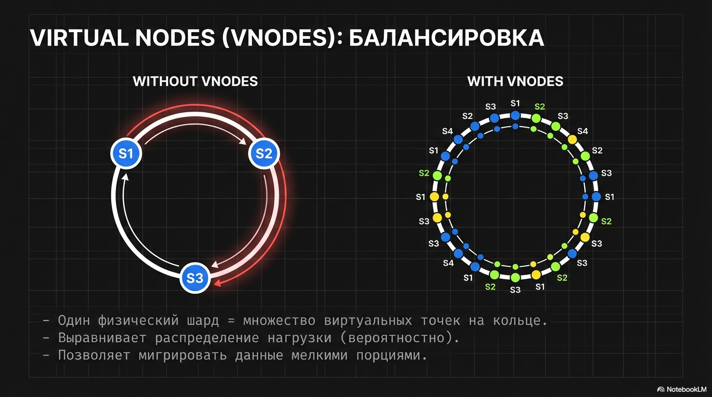

Несмотря на кольцо, может быть перекос по нагрузке — например, 8 из 10 запросов попали на один шард.
Поэтому используют виртуальные ноды (vnodes):

- один физический шард представлен множеством виртуальных “кусочков”;
- это выравнивает распределение и позволяет нам мигрировать меньшее количество данных за раз


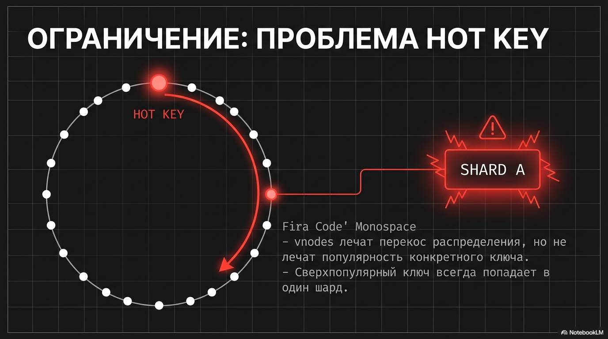

Однако vnodes/consistent hashing не лечат hot key — один сверхпопулярный ключ всё равно может перегреть один шард.

##### Стратегия 2: Directory-Based Sharding

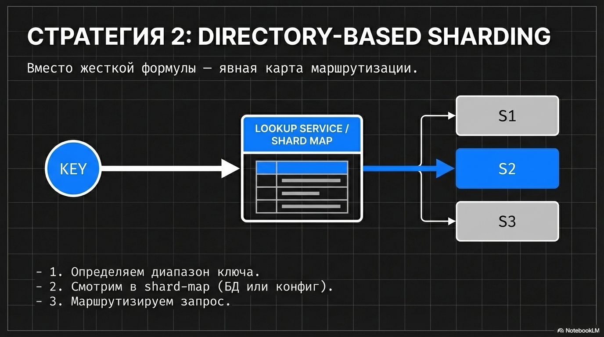

Вторая стратегия - Directory-based sharding

Вместо жёсткой формулы маршрутизации у нас есть явная “карта маршрутизации”, так называемая shard-map:
мы сначала определяем диапазон, в который попадает ключ, а потом смотрим, к какому физическому шарду он привязан.

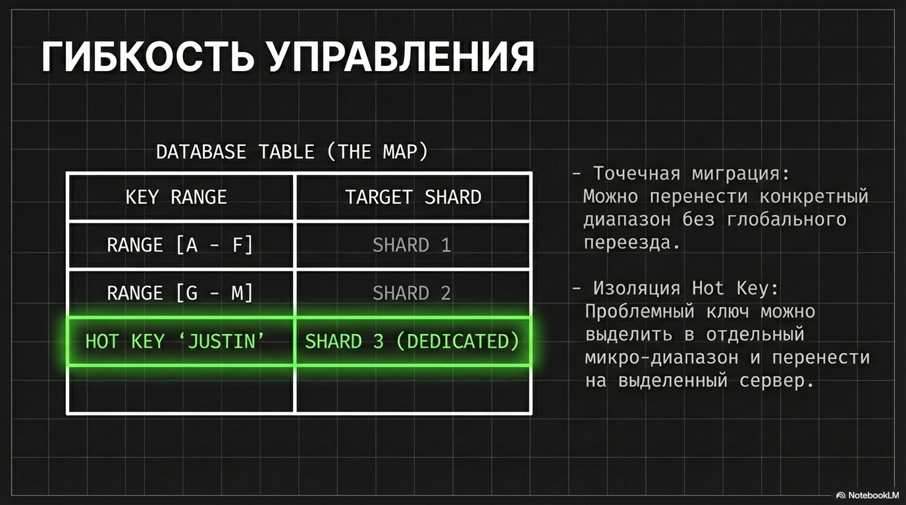

Такая мапа может храниться в базе или конфигах


Плюсы:

- можно переносить диапазоны без глобального переезда;
- легко изолировать горячие ключи на отдельные шарды

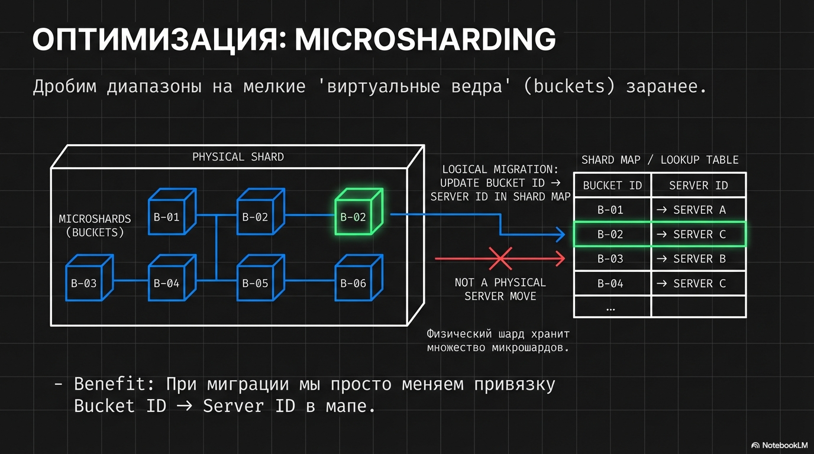

Чтобы переносить было еще проще, вводят microsharding
Идея очень похожа на виртуальные ноды в consistent hashing - дробим диапазоны на изначально более мелкие, и привязываем их к конкретным шардам

```text
bucket = H(user_id) % 4096
bucket → shard (в shard-map)
```

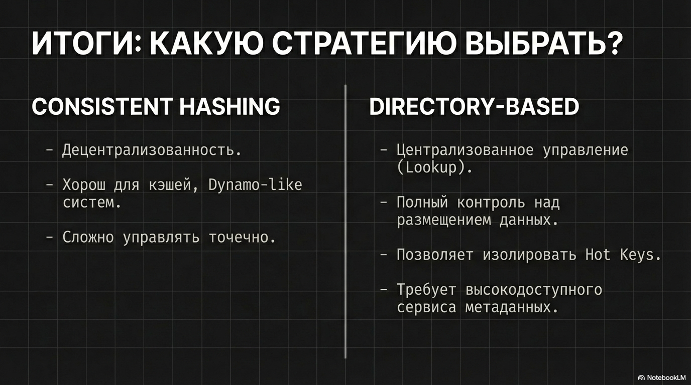

Этого понимания обычно достаточно, чтобы уверенно отвечать на вопросы на собеседовании.
