### 3.4 Rebalancing и миграции без downtime

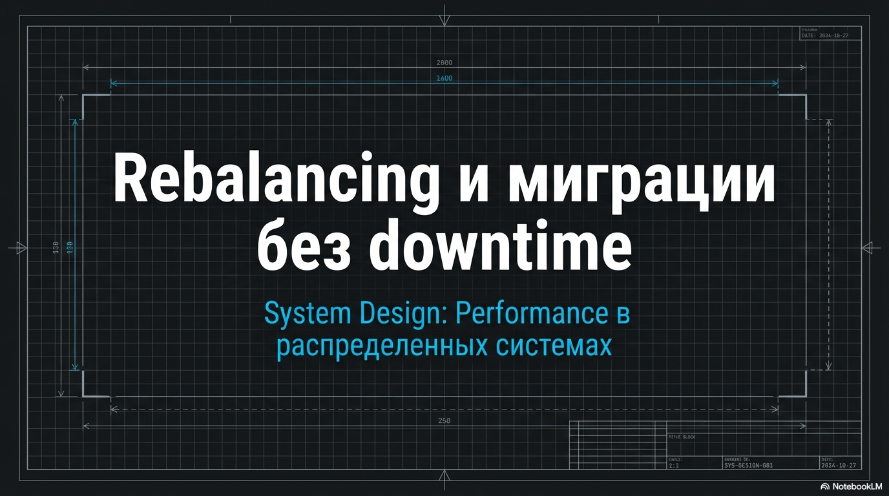

#### 3.4.1. Зачем вообще нужен rebalancing

Мы уже частично затронули проблему перемещения данных между шардами и почему статическое шардирование нас не устраивает,
теперь поговорим об этом подробнее

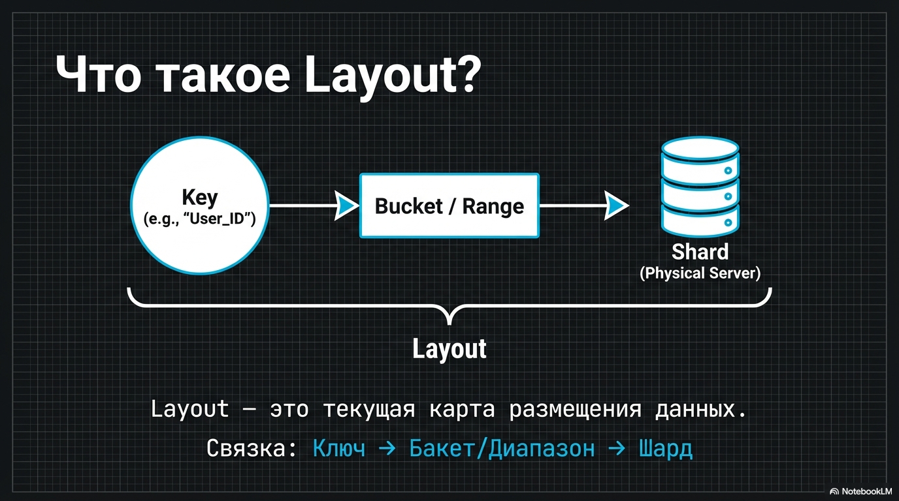

Сначала добавим новый термин
Layout — это текущая карта размещения: какие бакеты/диапазоны закреплены за какими шардами и как мы ключа получаем нужный бакет/диапазон

А rebalancing - это изменение layout'а шардирования без даунтайма

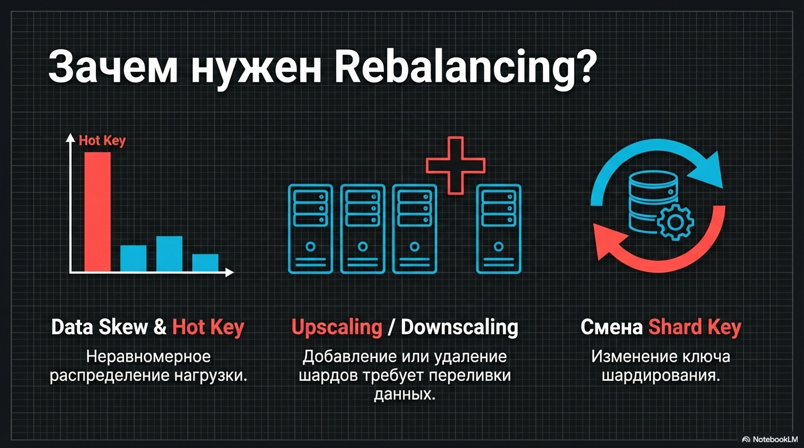

Rebalancing нужен, чтобы избавиться следующих проблем
- data skew и hot key
- upscaling/downscaling: добавили/убрали шарды — нужно перелить данные;
- смена shard key - тоже нужна переливка

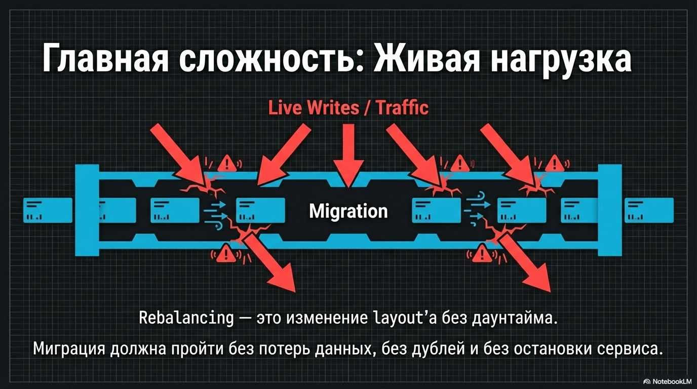

Главная сложность: миграция идёт на живой нагрузке — без потерь, дублей и долгого downtime.

#### 3.4.2. Основные проблемы при миграции

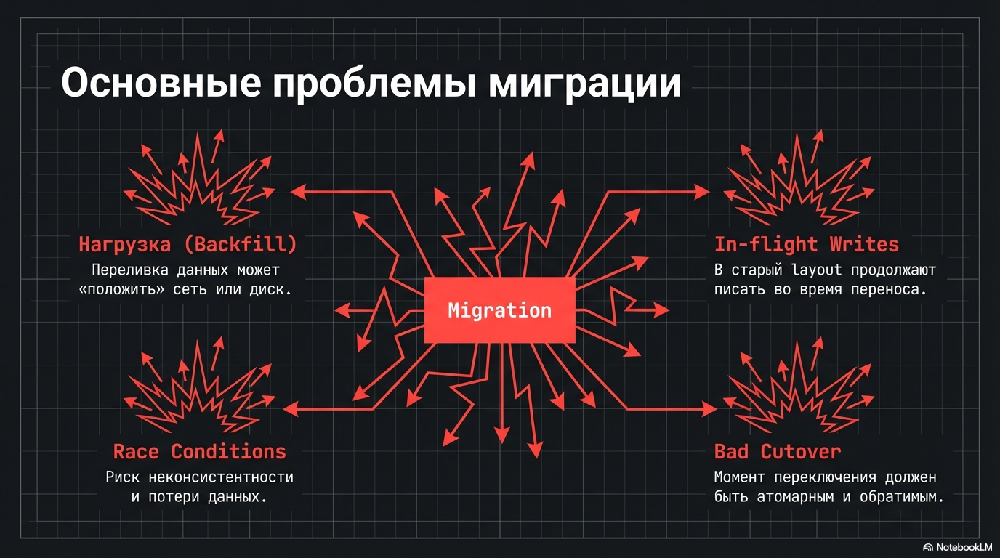

Типовые проблемы, которые важно учитывать:
- нагрузка: backfill - переливка уже существующих данных - легко может положить сеть/диск, если не ограничивать его и не мониторить
- in-flight writes: пока мы переливаем существующие данные, в старый layout продолжают писать;
- cutover - момент переключения между старым и новым layout'ом должен быть быстрым, атомарным и откатываемым
- неконсистентность данных - во время переноса можем задублировать/потерять какие-то данные

#### 3.4.3 Общая структура online-миграции

rebalancing обычно состоит из трех этапов

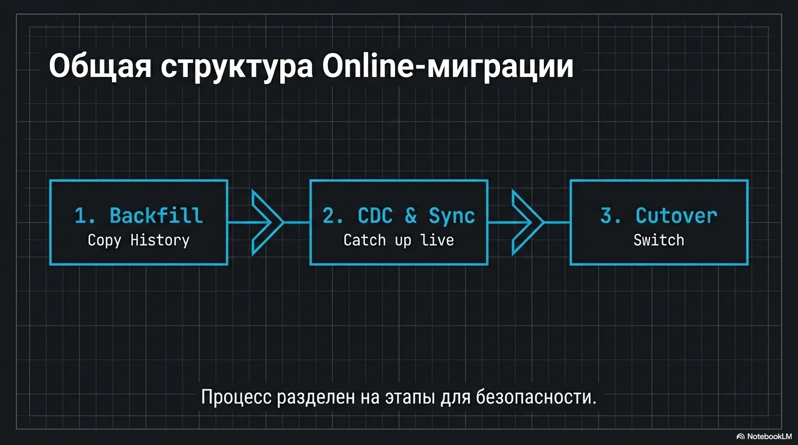

Разберём по шагам.

1. 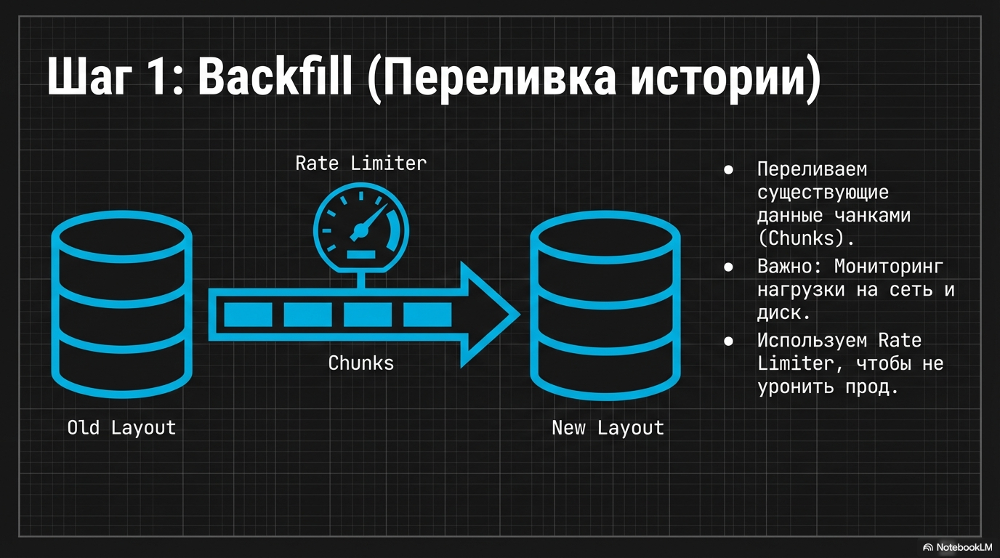
   Первый шаг - Backfill
   Переливаем существующие записи из старого layout в новый чанками, с мониторингом прогресса и нагрузки на сеть/диск

2. 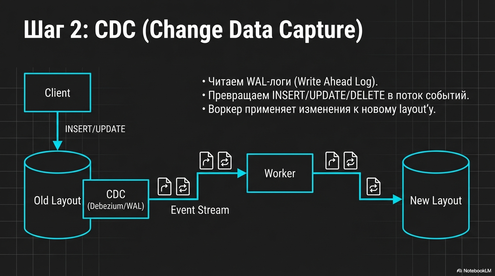
   Пока идёт backfill, в старую базу продолжают прилетать изменения.
   Чтобы их не потерять, используем CDC(Change Data Capture), например Debezium, читаем WAL-логи, каждое `INSERT/UPDATE/DELETE` превращаем в событие.
   Отдельным воркером применяем эти изменения к новому layout'у
   Здесь важно учесть идемпотентность и порядок записи
   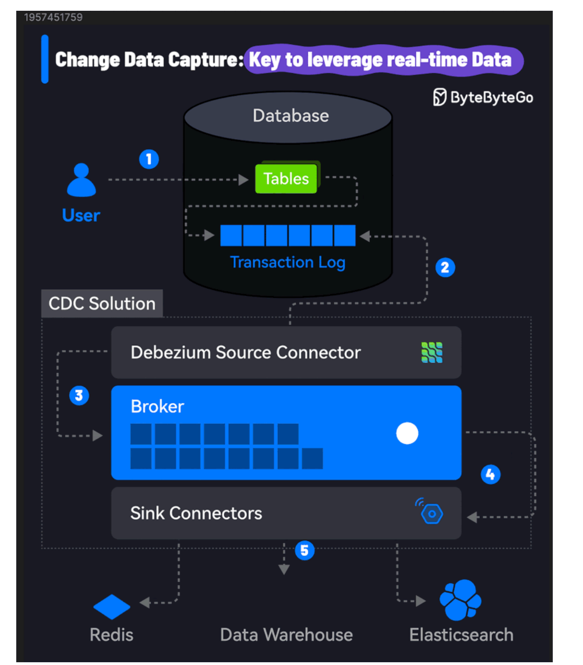

3. 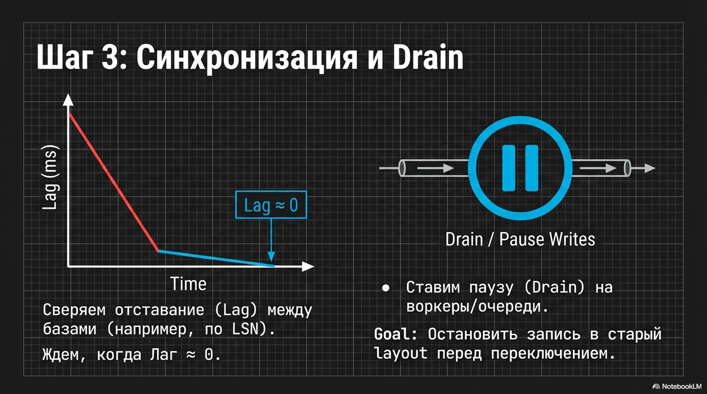 При этом постоянно сверяем отставание в записях между layout'ами (например по LSN), и когда оно примерно равно нулю

4. Ставим паузу на воркеры/очереди или drain’им их, чтобы во время cutover не было задач, которые продолжают писать по старой shard-map

5. 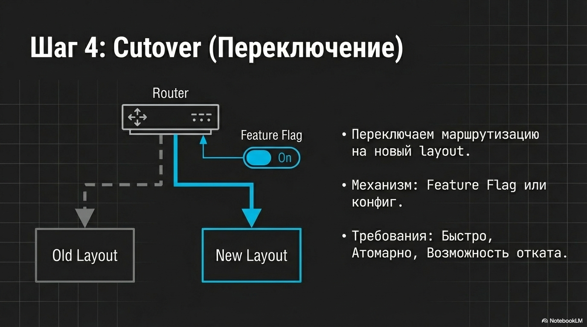 
   и тогда уже переходим к стадии Cutover - то есть переключаем маршрутизацию на новый layout. 
   это должно происходить быстро и важно иметь возможность быстро откатиться. Можно сделать через фича флаг, к примеру

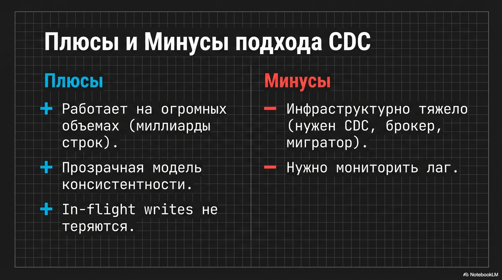

Плюсы такого подхода:

- работает на сотнях гигабайт и миллиардах строк;
- модель консистентности прозрачная;
- in-flight writes не теряются.

Минусы:

- инфраструктурно тяжелее:

    - нужен CDC/репликация или брокер;
    - нужен мигратор с retry/идемпотентностью;
    - нужно мониторить лаг.

#### 3.4.4 Упрощённые варианты, которые вы услышите

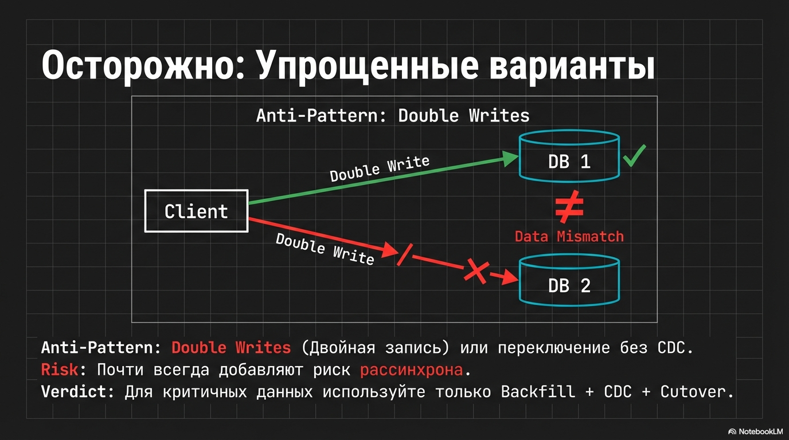

На практике встречаются упрощённые миграции без CDC (например, временно писать в два места или переключать роутинг раньше, а хвост догонять фоном).
Они проще, но почти всегда добавляют риск рассинхрона и усложняют reasoning по консистентности
Поэтому для критичных данных лучше держаться схемы “backfill + журнал изменений + быстрый cutover”.

#### 3.4.5. Итоги

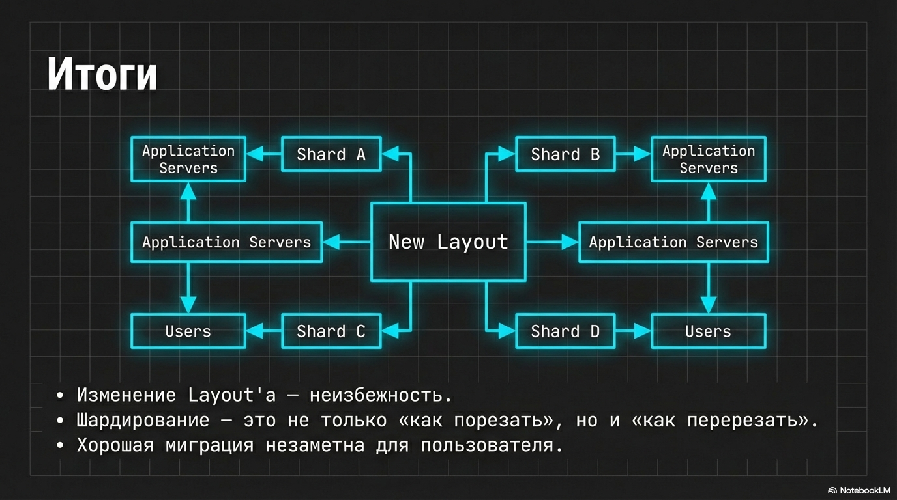

Таким образом, рано или поздно layout придётся менять - по тем или иным причинам. 
поэтому шардирование — это не только “как порезать”, но и “как потом это перерезать и не убить прод”.
