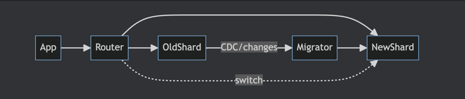

### 2.4.5. Rebalancing и миграции без downtime

#### 2.4.5.1. Зачем вообще нужен rebalancing

Мы уже частично затронули проблему перемещения данных между шардами в главе о динамическом шардировании и почему статическое шардирование нас не устраивает,
теперь поговорим об этом подробнее

Сначала добавим новый термин
Layout шардирования — это текущая схема “ключ → шард”:
выбор shard key, способ резки (range/hash/buckets) и shard-map, который говорит, какие данные лежат на каких нодах.

Так мы переходим к теме rebalancing - изменение layout'а шардирования так, чтоб избавиться следующих проблем
- data skew: один шард разросся, остальные маленькие;
- hot tenants / hot keys: один шард получает львиную долю RPS;
- upscaling/downscaling: добавили/убрали шарды — нужно переразложить данные;
- иногда меняется shard key из-за доменной модели.

Главная сложность: миграция идёт на живой нагрузке — без потерь, дублей и долгого downtime.

#### 2.4.5.2. Основные проблемы при миграции

Типовые проблемы, которые важно учитывать:
- in-flight writes: пока вы переливаете “историю”, в старый layout продолжают писать;
- race conditions: часть чтений уже в новом, часть ещё в старом — можно увидеть разные данные;
- cutover: переключение должно быть быстрым, атомарным в пределах системы и откатываемым;
- нагрузка: backfill легко положит сеть/диск, если не ограничивать скорость.
- неконсистентность данных - во время переноса можем задублировать/потерять какие-то данные

#### 2.4.5.3 Общая структура online-миграции

схемы rebalancing’а обычно состоят из трех этапов

1. Перенос bulk-данных (backfill)
   Перекачиваем основной объём из старого layout’а в новый.

2. Синхронизация изменений (CDC / журнал изменений)
   Пока идёт backfill, фиксируем все новые изменения и доносим их до нового шарда.

3. Переключение маршрутизации (cutover)
   Переводим чтение/запись на новый layout, минимизируя окно гонок.

Примерная схема:

Разберём по шагам.

1) Первый шаг - Backfill
   Переливаем основной объём из старого layout в новый чанками, с троттлингом и прогрессом.

1. Пока идёт backfill, в старую базу продолжают прилетать изменения.
   Чтобы их не потерять, используем CDC(Change Data Capture), например Debezium, читаем WAL-логи, каждое `INSERT/UPDATE/DELETE` превращаем в событие.
   Отдельным воркером применяем эти изменения к новому layout'у, важно учесть идемпотентность и порядок записи

2. Мы сверяем отставание в записях между layout'ами (например по LSN), и когда оно примерно равно нулю

3. производим drain очередей - перед cutover вычищаем очереди задач/сообщений, которые пишут в старый layout

4. и переходим к стадии Cutover - то есть переключаем маршрутизацию на новый layout. это должно происходить быстро и важно иметь возможность быстро откатиться

Плюсы такого подхода:

- работает на сотнях гигабайт и миллиардах строк;
- модель консистентности прозрачная;
- in-flight writes не теряются.

Минусы:

- инфраструктурно тяжелее:

    - нужен CDC/репликация или брокер;
    - нужен мигратор с retry/идемпотентностью;
    - нужно мониторить лаг.

#### 2.4.5.4 Упрощённые варианты, которые вы услышите

Иногда вместо полноценного CDC используют более простые схемы:

- Dual write
  Пишем в старый и новый layout после backfill.
  Проблемы: нет журнала, нет гарантии порядка, легко получить рассинхрон и двойные апдейты.
  Годится только для маленьких, не критичных данных.

- Write to new, read from old + мигратор
  Новые записи идут в новый layout, читаем ещё из старого, фоновый мигратор подтягивает историю.
  Работает, если объёмы умеренные и можно пережить мелкие расхождения.

- Routing first
  Сначала меняем shard-map, горячие ключи сразу начинают жить в новом layout,
  хвост медленно вывозим фоном. Удобно для разгрузки горячих шардов, но сложнее reasoning по консистентности.

#### 2.4.5.5. Итоги

Таким образом, рано или поздно layout придётся менять - по тем или иным причинам. 
поэтому шардирование — это не только “как порезать”, но и “как потом это перерезать и не убить прод”.
