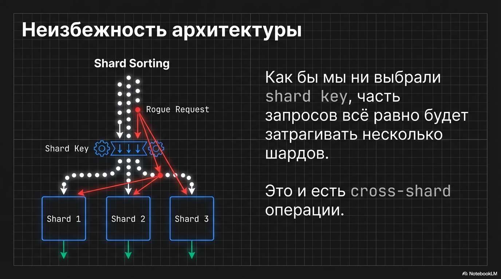
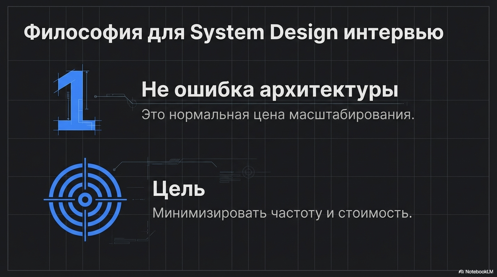
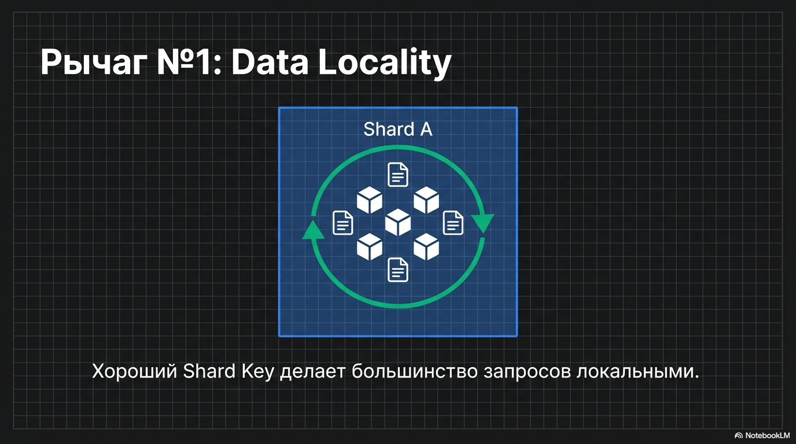
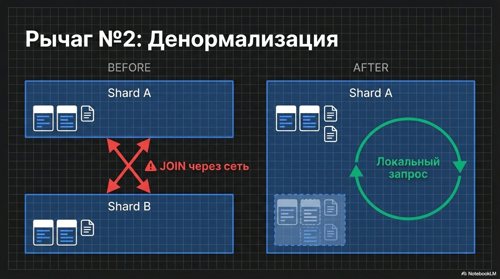
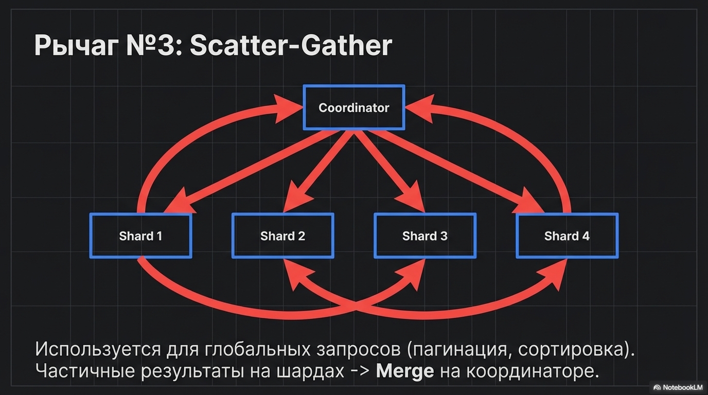
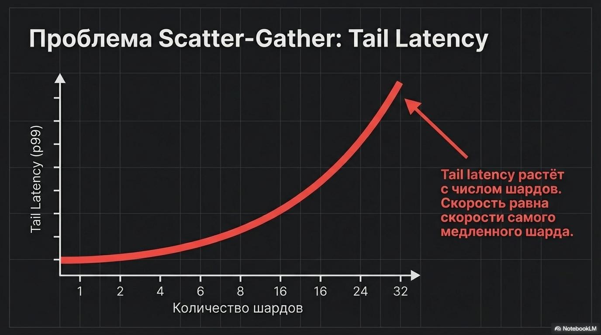
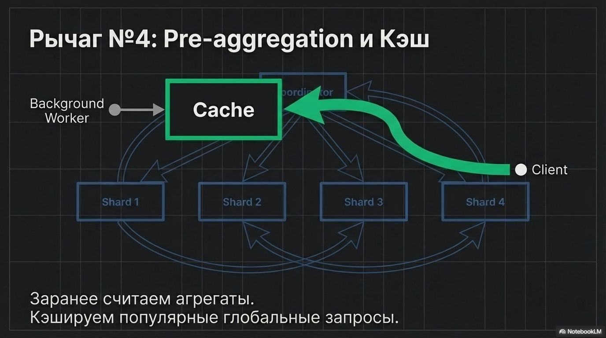
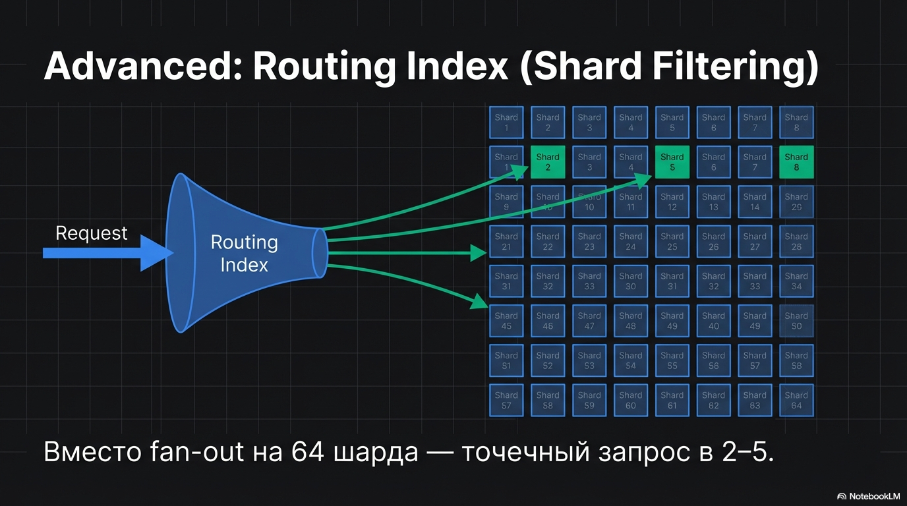
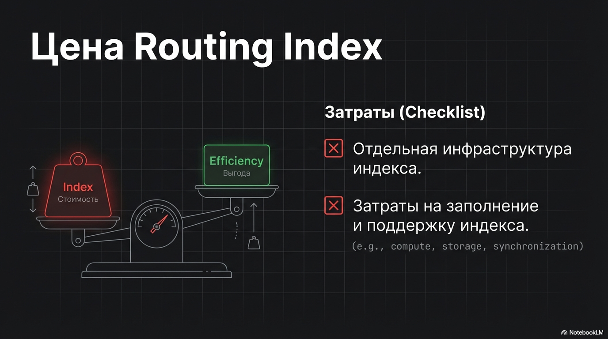

### 3.5 Cross-shard операции 

Как бы мы ни выбрали shard key, часть запросов всё равно будет затрагивать несколько шардов — это и есть cross-shard операции.
На собеседованиях важно уметь сказать 2 вещи:

1) Cross-shard — это не “ошибка архитектуры”, а нормальная цена масштабирования.
2) Наша задача — минимизировать их частоту и стоимость.

Базовые рычаги:
-  data locality : хороший shard key делает большинство запросов локальными,
-  денормализация : убираем JOIN через сеть,
-  scatter-gather : если запрос глобальный, например пагинация/сортировка, 
  то делаем частичные результаты на шардах и merge на координаторе.  но tail latency растёт с числом шардов,
-  pre-aggregation / кеш : заранее считаем агрегаты и кешируем популярные глобальные запросы.

Ещё один практический рычаг: routing index (или “shard filtering”) — по фильтрам определяем, какие шарды вообще трогать,
чтобы вместо fan-out на 64 шарда ходить в 2–5.

Цена — отдельная инфраструктура индекса и заполнение

Этого понимания достаточно для большинства backend-интервью; 
глубже имеет смысл идти только если вы реально строите шардированный кластер и отчётность/поиск на нём
