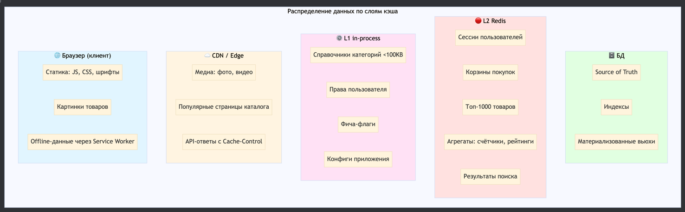
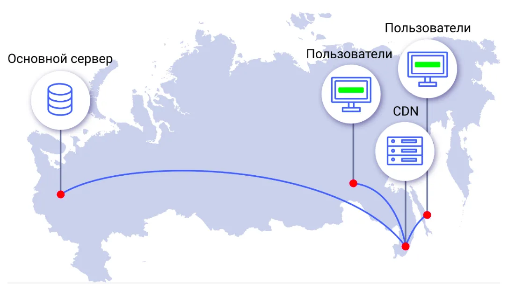

### Блок 4.2. Многоуровневое кэширование и оптимизации

#### Зачем слои?

Как мы сказали, кэш обычно решает две задачи: ускоряет ответ и разгружает компоненты позади него.

Так как наша цель - улучшить latency и throughput, то кэш выгодно располагать как можно ближе к пользователю:
чем раньше перехватим запрос, тем меньше работы делают нижестоящие слои - backend и БД

Отсюда и появляется многоуровневое кэширование

На схеме видно несколько уровней кеша — от браузера и до базы. Пройдёмся по ним и разберём, что где хранить.

#### 1. Клиент

Самый близкий к пользователю кэш — в браузере

Его задача, чтобы клиент не качал одно и то же из сети лишний раз

обычно здесь кэшируется ассеты клиента: JS/CSS файлы и шрифты

Таким кэшом можно управлять с помощью
- http заголовков, например: Cache-Control / ETag / Last-Modified
- а также добавлением ключа версии в имя файла

#### 2. CDN

Следующий слой находится между клиентом и нашим origin - это CDN узлы 

На этом уровне храним:
- медиа: изображения, видео, файлы;
- статику фронта: JS/CSS/шрифты (те же ассеты, что и в браузере - CDN ускоряет первый “холодный” запрос и снижает нагрузку на origin при этом).

CDN отвечает с узла, географически близкого к пользователю, что приводит к уменьшению latency.
И снимает с origin часть трафика.

#### 3. L1 in-process

Третий слой — L1-кэш прямо в процессе приложения, на каждой ноде отдельно.

Здесь имеет смысл хранить
- небольшие справочники (категории, статусы);
- фича-флаги и конфиги приложения.

Другие данные обычно не стоит здесь кэшировать, так как сервис станет stateful,
и может начать отдавать пользователю разные данные на одинаковый запрос в зависимости от балансировки

#### 4. L2 Redis

Четвёртый слой — общий кластерный кэш, обычно Redis.

На этом уровне можем закешировать
- топ товаров, который постоянно читают;
- какие-нибудь тяжёлые вычисления, например персональные рекомендации
- результаты запроса в стороннее АПИ, если приемлемо

#### 5. База данных

Последний слой — сама база данных, наш источник истины

Там находятся:
- как истинные данные;
- так и структуры для ускорения запросов: индексы, материализованные представления, собственный кэш бд и прочее

До базы мы доходим, когда:
- кэш промахнулся на всех предыдущих уровнях;
- или когда нужны строго консистентные данные

#### 6. Итог

Таким образом, по мере движения слева направо (от браузера к БД) растёт точность и надёжность данных, 
но уменьшается скорость ответа и растет нагрузка.

На собеседовании обычно ждут не “поставим Redis”, а разложение по слоям: что кэшируем где, почему, и какая цена по консистентности.
