### Блок 4.4. Решение сложных проблем кэширования


мы уже обсудили проблему когерентности кеша

Но кроме нее мы имеем несколько распространенных проблем. Расскажу о них в порядке убывания важности для собесов и работы

#### 4.4.1 Thundering herd

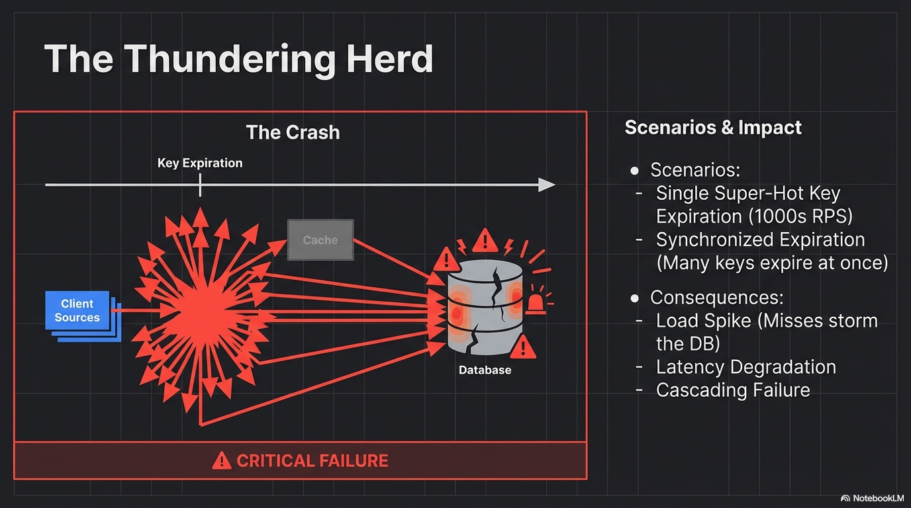

Первая из них - thundering herd (грохочущее стадо), он же dogpile/stampede и куча других названий

Два типовых сценария:

- истёк один супер-горячий ключ (тысячи RPS на ключ);
- много ключей истекают почти синхронно (одинаковый TTL).

Из-за этого много запросов одновременно получают miss и штурмуют БД что приводит к
- всплеску нагрузки,
- росту latency,
- иногда каскадному отказу

4 рабочих приёма:

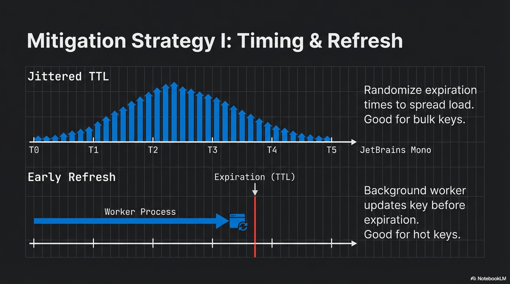

- Jittered TTL: рандомизируем TTL и размазываем истечения во времени (полезно для множества ключей, почти не помогает для одного горячего).
- Early refresh: обновляем ключ заранее отдельным воркером (работает и для горячего ключа, но может делать лишнюю работу).
- 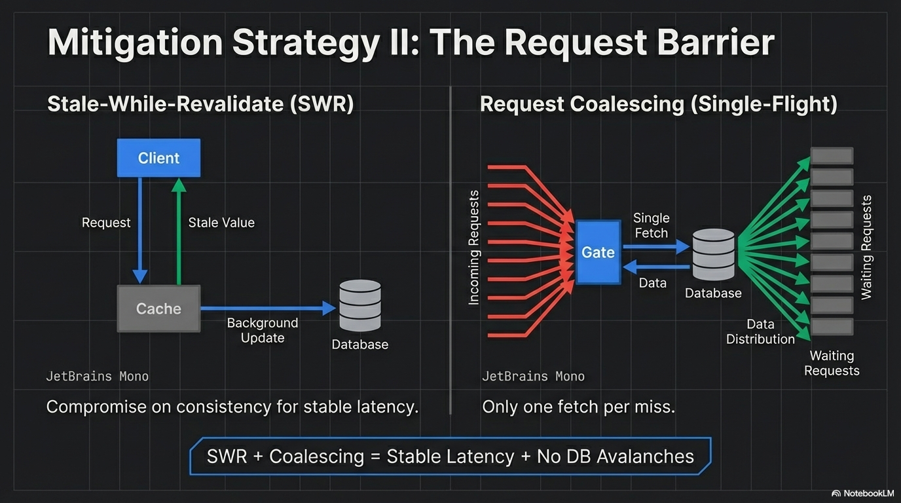 Stale-while-revalidate: отдаём слегка устаревшее значение, а обновление делаем в фоне (компромисс по консистентности).
- Request coalescing (single-flight): при miss только один запрос делает fetch в БД, остальные ждут/читают результат 
  (сильно снижает нагрузку на горячем ключе, но важно ограничивать ожидание таймаутами и TTL лока).

SWR часто комбинируют с coalescing: первый даёт стабильный latency, второй — убирает лавину запросов в БД.

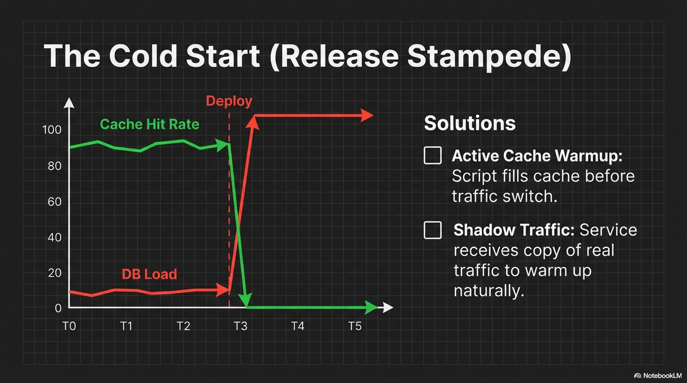

Релиз часто выглядит как stampede: новая версия приходит на холодный кэш

Здесь нам помог бы прогрев кеша - когда мы при деплое заполняем кеш чтоб сразу после релиза он начал работать

Здесь можем использовать или Active cache warmup - когда скриптом наполняем кэш, либо shadow - даем сервису копию трафика, чтобы он нативно прогрелся, но этот подход сложнее

#### 4.4.2 stale data / forever cache

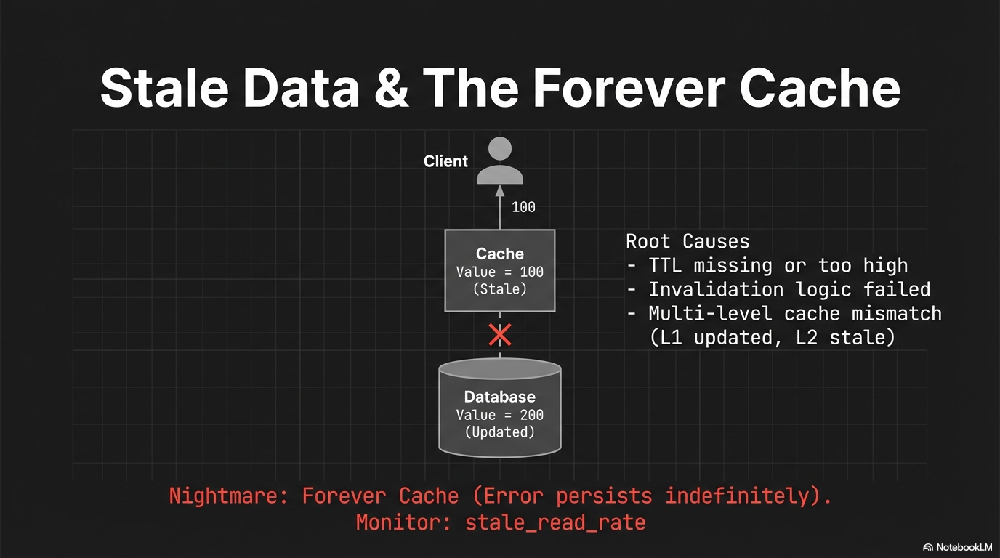

следующая типичная проблема кэша — stale data

Это когда в кэше лежит старое значение, которое уже не совпадает с базой, но мы продолжаем его раздавать.

Худший вариант - это forever cache - когда ключ живёт очень долго и ошибка держится неделями.

Типовые причины:

- нет TTL или он слишком большой;
- инвалидация не срабатывает или срабатывает не везде;
- несколько уровней кэша, а инвалидируем только один из них.

как мониторить stale data мы уже проговорили немного ранее

##### 4.4.3.1 Политики вытеснения (eviction)

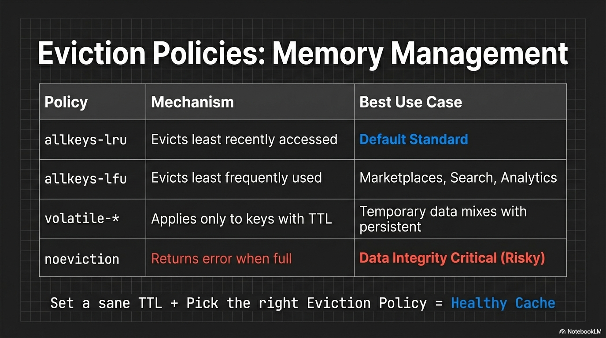

Даже если TTL и инвалидация настроены, остаётся ещё один важный фактор:
как кэш выбирает, какие ключи выкинуть, когда память заканчивается.

От eviction-политики зависит:

- будут ли вылетать в первую очередь малополезные/редко читаемые ключи,
- или мы начнём терять горячие данные, а устаревшие при этом будут жить дольше.

В Redis это задаётся конфигом. На практике чаще всего используют:

- `allkeys-lru` - Least Recently Used - вытесняем давно не используемые ключи;
- `allkeys-lfu` - Least Frequently Used вытесняем реже всего используемые (часто лучший вариант для маркетплейсов: каталоги, поиск, рекомендации);
- `volatile-*` - те же подходы, но только для ключей с TTL;
- `noeviction` - никого не выкидываем, при заполнении памяти начинаются ошибки.

Итого по stale data:

- ставим вменяемый TTL,
- следим за stale_read_rate,
- подбираем eviction-политику

иначе кэш превращается не в ускорение, а в систематическое раздавание старых данных.

#### 4.4.3 hot keys + Separate tier для hot keys

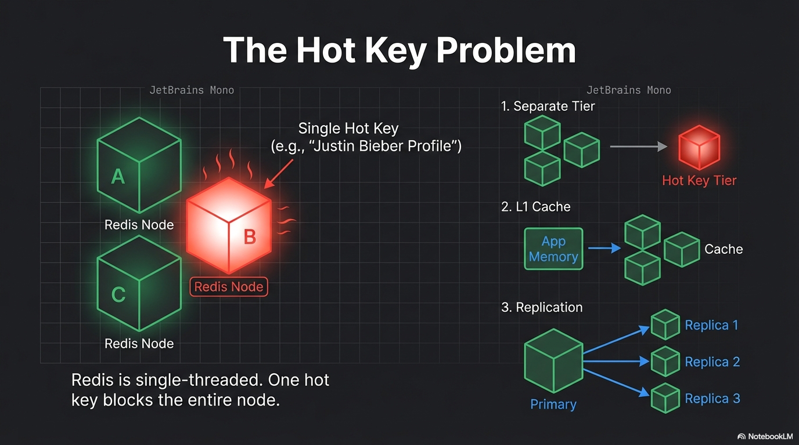

Иногда проблема не “кэш в целом”, а один сверхпопулярный ключ

Всё бы ничего, но Redis работает однопоточно — поэтому нагрузка на чтение одного ключа может мешат читать/писать остальные

Типовые решения:

1. Пднять отдельный инстанс редиса только под горячие ключи чтоб не положить остальные
2. L1 кэш на уровне приложения. Пусть 1000 запросов PHP читают из оперативки, а не из Redis.
3. Репликация редиса

#### 4.4.4 состояние гонки

Кэш — stateful слой, поэтому возможна race condition

Решение здесь как и везде - пессимистичная или оптимистичная блокировки

##### 1) Оптимистичная
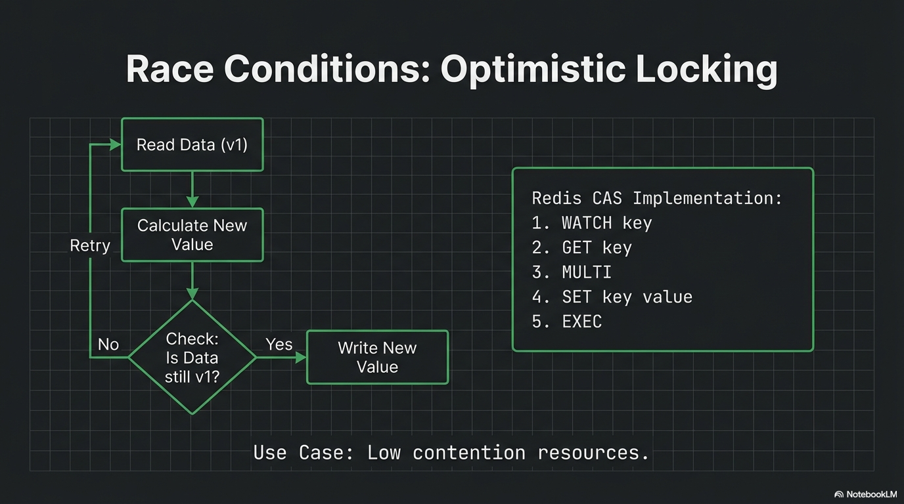

Оптимистичная блокировка значит, что Пишем в кэш только если данные не менялись с момента чтения; иначе — перечитываем  и пробуем снова.

Есть 2 механизма

- CAS(compare and set) подход: на примере редиса работает через команды `WATCH->MULTI->EXEC`
  

- И версионирование ключей: в ключи добавляем версию, например `product:123:v5`, а также храним и инкрементируем ключ с последней версией: `product:123:version = 7`

Оптимистичная блокировка подходит при низкой конкуренции на ключ; иначе будет много ретраев.

##### 2) Пессимистичная 

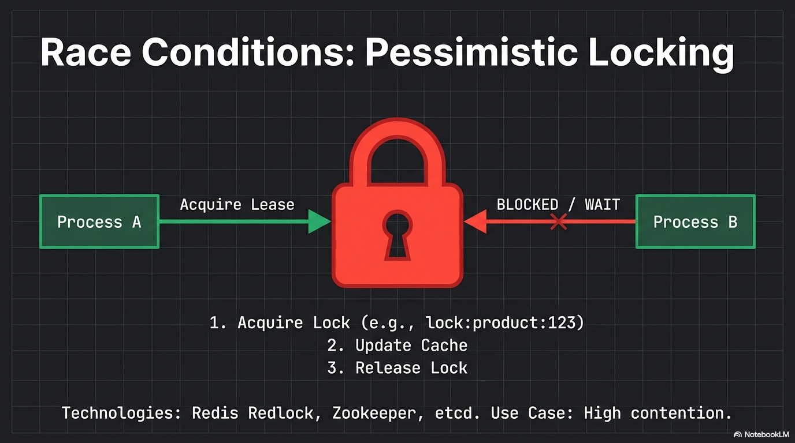

Пессимистичная блокировка значит, что мы Запрещаем параллельные обновления для ресурса: 
берём лок/lease, например `lock:product:123` → обновляем кэш → отпускаем. 
Пока ключ занят, Остальные ждут/ретраят/фейлятся.

Реализации:
- Redis (Redlock/lock с lease),
- Zookeeper/etcd,
- lease-based locks.

Зачастую на собеседовании вам достаточно оптимистичной блокировки, с пессимистичными много ньюансов и подходят для большой конкурентности

#### 4.4.5 несовместимость релизов через кэш

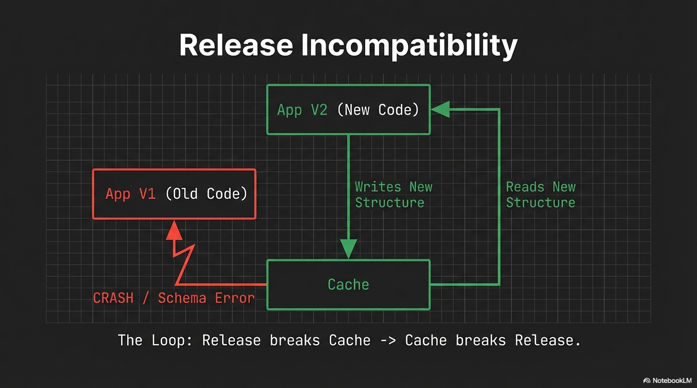

При canary/blue-green деплое две версии приложения одновременно работают с одним кэшем. 
Если формат данных изменился, версии начинают ломать друг друга.

Так как одна версия недосчитывается нужного поля, либо не может новое поле смапить на структуру в коде

В итоге кеш сломал релиз, а релиз сломал кеш

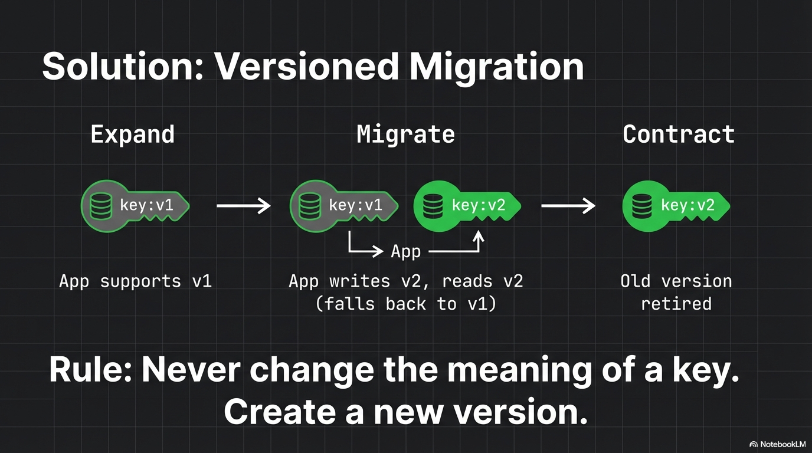

Стандартное решение — версионировать ключи по схеме:

```php
product:123:v1
product:123:v2
```

Это тот же принцип, что expand–migrate–contract: сначала добавляем совместимость (версионируем ключи), некоторое время живём в двух форматах, потом убираем старый.

Главное не перепутать с версионированием которое мы делали выше для оптимистичной блокировки
