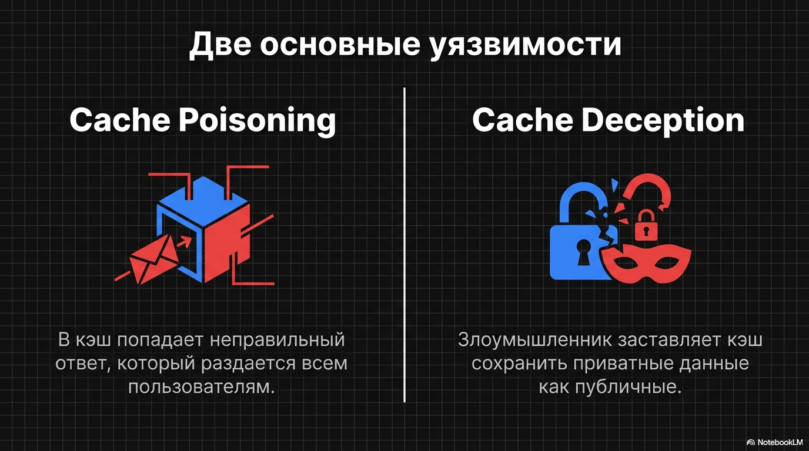
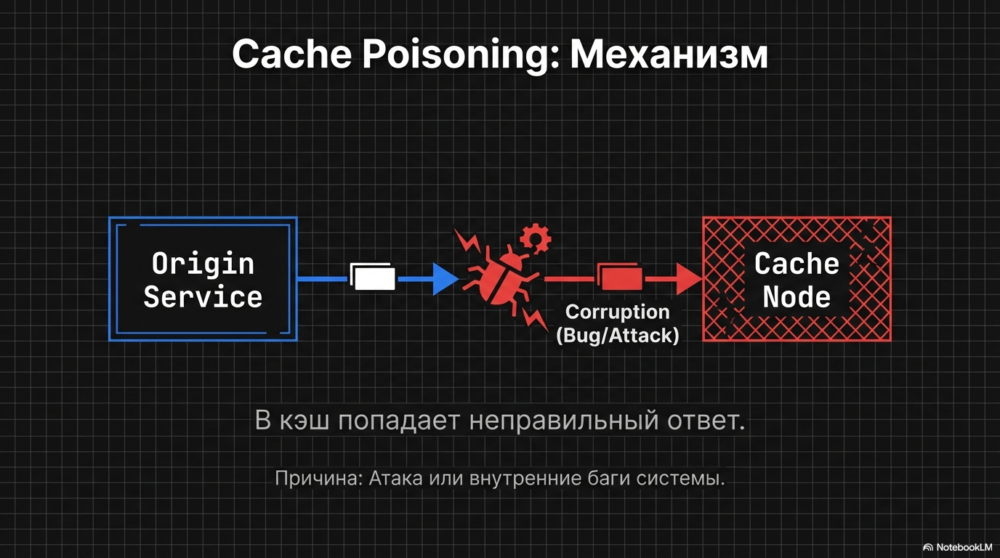
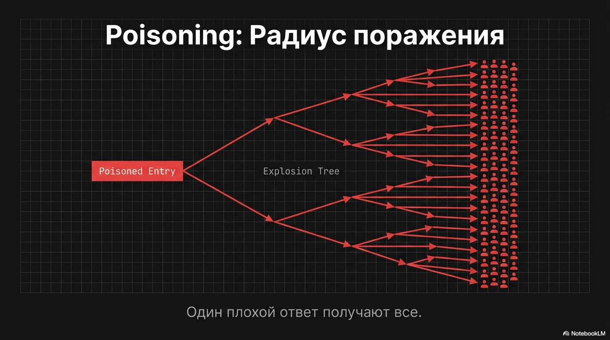
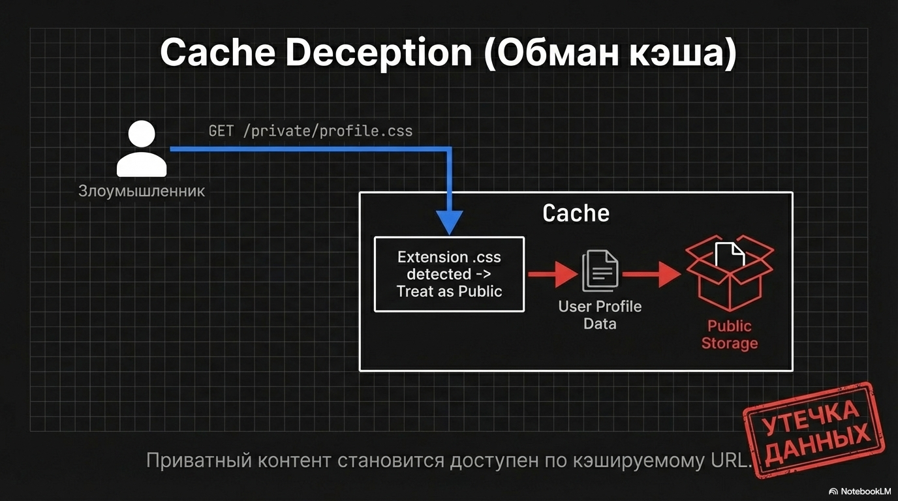
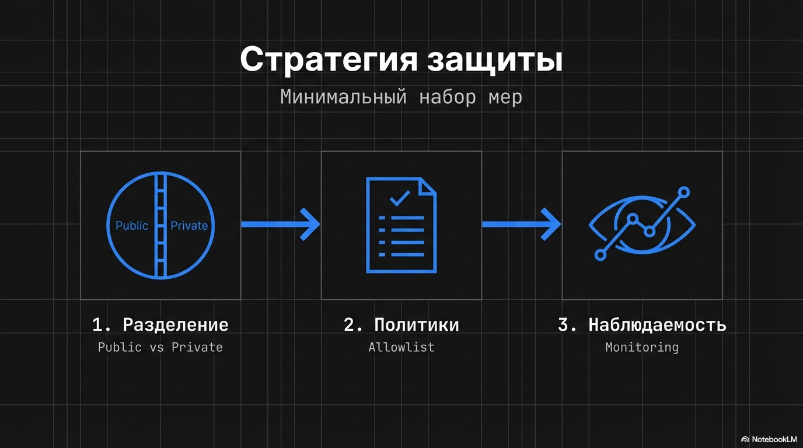

### Блок 4.6. Кэш как поверхность атаки

Кэш к тому же может являться поверхностью атаки для злоумышленников

Две основных уязвимости - cache poisoning & cache deception

Cache poisoning - Это ситуация, когда в кэш попадает неправильный ответ, и потом его получают все.

Но бывает, что мы сами отравляем кэш из-за тех или иных багов в системе

Cache deception (обман кэша) - когда злоумышленник заставляет кэш считать приватную страницу “публичной/кэшируемой” и положить её в общий кэш.
Результат — утечка данных: приватный контент становится доступен по кэшируемому URL.

#### 3) Как снизить риск

Минимальный набор мер:

1) Разделяем публичное и приватное кэширование
    - для приватных ответов явно запрещаем кэширование: `Cache-Control: private, no-store`
    - не допускаем, чтобы CDN/прокси кэшировали ответы, зависящие от авторизации/кук.

2) Кэшируйте по allowlist, а не “всё подряд”
   Явно определите, какие роуты и типы контента можно кэшировать публично.
   Всё остальное — либо не кэшируем, либо кэшируем только приватно/персонально.

Плюс наблюдаемость: резкие изменения hit rate - частый сигнал проблем
