## Часть 5. Распределённые транзакции и консистентность

### Блок 5.1. От 2PC до Saga

#### Вступление

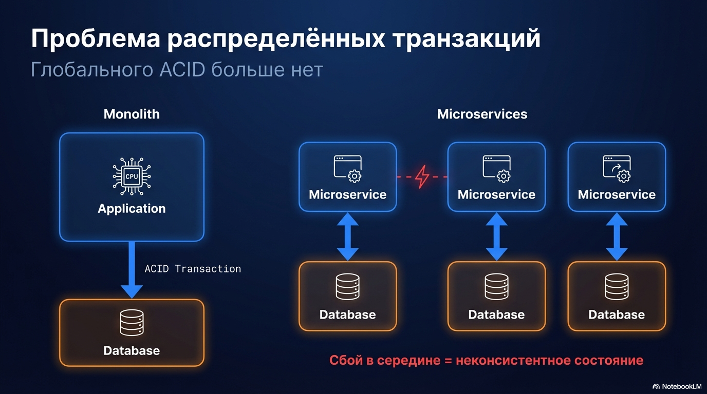

Итак, в процессе масштабирования под нагрузку мы добавили реплики, несколько слоев кеша, распределили логику по микросервисам.
Теперь нашим бизнес процессам приходится проходить через разные базы и сервисы

Тут главная проблема - как выполнить многосервисную операцию, чтобы сбой в середине не привел нас в неконсистентное состояние

Внутри одной базы это решил бы ACID одной транзакцией. 

В распределённой системе глобальной транзакции нет

[FULLSCREEN HOST START]

На собесе достаточно понимать 3 подхода к распределенным транзакциям
2pc, tcc и saga

### 5.1.2. Two-Phase Commit (2PC)

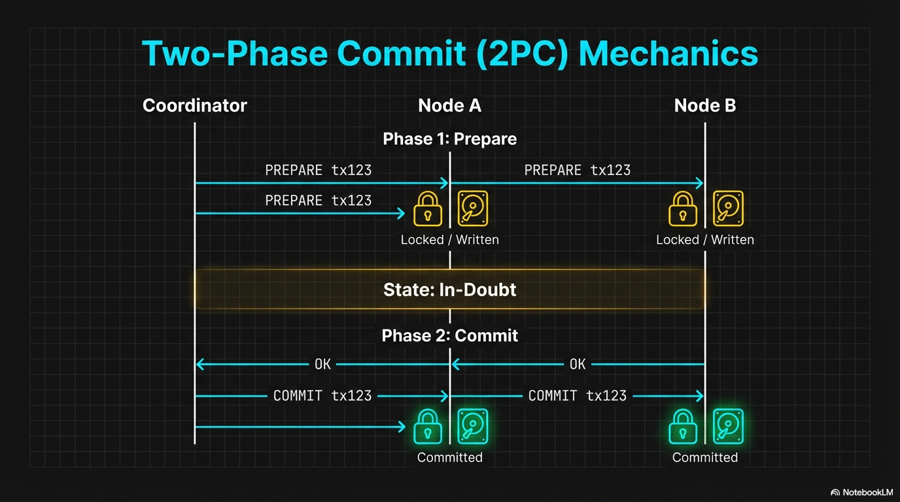

Начнём с 2PC - Two-Phase Commit двухфазный коммит

Это протокол распределённой транзакции между хранилищами: есть координатор и несколько участников (нод базы / шардов).

#### Фазы 2PC

На уровне протокола у нас две фазы.

1. Фаза голосования (prepare phase)

   Где Координатор говорит всем участникам выполнить свою часть транзакции и подготовиться к коммиту через команду `PREPARE TRANSACTION 'tx123'`. 

   После этого

    - все изменения записаны на диск;
    - нужные блокировки удерживаются;
    - транзакция ещё не зафиксирована и не видна другим сессиям.

2. Фаза фиксации (commit phase)

   Когда координатор получил `OK` от всех участников:

    - если все готовы → рассылает `COMMIT PREPARED 'tx123'` на каждую ноду;
    - если кто-то не смог подготовиться → рассылает `ROLLBACK PREPARED 'tx123'`.

   До тех пор, пока координатор не примет решение, каждая нода находится в состоянии in-doubt -  “подготовлено, но не закоммичено”.

#### Практические проблемы

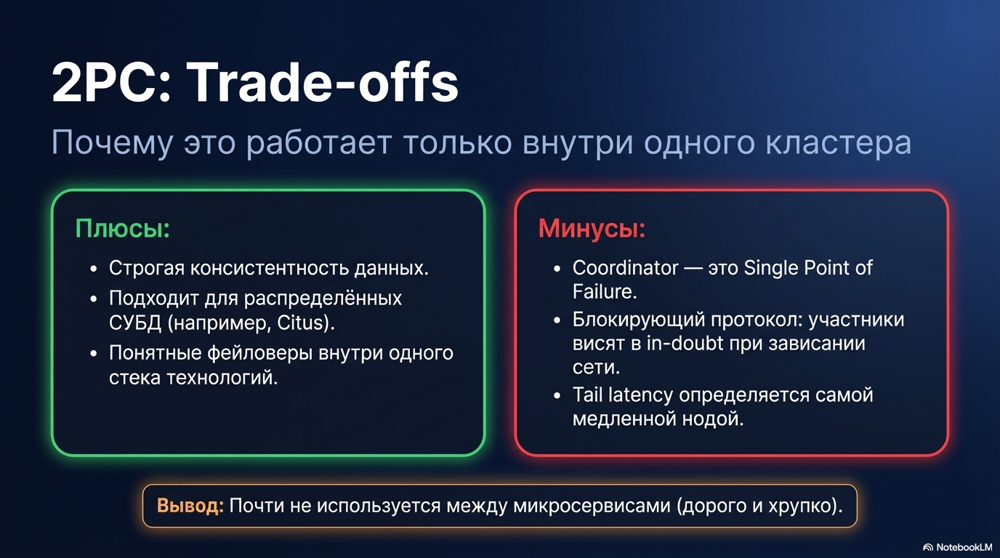

У 2PC есть минусы

- координатор — single point of failure:
- протокол блокирующий: если координатор/сеть “зависли”, участники остаются в in-doubt состоянии
- tail latency определяется самой медленной нодой

Поэтому:

- внутри одной БД/кластера (Citus, распределённая СУБД) 2PC ещё терпим:

    - один стек технологий,
    - один координатор,
    - понятные фейловеры.
- между микросервисами 2PC почти не используют:

    - слишком хрупко,
    - сложно эксплуатировать,
    - дорого по хвостам и блокировкам.

[FULLSCREEN HOST START]

Также есть 3PC протокол, как неблокирующий вариант 2PC, но там нужна весьма надежная сеть для устойчивой работы, 
из-за чего он практически не встречается в современных системах

#### 5.1.4. TCC

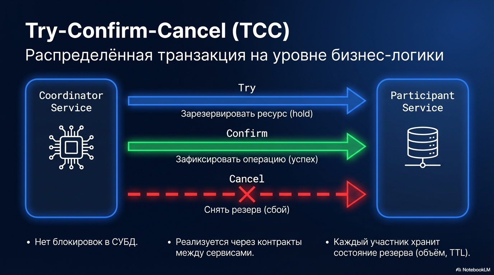

Кроме этих подходов есть и архитектурные паттерны, помогающие нам с распредленными транзакциями - это TCC (Try–Confirm–Cancel) и Saga

начнем с TCC - это прикладной паттерн распределённой транзакции на уровне бизнес-логики. 
реализуется контрактами между сервисами.

Координатором выступает наш отдельный сервис, который вызывает три вида операций у участников:

1. Try — зарезервировать ресурс - например пометить товар как “зарезервирован”
2. Confirm — зафиксировать операцию после успеха всех `Try`.
3. Cancel — снять резерв, если кто-то из участников не прошёл `Try` или произошёл сбой.

Соответственно каждый микросервис-участник должен:

- иметь отдельные эндпоинты `Try/Confirm/Cancel`,
- хранить состояние резерва (объём, срок жизни),
- работать идемпотентно

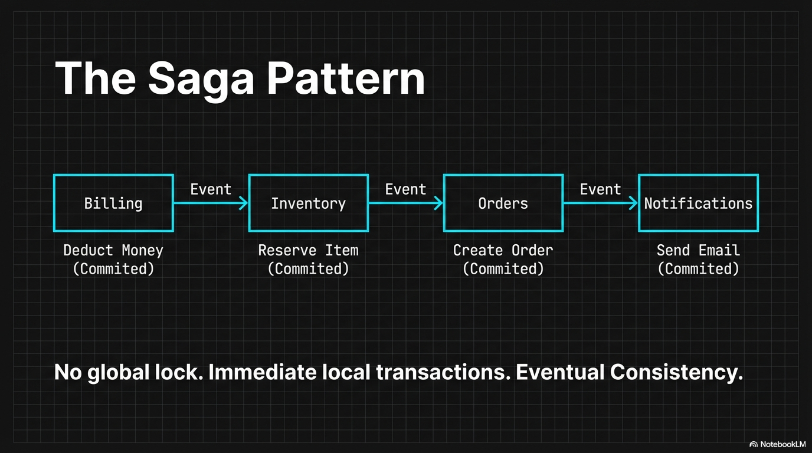

В отличие от 2PC:

- нет блокировок в СУБД;
- протокол не привязан к конкретной базе и может работать между разными стеками.

TCC применяют там, где важны резервы и цена ошибки высока: деньги (holds), бронирования, квоты.
Минус — рост сложности: больше состояний, больше координации, зачастую дополнительные таблицы с резервами и очистка протухших резервов

#### 5.1.5. Saga

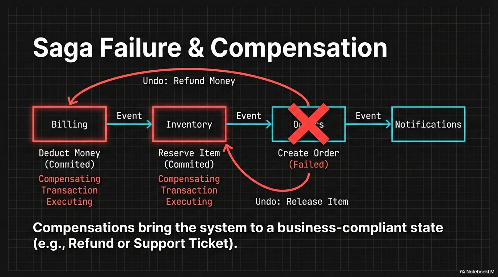

более известной альтернативой tcc является saga. 

при саге мы не делаем резервы, которые надо потом подтвердить, а просто по очереди выполняем шаги и при сбоях компенсируем уже сделанное

при саге, как и при tcc, нет никаких глобальных транзакций

для фичи оформления заказа сага бы выглядела как-то так

1. микросервис `Billing` списывает деньги.
2. `Inventory` резервирует товар.
3. `Orders` создаёт заказ.
4. `Notifications` отправляет письмо/пуш.

Если, например, на шаге 3 упало создание заказа:

- компенсируем то, что уже сделали: `Inventory` снимает резерв;
- `Billing` делает компенсацию:
  - возврат денег, если это допустимо,
  - либо “косвенная компенсация”: тикет в support/CRM на ручную обработку.

То есть компенсация не обязана быть симметричной обратной операцией - главное, чтобы процесс приходил в согласованное состояние по бизнес-правилам.

В отличие от TCC, в саге:

- нет обязательной фазы резервирования - шаги сразу “делают действие”;
- компенсации могут быть частично автоматическими, частично человеческими;
- вследствии чего больше допускается eventual consistency

Благодаря саге у нас:

- нет глобальных блокировок
- меньше шагов, чем в tcc

Цена — сложность самого workflow и продуманность компенсирующих сценариев.

Саги используют и в финансовых доменах, вместе с моделью резервации как в TCC

#### Организация шагов в саге

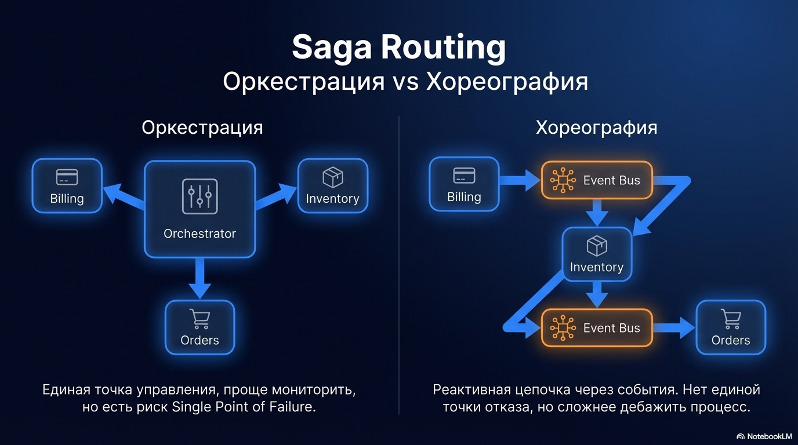

Для организации шагов в саге есть два способа: Оркестрация и Хореография

##### Оркестрация

при оркестрации у нас есть отдельный сервис — orchestrator. 
это обычный код, который управляет последовательностью шагов саги и компенсациями.

Плюсы:

- процесс описан в одном месте, его легче понять
- проще мониторить и восстанавливать;
- легче добавлять шаги.

Минусы:
- единая точка отказа
- один сервис знает всю бизнес логику

##### Хореография

есть и второй подход - хореография

здесь каждый участник слушает события других сервисов и выполняет свой шаг, не зная полной картины процесса.

например:
- `Billing` публикует событие `PaymentCaptured` →
- `Inventory` слушает его и пытается зарезервировать товар →
- если получилось, кидает `InventoryReserved` →
- `Orders` слушает это событие и создаёт заказ → и тд

Если к примеру не удастся зарезервировать товар, будет опубликовано сообщение `InventoryReservationFailed`, и `Billing` выполнит компенсирующее действие

То есть цепочка строится реактивно, без единой точки управления.

Плюсы:

- нет единой точки отказа, как с оркестратором
- нет единого “центра управления”: сервисы слабее связаны по времени, масштабировать проще

Минусы:

- полный процесс размазан по событиям, его трудно понять;
- добавление нового шага может быть сложнее, будет затрагивать несколько сервисов сразу
- дебажить сложнее

#### Outbox + CDC

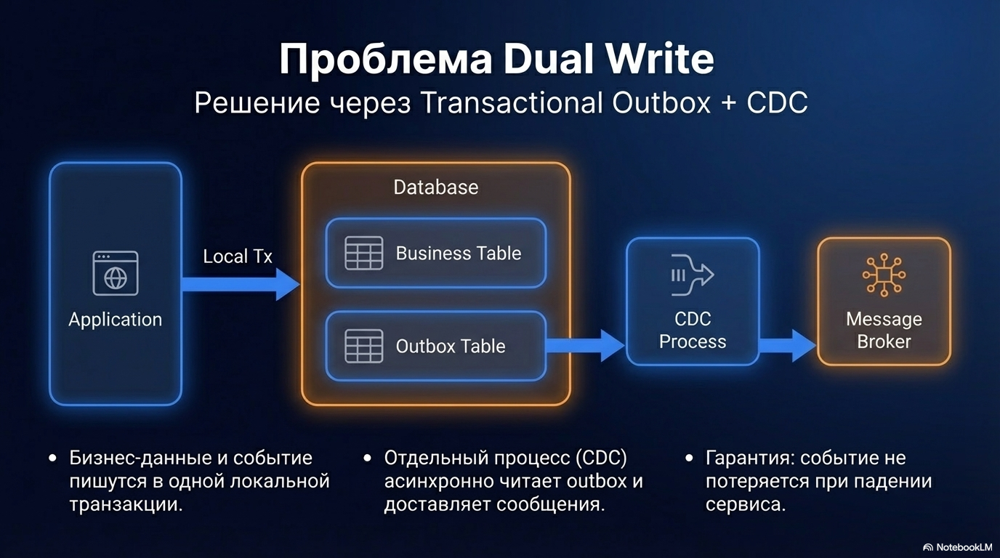

При хореографии (и вообще при event-driven интеграции) почти сразу появляется проблема dual write:

Это когда в рамках одной бизнес-операции мы одновременно меняем БД и публикуем событие в брокер.
Если делать сначала `COMMIT`, потом `publish` - при падении сервиса между этими шагами мы либо записали, но не отправили, либо отправили, но не записали

это решается паттерном Transactional Outbox

- мы в одной транзакции:

    - и обновляем бизнес-данные
    - и пишем событие в таблицу `outbox`;
- а отдельный процесс читает `outbox` и доставляет события в брокер сообщений

таким образом не бывает ситуации, что событие есть, а записи нет, или наоборот — оба факта атомарно живут в одной БД.

#### 5.1.9. Идемпотентность: зачем и как

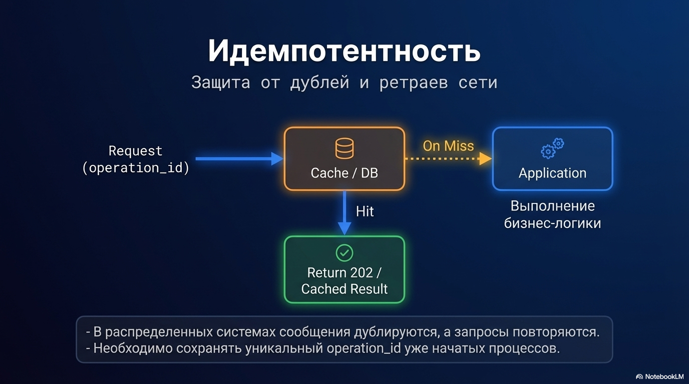

при саге, да и в любой распределенной системе
- сообщения могут задублироваться;
- запросы могут заретраиться

Поэтому обязательно нужна идемпотентность операций

- в кэше или таблице храним уникальный operation_id уже начатых процессов обработки запроса/сообщения
- если операция уже выполнялась → вернуть прежний результат или какой-нибудь 202 статус ответа

#### Стратегии завершения саги: откатывать или дожимать

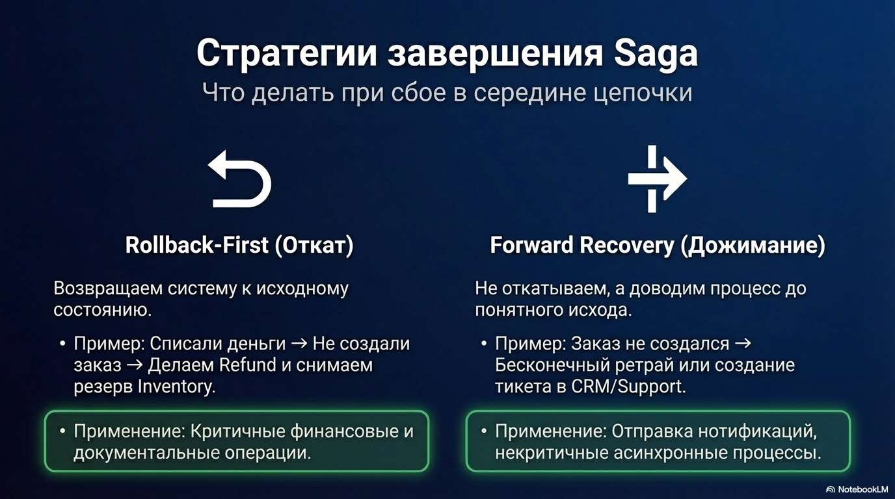

если произошел сбой на каком-то этапе саги, у нас есть два варианта как его обработать

1. Откатывать назад (rollback-first)
   Стараемся вернуть всё к исходному состоянию:

   Пример: списали деньги → не создали заказ → делаем refund и снимаем резерв.

2. Дожимать вперёд (forward recovery)
   не откатываемся идеально, а доводим процесс до понятного исхода

   Примеры:
   - деньги списались, заказ не создался → ретраим создание заказа; не вышло → тикет в CRM/support;
   - пуш не ушёл → просто отправим позже (не надо откатывать весь заказ). или отправим уведомление другим каналом

На практике:

- деньги/документы обычно тяготеют к rollback-подходу,
- не критичные процессы чаще живут в forward-режиме.

#### Workflow движки (temporal)

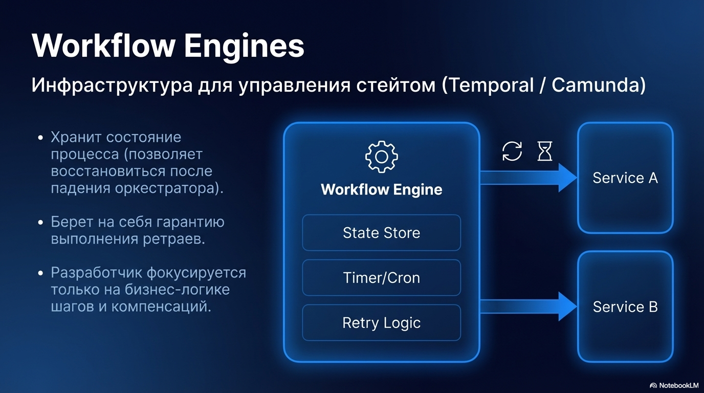

чтобы сконцентрироваться на бизнес логике, а не кронах/ретраях/таймаутах и прочем часто прибегают к помощи workflow движков, например Temporal или Camunda

зачем он нужен?
- хранит состояние процесса (на каком шаге мы находимся)
- гарантирует ретраи шагов;
- восстанавливается после падения;
- и тп;

вот как это примерно выглядит в коде, чтоб не казалось что это сферический конь в вакууме

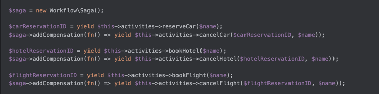

По ссылке можете посмотреть другие примеры кода https://github.com/temporalio/samples-php/blob/master/app/src/BookingSaga/TripBookingWorkflow.php

#### Краткий вывод для собеседований

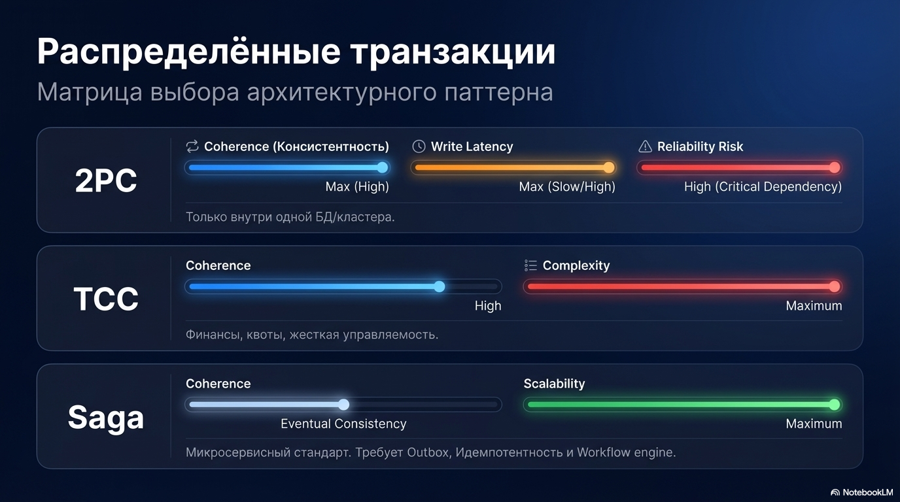

Таким образом, если бизнес-операция проходит через несколько сервисов/БД, глобальной ACID-транзакции нет,
поэтому выбираем паттерн под требования к консистентности и доступности.

1. 2PC
   Подходит в основном внутри одного кластера/распределённой СУБД.
   Между микросервисами почти не используют, потому что протокол блокирующий

2. TCC (Try/Confirm/Cancel)
   Выбирают, когда нужна жёсткая управляемость: резервы/holds, деньги, квоты, бронирования.
   Цена — больше состояний и инфраструктуры: таблицы резервов, TTL

3. Saga
   Основной подход для микросервисов: шаги + компенсации, допускаем eventual consistency

И чтобы это работало, почти всегда нужны три вещи:

- Transactional Outbox
- идемпотентность
- хранение состояния workflow - для ретраев и восстановления
