### Блок 5.2. Eventual Consistency в распределённых системах

#### 1. Введение

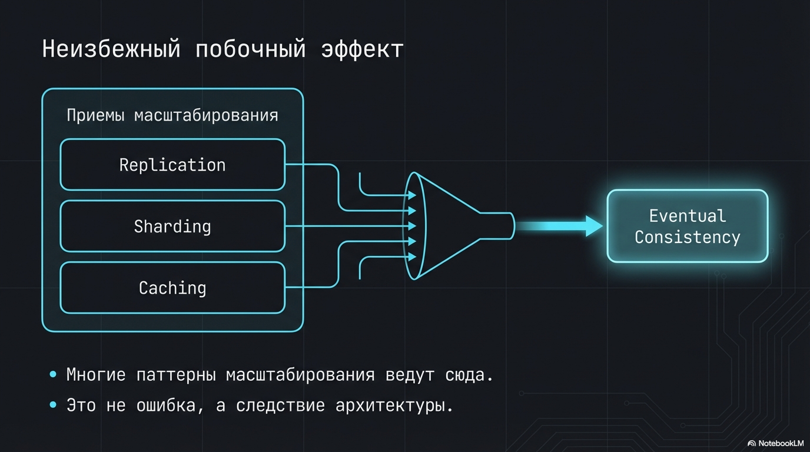

как вы могли заметить, многие приемы масштабирования которые мы разбирали в этой главе ведут к eventual consistency.

Давайте подробнее разберемся к каким проблемам нас это приводит и как с этими проблемами бороться

#### 2. Что это и зачем?

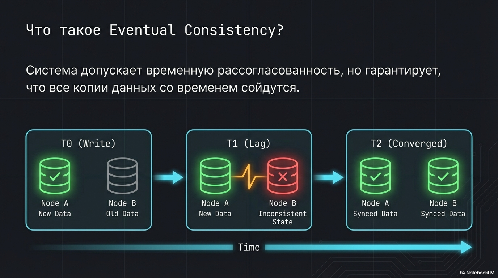

Формальное определение
> Eventual consistency — модель, когда система допускает временную рассогласованность данных между репликами и сервисами,
> но гарантирует, что все копии данных со временем сойдутся.

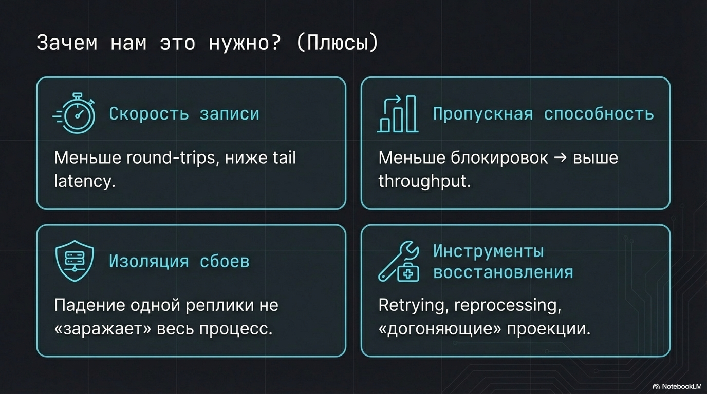

При eventual consistency у нас следующие выигрыши по сравнению со strong consistency

- Запись быстрее
  Не нужно синхронно подтверждать изменения во всех сервисах/репликах/регионах → меньше round-trips, меньше tail latency.

- Выше пропускная способность при той же цене.
  Меньше координации и блокировок → меньше контеншна → выше throughput и стабильнее p95/p99.

- Сбой изолируется, а не “заражает” весь процесс.
  Если один сервис/реплика/регион недоступны, мы можем принять команду, поставить её в очередь и “дожать” позже, вместо того чтобы падать всем бизнес-процессом.

- Появляется нормальный инструментарий восстановления.
  Retrying, компенсации, reprocessing событий, “догоняющие” проекции — всё это работает именно потому, что ты допускаешь “сейчас не идеально, но потом сойдётся”.

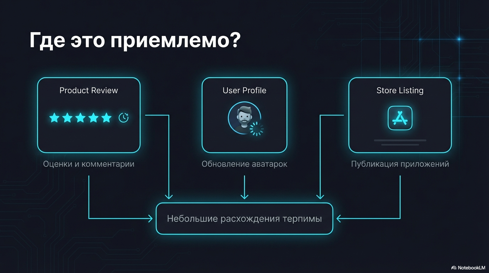

Примеры где нас устраивает eventual consistency:

- оценки товаров, комментарии, рекоммендации;
- всякие обновления аватарок
- или вот например в гугле, когда создаешь приложеньку, написано что она может появиться аж через несколько часов 

В этих примерах:

- небольшие расхождения во времени терпимы;
- возможны компенсации и повторные попытки;
- бизнес-последствия ошибки минимальны.

#### 3. Минусы

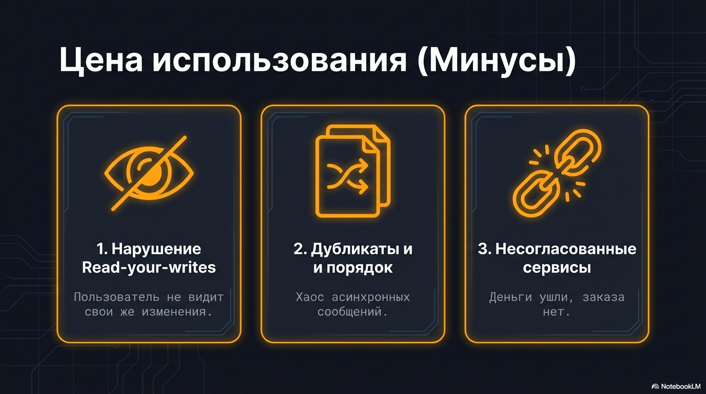

Конечно есть не только плюсы, но и минусы, а именно:

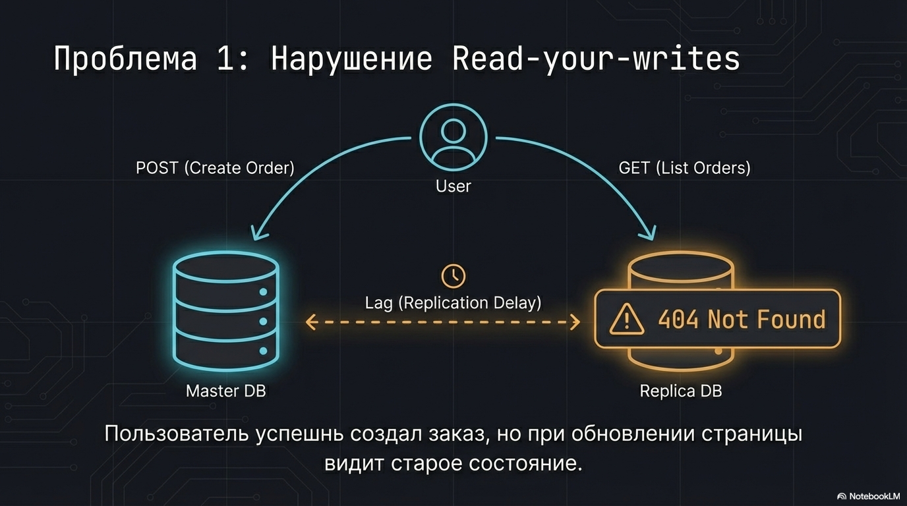
1. Нарушение read-your-writes
   Например пользователь успешно создал заказ, но следующее чтение идёт с реплики/кэша и он при обновлении страницы видит старое состояние - то есть отсутствие заказа

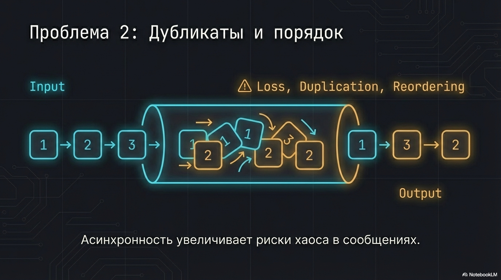
2. Дубликаты и переупорядочивание событий.  
   Так как при eventual consistency много асинхронщины, то и проблем связанных с потерей/дубликацией сообщений или перемешивания их порядка становится больше

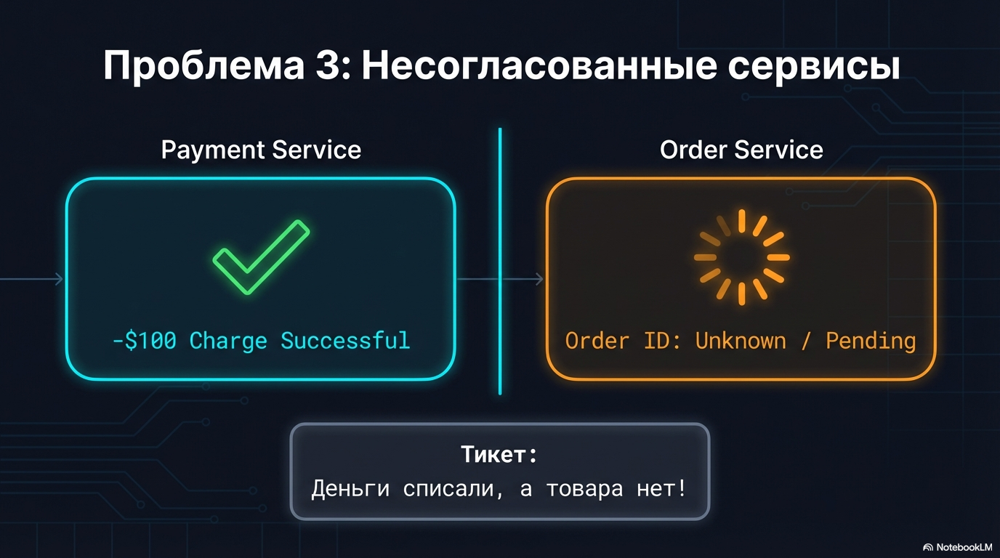
3. Несогласованные сервисы.  
   Разные сервисы сходятся не мгновенно: платеж уже подтверждён (hold/charge), а заказ ещё не появился из-за очереди/ретраев. 
   Пользователь видит списание, но не видит заказа — классический тикет “деньги ушли, заказа нет”.

#### 4. Как смягчить последствия

Полностью эти проблемы не победить, да и не нужно — иначе получиться уже strong consistency со своими недостатками

Но можно сделать так, чтобы пользователь и данные страдали минимально

Давайте теперь разберем решения этих проблем

##### 4.1. read-your-writes

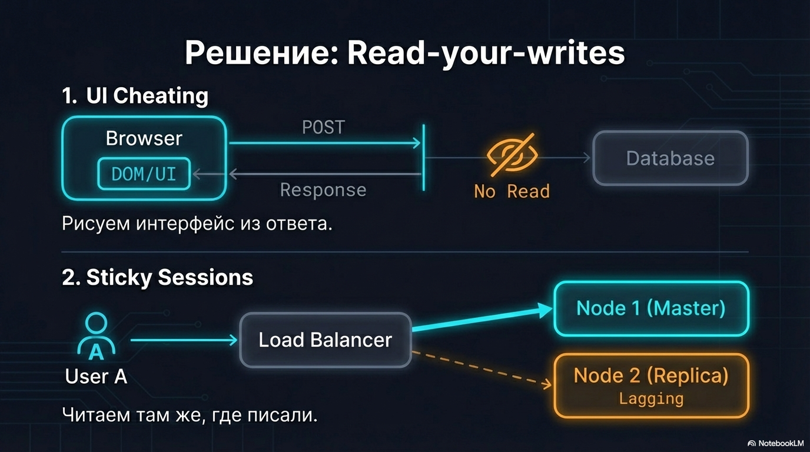

Первое, что хочется вернуть — это read-your-writes для автора операции.

Делается это двумя способами:

- Фронт не перечитывает ресурс, а использует ответ записи.  
  Создали заказ — страница заказа рисуется из ответа на `POST` запрос, а не из последующего запроса на список заказов, который опирается на кэши/реплики

- Если всё-таки нужно перечитать — читаем тем же путём, куда писали.  
  Писали в мастер Postgres → первый read после записи идёт либо в тот же мастер,  
  либо в реплику с гарантией LSN ≥ X, а не в произвольный кеш или индекс.
  Зачастую достигается через липкие сессии (sticky sessions)

Таким образом мы возвращаем read-your-writes хотя бы для автора операции, а остальным можно терпеть лаг, так как они о нем не знают

##### 4.2 Проблема: дубликаты / ретраи / порядок обработки

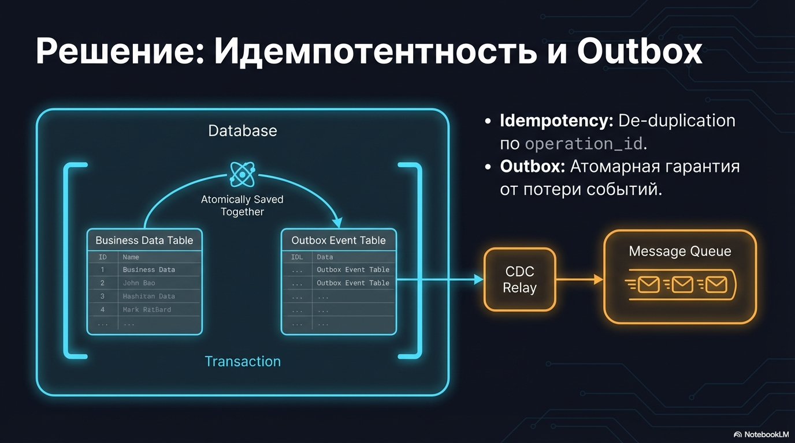

Для борьбы со второй проблемой - про ретраи/дубликаты и тп -  у нас целый набор инструментов:

- в первую очередь обеспечиваем идемпотентность по operation_id и дедупликацию
- делаем Transactional Outbox или используем CDC — чтобы не терять события и не ловить dual write.
- 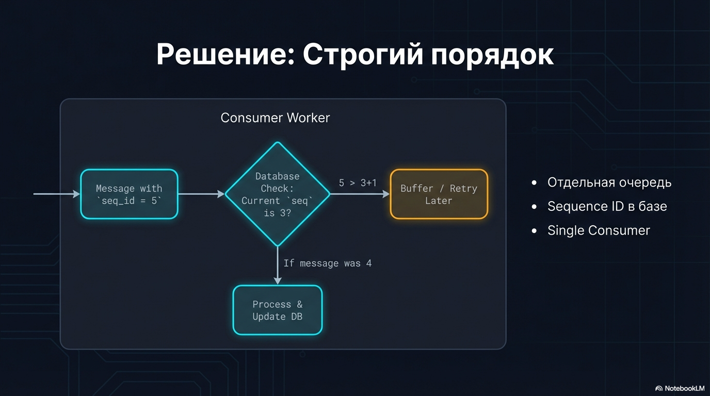
  Если важен порядок сообщений в рамках одной сущности:
  - создаем под это свою очередь, 
  - держим sequence в базе, чтоб если пришло сообщение не по порядку откладывать его
  - и имеем только одного консьюмера на это дело

##### 5.2. Проблема: несогласованные сервисы

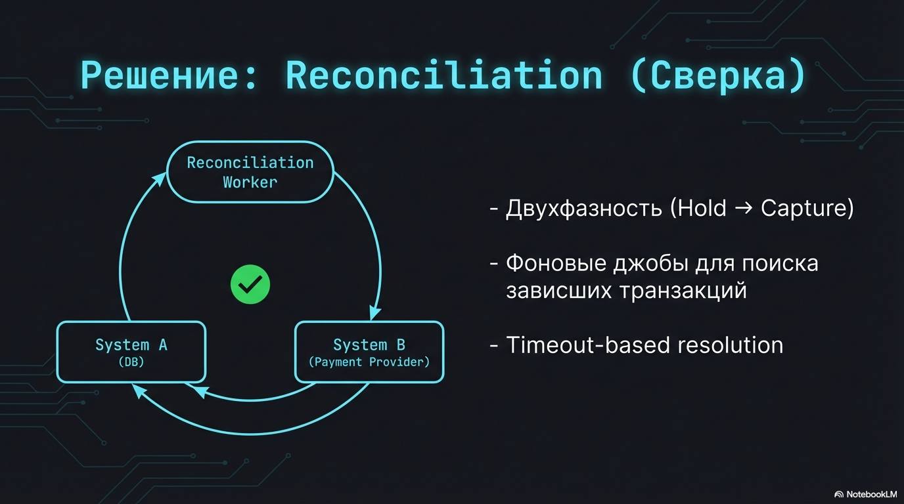

1. Для необратимых действий (например списание денег) делаем двухфазность: 
   hold/authorize → capture (или reserve → finalize), чтобы можно было безопасно откатить.

2. используем reconciliation и Timeout-based resolution - 
   фоновые джобы находят “зависшие/рассогласованные” кейсы и дожимают, компенсируют или эскалируют в ручную обработку.
   Примеры reconciliation
   - товар создан в бд, а в индексе elasticsearch'а его нет, из-за чего не находится в поиске.
   Reconciliation здесь - воркером сверять список id'шников и формировать события на обновление индекса
   - или у платежного провайдера платеж отметился успешным,а у нас нет. причина тому - упала сеть для вебхука.
   отдельная джоба сверяет статусы и обновляет нужные записи/кидает ивенты

3. 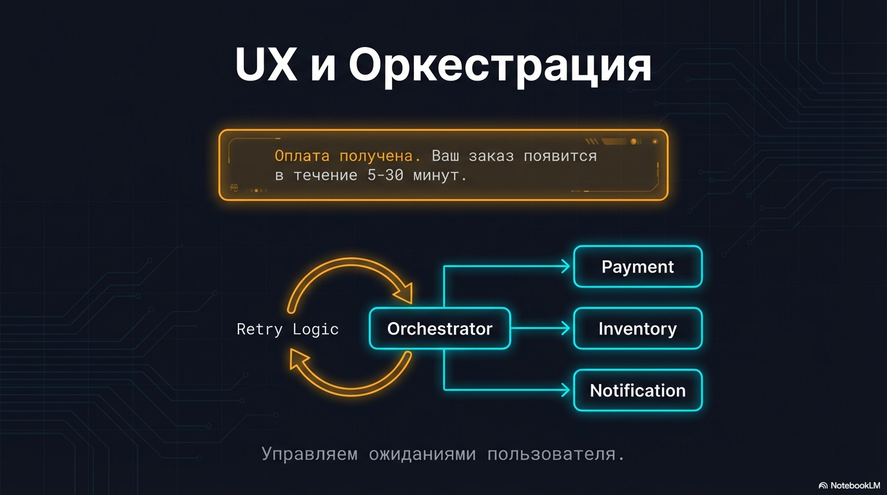 строим UI который предупреждает пользователя о возможности временного расхождения, 
   например пишем "ваш заказ появится в течение от 5 до 30 минут" и показываем промежуточные статусы (“оплата получена → создаём заказ”)

4. используем оркестратор. он будет управлять сервисами нашими, ретраить шаги, и в крайнем случае переводить на ручную обработку сложные кейсы.
   но это не отменяет необходимость reconciliation

#### Вывод

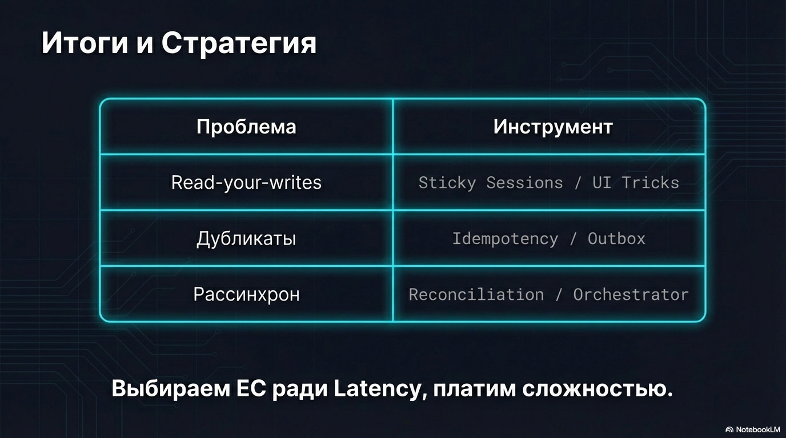

На собеседовании, если домен допускает временные рассогласования, имеет смысл явно обозначить выбор eventual consistency: 
это даёт выигрыш в latency/throughput за счёт меньшей координации.

Но важно сразу проговорить трейд-оффы и способы их закрыть: read-your-writes, дубликаты/порядок, рассинхрон сервисов -
через идемпотентность и outbox/CDC, оркестрацию с ретраями, reconciliation/таймауты и понятный UX под async.
