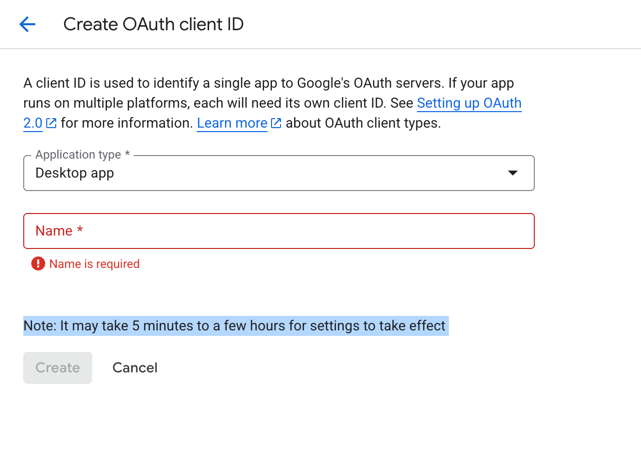

### Блок 3.2. Eventual Consistency в распределённых системах

#### 1. Мост от распределённых транзакций

В распределённых системах есть два крупных класса решений:

- тяжёлые протоколы транзакций (2PC/TCC), которые максимально приближают нас к атомарности между участниками ценой сложности и задержек;
- процессные паттерны (Saga, outbox, event-driven), которые упрощают жизнь сервисам, но делают расхождения между их состояниями нормой.

На уровне данных это выглядит так:

- есть куски, где нам нужна более строгая консистентность — балансы, права доступа, критичные инварианты;
- есть всё остальное, где мы готовы жить с тем, что разные сервисы какое-то время видят разные версии данных.

Дальше мы разберём подробнее эти два вида согласованности: eventual consistency и strong consistency

И главное — как эти модели влияют на архитектуру и поведение системы для пользователя.

#### 2. Что такое eventual consistency

> Eventual consistency — модель, когда система допускает временную рассогласованность данных между репликами и сервисами,
> но гарантирует, что все копии данных со временем сойдутся.

но зачем нам выбирать eventual consistency?:

- повышаем доступность — не блокируем всю систему из-за одной реплики или региона;
- упрощаем масштабирование — можем шардировать и реплицировать без глобальных транзакций;
- снижаем стоимость записи — меньше блокировок, меньше координации.

Типичные примеры где используется eventual consistency:

- кеши (разные слои: Redis, CDN, in-process);
- оценки товаров, комментарии;
- каталоги товаров;
- рекомендательные блоки;
- большинство аналитических витрин.

В этих местах:

- небольшие расхождения во времени терпимы;
- возможны компенсации и повторные попытки;
- бизнес-последствия ошибки минимальны.

#### 3. Типичные эффекты для пользователя и системы

Eventual consistency — это не абстрактная “модель данных”, а очень конкретные странности, которые начинает видеть пользователь и команда поддержки.

Самые частые эффекты:

- Окно рассогласованности.  
  Пользователь сделал действие, а интерфейс ещё какое-то время показывает старое состояние: 
  - заказ создан, но в списке не виден; 
  - профиль обновлён, но старая аватарка ещё торчит.
  - вот пример в гугле 

- Нарушение read-your-writes.  
  Клиент успешно записал изменения, но следующее чтение идёт не из того же стора (реплика, индекс, кеш) и возвращает старые данные.

- Потерянные обновления.  
  Два клиента читают устаревшее состояние, оба его меняют и пишут обратно. 
  Последний просто перезатирает изменения первого — без явного конфликта и ошибок.

- Дубликаты и переупорядочивание событий.  
  При доставке “at-least-once” брокер может прислать одно и то же сообщение несколько раз и не обязательно в исходном порядке. 
  Если операции не идемпотентны, начинаются двойные списания, дубликаты заказов и странные переходы статусов.

- Несогласованные сервисы.  
  В saga `orders` уже создал заказ, `notifications` успели отправить письмо, а `billing` откатил списание. 
  Для пользователя “заказ есть” (он видит письмо и страницу), а для биллинга — нет.

#### 4. Как смягчить последствия: локальные приёмы

Окей, с эффектами понятно
Полностью это не победить, да и не нужно — иначе получиться уже strong consistency
Задача другая: сделать так, чтобы пользователь и данные страдали минимально

Рассмотрим несколько приемов

##### 4.1. Локальное read-your-writes

Первое, что хочется вернуть — это read-your-writes для автора операции.

Идея простая: если пользователь только что что-то записал, он должен видеть свою версию данных, а не то старое то новое состояние из-за разных реплик или слоев кеша.

Делается это двумя способами:

- Фронт не перечитывает ресурс, а использует ответ записи.  
  Создали заказ — страница заказа рисуется из ответа на `POST /orders`, а не из списка заказов `GET /orders`, который опирается на кворумы/кеши/реплики

- Если всё-таки нужно перечитать — читаем тем же путём, куда писали.  
  Писали в мастер Postgres → первый read после записи идёт либо в тот же мастер,  
  либо в реплику с гарантией LSN ≥ X, а не в произвольный кеш или индекс.
  Зачастую достигается через липкие сессии (sticky sessions)

Это не делает систему глобально консистентной,  
но убирает самый раздражающий эффект: “я только что сохранил, а UI показывает старое”.

##### 4.2. Оптимистичные блокировки: защита от потерянных апдейтов

Вторая локальная проблема — потери обновлений, когда несколько клиентов пишут в одну и ту же запись.

Здесь помогают оптимистичные блокировки.

Механика:

- у записи есть поле `version` (или `updated_at`);
- `UPDATE ... WHERE id = :id AND version = :oldVersion`;
- если обновлено 0 строк — кто-то уже поменял запись раньше, нужно перечитать и решить, что делать.

Это не “лечит” рассинхрон между сервисами, но мешает молча затирать изменения.

Цена:

- при высокой конкуренции за одну запись ловим много конфликтов и ретраев,
  а значит — рост latency именно для этих горячих записей.

Но это более контролиуемая проблема чем исчезновение данных клиента

##### 4.3. Идемпотентность и аккуратные ретраи

Третья история — всё, что связано с сетью: брокеры, HTTP-запросы, очереди.  
Как только у нас есть at-least-once доставка, вместе с eventual consistency автоматически приезжают:

- дубликаты,
- возможная перестановка событий,
- и периодические задержки.

Тут надо решить 2 проблемы

- Операции, которые приходят через сеть, делаем максимально идемпотентными.

- Ретраи — только с backoff + jitter и жёстким лимитом.  
  Без этого любая временная деградация ресурса превращается в retry storm

- Явно решаем, кто именно ретраит - разбирали эту проблему подробнее в главе про latency

Это всё не отменяет eventual consistency,  
но делает систему устойчивой к её неизбежным побочным эффектам:
нет двойных списаний, нет пачек дублей, нет бесконечных ретраев в мёртвый сервис.

#### 5. Архитектурные паттерны, которые помогают жить с eventual consistency

Локальными приёмами мы немного приглушили боль для конкретного запроса и конкретного пользователя.  
Но чтобы система в целом не превращалась в хаос из рассинхронов, нужны более “сквозные” архитектурные решения.

Здесь три основных подхода.

##### 5.1. Transactional Outbox / CDC: не теряем события

в блоке про распределённые транзакции мы уже говорили подробно про Transactional Outbox паттерн, напомню кратко Что он даёт в контексте eventual consistency:

- write-модель и поток событий всегда согласованы по факту коммита — “если запись есть, событие рано или поздно уйдёт”;
- рассинхрон между сервисами уже связан только с задержками доставки, а не с тем, что мы вообще забыли послать ивент.

##### 5.2. Read-модели и проекции вместо «одной большой таблицы»

Следующий паттерн — не пытаться заставить всю систему быть “одинаково консистентной”,  
а жёстко разделить:

- write-модель — “ядро истины”, где живут жёсткие инварианты (балансы, статусы заказов, права доступа);
- read-модели / проекции — удобные, но по определению отстающие представления под чтение.

и вот у нас получился cqrs - Command Query Responsibility Segregation

Типичная схема:

- есть основной реестр заказов/платежей в Postgres;
- через события / CDC строим витрины: поиск, отчёты, агрегаты, рекомендации;
- эти витрины eventual — с лагом в секунды/минуты, и это считается нормальным.

Плюс такого подхода:

- рассинхрон не “размазан по всей системе”, а заперт в слое проекций;
- команда чётко знает, что:

  - ядро (write-модель) должно быть максимально строгим по консистентности;
  - в проекциях небольшой лаг и редкие артефакты допустимы по дизайну.

##### 5.3. Reconciliation: мириться с тем, что всё равно поползёт

Даже с Outbox’ом, проекциями и аккуратными ретраями сложная система со временем всё равно накапливает рассинхроны.  
Поэтому нужен третий кирпич — регулярная сверка и починка (reconciliation).

Идея следующая:

- периодически сравниваем критичные сущности между системами:

  - заказы в `orders` и списания в `billing`;
  - записи в Postgres и документы в поисковом индексе;
  - состояние кошельков и отчётные витрины;

- если расхождения найдены, то они:

  - либо чинятся автоматически (досылаем событие, пересобираем проекцию, докатываем статус),
  - либо попадают в отдельный отчёт/очередь для ручного разруливания.
