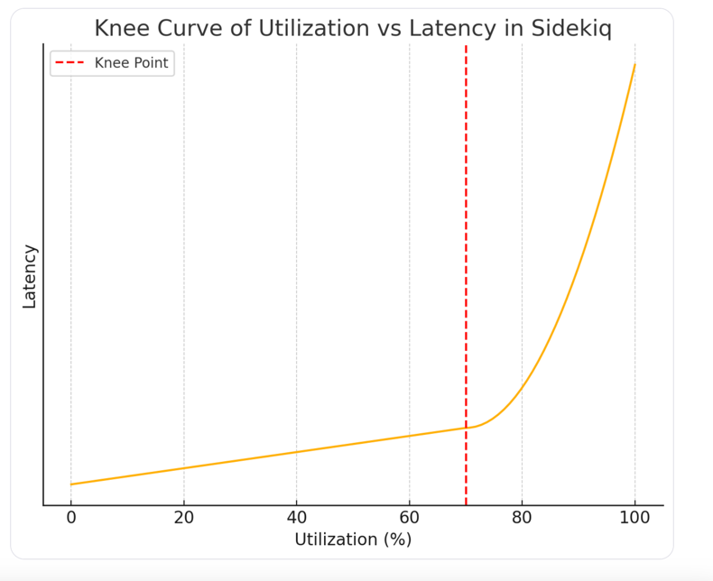

## Часть 6. Resources 

### 6.1 Resource Optimization Trade-offs

#### Введение

В прошлых частях мы постоянно улучшали систему инженерными приёмами: кэшировали, добавляли реплики, уходили от транзакций к сагам, принимали eventual consistency. 
Почти всегда это даёт выигрыш в latency/availability/throughput — но не бесплатно.

Платим мы ресурсами и сложностью эксплуатации - то есть деньгами в конечном счете

Поэтому “быстро, дёшево, надёжно и просто” одновременно не бывает: 
- ускоряем — часто дорожает; 
- повышаем надёжность — растёт координация и задержки; 
- упрощаем — платим запасом железа.

~~на экран~~
> “Everything in software architecture is a trade-off.”
> — Mark Richards

~~на экран~~

И это ровно то, что проверяют на архитектурных интервью: 
способность объяснить, какой компромисс выбран, чем за него платим и какие последствия принимаем. 

Дальше покажу типовые trade-off’ы

#### Блок 6.2. CPU & Concurrency

Первый трейдофф - cpu и concurrency 

Проблема в том, что при высокой утилизации cpu система начинает вести себя как очередь: задержки растут непропорционально, и особенно страдают хвосты.

вы можете видеть на экране так называемый knee curve - зависимость задержки/очереди от загрузки процессора

Как видно из графика

- после ~70–80% утилизации кривая резко “ломается”
- ближе к 90% любая небольшая вспышка нагрузки превращается в рост очередей и скачок tail latency
  так как нет ничего за счет чего очередь сможет стать меньше

Отсюда trade-off

- latency-critical сервисы (UI-API, auth, checkout) держат headroom по CPU, чтобы выдерживать пики и не разгонять хвосты
- аналитика могут жить на высокой утилизации: там важнее завершить работу к дедлайну, чем стабильный p99

Соответственно и на собесе при расчете необходимых мощностей закладывай сверху 20-40%, если важна latency

#### Блок 6.3. Память и кэш: hit ratio vs стоимость vs сложность

Следующий распространенный способ оптимизировать ресурсы — закэшировать все что можно

почти всегда работает по latency и разгрузке БД, но платим:ч
1. Оперативка - чем больше кеша тем больше нам надо оперативы , а она дорогая (особенно последнее время)
2. Сложность - как мы разбирали в главе про кеш, он несет много новых проблем

В итоге trade-off выглядит так:

- хотим меньше грузить БД и внешние сервисы → увеличиваем кэш → платим за RAM и за сложность инвалидации;
- хотим простую систему и дешёвые машины → уменьшаем кэш → платим ростом нагрузки на нижние уровни и меньшим throughput

#### Блок 6.4. Data Layer: чтения, записи, консистентность и цена

На уровне данных компромисс обычно крутится вокруг трёх осей:

- скорость чтений
- скорость записей
- и  какая консистентность

- если система read-heavy — реплики дают рост чтений и отказоустойчивость;
- цена: больше инфраструктуры и replication lag — то есть после записи чтение с реплики может вернуть старое.

- хотим более сильную консистентность по данным — начинаем ждать подтверждения от кворума узлов;
- цена: запись становится медленнее, а tail latency растёт вместе с сетью и самым медленным участником.

- индексы и materialized view ускоряют SELECT;
- но замедляют INSERT/UPDATE и усложняют поддержку модели данных.

Практический вывод для собеседования:

- ускоряешь чтение — почти всегда платишь записью и/или строгой консистентностью;
- усиливаешь консистентность — платишь latency и теряешь throughput.

#### Блок 6.5. Сеть и топология: отказоустойчивость vs RTT vs деньги

Следующий классический trade-off — где держим сервисы и данные: в одном датацентре/зоне или размазываем по нескольким зонам/регионам.

Если всё в одном регионе (и тем более в одной Availability Zone), то это

- быстрее (низкий RTT (round trip time)→ ниже latency),
- дешевле (межзонный/межрегиональный трафик не платим),
- проще в эксплуатации.

Но платим риском: 
если падает этот датацентр/зона/регион (из-за блэкаута, наводнения или еще чего-то), мы теряем доступность системы, а иногда и данные.

Если делаем multi-AZ / multi-region, выигрываем отказоустойчивостью, но проигрываем в latency, стоимости трафика и сложности эксплуатации

Чтобы принять решение на собесе/работе, надо собрать требования по RTO/RPO

- RPO (Recovery Point Objective) — сколько данных мы готовы потерять
  Пример: RPO = 5 минут → при падении допустимо потерять до 5 минут последних записей.
- RTO (Recovery Time Objective) — за сколько времени должны восстановиться
  Пример: RTO = 30 минут → сервис обязан подняться в другом месте за полчаса.

Если бизнесу нужен RPO≈0 и RTO в минуты — придётся покупать это деньгами и возросшей latency.
Если продукт переживает редкий даунтайм — часто разумнее оставить архитектуру проще, быстрее и дешевле.

#### Блок 6.6. Изоляция vs Utilization: noisy neighbors

Ещё один классический trade-off: утилизация ресурсов против предсказуемости.

Если сложить всё в один общий кластер (API, очереди, batch, аналитика), на старте это дёшево по утилизации ресурсов

Но в реальности появляется noisy neighbor: различные background джобы съедают ресурсы и latency у пользовательского API страдает

Решение — изоляция пулов: отдельные ресурсы для latency-critical API и отдельно для тяжёлого batch/аналитики.
Плюс — хвосты стабильнее и если упал пул с условной аналитикой, то пользователь не заметит.
Минус — часть железа простаивает и инфраструктура дороже.

Соответственно на собеседованиях и при проектировании надо помнить о разделении ресурсов между компонентами

#### Блок 6.7. Сложность vs экономия на железе

Ещё один ресурс, который быстро становится лимитирующим — время и внимание команды.

Можно “выжать максимум из инфраструктуры”: умный автоскейлинг, динамические лимиты concurrency, приоритетные очереди, сложный backpressure, куча тюнинга.
Цена — непрозрачность: систему сложнее понимать, отлаживать и безопасно менять; под нагрузкой поведение часто становится неожиданным.

Альтернатива — проще, но с запасом: понятное горизонтальное масштабирование и чуть больше железа, чем “по минимуму”.
Trade-off простой: экономим на облаке → чаще платим сложностью и инцидентами; держим систему проще → чаще платим ресурсным запасом.

#### Блок 6.8. Финал: как принимать решения

Суть всех trade-off’ов одна: вы оптимизируете не “систему вообще”, а конкретные SLO — и платите за это ресурсами.

Что обычно двигаете:

- CPU: headroom vs высокая утилизация
- Память/кэш: hit rate vs RAM и сложность инвалидации
- Data layer: чтения vs записи vs консистентность (репликация, кворумы, индексы)
- Сеть/топология: доступность и DR vs RTT и деньги
- Изоляция: предсказуемые хвосты vs стоимость
- Сложность: экономия на железе vs управляемость системы

Ключевой вопрос:

> Какие SLO мы берём и чем готовы платить — деньгами, задержками или сложностью?

В таком виде это и спрашивают на собесах:

- что упростишь, если нужно вдвое дешевле?
- что пожертвуешь, если важнее latency, чем консистентность отчётов?
- где усложнишь архитектуру, чтобы сэкономить на инфраструктуре?

Хороший ответ — не “хочу всё сразу”, а явный выбор компромиссов и последствий.
