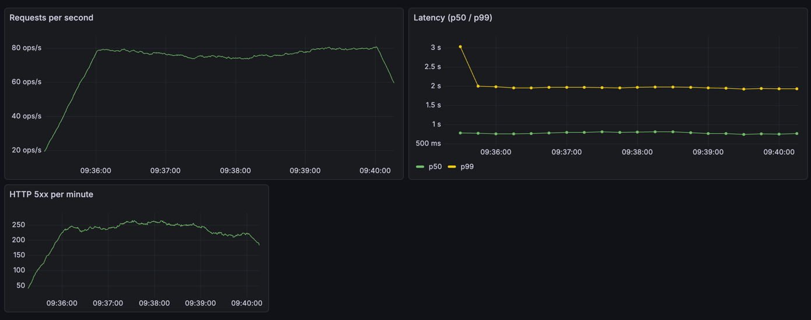

## Домашнее задание

В качестве домашней работы предлагаю вам настроить сбор и визуализацию метрик для собственного веб‑приложения.

### Цель

Нужно создать дашборд, где будут отображаться:

- RPS (requests per second) — сколько запросов приходит на ваш сервис в секунду.
- Latency (p50 и p99) — 50‑й и 99‑й процентиль времени ответа.
- HTTP 5xx — количество и доля серверных ошибок за выбранный интервал.

Вот пример того, как это будет выглядеть

### Что нужно сделать

1. Напишите или возьмите готовое приложение на своём стеке (язык и фреймворк по вашему выбору).
2. Сконфигурируйте Nginx или аналогичный прокси так, чтобы он записывал логи в формате JSON с полем `request_time`.
3. Собирайте логи и метрики
4. Настройте Grafana
5. Через k6 сгенерируйте нагрузку
6. Убедитесь, что графики реагируют.

Разбор моего решения будет опубликован на Boosty.
