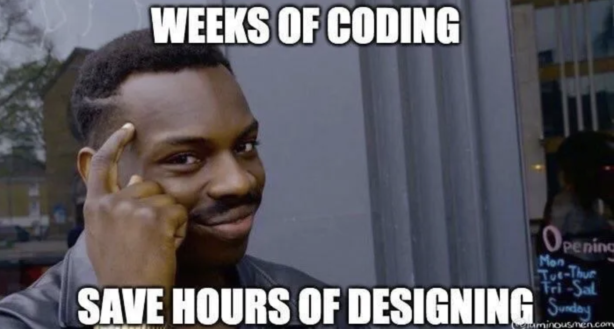

# Продвинутый system design

Привет! Мы начинаем продвинутую часть курса по системному дизайну.

Меня зовут Михаил, я писал backend на php, сейчас являюсь ментором

Начнем с того, что лишь вопрос времени когда какая-то часть инфраструктуры вашей откажет, 
поэтому очень важно научить свою систему продолжать работать в таких ситуациях

Этому и будет посвящена глава
