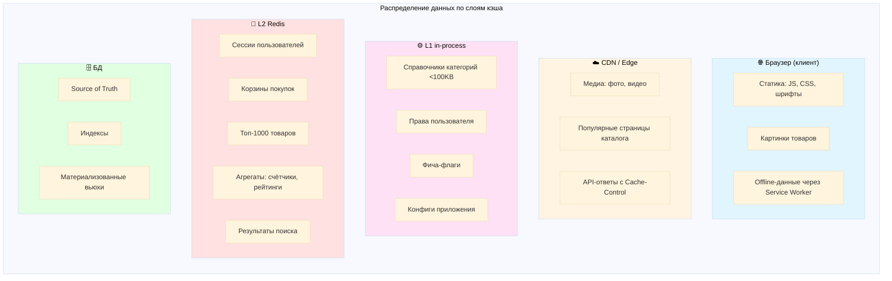

```mermaid
%%{init: {'theme':'base'}}%%
graph TB
    subgraph "Распределение данных по слоям кэша"
        direction TB
        
        subgraph Browser["🌐 Браузер (клиент)"]
            B1[Статика: JS, CSS, шрифты]
            B2[Картинки товаров]
            B3[Offline-данные через Service Worker]
        end
        
        subgraph CDN["☁️ CDN / Edge"]
            C1[Медиа: фото, видео]
            C2[Популярные страницы каталога]
            C3[API-ответы с Cache-Control]
        end
        
        subgraph L1["⚙️ L1 in-process"]
            L1_1[Справочники категорий <100KB]
            L1_2[Права пользователя]
            L1_3[Фича-флаги]
            L1_4[Конфиги приложения]
        end
        
        subgraph L2["🔴 L2 Redis"]
            L2_1[Сессии пользователей]
            L2_2[Корзины покупок]
            L2_3[Топ-1000 товаров]
            L2_4[Агрегаты: счётчики, рейтинги]
            L2_5[Результаты поиска]
        end
        
        subgraph DB["🗄️ БД"]
            DB1[Source of Truth]
            DB2[Индексы]
            DB3[Материализованные вьюхи]
        end
    end
    
    style Browser fill:#e1f5ff
    style CDN fill:#fff4e1
    style L1 fill:#ffe1f5
    style L2 fill:#ffe1e1
    style DB fill:#e1ffe1
```

