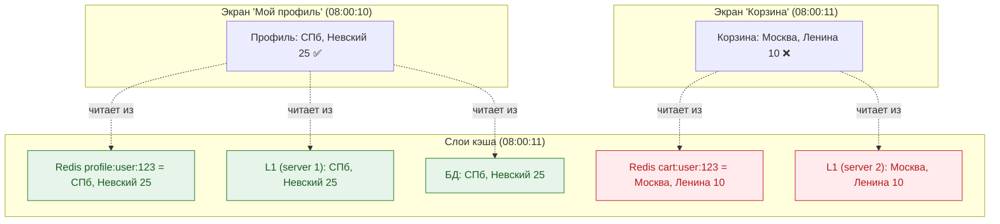

```mermaid
graph TB
    subgraph "Экран 'Мой профиль' (08:00:10)"
        ProfileUI["Профиль: СПб, Невский 25 ✅"]
    end

    subgraph "Экран 'Корзина' (08:00:11)"
        CartUI["Корзина: Москва, Ленина 10 ❌"]
    end

    subgraph "Слои кэша (08:00:11)"
        DB["БД: СПб, Невский 25"]
        RedisProfile["Redis profile:user:123 = СПб, Невский 25"]
        RedisCart["Redis cart:user:123 = Москва, Ленина 10"]
        L1Profile["L1 (server 1): СПб, Невский 25"]
        L1Cart["L1 (server 2): Москва, Ленина 10"]
    end

    ProfileUI -. читает из .-> RedisProfile
    ProfileUI -. читает из .-> L1Profile
    ProfileUI -. читает из .-> DB

    CartUI -. читает из .-> RedisCart
    CartUI -. читает из .-> L1Cart

    classDef fresh fill:#e6f4ea,stroke:#2e7d32,color:#1b5e20;
    classDef stale fill:#ffebee,stroke:#c62828,color:#b71c1c;

    class DB,RedisProfile,L1Profile fresh;
    class RedisCart,CDN,L1Cart stale;
```

