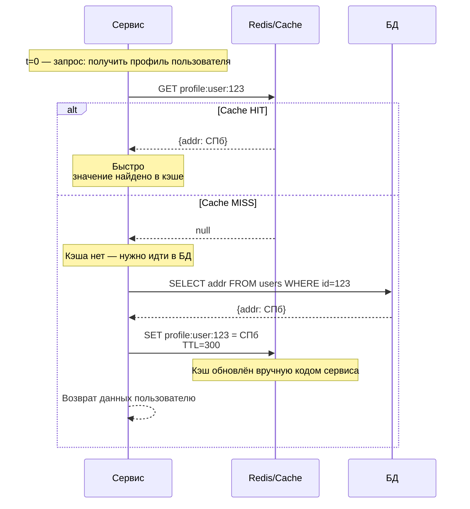

```mermaid
sequenceDiagram
  participant Service as Сервис
  participant Cache as Redis/Cache
  participant DB as БД

  Note over Service: t=0 — запрос: получить профиль пользователя

  Service->>Cache: GET profile:user:123
  alt Cache HIT
    Cache-->>Service: {addr: СПб}
    Note over Service: Быстро<br/>значение найдено в кэше
  else Cache MISS
    Cache-->>Service: null
    Note over Service: Кэша нет — нужно идти в БД

    Service->>DB: SELECT addr FROM users WHERE id=123
    DB-->>Service: {addr: СПб}

    Service->>Cache: SET profile:user:123 = СПб<br/>TTL=300
    Note over Cache: Кэш обновлён вручную кодом сервиса

    Service-->>Service: Возврат данных пользователю
  end

```

