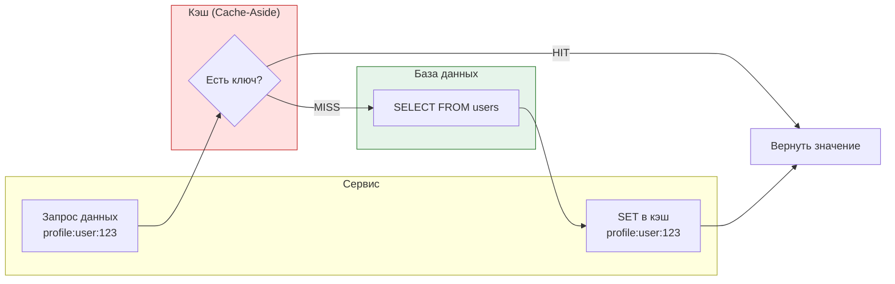

```mermaid

flowchart LR
    subgraph S["Сервис"]
        A[Запрос данных<br/>profile:user:123]
        F[SET в кэш<br/>profile:user:123]
    end

    subgraph C["Кэш (Cache-Aside)"]
        B{Есть ключ?}
    end

    subgraph DB["База данных"]
        D[SELECT FROM users]
    end

    A --> B
    B -- HIT --> E[Вернуть значение]
    B -- MISS --> D
    D --> F
    F --> E

    style C fill:#ffe1e1,stroke:#c62828
    style DB fill:#e6f4ea,stroke:#2e7d32

```

