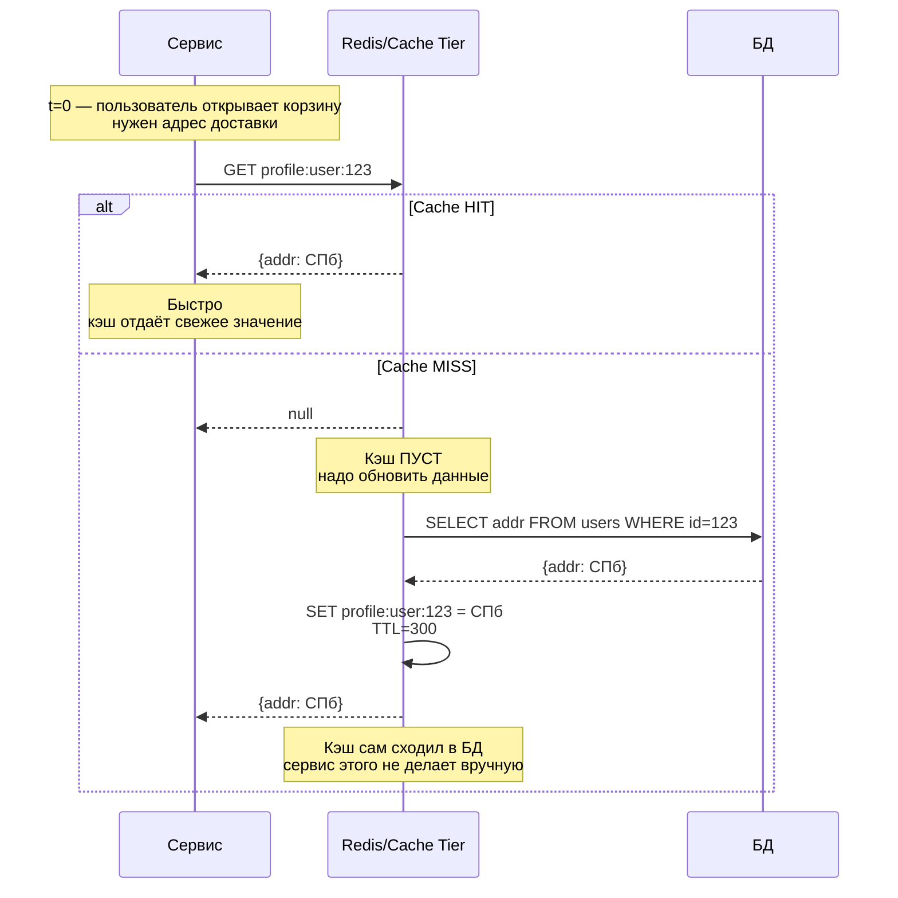

```mermaid
sequenceDiagram
    participant Service as Сервис
    participant Cache as Redis/Cache Tier
    participant DB as БД

    Note over Service: t=0 — пользователь открывает корзину<br/>нужен адрес доставки

    Service->>Cache: GET profile:user:123
    alt Cache HIT
        Cache-->>Service: {addr: СПб}
        Note over Service: Быстро<br/>кэш отдаёт свежее значение
    else Cache MISS
        Cache-->>Service: null
        Note over Cache: Кэш ПУСТ<br/>надо обновить данные

        Cache->>DB: SELECT addr FROM users WHERE id=123
        DB-->>Cache: {addr: СПб}

        Cache->>Cache: SET profile:user:123 = СПб<br/>TTL=300
        Cache-->>Service: {addr: СПб}

        Note over Cache: Кэш сам сходил в БД<br/>сервис этого не делает вручную
    end

```

