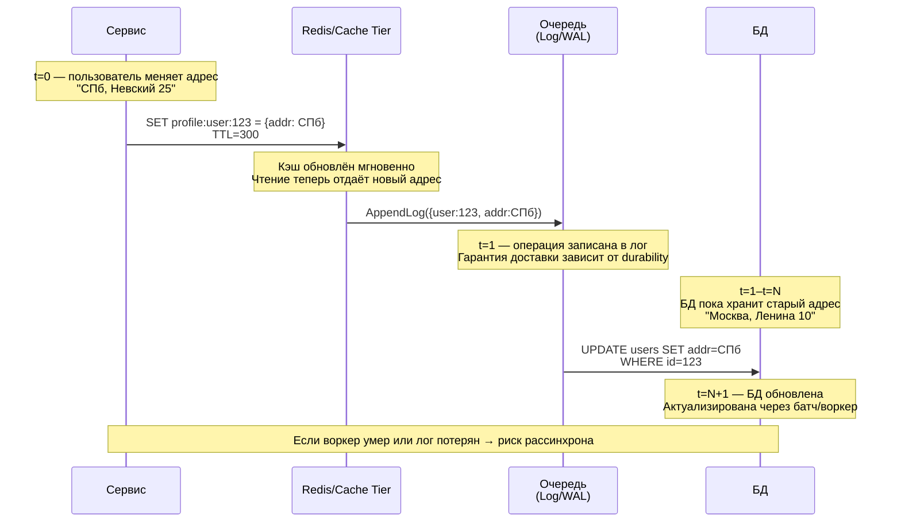

```mermaid
sequenceDiagram
  participant Service as Сервис
  participant Cache as Redis/Cache Tier
  participant Queue as Очередь<br/>(Log/WAL)
  participant DB as БД

  Note over Service: t=0 — пользователь меняет адрес<br/>"СПб, Невский 25"

  Service->>Cache: SET profile:user:123 = {addr: СПб}<br/>TTL=300
  Note over Cache: Кэш обновлён мгновенно<br/>Чтение теперь отдаёт новый адрес

  Cache->>Queue: AppendLog({user:123, addr:СПб})
  Note over Queue: t=1 — операция записана в лог<br/>Гарантия доставки зависит от durability

  Note over DB: t=1–t=N<br/>БД пока хранит старый адрес<br/>"Москва, Ленина 10"

  Queue->>DB: UPDATE users SET addr=СПб<br/>WHERE id=123
  Note over DB: t=N+1 — БД обновлена<br/>Актуализирована через батч/воркер

  Note over Service,DB: Если воркер умер или лог потерян → риск рассинхрона

```

