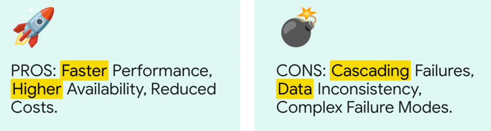

Phil Karlton famously said, “There are only two hard things in computer science: cache invalidation and naming things.” in 1997

receives cache invalidation events. For example, if Polaris receives an invalidation event that says “x=4 @version 4,” it then queries all cache replicas as a client to verify whether any violations of the invariant occur. If one cache replica returns “x=3 @version 3,” Polaris flags it as inconsistent and requeues the sample to later check it against the same target cache host. Polaris reports inconsistencies at certain timescales, e.g., one minute, five minutes or 10 minutes. If this sample still shows as inconsistent after one minute, Polaris reports it as an inconsistency for the corresponding timescale.

надо заменить все примеры кода на питоне на код на php (symfony)

2.5. Типичные архитектуры кэшей - я бы инвертировал логику - сначала ситуация, потом решение. а не сначала решение потом для чего подходит

как считать stale reads?

Blue-Green deploy - что это? хоть 2 слова бы. по схеме как будто канареечный

пункт 3.7 как будто надо двинуть целиком в последнюю часть - про проблемы кеша

пару слов бы про cdn и как работает эта геораспределенность кеша

